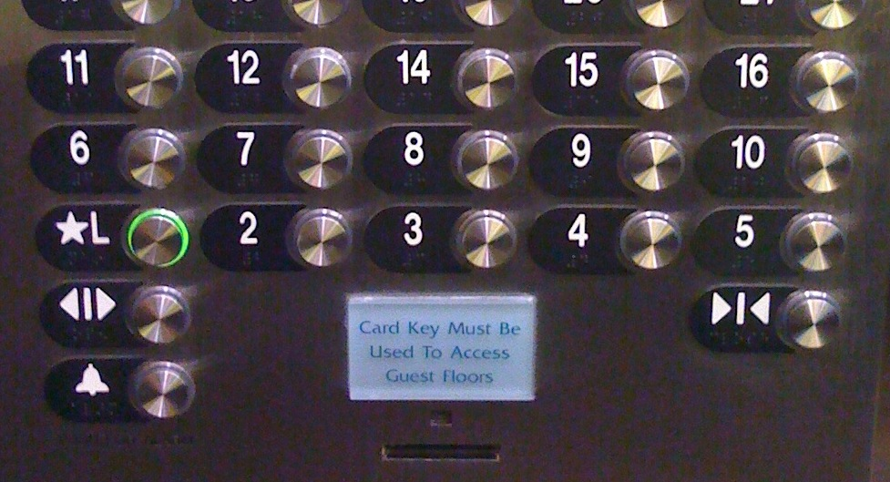
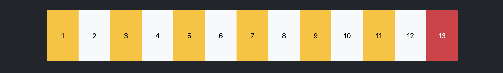

---
tags:
  - Exercice
  - Bootstrap
---

# Triskaïdékaphobie

{.w-100}

> La [triskaïdékaphobie](https://fr.wikipedia.org/wiki/Triska%C3%AFd%C3%A9kaphobie) est un phobie basée sur la superstition du nombre treize.

## Résultat attendu

{data-zoom-image}

## Consignes

- [ ] Effectuez un fork du [Codepen de départ](https://codepen.io/tim-momo/pen/Byjyqbg)
- [ ] Ajouter le HTML nécessaire pour arriver au résultat attendu
  - [ ] Créer **13 colonnes** avec le système de grille Bootstrap.
  - [ ] Assurez-vous d'utiliser la bonne classe bootstrap pour que le texte ait le bon contraste avec la couleur de fond.
  - [ ] Le texte doit être centré
- [ ] En JavaScript, lorsqu'on clic sur n'importe quel chiffre, sauf le chiffre 13, celui-ci disparait.
