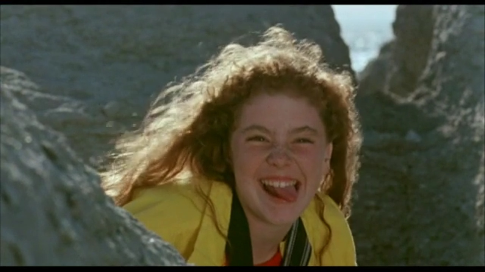

---
tags:
  - Exercice
---

[:material-arrow-u-left-top: Cours 13](../cours13.md){.breadcrumb}

# La grenouille et la baleine

L'objectif de cet exercice est d'atteindre un score de 100% dans toutes les sphères sur Lighthouse en mode Desktop.

Point bonus si vous y arrivez en mode Mobile!

[Code de départ :material-download:](./Baleine.zip){ .md-button .md-button--primary }

## Quelques indices

- [ ] Est-ce que le HTML de départ est valide ? Il me semble qu'il manque un `doctype` et quelques balises dans le `head` non?
- [ ] D'ailleurs, ce serait bien d'ajouter en plus des balises meta pour le référencement.
- [ ] S'il y a du code importé qui n'est pas utilisé, il vaut mieux ne pas le charger.
- [ ] Est-ce que la structure HTML est bien organisée ? Les titres sont-ils bien hiérarchisés ?
- [ ] Il serait surement bon de redimentionner les images. Observez bien l'espace graphique occupé par celles-ci ainsi que les breakpoints.
- [ ] Réduire le poids des images ne ferait surement pas de mal.
- [ ] WebP ?!
- [ ] Utiliser la balise `picture` pour spécifier les images à afficher en fonction des tailles d'écran. N'oubliez les pas fallbacks !
- [ ] Concernant la vidéo, ajoutez lui un beau poster, mais très léger !!
- [ ] La vidéo est-elle bien optimisée par rapport aux breakpoints ?
- [ ] La vidéo est-elle bien accessible ? Ce serait bien d'avoir des fichiers .vtt sous la main.
- [ ] Lazyload, ca vous dit quelque chose ?
- [ ] Saviez-vous qu'on doit toujours spécifier un width et un height sur les images ?
- [ ] Ça manque de textes alternatifs, vous trouvez pas ?
