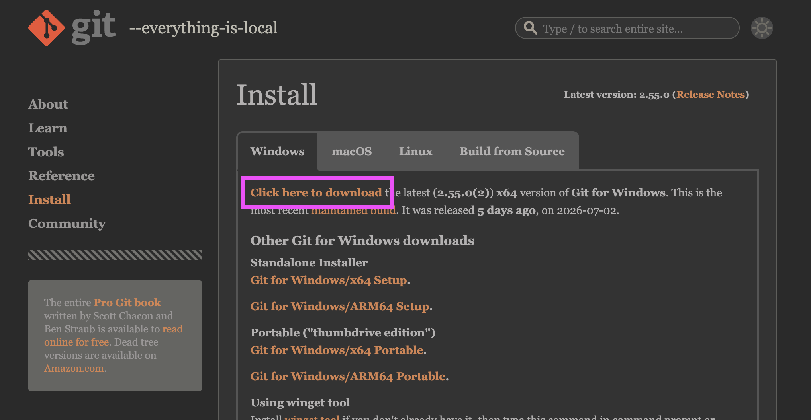
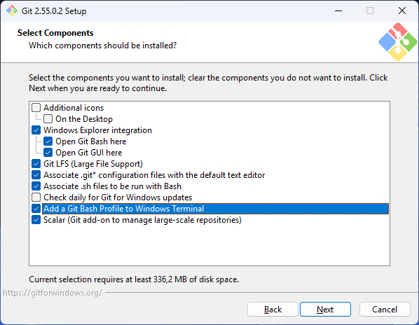
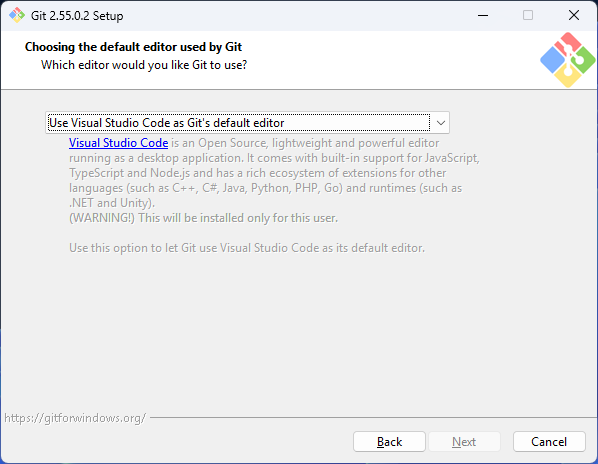

# Git Bash

Git Bash est une application pour Windows qui fournit un terminal permettant d'utiliser Git avec des commandes de type Unix.

Essentiel pour les développeurs, il émule l'environnement Linux/macOS et permet de gérer ses versions de code ou d'interagir avec des plateformes comme GitHub directement depuis son PC.

## Installation 

### Télécharger l'installateur

- [ ] Rendez-vous sur le site officiel de Git : [git-scm.com/install/windows](https://git-scm.com/install/windows).
- [ ] Cliquez sur le lien « _Click here to download_ ».
  
  {data-zoom-image .w-33}

### Lancer l'installation

- [ ] Ouvrez le fichier téléchargé (par exemple : Git-2.xx.x-64-bit.exe). 
- [ ] Si Windows vous demande l'autorisation, cliquez sur Oui. 
- [ ] Lisez la licence et cliquez sur « _Next_ ».

### Choisir l'emplacement et les composants

- [ ] Destination : Laissez le dossier par défaut et cliquez sur « _Next_ ».
- [ ] Composants : Laissez les cases cochées par défaut puis cochez aussi la case « _Add a Git Bash Profile to Windows Terminal_ ». Cliquez sur « _Next_ ».
  
  {data-zoom-image .w-33}

### Configurer les options clés 

L'assistant propose de nombreuses étapes. Pour une installation standard et sans problème, suivez ces recommandations :

- [ ] Menu Démarrer : Cliquez sur « _Next_ ».
- [ ] Éditeur par défaut : Choisissez « Visual Studio Code » puis cliquez sur « _Next_ ».
  
  {data-zoom-image .w-33}
  
- [ ] Nom de la branche initiale : Laissez l'option par défaut (Let Git decide) et cliquez sur « _Next_ ».
- [ ] Modification du PATH : Choisissez l'option recommandée : « _Git from the command line and also from 3rd-party software_ ». Cela permet d'utiliser Git partout. Cliquez sur « _Next_ ».  
- [ ] Client SSH : Laissez OpenSSH sélectionné. Cliquez sur « _Next_ ».
- [ ] Fin de ligne : Laissez « _Checkout Windows-style, commit Unix-style line endings_ » sélectionné pour éviter les bugs de format de fichier entre systèmes. Cliquez sur « _Next_ ».

### Finaliser l'installation

- [ ] Pour toutes les étapes restantes (Émulateur de terminal, comportement de git pull, etc.), laissez les choix par défaut et cliquez sur « _Next_ » jusqu'au bouton final.
- [ ] Cliquez sur Install.
- [ ] Une fois l'installation terminée, décochez « _View Release Notes_ » et cliquez sur Finish.