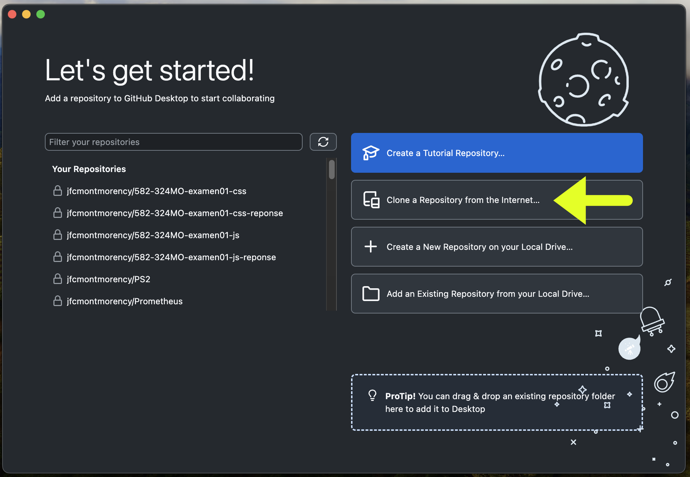
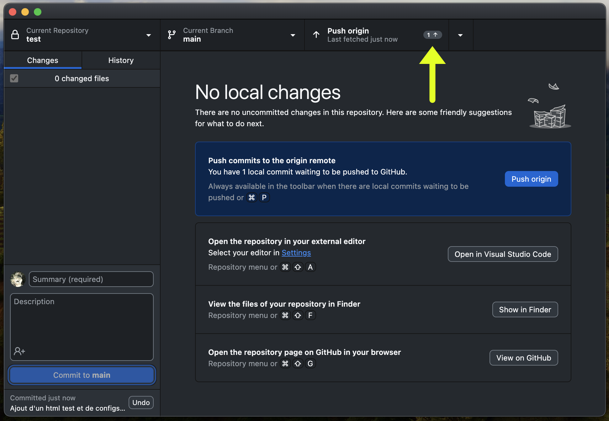
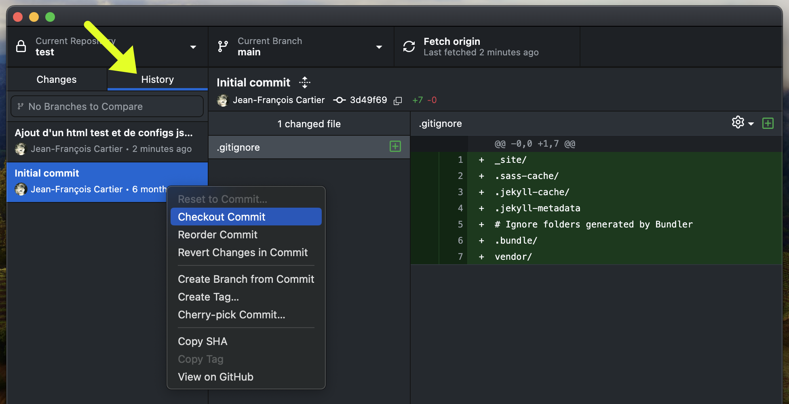

# Github Desktop

L'interface en ligne de commande de Git permet aux développeurs de travailler sans interface graphique en tapant des lignes de commandes directement dans un terminal. Cette technique est puissante, efficace et ne présente que très peu d'inconvénients, outre qu'elle peut paraître intimidante de prime abord.

Pour rendre Git plus accessible, GitHub a créé l'application gratuite GitHub Desktop offrant une interface graphique, permettant d'utiliser des boutons plutôt que d'entrer des lignes de commande sous forme de texte.

[Télécharger Github Desktop](https://desktop.github.com/download/)

## Authentification

{data-zoom-image}

{data-zoom-image}

{data-zoom-image}

## Clone via Github

{data-zoom-image}

{data-zoom-image}

{data-zoom-image}

## Clone manuel

{data-zoom-image}

{data-zoom-image}

## Repo / Branch / Fetch et Pull

{data-zoom-image}

**Current Repository** indique le répertoire/projet sur lequel vous, vous trouver. Au clic, il vous permet de passer d'un projet à un autre.

**Current Branch** indique la branche courante. Au clic, il est possible de changer de branche.

**Fetch origin** indique quand GitHub Desktop a vérifié pour la dernière fois si de nouveaux changements étaient disponibles en ligne. Cliquer sur cet onglet forcera GitHub à effectuer une nouvelle vérification. Si un changement existe, le bouton changement pour un "Pull origin".

## Commit

{data-zoom-image}

{data-zoom-image}

**Changes** indique le nombre de fichiers modifiés depuis le dernier commit et les affiches, sous forme de liste.

**History** lorsque sélectionné, indique tous les précédents commits, du plus récent aux plus anciens, et permet de voir le détail de chaque fichier modifié.

## Push

{data-zoom-image}

## Se déplacer entre commits (rollback)

{data-zoom-image}

## Alternatives

Il existe plusieurs alternatives à GitHub Desktop, notamment:

* Sourcetree :fontawesome-brands-sourcetree:
* GitKraken :fontawesome-brands-gitkraken:
