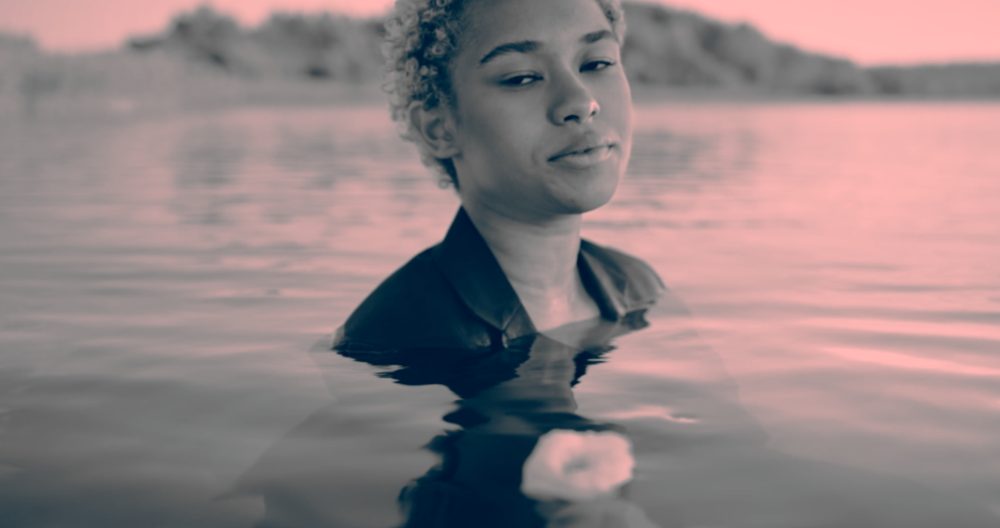
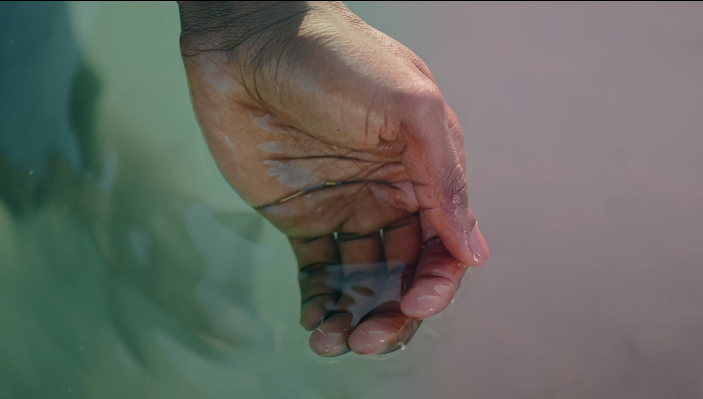

# Cours 5

## [Da Vinci - La base](da_vinci_base.md) (15 minutes)

### 🛠️ Travail sur le son et la synchronisation
- [ ] Revoir les **fades** :  
  - [ ] Sur des bruits de pas  
  - [ ] Sur une musique  
  - [ ] Sur du texte  
- [ ] Vérifier la **synchronisation image et son**  

---

# Différences entre les types de Nodes dans DaVinci Resolve

## 1. Serial Node (Alt + S)
- **Fonction** : Node de base, enchaîné en série.  
- **Principe** : Chaque node applique sa correction l’un après l’autre.  
- **Usage typique** : Balance des blancs → contraste → colorimétrie.  
- **Avantage** : Simple, clair et ordonné.  
- **Limite** : Chaque correction dépend de ce qui précède.  

---

## 2. Parallel Node (Alt + P)
- **Fonction** : Permet de travailler plusieurs corrections en parallèle.  
- **Principe** : Tous les nodes reçoivent la même source, puis leurs résultats se combinent.  
- **Usage typique** : Corriger la peau d’un côté et le ciel de l’autre, puis fusionner.  
- **Avantage** : Les traitements restent indépendants.  
- **Limite** : Les corrections se superposent, risque de saturation.  

---

## 3. Layer Mixer Node (Alt + L)
- **Fonction** : Système de calques avec ordre et modes de fusion.  
- **Principe** : Chaque entrée est un calque, avec différents modes de mélange.  
- **Usage typique** : Appliquer un look global sur le calque supérieur et un vignettage en dessous.  
- **Avantage** : Plus de contrôle, comme dans Photoshop.  
- **Limite** : Plus complexe à gérer qu’un Parallel Node.  

---

## 4. Outside Node (Alt + O)
- **Fonction** : Crée un node qui traite l’extérieur d’une sélection ou d’un masque.  
- **Principe** : Utilise l’inverse d’une qualification ou d’un masque du node précédent.  
- **Usage typique** : Qualifier un visage, puis corriger uniquement l’arrière-plan.  
- **Avantage** : Rapide, pas besoin de recréer un masque inversé.  
- **Limite** : Dépend entièrement du masque précédent.  

---

## 5. Splitter & Combiner (Alt + Y)
- **Fonction** : Sépare l’image en composantes (R, G, B, Luma, etc.) pour les corriger individuellement.  
- **Principe** : Le Splitter crée plusieurs branches, chaque canal peut être corrigé, puis le Combine recompose l’image.  
- **Usage typique** : Retoucher uniquement le canal bleu pour le ciel, ou réduire le bruit dans un canal précis.  
- **Avantage** : Très précis, idéal pour des corrections techniques.  
- **Limite** : Avancé, rarement nécessaire pour des corrections basiques.  

---

## Résumé rapide

| Node                   | Raccourci | Usage principal |
|------------------------|-----------|-----------------|
| **Serial**             | Alt + S   | Workflow linéaire, corrections en série |
| **Parallel**           | Alt + P   | Corrections indépendantes en parallèle |
| **Layer Mixer**        | Alt + L   | Corrections superposées avec modes de fusion |
| **Outside**            | Alt + O   | Corriger l’extérieur d’un masque/qualif |
| **Splitter & Combine** | Alt + Y   | Travailler canal par canal (R, G, B, Luma) |

---

## [Da Vinci - La colorisation](da_vinci_colorisation.md) (90 minutes)

### 🛠️ Exploration des outils de colorisation
- [ ] Créer différents nodes (Serial, Parallel, Layer, Outside, Splitter & Combine)  
- [ ] Appliquer une première correction de couleur  
- [ ] Expérimenter le **RGB Mixer**  
- [ ] Travailler avec les **Courbes**  
- [ ] Tester le **Color Wrapper**  
- [ ] Isoler des zones avec le **Qualifier**  
- [ ] Utiliser une **Power Window** et le **Tracker**  
- [ ] Appliquer une **stabilisation** sur un plan  
- [ ] Ajouter un **flou** pour adoucir une zone  
- [ ] Créer une animation simple avec des **Keyframes**  
- [ ] Copier des effets d’un plan à un autre  

---

## Pause (15 minutes)

---

# Techniques de Correction et Effets dans DaVinci Resolve

## 1. Créer un look Polaroid avec le mode Log

 

 

### 🛠️ Log Wheels 
- [ ] Créer un **Serial Node** (Alt + S)  
- [ ] Passer en mode **Log Wheels**  
- [ ] Ajuster :  
  - [ ] **Highlights** → rose/orange (adoucir et réchauffer)  
  - [ ] **Midtones** → magenta/violet (donner une teinte artistique)  
  - [ ] **Shadows** → cyan/bleu (refroidir légèrement)  
- [ ] Ajouter une légère saturation  

### 🛠️ Glow (Lueur diffuse)
- [ ] Créer un **Serial Node** (Alt + S)  
- [ ] Régler le **Seuil de brillance** (~0.31)  
- [ ] Régler la **Diffusion** (~1.21)  
- [ ] Ajuster la **Diffusion relative** : rouge ↑ / bleu ↓  
- [ ] Régler le **Gain** (~0.40)  

### 🛠️ Film Grain (16mm 250D)
- [ ] Créer un **Serial Node** (Alt + S)  
- [ ] Régler l’**Opacité** (~0.80)  
- [ ] Régler la **Taille** (~0.40)  
- [ ] Régler l’**Intensité** (~0.20)  

---

## 2. Créer un look Noir et blanc à partir de la galerie

 

 

### 🛠️ Création de noir et blanc depuis la Galerie
- [ ] Ouvrir la Galerie dans DaVinci Resolve
- [ ] Sélectionner une image de référence en noir et blanc
- [ ] Appliquer la référence sur le plan actif
- [ ] Aller dans les **Courbes** pour corriger le noir et blanc
- [ ] Cliquer droit sur l’image
- [ ] Sauvegarder comme **Image de référence** dans la Galerie

---

## 3. Créer un look Duotone

 

 

### 🛠️ Création d’un Duotone
- [ ] Créer un **Serial Node** (Alt + S)  
- [ ] Désaturer avec le **RGB Mixer** (Monochrome activé)  
- [ ] Appliquer une teinte dans les **Shadows**  
- [ ] Appliquer une teinte contrastée dans les **Highlights**  
- [ ] Ajuster les **Midtones** pour équilibrer  
- [ ] Affiner avec les **Curves**  

---

## 4. Utilisation des Layer Nodes

 

 

### 🛠️ Correction avec Layer Nodes
- [ ] Créer un **Layer Node** (Alt + L)  
- [ ] Sélectionner un personnage avec le **Sélecteur 3D** (layer supérieur)  
- [ ] Désaturer l’arrière-plan (layer inférieur)  

---

## 5. Utilisation des Parallel Nodes

 

 

 ### 🛠️ Correction avec Parallel Nodes
- [ ] Créer deux **Parallel Nodes** (Alt + P)  
- [ ] Dans le premier, ajouter une **Power Window avec dégradé** et appliquer une couleur  
- [ ] Dans le second, ajouter une **Power Window avec dégradé** et appliquer une autre couleur  

---

## 6. Isoler un personnage et flouter l’arrière-plan

 

 

### 🛠️ Isolement avec Power Window
- [ ] Créer une **Power Window** autour du personnage
- [ ] Adoucir avec la **Softness**  
- [ ] Tracker le mouvement  
- [ ] Inverser la sélection et appliquer un **Blur**  

## 7. Effet de séparation des couleurs (Combine Node)

 

 

### 🛠️ Séparation des canaux
- [ ] Créer un **Splitter & Combiner** (Alt + Y)  
- [ ] Créer des nodes distincts pour chaque canal (R, G, B)  
- [ ] Décaler chaque canal pour obtenir l’effet, dans échelle et échelle de noeuds.
- [ ] Ajouter un effet de blur pour chaque canal (R, G, B)
- [ ] Ajouter un node en série (Alt + S) et désaturer un peu l'image. 

---

## 8. Colorisation dynamique avec des Keyframes

### 🛠️ Animation avec Keyframes
- [ ] Créer un Keyframe au début  
- [ ] Modifier les réglages (ex. froid → chaud)  
- [ ] Ajouter un Keyframe final  
- [ ] Vérifier la transition

## 9. Adoucir la peau avec Mid/detail ou retouche beauté

### 🛠️ Corriger la peau Mid/detail ou retouche beauté
- [ ] Aller Mid/detail dans Correction primaire  

---

## 10. Keying pour isoler une couleur

 

 

### 🛠️ Keying d’une couleur
- [ ] Sélectionner la couleur avec le **Qualifier**  
- [ ] Affiner avec Threshold, Clean Black/White, Denoise  
- [ ] Appliquer l’effet dans des nodes séparés  

---

## Devoir

### 🛠️ Montage offline
- [ ] Réaliser le montage offline de votre projet (vidéo + son)
