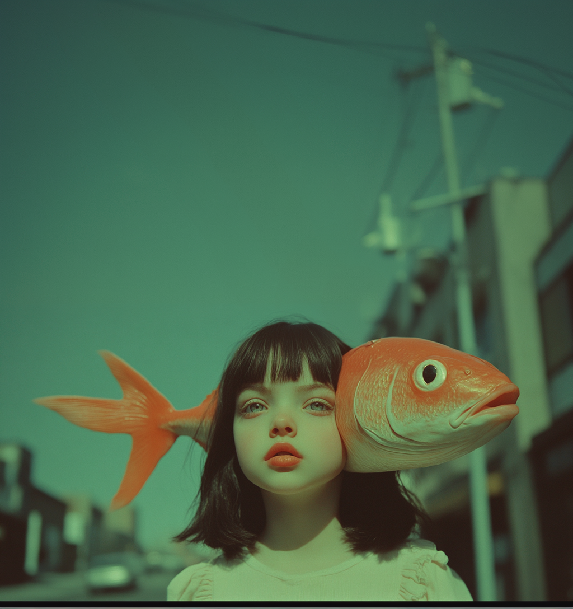

Le but de cet exercice est de corriger une image. 

***

[📁 Document de départ](../assets/image/05_enfant_corde.png){ .md-button }    

## Étapes

- [ ] **Aller dans l'éditeur** :
   - Sélectionne une zone de l'image à changer.

- [ ] **Écrire un prompt pour l'image** :
   - Rédige un nouveau prompt qui reflète le changement: ex. : A girl with a fish in her head.

- [ ] **Soumet la tâche** :
  - Soumet la tâche. 

***

## Tutoriel 📚

[📖 Pour en savoir plus](https://cmontmorency365-my.sharepoint.com/:v:/g/personal/flpilote_cmontmorency_qc_ca/EY9dtF_-ufRCjjN1VH3iur8BQdCxPXhcGceQbxaFUzU7YA?nav=eyJyZWZlcnJhbEluZm8iOnsicmVmZXJyYWxBcHAiOiJPbmVEcml2ZUZvckJ1c2luZXNzIiwicmVmZXJyYWxBcHBQbGF0Zm9ybSI6IldlYiIsInJlZmVycmFsTW9kZSI6InZpZXciLCJyZWZlcnJhbFZpZXciOiJNeUZpbGVzTGlua0NvcHkifX0&e=oorTvU){ .md-button }    

[📖 Consulter la page suivante](../ai/prompt.md) pour plus d’informations sur la rédaction d'un prompt efficace.

