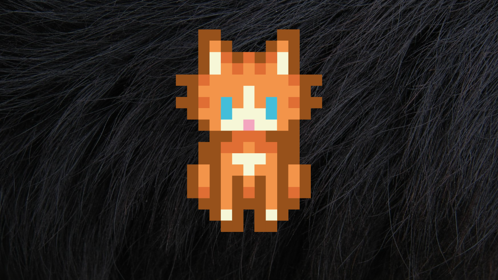

# Cours 1 - Bienvenue!

## Plan de cours

[:material-download: Plan de cours | Lora](https://cmontmorency365-my.sharepoint.com/:b:/g/personal/lora_boisvert_cmontmorency_qc_ca/IQAfhfEi4In-SJ2VAKNy7BX7AWHtDHkc9-K-JUB8RT2vmPo?e=bqQiVK){ .md-button .md-button--primary }

[:material-download: Plan de cours | Jean-François](https://cmontmorency365.sharepoint.com/:b:/r/sites/Ralitmixte/Documents%20partages/General/plan-cours-582-401-MO-Realite-mixte-H26-JFC.pdf?csf=1&web=1&e=geaYFL){ .md-button .md-button--primary }

## Unity

{.w-100}

### Créer un compte Unity

- [ ] [Créer un identifiant Unity](https://id.unity.com/en/account/new)
- [ ] S'inscrire au [Unity student plan](https://unity.com/products/unity-student) en cliquant sur « **enseignement supérieur** »

### Ajouter le _Sampler pack_ de Synty Studios à vos assets

Vous devriez recevoir un code par courriel pour ajouter **gratuitement** le paquet [POLYGON - Sampler Pack](https://assetstore.unity.com/packages/3d/environments/polygon-sampler-pack-207048) à votre bibliothèque.

- [ ] Ajouter _Sampler Pack_ à vos assets

### Télécharger Unity

- [ ] [Installer le logiciel](./installation/telechargement.md){.back}
- [ ] [Ajouter des modules](./installation/modules.md){.back}
- [ ] [Activer une licence](./installation/license.md){.back}    

## Introduction à Unity

  

  <small>Exercice - Unity</small> 
  **[Intro](./exercices/intro.md){.stretched-link .back}**

### Retour en groupe

- [:pencil: Créer un projet](./unity/creer_projet.md){.back}
- [:pencil: Fenêtres](./unity/fenetres.md){.back}
- [:pencil: Nomenclature](./unity/nomenclature.md){.back}
- [:pencil: Importer des *Assets* depuis le *Asset store*](./unity/importer_asset_store.md){.back}

## Réalité augmentée

### Test d'exemples de livres en AR

Livres:      

- Slush le lutin
- Tracé de voyage
- Bandits des mers

## Travail 1
    
[💼 Travail 1](./travaux/travail1.md){ .md-button .back }   

### Création de visuels

- [📝 Sprite](./unity/sprite.md){.back}

### Réflexion sur la thématique de votre travail 1

Tempête d'idées   

## Devoir

### Réaliser l'étape 0 du travail 1 pour créer les contenus de votre travail 1

[💼 Travail 1 - Étape 0](./travaux/travail1.md#0-creation-des-elements-visuels-et-recherche-de-contenu){.back}

### Réaliser l'étape 1 du travail 1

[💼 Travail 1 - Étape 1](./travaux/travail1.md#1-creation-du-projet){.back}

### S'inscrire au Unity student plan

Appuyer sur enseignement supérieur : 

[🛠️ Student Plan](https://unity.com/products/unity-student){.back}