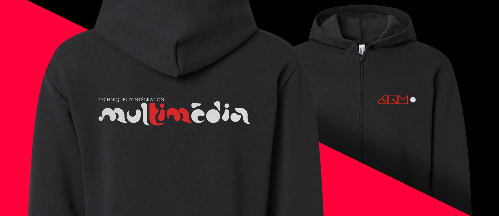

# Cours 8

## Commandez votre veste TIM 2026 !

{.w-100}

C'est maintenant le temps de commander votre veste TIM 2026 🎉🎉🎉
 
📆 Vous avez jusqu'à vendredi prochain (27 mars) pour effectuer vos commandes !

[Feuille de commande](https://forms.office.com/r/f9FZ4r0BeD?origin=lprLink){ .md-button .md-button--primary }

## 🚨 Remise du travail 2

## Prêt des casques oculus

[🛠️ Formulaire à remplir - Lora](https://cmontmorency365.sharepoint.com/:w:/s/TIM-programmeTIM752/IQADWkesB3tXRrtaO1bjuJSTAcuiCCcutg3KcJGTdBNj4_M?e=M0T3Si){ .md-button } 

[🛠️ Formulaire à remplir - JF](https://cmontmorency365.sharepoint.com/:w:/r/sites/TIM-programmeTIM752/Documents%20partages/TTP%20-%20R%C3%A9servations/582_401_mo_realite_virtuelle_formulaire_emprunt_JF.docx?d=wc6fcf331a2b54f4aa79d0f4aa88fa282&csf=1&web=1&e=VGrAqJ){ .md-button } 

### Casques de réalité virtuelle
- [:pencil: Quest](./unity/quest.md)
- [:pencil: Guardian - Créer une limite de jeu](./unity/guardian.md)
- [:pencil: Meta Quest Link - Relier le casque et l'ordinateur](./unity/meta_quest_link.md)

## Configurer la VR dans votre projet
- [:pencil: Importer les paquets pour la VR](unity/configuration_vr.md)
- [:pencil: Intégrer le casque de VR à une scène](unity/xr_origin.md)
- [:pencil: Tester avec un clavier et une souris](unity/test_clavier.md)     

## Interagir avec les manettes et l'environnement
- [:pencil: Prendre et lancer des objets](unity/interaction_vr.md)

### Exercice
Ajouter la VR à votre projet 2 et essayez de lancer des objets. 

## Présentation du projet final
[🛠️ Travail 3](./travaux/travail3.md){ .md-button } 

## Idéation du projet final
Élaborer le plan de projet pour le travail 3.   
[🛠️ Plan de travail 3](./consignes/plandetravail.md){ .md-button } 

