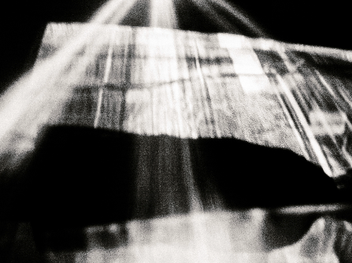

# Cours 9

## Concours d'essais audiovisuels

{.w-100}

Le fameux concours d'essais audiovisuels aura encore lieu cette année !
Ce concours est une belle occasion d'obtenir une bourse en argent (jusqu'à 175$) et de bonifier votre portfolio ! 
 
Date limite de remise : **10 mai 2026**
 
Vous trouverez ici les détails de l'appel à candidatures: [Appel a candidature 2026.pdf](./images/Appel-a-candidature-2026.pdf)
 
Des questions? Adressez-les à **Lora Boisvert** ou **Thomas O Fredericks** sur Teams.

## 🚨 Présentation des plans de projet

[🛠️ Plan de travail 3](./consignes/plandetravail.md){ .md-button } 

## Début de la création du projet final

### GitHub
- [:pencil: Github](./unity/github.md)

### Configurer la VR dans votre projet
- [:pencil: Importer les paquets pour la VR](unity/configuration_vr.md)
- [:pencil: Intégrer le casque de VR à une scène](unity/xr_origin.md)
- [:pencil: Tester avec un clavier et une souris](unity/test_clavier.md)     

### Interagir avec les manettes et l'environnement
- [:pencil: Prendre et lancer des objets](unity/interaction_vr.md)

### Casques de réalité virtuelle
- [:pencil: Meta Quest Link - Relier le casque et l'ordinateur](./unity/meta_quest_link.md)

#### Exercice 
Tester la scène Démo et regarder les méthodes de prise des objets. 

## Devoir: Avancement du projet final
[🛠️ Travail 3](./travaux/travail3.md){ .md-button } 

