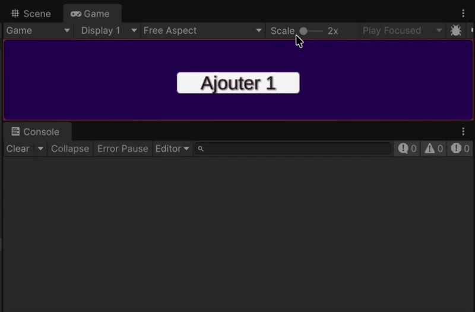
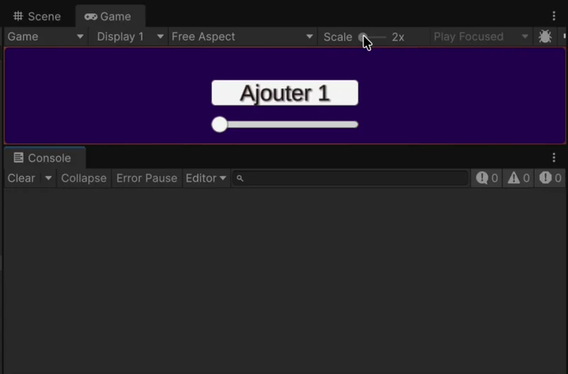

# Exercices de programmation

{.w-100}

## Exercice 1

Objectif : Assigner une `Image` dans l’`Inspector`, puis modifier son opacité au lancement

{data-zoom-image .w-50}

- [ ] Créez une nouvelle scène nommée « Exercices »
- [ ] Ajoutez un `Canvas`
- [ ] Dans le `Canvas`, créez un `Panel`, puis une `Image` (enfant du `Panel`)
- [ ] Sélectionnez l’`Image` et mettez son opacité à 50%
- [ ] Créez un `GameObject` vide nommé « Exercice1 »
- [ ] Ajoutez-lui un script (_component_) nommé « ExerciceShowImage »
- [ ] Dans le script, ajoutez une variable publique de type `Image`
- [ ] Dans l’`Inspector` de « Exercice1 », assignez votre `Image` à la variable
- [ ] Au lancement de la scène, faites en sorte que l’image devienne opaque à 100%

!!! example "Fragments de code utiles"

    ```csharp
    using UnityEngine.UI;
    ```

    ```csharp
    public Image maBelleImage;
    ```

    ```csharp
    maBelleImage.color = new Color(1f, 1f, 1f, 1f);
    ```

## Exercice 2

Objectif : Utiliser un événement `onClick` pour modifier une variable et modifier la valeur d'un `Slider`.

### Partie 1

{data-zoom-image .w-50}

- [ ] Créez un `GameObject` vide nommé « Exercice2 »
- [ ] Créez un script nommé « ExerciceCompteur »
  - [ ] Associez le script à `Exercice2` si ce n'est déjà fait
- [ ] Dans le `Canvas` de l'exercice 1, ajoutez un nouveau `Button - TextMeshPro`

> Maintenant, chaque clic sur le bouton doit augmenter un compteur et afficher sa valeur dans la console.

- [ ] Dans le script, créez une variable publique `int` nommée `compteur` (initialisée à 0)
- [ ] Créez une méthode publique nommée `AjouterUn` qui retourne `void`
- [ ] Dans `AjouterUn()`, ajoutez 1 à la variable `compteur`, puis affichez la valeur dans la console
- [ ] Si `compteur` est plus grand ou égal à `3`, affichez dans la console « Objectif atteint »
- [ ] Dans l’`Inspector` du `Button`, connectez l’événement `On Click()` à la méthode `AjouterUn()` du script

!!! example "Fragments de code utiles"

    ```csharp
    public int compteur = 0;
    ```

    ```csharp
    compteur++;
    ```

    ```csharp
    Debug.Log("Compteur : " + compteur);
    ```

### Partie 2

{data-zoom-image .w-50}

- [ ] Dans le script, créez une nouvelle variable publique de type `Slider`
- [ ] Ajoutez un `Slider` dans le `Canvas` et glisser le dans l’`Inspector` pour l’assigner à la variable
- [ ] Dans la méthode « AjouterUn », à chaque clic, augmentez la valeur du slider de 0.33f

!!! example "Fragments de code utiles"

    ```csharp
    using UnityEngine.UI;
    ```

    ```csharp
    public Slider monSlider;
    ```

    ```csharp
    monSlider.value += 0.33f;
    ```

## Exercice 3

Objectif : Utiliser un tableau de sprite, un index et un événement pour faire défiler des images comme dans un carousel.

{data-zoom-image .w-50}

- [ ] Créez un `GameObject` vide nommé « Exercice3 »
- [ ] Créez un script nommé « ExerciceCarousel »
  - [ ] Ajoutez le script à `Exercice3` si ce n'est déjà fait
- [ ] Ajoutez un `Button - TextMeshPro` dans le `Canvas`
- [ ] Ajoutez une `Image` dans le `Canvas`

> Quand on clique sur le bouton, l’image doit changer pour afficher une autre image (sprite) parmi celles qui sont configurées

- [ ] Dans le script, créez une variable publique de type `int` nommée « idActif »
- [ ] Créez un tableau de type `Sprite` nommé `cibles` et assignez-y 3 sprites de votre choix dans l’`Inspector` (vous pouvez glisser des sprites directement depuis le panneau `Project`)
- [ ] Créez une variable publique de type `Image` nommée `recherche` et assignez-y l’image du Canvas dans l’`Inspector`
- [ ] Au chargement, initialisez la variable `idActif` à `0` et remplacez l'image de `recherche` par celle du tableau `cibles` à l’index `idActif`

- [ ] Créez une nouvelle méthode nommée « NextSprite »
- [ ] Associez la méthode à l'événement « On Click » du bouton
- [ ] Dans la méthode, augmentez `idActif` de 1
- [ ] Si `idActif` est plus grand ou égal à la longueur du tableau `cibles`, réinitialisez `idActif` à `0` (pour boucler les images)
- [ ] Remplacez l'image de `recherche` par celle du tableau `cibles` à l’index `idActif`

!!! example "Fragments de code utiles"

    ```csharp
    using UnityEngine.UI;
    ```

    ```csharp
    public Sprite[] cibles;
    public int idActif;
    public Image recherche;
    ```

    ```csharp
    idActif = 0;
    recherche.sprite = cibles[idActif];
    ```

    <!-- Cacher, sinon trop facile.
    ```csharp
    idActif++;
    if (idActif >= cibles.Length)
    {
        idActif = 0;
    }
    recherche.sprite = cibles[idActif];
    ```
    -->