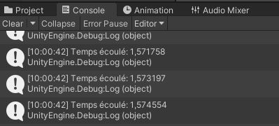

## Démonstration
``` c#
public float compte;

private void Update()
{
 compte = Time.time; 
}
```

Pour imprimer une valeur dans unity vous devez remplacer le mot message par ce que vous souhaitez imprimer.: 
``` c#
Debug.Log(message); 
```

## Exercice 1
- [ ] Créez un nouveau script.
- [ ] Créez une variable qui change grâce à Time.time.
- [ ] Imprimez un message dans la console qui contient un message écrit en plus de votre chiffre qui change.

Résultat attendu:     



## Démonstration
On peut utiliser ce code pour modifier notre chiffre une seule fois par seconde: 

``` c#
public int temps;
private float compteur; 

compteur += Time.deltaTime;

if (compteur > 1)
{
  temps++; 
  compteur = 0; 
}
```

## Exercice 2

- [ ] Créez une nouvelle scène.
- [ ] Créez un bouton.
- [ ] Créez un texte qui affiche le chiffre 0.
- [ ] Créez un objet vide nommé compteur. 
- [ ] Créez un script sur ce nouvel objet. 
- [ ] À l'aide des bouts de code suivants, créez un script pour qu'un clic de votre bouton augmente de 1 la valeur du chiffre qui est affiché sur votre écran. 

``` c#
using TMPro;
```

``` c#
public TextMeshProUGUI pointage;
```

``` c#
nombre.ToString()
```
