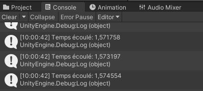

# **Introduction au C#**

## Démonstration

```c#
// dans la classe, mais hors la méthode Update()
public float compte;

private void Update()
{
 compte = Time.time; 
}
```

Pour imprimer une valeur dans Unity vous devez remplacer le mot message par ce que vous souhaitez imprimer.: 

```c#
Debug.Log(message); 
```

## Exercice 1
Avant de commencer l'exercice, prenez le temps d'écrire votre code à la main comme un schéma. 

- [ ] Créez un nouveau script sur un GameObject vide.
- [ ] Créez une variable qui change grâce à `Time.time`.
- [ ] Imprimez un message dans la console qui contient un message écrit en plus de votre chiffre qui change.

Résultat attendu:     



## Exercice 2

- [ ] Créez une nouvelle scène.
- [ ] Créez un bouton (UI > Button).
- [ ] Créez un texte (UI > Text - TextMeshPro)  qui affiche le chiffre 0.
- [ ] Créez un objet vide nommé `Compteur`. 
- [ ] Créez un script sur ce nouvel objet. 
- [ ] À l'aide des bouts de code suivants, créez un script pour qu'un clic de votre bouton augmente de 1 la valeur du chiffre qui est affiché sur votre écran. 

``` c#
using TMPro;
```

``` c#
public TextMeshProUGUI pointage;
```

``` c#
nombre.ToString();
```

## Démonstration
On peut utiliser ce code pour modifier notre chiffre une seule fois par seconde: 

```c#
// dans la classe, mais hors la méthode
public int temps;
private float compteur; 

// dans la méthode Update()
compteur += Time.deltaTime;

if (compteur > 1)
{
  temps++; 
  compteur = 0; 
}
```

## Exercice 3
Au tableau, créez un schéma de programmation pour l'exercice 4. Écrivez ensuite votre code à la main. 

## Exercice 4
- [ ] Créez deux GameObjects à une nouvelle scène avec Sprites de couleur différentes et désactivez-les.
- [ ] Modifiez votre code précédent. Lorsque le temps est pair, l'image 1 est activée et la 2 désactivée. Lorsque le temps est impair, l'image 1 est désactivée et l'image 2 est activée. 

Pour activer ou désactiver un objet:

``` c#
gameObject.SetActive(false);
```

## Démonstration

Comment transformer la vérification en méthode avec une valeur de retour. 

## Exercice 5

On veut créer un script qui alterne entre deux images. Après 5 secondes de jeu, activez l'une des images de l'exercice 4. Après 5 secondes de plus, désactivez cette image et activez en une autre.

Pour faire cette logique, on va utiliser une fonctionalité qui s'appelle **coroutine**. Elle va nous premettre de "pauser" une méthode et de la continuer après un délai. Voici un exemple : 

``` c#
// Dans un script MonoBehavior
public IEnumerator MaCoroutine()
{
 Debug.Log("Instruction immédiate");

 // Pour appliquer une pause avec un délai à la coroutine
 yield return new WaitForSeconds(1f);
 Debug.Log("Instruction après la pause");
}
```

Vous aurez besoin de ce script pour partir votre coroutine:    

``` c#
StartCoroutine("MaCoroutine");
```

- [ ] Planifiez votre script comme un schéma.
- [ ] Créez un nouveau script.
- [ ] Créez des variables pour se réferer aux objets (image).
- [ ] Utilisez une coroutine pour alterner entre une image et l'autre.
