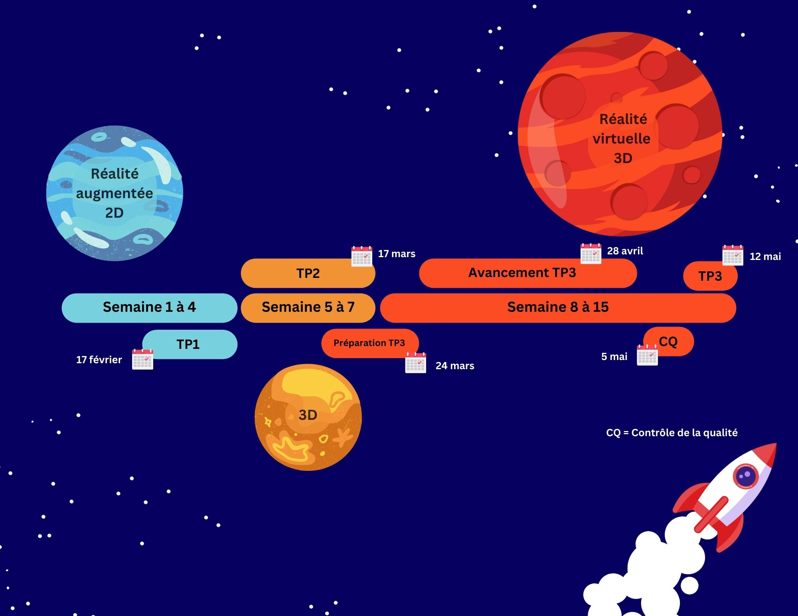

---
hide:
  - toc
---

# Réalité Mixte

## Vue synoptique

{.w-100 data-zoom-image}

<!-- Évaluer la possibilité de faire une image sans les dates ou 2 images pour illustrer les 2 cours -->

## Descriptif du cours

Ce cours permet à l'élève de se familiariser avec les outils de la réalité mixte et de développer ses compétences avec la réalité mixte pour la conception d'expériences interactives. 

Ce cours lui permet ainsi de développer ses compétences dans la conception d’expériences interactives.

| Spécifications        | Valeur  |
| --------------------- | ------- |
| Code                  | 582-401 |
| Pondération           | 2-2-2   |
| Unités                | 2       |
| Heures d’enseignement | 60      |
| Session               | 4       |

