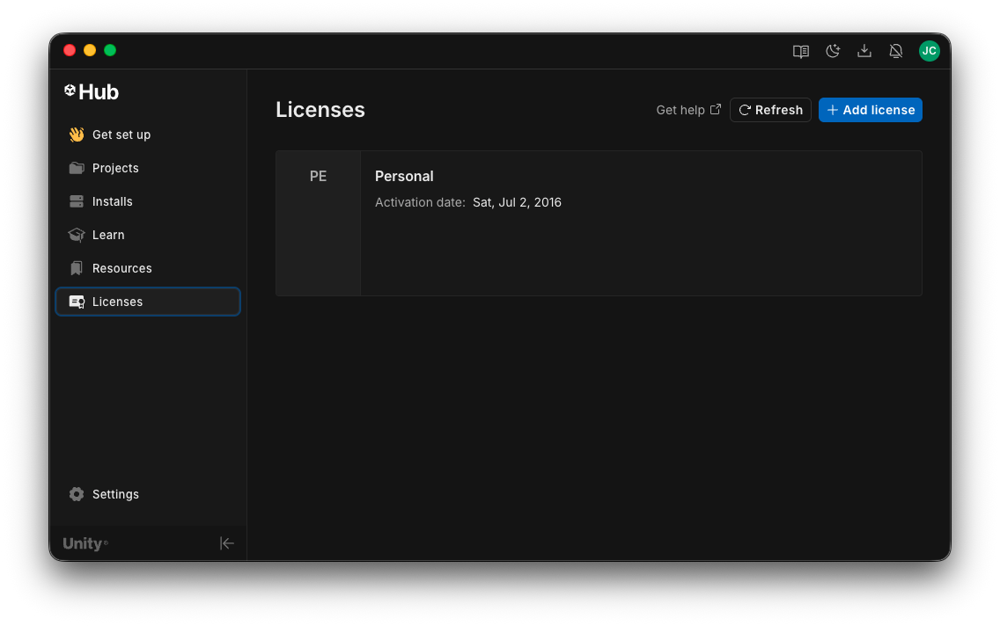

# Activer une licence

Pour pouvoir utiliser Unity, vous devrez activer une licence. Voici comment faire.

{data-zoom-image}

{data-zoom-image}

- [ ] Dans Unity Hub, cliquez sur `Sign in`, puis entrez les informations de votre compte Unity.
- [ ] Cliquez sur `Licenses` dans la colonne de gauche.
- [ ] Dans la nouvelle fenêtre, cliquez sur `+ Add license`.
- [ ] Choisissez `Get a free personal license`.

## Tutoriel 🎥

<iframe class="w-100 aspect-16-9" src="https://www.youtube.com/embed/NVuzmtxxbfc?si=0GOsqp4MRDKY04nu&amp;start=224" title="YouTube video player" frameborder="0" allow="accelerometer; autoplay; clipboard-write; encrypted-media; gyroscope; picture-in-picture; web-share" referrerpolicy="strict-origin-when-cross-origin" allowfullscreen></iframe>
