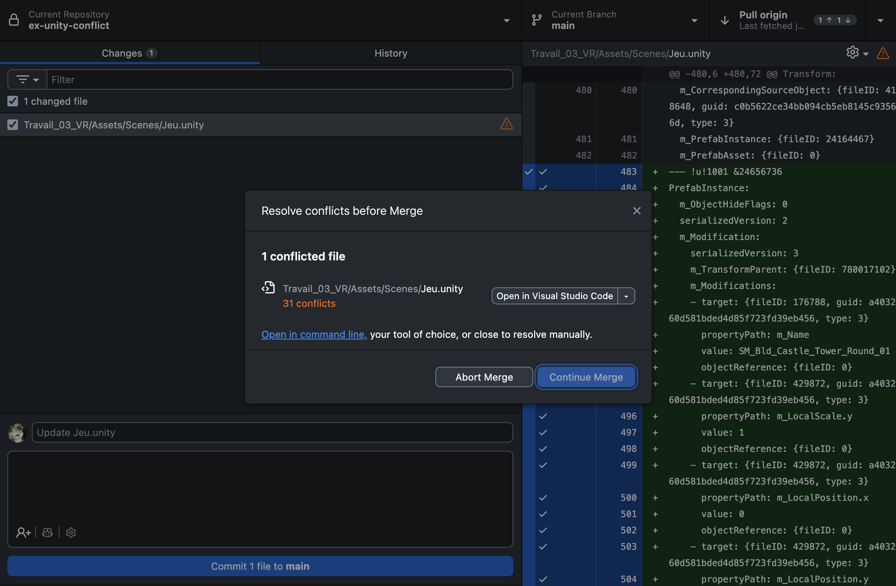
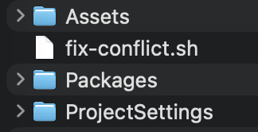

# Résoudre un conflit git sur Unity

<!-- !!! warning "Prérequis"
    Ce guide suppose que **Git LFS** est installé et qu'un fichier **`.gitattributes`** est présent à la racine du projet Unity avec les lignes `merge=unityyamlmerge` pour les fichiers `.unity` et `.prefab`. Consultez la [page sur la collaboration GitHub](./github.md) pour la configuration initiale. -->

{.w-100 data-zoom-image}

Quand GitHub Desktop signale un conflit dans un fichier `.unity`, **n'essayez pas de résoudre le conflit manuellement** et **ne faites pas de commit**. 

Unity recommande d'utiliser son outil UnityYAMLMerge (Smart merge) pour résoudre de type de fichier. Voici comment faire :

=== "Mac"
    1. Sur Mac, télécharge [fix-conflict.sh](scripts/fix-conflict.sh)
    1. Place-le à la **racine du projet Unity** (pas dans le dossier `Assets`, mais au même niveau que le dossier `Assets`)
    > {.w-25}
    1. En ligne de commande, rendez vous à la **racine du projet Unity**
    1. Exécute : 
    ```bash
    bash fix-conflict.sh
    ```

=== "Windows"
    1. Sur Windows, télécharge [fix-conflict.ps1](scripts/fix-conflict.ps1)
    1. Place-le à la **racine de ton projet Unity** (pas dans le dossier `Assets`, mais au même niveau que le dossier `Assets`)
    > {.w-25}
    1. Ouvre PowerShell et rends-toi à la **racine du projet Unity**
    1. Exécute :
    ```powershell
    powershell -ExecutionPolicy Bypass -File fix-conflict.ps1
    ```

!!! success "Voilà. Le conflit devrait être réparé ;)"
