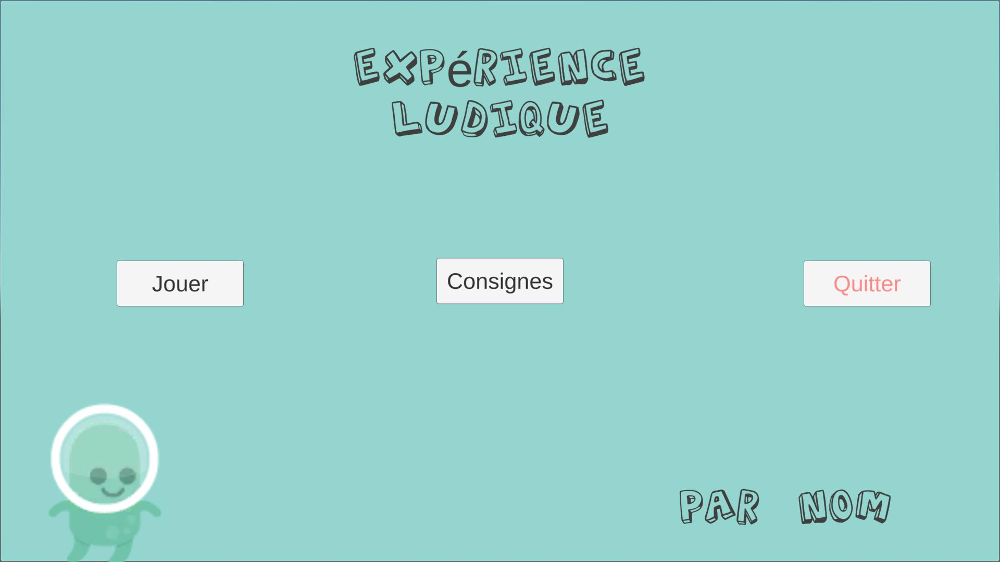

# Exercices interface utilisateur

## Exercice 1 
Analysez les captures d'écran suivantes. Quels sont les problèmes que vous repérez? 

## Exercice 2
Examinez le menu d'un collègue de classe. Est-ce que les éléments suivants sont tous corrects? Proposez des améliorations possibles pour le menu de votre collègue. 

- [ ] La taille des boutons est adéquate
- [ ] La typographie a une bonne taille
- [ ] La disposition des boutons est optimale
- [ ] La disposition de la typographie est logique
- [ ] Les éléments sont alignés
- [ ] Les consignes sont claires
- [ ] La position des boutons est intuitive
- [ ] La résolution des images est adéquate
- [ ] Les différents éléments sont cohérents entre eux
- [ ] Adaptation de la taille du menu
