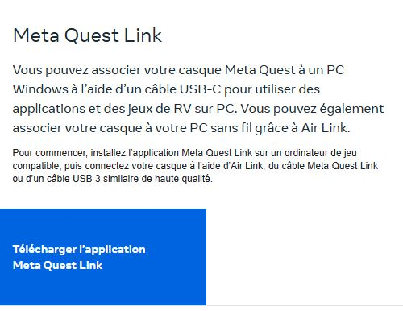

Dans le cadre du cours, des casques Quest ou Quest 2 vous serons prêtés.   

!!! info "Information"

    Si vous éprouvez de la motion sickness, vous pourrez tester au clavier et à la souris 

      

## Description de Meta

      

## Guardian - information
Le "Guardian" est la zone de jeu dont vous disposez avec votre casque. Il est important de le configurer chaque fois que vous changez d'endroit avec votre casque. En effet, c'est grâce à lui que vous verrez quelles sont les limites de votre zone de jeu et que vous éviterez des blessures ou des bris d'équipement. Le "Guardian" s'affichera uniquement si vous vous approchez trop de la limite de votre zone de jeu. Sinon vous ne le verrez pas.   

Comme vous le voyez sur l'image, il est important de laisser un peu d'espace entre les murs ou objet et le guardian. Ainsi, si vous dépassez un peu vous aurez le temps de voir que vous êtes sortis de la zone avant de toucher un objet.   

Il existe plusieurs modes "Guardian", le premier est la limite **Roomscale**. C'est ce qu'on voit dans l'image, c'est une zone de jeu qui vous permet de vous déplacer à travers une pièce. Pour certains jeux, vous pourrez rester assis et n'aurez pas à vous déplacer. À ce moment, vous pouvez utiliser une limite **stationnaire**. Celle-ci est beaucoup plus petite et prévoit que vous ne marcherez pas à travers la pièce.   

## Guardian - configuration
- [ ] Pour délimiter votre limite "Guardian", appuyez sur le bouton Oculus de votre manette droite.
- [ ] Appuyez ensuite sur la batterie pour ouvrir l'accès rapide.
- [ ] Dans le menu choisissez Guardian.
- [ ] Choisissez si vous créez une zone stationnaire ou à la taille de votre pièce.
- [ ] Suivez ensuite les étapes du Guardian pour redessiner la zone de jeu.
      

<iframe width="560" height="315" src="https://www.youtube.com/embed/GxF2-rlt0IY?si=W4MNCkrnkY_PcGte" title="YouTube video player" frameborder="0" allow="accelerometer; autoplay; clipboard-write; encrypted-media; gyroscope; picture-in-picture; web-share" referrerpolicy="strict-origin-when-cross-origin" allowfullscreen></iframe>

      

## Lier le casque à votre ordinateur - Installer Oculus
Avant de commencer, assurez-vous que le logiciel <b>Oculus</b> est installé sur votre ordinateur.   
[📁 Installer Oculus link](https://www.meta.com/ca/fr/quest/setup/){ .md-button }    

Assurez-vous d'être sur la bonne version de casque (Quest ou Quest 2), puis appuyez sur télécharger le logiciel.   

      

## Lier le casque à votre ordinateur - Quest link
Assurez-vous de brancher votre casque avec le USB-C dans l'ordinateur.   

Dans le logiciel Oculus, ouvrez l'onglet appareil. Vous devriez maintenant voir votre casque en vert:   

- [ ] Enfilez votre casque.
- [ ] Pour démarrer le lien Oculus, appuyez sur le bouton Oculus de votre manette droite.
- [ ] Appuyez ensuite sur la batterie pour ouvrir l'accès rapide.
- [ ] Dans le menu choisissez Quest Link.
- [ ] Décochez AirLink, puis choisissez votre ordinateur dans la liste. Appuyez ensuite sur lancer.
- [ ] Dans la nouvelle fenêtre, ouvrez le moniteur de votre ordinateur.
- [ ] Appuyez sur play dans votre projet Unity, vous pourrez alors le tester.

<iframe width="560" height="315" src="https://www.youtube.com/embed/ta09UeUbT5s?si=iDjIcWSqUZKP0MZo" title="YouTube video player" frameborder="0" allow="accelerometer; autoplay; clipboard-write; encrypted-media; gyroscope; picture-in-picture; web-share" referrerpolicy="strict-origin-when-cross-origin" allowfullscreen></iframe>
