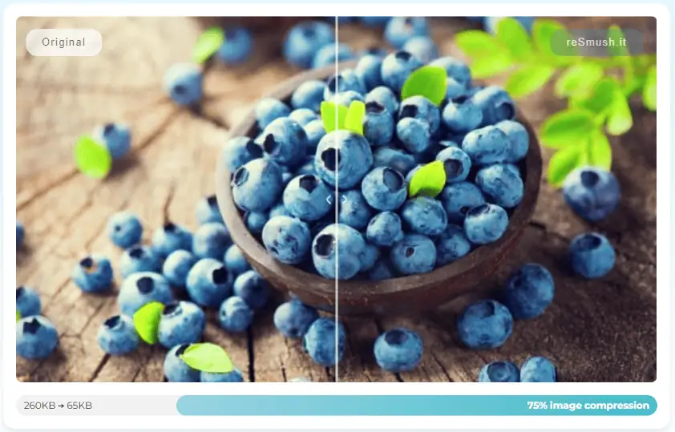
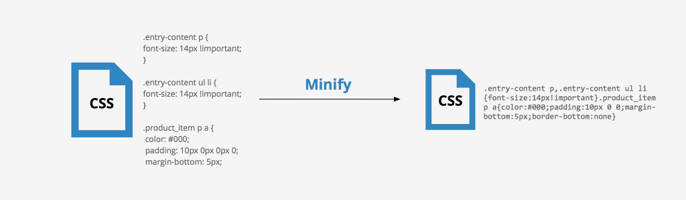
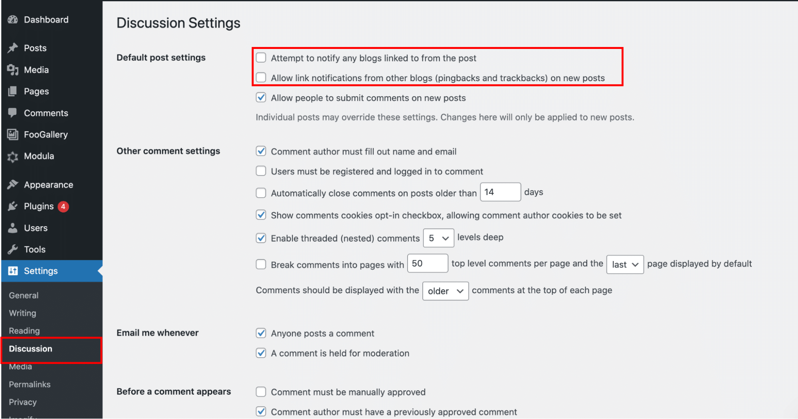
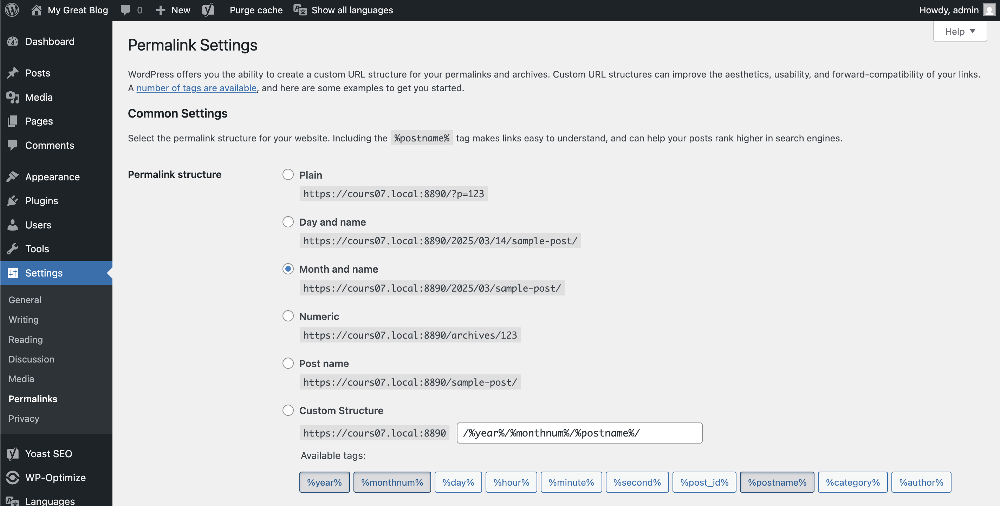
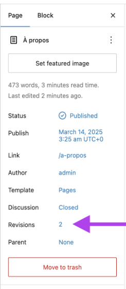
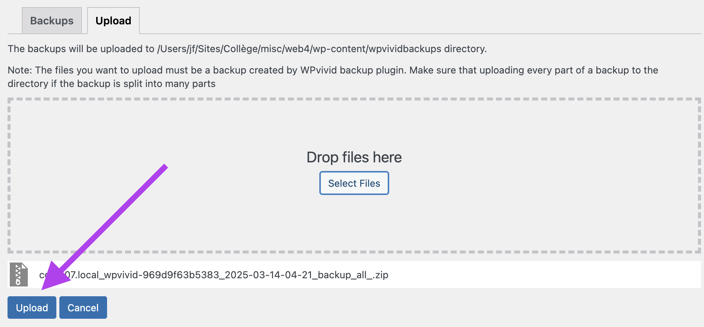

# Cours 7

## Optimisation

### Images



Une conversion des images au format **WebP** est nécessaire pour améliorer les performances du site en réduisant leur poids sans perte significative de qualité. Ce format est d’ailleurs recommandé par Google pour optimiser le temps de chargement des pages.

Plugin : [WP-Optimize](https://fr-ca.wordpress.org/plugins/wp-optimize/)

Un compression est effectuée par l'entremise de l'outil [reSmush.it](http://resmush.it/).

### Compression du code

{data-zoom-image}

L’optimisation des fichiers **CSS** et **JavaScript** permet d’accélérer l’affichage des pages.

Cette technique, appelée « **minification** », supprime les espaces inutiles, les commentaires et réduit la taille des fichiers.

Plugin : [WP-Optimize](https://fr-ca.wordpress.org/plugins/wp-optimize/)

### Base de données

Une base de données optimisée améliore la réactivité et réduit le temps de réponse du serveur. Cela inclut le nettoyage des **révisions** de posts ou des **commentaires en attente** par exemple.

Plugin : [WP-Optimize](https://fr-ca.wordpress.org/plugins/wp-optimize/)

[Commentaire faire un bon nettoyage de la base de données ? (en)](https://nitropack.io/blog/post/wordpress-database-cleanup-guide)

Avant d'effectuer un nettoyage, faites toujours un backup de votre site et analysez en amont ce qui n'est plus à jour. Par exemple :

* plugins non utilisés
* themes non utilisés
* étiquettes non utilisés
* catégories non utilisées
* posts non publiés
* commentaires en attente
* images non utilisées
* posts plus à jour
* profils utilisateurs peu ou pas utilisé depuis longtemps
* anciennes révisions
* spam
* etc.

#### Pingbacks et trackbacks

Tant qu'à être dans le grand ménage du printemps, supprimez les pingbacks et trackbacks et désactivez les.

{data-zoom-image}

### Cache

{data-zoom-image}

La mise en cache permet d’**accélérer le chargement des pages** en stockant temporairement des versions statiques du contenu, réduisant ainsi la charge sur le serveur et améliorant l’expérience utilisateur.

Plugin : [WP-Optimize](https://fr-ca.wordpress.org/plugins/wp-optimize/)

### CDN

Un Content Delivery Network (CDN) est un réseau de serveurs **répartis géographiquement** qui permet d’accélérer le chargement des pages en distribuant les fichiers statiques (images, CSS, JavaScript, polices, etc.) depuis un serveur proche de l’utilisateur. Par exemple : Cloudflare.

Avantages :

* Améliore les **performances**
* Optimise la **SEO**
* Réduit de la consommation de **bande passante**
* Renforce la **sécurité** :
  * Protection contre les attaques DDoS[^ddos] en répartissant le trafic sur plusieurs serveurs.
  * Certains services CDN offrent aussi une protection contre les _bots_ et les tentatives d’intrusion.

{data-zoom-image}

[^ddos]: Une attaque DDoS (_Distributed Denial of Service_) est une tentative malveillante de surcharger un serveur ou un réseau en envoyant un grand nombre de requêtes simultanées depuis plusieurs sources, rendant le site ou le service inaccessible.

| Type de CDN              | Utilité principale                                           | Exemples                         |
|--------------------------|--------------------------------------------------------------|----------------------------------|
| **CDN classique**        | Héberge des fichiers **statiques** pour accélérer WordPress. | Cloudflare, BunnyCDN, StackPath |
| **CDN de bibliothèques** | Fournit des **fichiers publics** comme Bootstrap pour éviter de les stocker localement. | Google Hosted Libraries, jsDelivr, CDNJS |

!!! question "Wait what ?"

    Si Cloudflare créé des fichiers statiques de mon site WordPress, ça veut dire que ceux-ci seront dupliqués sur le nombre de serveurs que Cloudflare a dans le monde ?

    C'est fou, n'est-ce pas ?! Sachant que Cloudflare dispose d’un réseau mondial avec plus de **13 000 points d'accès**. Ça en fait des copies !

    Imaginez la quantité d’informations stockées sur ces serveurs ! C’est **astronomique**. 🌍🚀

## Metatags

Configurer les OG tags (Open Graph) est essentiel pour contrôler l’affichage des liens de votre site sur les réseaux sociaux. C'est simplement une question de crédibilité.

Plugin : [Yoast SEO](https://fr-ca.wordpress.org/plugins/wordpress-seo/)

Pour tester les metatags dans votre navigateur, je suggère l'emploi de l'extension Chrome [OGraph Previewer](https://chromewebstore.google.com/detail/ograph-previewer/ggcfeakcnodgcmmllfdbmngekljbhiim)

## Préparation à l'examen

### Domaine, serveur et base de données

**Nom de domaine** : C’est l’adresse web qui permet d’accéder au site sans avoir à retenir son adresse IP.

**L’hébergement** : C’est l’espace de stockage où sont conservés les fichiers et données du site.

**Le serveur** : C’est l’ordinateur (physique ou virtuel) qui exécute le site et le rend accessible sur Internet.

**La base de données** : C’est le système de stockage des contenus dynamiques du site (articles, utilisateurs, réglages).

### Le processus d'une requête

{data-zoom-image}

1. Jean-François entre un URL dans **Chrome**
1. Résolution **DNS** (Domain Name System)
  * Chrome vérifie son cache (ou celui du système d’exploitation) pour voir si l’IP est déjà connue.
  * Si c'est pas le cas, il interroge un serveur DNS (ex: 4.4.4.4 ou 8.8.8.8 de Google).
  * Le DNS renvoie l’adresse IP du serveur où est hébergé le site (ex: 53.35.44.2).
1. Envoi de la **requête HTTP** vers le serveur
  * Chrome établit une connexion avec le serveur.
  * Si Cloudflare ou un autre CDN est utilisé, la requête passe d’abord par ce réseau avant d’atteindre le serveur d’origine!
1. Le serveur **reçoit** la requête et l’analyse
  * Le serveur Web (Apache ou Nginx) reçoit la demande.
  * Il vérifie s’il y a une version en cache de la page. Si oui, la page est servie immédiatement. Si non, la requête est transmise à PHP.
1. **PHP** traite la requête
  * PHP exécute Wordpress et analyse la requête (ex: charger la page d’accueil).
  * Si la page demandée contient du contenu dynamique, PHP interroge la base de données.
1. PHP **envoie** le contenu généré Apache ou Nginx
1. Le serveur **envoie** la réponse à Chrome
1. Le Chrome **télécharge** et affiche la page à Jean-François
  * Le Chrome analyse le HTML, et télécharge les CSS, images, polices, JavaScript et exécute le code JavaScript.

### Multilingue avec Polylang

#### Installation

{data-zoom-image}

{data-zoom-image}

{data-zoom-image}

{data-zoom-image}

#### Menu et sélecteur de langue

Pour une gestion de menu plus simple, utilisons le plugin [Site Editor Classic Features](https://fr-ca.wordpress.org/plugins/polylang/).

{data-zoom-image}

{data-zoom-image}

{data-zoom-image}

{data-zoom-image}

<!--
Activez le _language switcher_ en code dans le fichier `functions.php` de votre theme.

```php
<?php

function custom_pll_language_switcher() {
  return pll_the_languages( array(
    'show_flags' => 1,
    'show_names' => 1,
    'display_names_as' => 'name', // name ou slug
    'echo' => 0,
    'hide_current' => 1,
  ) );
}
add_shortcode( 'custom_language_switcher', 'custom_pll_language_switcher' );
```

Le shortcode suivant sera alors disponible sur WordPress :

```txt
[custom_language_switcher]
```

Insérez ensuite le shortcode dans l'entête ou le pied de page.

{data-zoom-image}

-->

Enfin, configurez correctement les paramètres de Polylang.

{data-zoom-image}

{data-zoom-image}

#### Traduction

Lorsqu'on traduit une page avec plusieurs blocs, il est possible de copier/coller les blocs dans la traduction.

{data-zoom-image}

### Page ou article ?

Utilise un “article” (_post_) si le contenu est chronologique, dynamique[^dyn] et catégorisé (ex: articles de blog, actualités).

Utilise une “page” si le contenu est statique et intemporel (ex: “À propos”, “Contact”, “Services”).

[^dyn]: Qui pourrait être mis à jour régulièrement.

### Configurer son article

#### Image et extrait

**Le plus souvent possible**, ajoutez une **image principale** et un **extrait** à vos articles.

{data-zoom-image}

#### Statut de publication

{data-zoom-image}

#### Catégories

* Organisation hiérarchique (ex: “Recettes > Desserts > Gâteaux”).
* Une **obligation** d’en choisir au moins une par article ! Si on ne spécifie rien, c'est « Uncategorized » qui est choisi!
* **Structure le site et aide à sa navigation**.

> Catégorie répond à la question : Dans quelle section du site mon article devrait-il aller ?

#### Étiquettes (_Tags_)

* Mots-clés qui **décrivent** un article (ex: “chocolat”, “rapide”, “sans gluten”).
* Permettent de relier des articles ayant des **sujets** communs, sans hiérarchie.

> Étiquettes répond à la question : Quels mots résument bien l'article ?

### Gestion des URL

{data-zoom-image}

En multilingue, n'oubliez pas aussi de corriger la structure des URL dans Polylang.

### Modèles

Il faut faire la différence entre la gestion des modèles de page et celle du contenu.

{data-zoom-image}

!!! example "Exercice éclair"

    Laquelle des images ci-dessous permet l'édition de la page et laquelle fait l'édition du modèle de page ?

<div class="grid grid-1-1" markdown>
{data-zoom-image}

{data-zoom-image}
</div>

Notion à connaitre également : Compositions (Patterns) (_Synced_ vs. _Not synced_)

### Révisions

Les révisions sont des versions de contenu. Lorsque cette fonctionnalité est active, les modifications sont enregistrées automatiquement et peuvent être restaurées à tout moment.

Super pratique, mais assez lourd pour la base de données.

{data-zoom-image}

### Sauvegarde et exportation

L'exportation d’un site WordPress est simplifiée grâce au plugin [WPvivid Backup & Migration](https://wordpress.org/plugins/wpvivid-backuprestore/).

#### Créer une sauvegarde

1. Allez dans WPVivid Backup et cliquez sur **"Backup Now"** pour créer une copie complète de votre site.
2. Une fois la sauvegarde terminée, elle apparaît dans l’onglet **"Backups"**.

{data-zoom-image}

#### Exporter une sauvegarde

1. Dans l'onglet **"Backups"**, trouvez la sauvegarde souhaitée.
2. Cliquez sur **"Download"** pour exporter votre sauvegarde.
3. Vous pouvez maintenant l'utiliser pour restaurer votre site sur un autre WordPress.

{data-zoom-image}

{data-zoom-image}

#### Restaurer une sauvegarde

Avant de restaurer une sauvegarde, assurez-vous que votre nouveau site WordPress est installé et que le plugin **WPvivid Backup & Migration** est activé.

**Téléverser la sauvegarde**

* Allez dans WPVivid Backup sur le nouveau site.
* Cliquez sur **"Upload"** et importez le fichier de votre sauvegarde.

{data-zoom-image}

{data-zoom-image}

**Restaurer la sauvegarde**

* Une fois l’import terminé, retournez dans l’onglet **"Backups"**.
* Cliquez sur **"Restore"** pour restaurer votre site.

Votre site est maintenant restauré avec succès ! 🚀

## Exercices

<div class="grid grid-1-2" markdown>
  

  <small>Exercice - PHP</small><br>
  **[D&D](./exercices/wp-dd.md){.stretched-link .back}**
</div>
