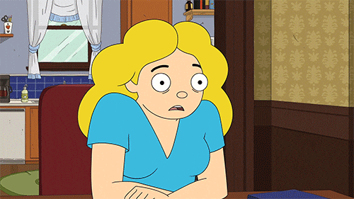

# TP - Préparation

Première étape du projet : définir l’**organisation** de l’équipe, le **concept éditorial** du magazine, son **identité visuelle** et réaliser les **wireframes** des pages principales.

## Organisation du travail

{.w-100}

- [ ] Répartition des rôles (⚠️ le développement WordPress doit être partagé entre tous les membres) :
  * Rédaction de contenu
  * Design visuel et identité graphique
  * Vérification SEO, accessibilité et multilingue
- [ ] Planification du travail à faire en classe et à l’extérieur des cours

## Exemples de magazines Web

Besoin d’inspiration ? Voici quelques exemples :

* [The Creative Independent](https://thecreativeindependent.com/) – Arts et création
* [Pitchfork](https://pitchfork.com/) – Musique
* [Konbini](https://www.konbini.com/) – Culture pop
* [Horreur Québec](https://www.horreur.quebec/) – Cinéma
* [Polygon](https://www.polygon.com/) – Jeux vidéo
* [Makezine](https://makezine.com/) – DIY & bricolage
* [Elle](https://www.ellecanada.com/) – Mode

T'en veux plus ? 👉 <https://www.magazine.co.uk/>

## Brainstorm et inspiration

{.w-100}

Un brainstorming, c’est une séance de génération d'idées où **aucune piste n’est mauvaise**. L’objectif est d'explorer pleins de directions possibles avant d'établir une ligne directrice au projet. Le but ici est de trouver un sujet motivant.

Quelques questions pour orienter votre réflexion :

- [ ] Quelle est la **thématique principale** du magazine ?
  - 🎨 Arts et culture
  - 🎮 Divertissement
  - 💄 Mode & beauté
  - 📚 Loisirs & passe-temps
  - 🍽️ Alimentation
  - 🚗 Automobile & transport
  - 🧪 Science & nature
  - 🧑‍💻 Technologies
  - 📰 Actualités
  - ⚽ Sports
- [ ] Quel est le ou les **sous-thèmes** abordés ?
  - Peinture, dessin, peinture, photographie, musique
  - Jeux, cinéma, séries télé, musique, anime
  - Cosmetique, coiffure, vêtements
  - Lecture, écriture, voyages, diy
  - Cuisine, nutrition, restos
  - Voitures, motos, vélo
  - Environnement, astronomie, biologie, animaux
  - Gadgets, IA, programmation
  - Politique, société, débats d’idées
  - Sport amateur, e-sport, entraînements, tournois
- [ ] Quel est le **public cible** ? (Enfants, ados, adultes…)
- [ ] Quel est le **ton éditorial** ? (Sérieux, humoristique, informel…)
- [ ] Quel sera le **titre du magazine** ?
- [ ] Quels types de **contenus** seront publiés ? (Éditoriaux, critiques, _how-to_, palmarès, événements…)
- [ ] Quelle **identité visuelle** correspond au projet ? (Couleurs, ambiance, inspirations…)

- [ ] Compiler toutes vos réponses dans un document Word 📄 Word.

## Wireframes

{.w-100}

Les wireframes sont des maquettes fonctionnelles qui montrent la **structure des pages** du site (pas leur design final). Ils ne représente pas le design graphique, mais bien le design d'information (la disposition des contenus).

Voici [des exemples de wireframes](https://www.flux-academy.com/blog/20-wireframe-examples-for-web-design).

Utilisez Figma, Google Slides ou tout simplement du papier et un crayon ✏️.

- [ ] Créer un wireframe pour la page d'accueil
- [ ] Créer un wireframe pour la page d'un auteur (nom, biographie, portrait, articles de l'auteur, informations de contact)
- [ ] Créer des wireframes pour chaque type de contenu (types de post).

!!! question "Pourquoi créer un type de contenu personnalisé ?"

    On pourrait se contenter de catégories, non ?

    Le hic, c’est qu’on ne peut pas créer un modèle de page spécifique pour une catégorie. Donc si vous voulez, par exemple, une mise en page spéciale pour des recettes, vous devrez :
    1. Soit modifier le modèle de **tous** les articles (pas idéal)
    2. Soit créer un type de post "Recette" avec son propre template 👍

!!! example "Flexibilité"

    Assurez-vous de garder une certaine flexibilité dans vos wireframe, parce que les consignes de la deuxième partie risquent d'influencer un peu votre travail de conception.

## Identité visuelle et design graphique

- [ ] Définir l’esthétique recherchée :
  * Recherches d’inspiration (veille graphique, moodboards)
  * Exploration de thèmes existants dans WordPress. Attention de bien choisir un thème à base de blocs (_block based themes_).
  * Vous n'êtes pas forcé à cette étape de vous commetre sur un thème spécifique. Toutefois, je vous conseillerais d'en sélectionner 2 ou 3 max.

## Remise

En mode formatif, au prochain cours (le 17 avril), vous devrez avoir terminé cette partie du TP afin de recevoir des rétroactions sur votre préparation.
