# Accessibilité

*[SEO]: Search Engine Optimization
*[E-E-A-T]: Experience, Expertise, Authoritativeness, and Trustworthiness
*[WCAG]: Web Content Accessibility Guidelines
*[UX]: User eXperience
*[CTA]: Call To Action
*[CTR]: ClickThrough Rate

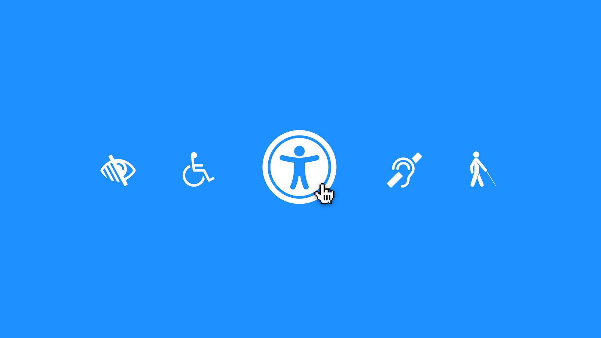

L'**accessibilité Web** (A11Y) consiste à rendre les sites internet utilisables par **tous**, y compris les personnes en situation de handicap (**visuel**, **auditif**, **moteur**, **cognitif**).

Une bonne accessibilité **garantit une expérience utilisateur équitable** et **optimise aussi le SEO**, car les sites bien structurés sont mieux référencés.

De plus, plusieurs pays imposent des normes légales comme **WCAG 2.1**.

[^a11y]: <https://www.boia.org/blog/what-is-a11y>

## Normes et obligations

Plusieurs endroits dans le monde (Union Européenne, Royaume-Uni, Australie, États-Unis, Canada) exigent que les sites web respectent certaines normes d'accessibilité (ex : **WCAG 2.1**).

D'ailleurs, c'est le cas pour les organismes gouvernementaux et para-gouvernementaux au Québec[^qc] :

* Ministères et organismes gouvernementaux.
* Municipalités et services publics.
* Organismes recevant du financement gouvernemental.

[^qc]: <https://www.quebec.ca/accessibilite>

## Principes fondamentaux

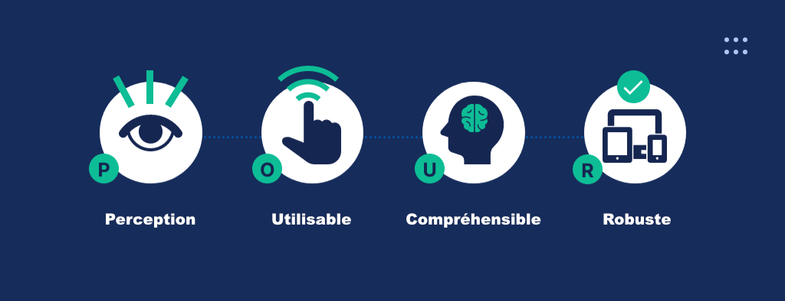{.w-100}

Les **WCAG**[^wcag] définissent **quatre principes fondamentaux** pour garantir l'accessibilité numérique. Depuis décembre 2024, on est maintenant à la version republiée `2.2` des WCAG[^wcag22].

[^wcag]: <https://www.w3.org/WAI/standards-guidelines/wcag/>

[^wcag22]: <https://www.w3.org/TR/WCAG22/>

### Perceptible

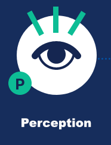

Les utilisateurs doivent pouvoir accéder au contenu, quel que soit leur mode d'interaction.

#### Mise en contexte

Un site de recettes affiche l'image d'un plat. Par contre, les utilisateurs aveugles n'arrivent pas à comprendre ce que montre l'image.

✅ Solution : Ajouter un texte alternatif décrivant chaque image :

```html

```

### Utilisable

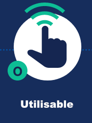

La navigation et l'interactivité doivent être accessibles à tous les utilisateurs.

#### Mise en contexte

Un site e-commerce utilise un menu déroulant, mais celui-ci ne peut être ouvert qu’avec une souris.

✅ Solution : Permettre la navigation au clavier (++tab++ et ++enter++). En même temps, penser à indiquer clairement où se trouve le focus au moment de la navigation par clavier :

```css
:focus {
  outline: 2px solid blue;
}
```

### Compréhensible

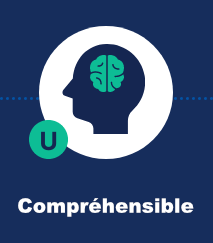

L'information et la navigation doivent être faciles à comprendre.

#### Mise en contexte

Un site WordPress affiche un formulaire de contact, mais les champs ne sont pas bien étiquetés. On comprend mal où entrer ses informations.

✅ Solution : Ajouter des labels explicites pour les champs de formulaire.

```html
<label for="email">Courriel :</label>
<input type="email" id="email" name="email" placeholder="jfcartier@cmontmorency.qc.ca">
```

Pensez aussi à la gestion des erreurs en JavaScript et assurez vous que le message parle à l'utilisateur.

```html
<label for="email">Courriel :</label>
<input type="email" id="email" name="email" placeholder="jfcartier@cmontmorency.qc.ca">
<small class="form-error">Veuillez entrer un courriel valide.</small>
```

### Robuste

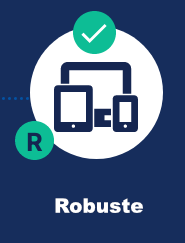

Le site doit être compatible avec différents appareils et technologies.

#### Mise en situation

Un blog utilise un lecteur audio JavaScript super cool, mais celui-ci ne fonctionne pas avec un lecteur d’écran.

✅ Solution : Utiliser HTML5 pour une meilleure compatibilité :

```html
<audio controls>
  <source src="podcast.mp3" type="audio/mpeg">
</audio>
```

## Exemples concrets

### 📸 Texte alternatif (Alt text)

* Les images doivent avoir un **texte alternatif** qui décrit leur contenu.
* Les icônes purement décoratives doivent avoir un `alt=""` ou être cachées aux lecteurs d'écran.

### 🎨 Contraste des couleurs

* Le contraste entre le texte et l'arrière-plan doit être d'au moins **4.5:1**.
* Un contraste insuffisant rend la lecture difficile pour les personnes malvoyantes.

### 🎥 Sous-titres et transcriptions

* Les vidéos doivent contenir **des sous-titres et/ou une transcription** pour les personnes sourdes ou malentendantes.

### ⌨️ Navigation au clavier

* Un utilisateur doit pouvoir **parcourir tout le site avec la touche Tabulation (`Tab`)**.
* Les menus déroulants, boutons et autres éléments interactifs doivent être accessibles sans souris.

### 🏷️ Labels et formulaires accessibles

* Tous les champs de formulaire doivent être accompagnés d'un **label clair et lisible**.
* Les erreurs de saisie doivent être expliquées **clairement** à l'utilisateur.

### ⚠️ Erreurs fréquentes à éviter

* Ne pas imposer **d'actions rapides** (ex : limite de temps non ajustable).
* Ne pas utiliser de **contenus clignotants** qui peuvent provoquer des crises d'épilepsie.
* Éviter d'utiliser uniquement la couleur pour transmettre une information.

## À faire / À éviter

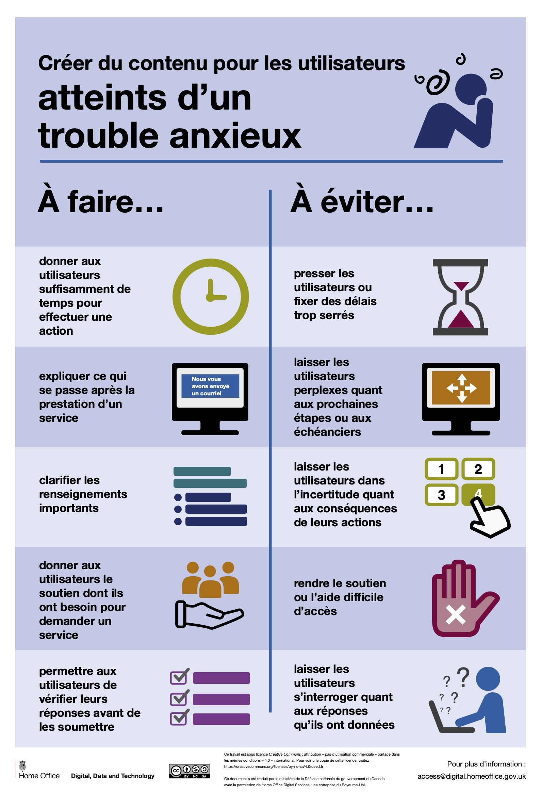{.w-100 data-zoom-image}

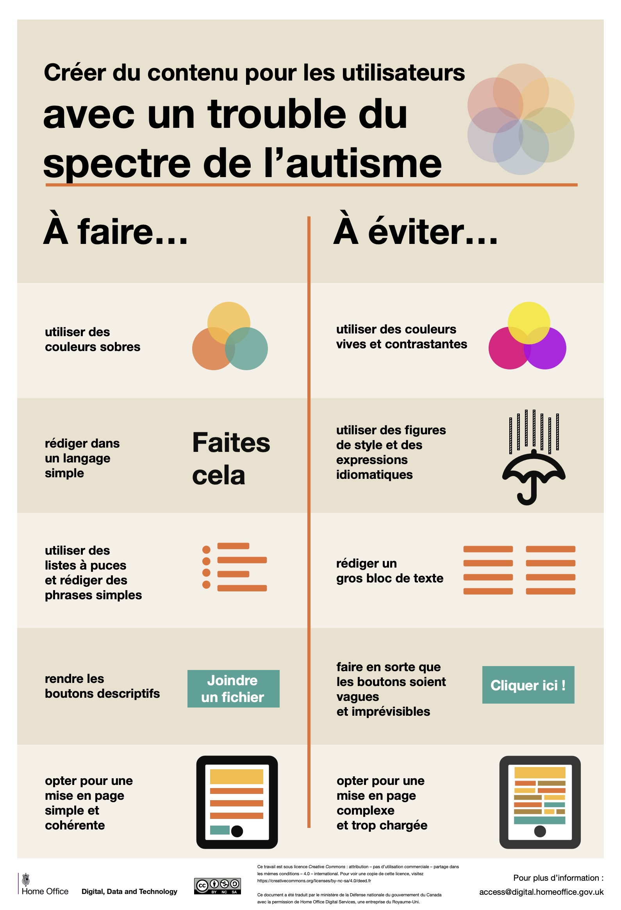{.w-100 data-zoom-image}

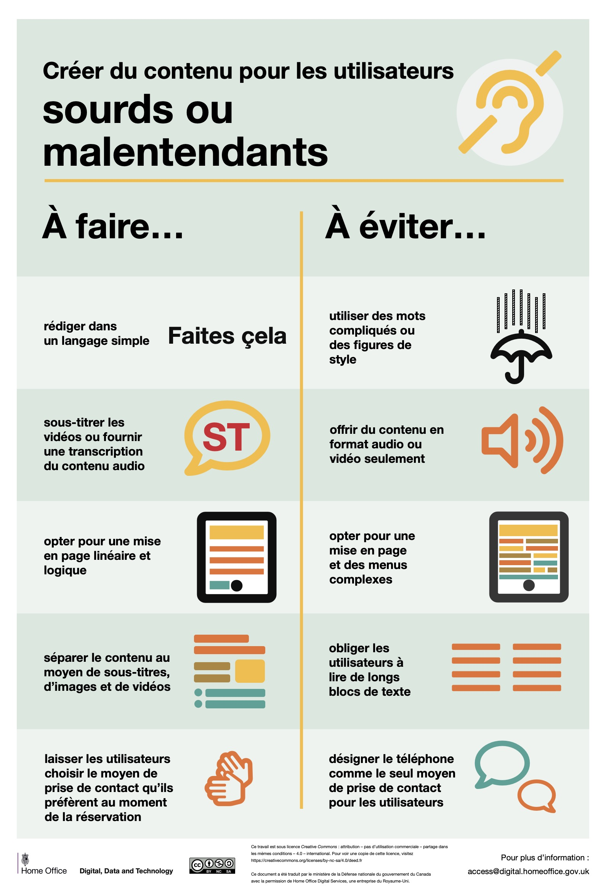{.w-100 data-zoom-image}

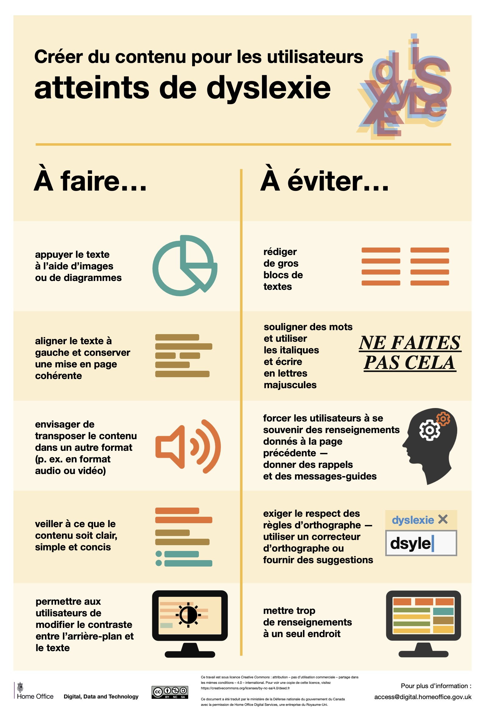{.w-100 data-zoom-image}

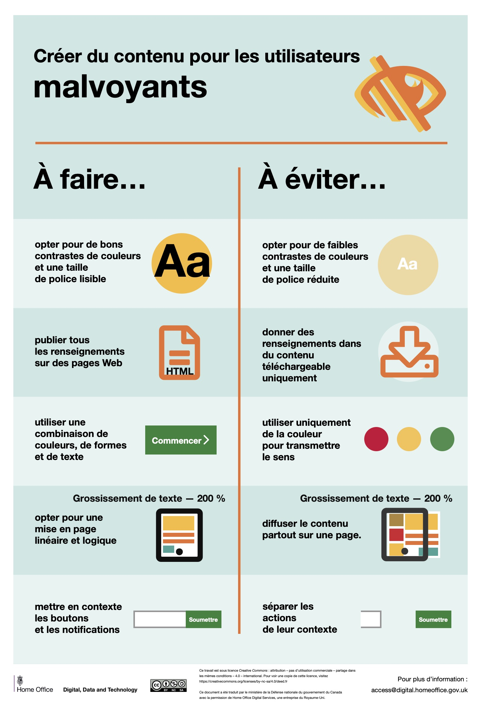{.w-100 data-zoom-image}

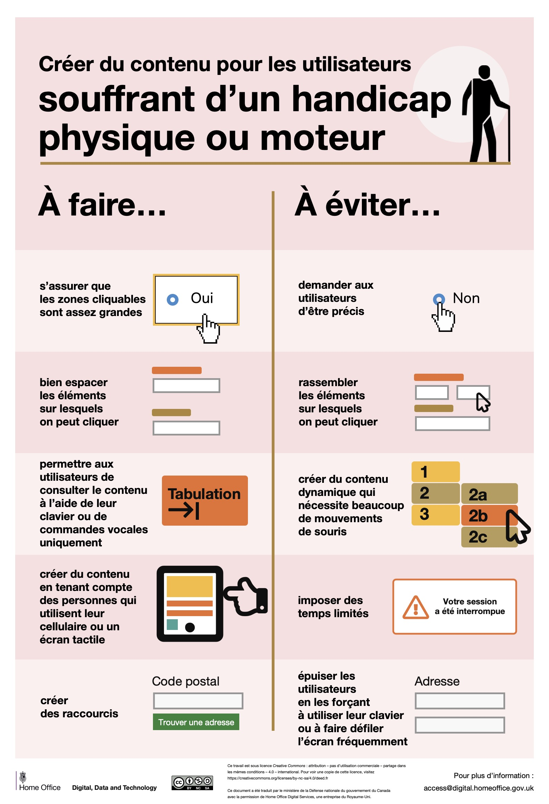{.w-100 data-zoom-image}

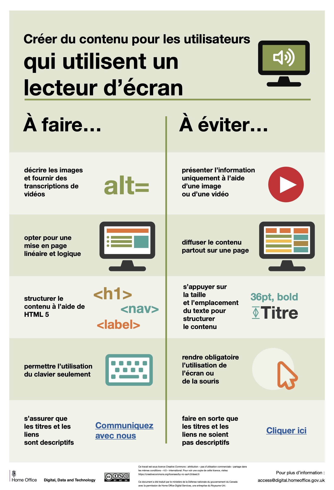{.w-100 data-zoom-image}

Source : https://github.com/UKHomeOffice/posters

## Tester l'accessibilité

<div class="grid grid-1-2" markdown>
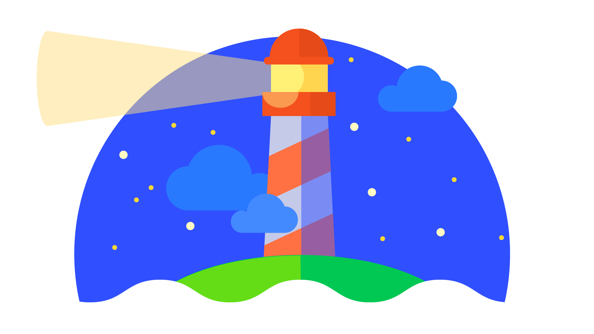

<div markdown>
**[Lighthouse (Google)](https://developer.chrome.com/docs/lighthouse/)**

Audit automatique d'accessibilité.
</div>
</div>

<div class="grid grid-1-2" markdown>
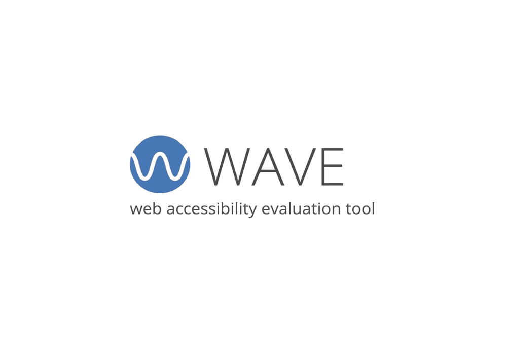

<div markdown>
**[WAVE Web Accessibility Evaluation Tool](https://wave.webaim.org/)**

Analyse les contrastes, textes alternatifs, erreurs ARIA, etc.
</div>
</div>

<div class="grid grid-1-2" markdown>
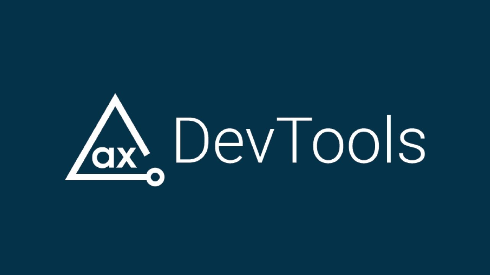

<div markdown>
**[axe DevTools](https://www.deque.com/axe/devtools/)**

Extension Chrome pour détecter les problèmes d'accessibilité.
</div>
</div>

<div class="grid grid-1-2" markdown>
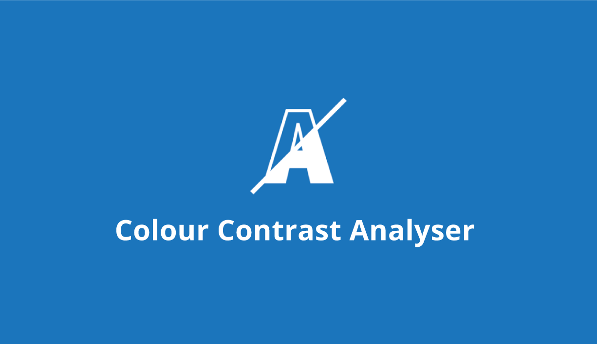

<div markdown>
**[Contrast Checker](https://webaim.org/resources/contrastchecker/)** / **[Link Contrast Checker](https://webaim.org/resources/linkcontrastchecker/?fcolor=0000FF&bcolor=FFFFFF)**

Vérifie si le contraste des couleurs respecte les normes WCAG 2.1.
</div>
</div>

<div class="grid grid-1-2" markdown>
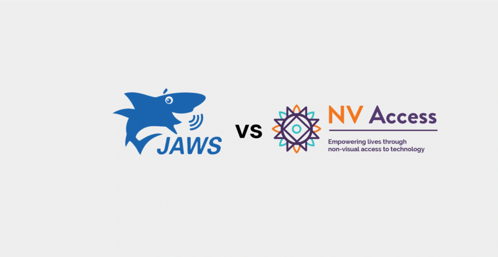

<div markdown>
**[NVDA (NonVisual Desktop Access)](https://www.nvaccess.org/)**

Lecteur d'écran gratuit pour tester la compatibilité.
</div>
</div>
