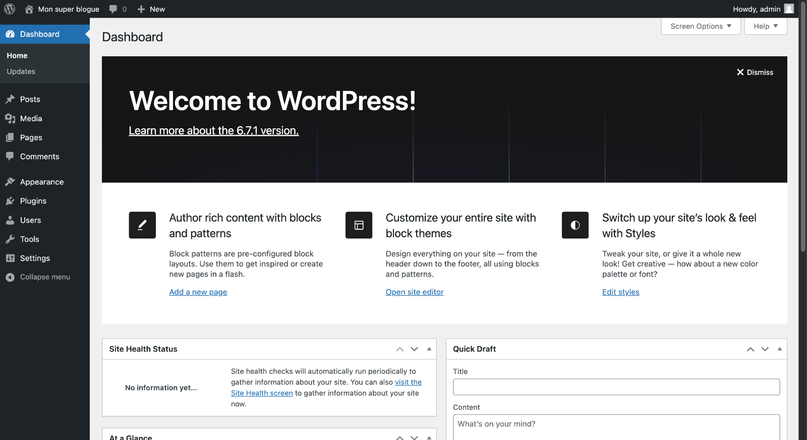
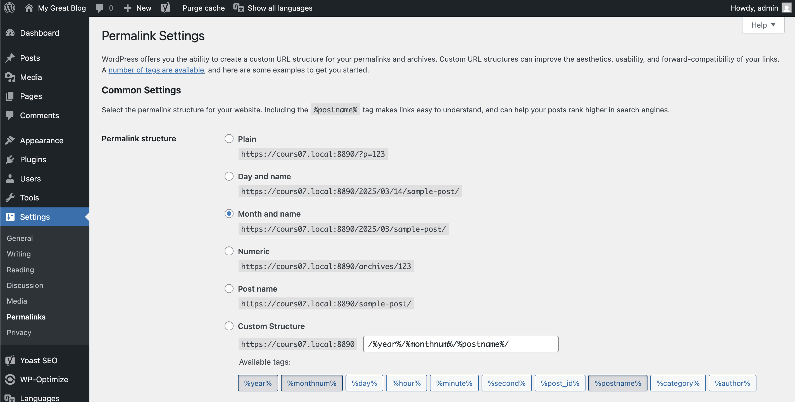

# Bienvenue en Web 4

*[CMS]: Content Management System
*[BD]: Base de données

{.w-100}

## Système de gestion de contenu (CMS)

Un CMS (Content Management System) c'est un outil qui permet de créer, organiser et gérer des contenus sans programmation ! Il est composé d'un gros paquet de fichiers de programmation qui permet d'exécuter plein de fonctionnalités.

!!! info "Info"

    WordPress est utilisé par 60 % des sites web dont nous connaissons le système de gestion de contenu. Cela représente 42,8 % de l'ensemble des sites web .

{data-zoom-image}

### Voici une liste non exhautive de CMS populaires[^cms] :

[^cms]: [Liste des 15 CMS les plus populaires](https://www.wpbeginner.com/showcase/best-cms-platforms-compared/)

* :simple-wordpress: Wordpress (open-source)
* :simple-drupal: Drupal (open-source)
* :simple-joomla: Joomla (open-source)
* :simple-hubspot: Hubspot
* :simple-shopify: Shopify
* :simple-ghost: Ghost (open-source)
* :simple-typo3: Typo3 (open-source)
* :simple-blogger: Blogger
* :simple-wix: Wix

### Constructeur de pages les plus populaire pour Wordpress

{data-zoom-image}

### Voici un aperçu rapide de ce à quoi ressemble le CMS wordpress :

<div class="grid grid-1-2" markdown>
  {data-zoom-image}

  Interface administrative où les utilisateurs gèrent le contenu, les paramètres et les fonctionnalités du site (back-end)
</div>

<div class="grid grid-1-2" markdown>
  {data-zoom-image}

  Édition du contenu en ligne (inline editing)*
</div>

<div class="grid grid-1-2" markdown>
  {data-zoom-image}

  Aperçu du résultat final (front-end)
</div>

<!-- Une manière de gérer le contenu. Soit par wysiwyg, inline editing ou par formulaire admin. -->

## Fonctionnalités d'un CMS

Voici quelques-unes des fonctionnalités clés que l’on retrouve généralement dans un CMS :

* **Interface conviviale (UI)** : Une interface utilisateur intuitive permet aux administrateurs et aux éditeurs de naviguer facilement dans le système, de créer et de modifier du contenu sans nécessiter de compétences techniques avancées.
* **Gestion de contenu** : Les CMS permettent une gestion efficace du contenu, offrant des fonctionnalités pour ajouter, modifier et supprimer des pages, des articles, des images et d’autres types de médias.
* **Personnalisation de l’apparence** : La possibilité de personnaliser l’apparence du site grâce à des **thèmes**.
* **Optimisation pour les moteurs de recherche (SEO)**
* **Gestion des utilisateurs et des permissions** : La possibilité de gérer plusieurs utilisateurs avec des rôles et des permissions spécifiques, facilitant la collaboration tout en maintenant la sécurité et le contrôle sur le contenu publié.
* **Sécurité** : Des fonctionnalités de sécurité robustes, y compris des mises à jour régulières, la gestion des permissions et le support SSL, sont essentielles pour protéger les informations sensibles et assurer la fiabilité du site.
* **Support multilingue**
* **Optimisation pour les appareils mobiles** : En bonne partie lié au thème choisi.
* **Gestion des versions et historique des révisions**
* **Intégration avec des outils tiers** : La possibilité d’intégrer des **plugins** et des extensions pour ajouter des fonctionnalités supplémentaires et des fonctionnalités avancées.

## Pourquoi utiliser un CMS ?

> ... plutôt que d'utiliser le bon vieux duo HTML et CSS?

C'est que créer un site Web complet, entièrement à la main, peut être long et compliqué. De plus, pour faire la gestion d'une site, ne serait-ce que pour changer une virgule, il faut être capable de lire le code ainsi que savoir comment programmer. Les CMS démocratisent la gestion de site Web, car ils offrent une interface compréhensible pour le commun des mortels.

Voici quelques avantages à l'usage de CMS :

* Gain en temps
* Architecture logique
* Mises à jour : pour ajouter des fonctionnalités, mais aussi régler certains bogues ou vulnérabilités
* Sécurité
* Expérience utilisateur (UX)
* Design
* Flexibilité
* Accessibilité

## Bon, comment ça marche ?

### Le serveur

Un serveur est un ordinateur configuré pour fournir des ressources via un réseau, comme Internet. Dans le cas d’un serveur web, son rôle est de traiter les requêtes des utilisateurs et de fournir les réponses correspondantes, comme les pages web, les fichiers ou les médias.

### CMS et langage de programmation

Sur le serveur, on peut installer un CMS. Cependant, il est également nécessaire d’installer le langage de programmation utilisé par le CMS. Par exemple, WordPress est écrit en PHP.

### Le logiciel serveur

Pour permettre les communications via Internet et afficher un site web, vous devez installer un serveur web comme **Apache** ou **Nginx**.

### Base de données

Une base de données est un logiciel serveur conçu pour stocker, organiser et gérer des données de manière structurée. Un peu comme Excel, mais sur les stéroïdes. Il existe plusieurs sortes de base de données. Chacune a ses propres avantages et inconvénients[^db]. Pour sa part, WordPress fonctionne avec MySQL ou MariaDB.

[^db]: [Comparatif des différentes bases de données](https://en.wikipedia.org/wiki/Comparison_of_relational_database_management_systems) (en)

### Nom de domaine

Il est également préférable d’acquérir un nom de domaine pour que les visiteurs puissent accéder facilement à votre site (par exemple, recettes.qc.ca) plutôt que par une adresse IP (par exemple: 24.71.1.221). Ce domaine doit être configuré pour pointer vers votre serveur !

## WordPress


WordPress est un CMS open-source permettant de créer et de gérer des sites Web sans nécessiter de connaissances approfondies en programmation.

!!! info "Un peu d’histoire"

    * Créé en 2003 par Matt Mullenweg et Mike Little
    * Initialement conçu pour faire des blogues, il est devenu la plateforme CMS la plus utilisée au monde
   

### Avantages de WordPress

* **Gratuit et open-source**
* **Flexibilité** : permet de créer des blogs, sites vitrine, boutiques en ligne, etc
* **Large communauté** : des milliers de développeurs créent des extensions et thèmes
* **Facilité d’utilisation** : interface intuitive et personnalisable
* **SEO-friendly** : optimisé pour les moteurs de recherche

### Licence GPL

WordPress est sous licence <b>GPL</b> (General Public License). 

Voici les trois avantages principaux :

* Vous pouvez utiliser WordPress comme bon vous semble **sans aucune restriction**.
* Vous pouvez personnaliser, ajouter ou supprimer tout ce que vous n’aimez pas dans WordPress sans aucune restriction.
* Vous pouvez reconditionner, renommer, vendre et distribuer WordPress sans aucune restriction, sauf qu’il est également publié sous licence GPL.

## WordPress.com / WordPress.org

WordPress.org appartient à la communauté open-source et est supervisé par la WordPress Foundation.

WordPress.com appartient à Automattic, une société privée dirigée par Matt Mullenweg.

| Critère          | WordPress.com                                                      | WordPress.org                                           |
| ---------------- | ------------------------------------------------------------------ | ------------------------------------------------------- |
| Hébergement      | Hébergé par [Automattic](https://en.wikipedia.org/wiki/Automattic) | Hébergé par vous-même (auto-hébergé)                    |
| Coût             | Gratuit avec options payantes.                                     | 100% gratuit, mais vous payez pour l’hébergement        |
| Personnalisation | Limitée (certains thèmes et plugins restreints)                    | Totale (tous les thèmes et plugins disponibles)         |
| Nom de domaine   | Sous-domaine gratuit (ex. : votresite.wordpress.com)               | Nécessite un domaine personnalisé (ex. : votresite.com) |
| Publicité        | Publicité imposée sur les plans gratuits                           | Pas de publicité imposée                                |


## Structure des fichiers de Wordpress


```txt
votre-site-web/
          └──   index.php
          └──   license.txt
          └──   readme.html
          └──   activate.php
          └──   wp-admin/
          └──   wp-blog-header.php
          └──   wp-comments-post.php
          └──   wp-config-sample.php
          └──   wp-config.php
                wp-content/
                    └──  index.php
                    └──  languages/
                    └──  plugins/
                    └──  themes/
                    └──  upgrade/
                    └──  uploads/
          └──   wp-cron.php
          └──   wp-includes/
          └──   wp-links-opml.php
          └──   wp-load.php
          └──   wp-login.php
          └──   wp-mail.php
          └──   wp-settings.php
          └──   wp-signup.php
          └──   wp-trackback.php
          └──   xmlrpc.php
```

## L'interface

<div class="grid grid-1-2" markdown>
  {data-zoom-image}

  Barre d’administration WordPress
</div>

### Barre d’administration WordPress

=== "Logo WordPress"

    **Donne accès au site officiel de WordPress et aux ressources :**

    - WordPress.org
    - Documentation
    - Forums
    
    Permet aussi de voir la version actuelle de WordPress.

=== "Maison (Accueil / Nom du site)"
    - Affiche le nom de votre site.
    - Cliquer dessus ouvre le site public (front-end).
    - Menu déroulant : accès rapide à Tableau de bord, et parfois aux pages ou articles récents.

=== "Symboles 💬"

    - Commentaire / Chat : notifications de commentaires récents, mentions ou interactions.
    - Cliquer dessus ouvre la liste des commentaires pour modérer ou répondre.
    - D’autres icônes peuvent apparaître selon les plugins ou thèmes (ex. notifications SEO, mise à jour plugins).

=== "Menu « + Créer »"

    - Permet de créer rapidement :
    - Article
    - Page
    - Médias
    - Utilisateur
    - Éléments personnalisés (selon le thème ou les plugins)
    - Gain de temps pour accéder directement aux fonctions principales.

### Menu principal
{data-zoom-image}

=== "Tableau de bord"

    **Tableau de bord :**

    - Accueil : vue d’ensemble du site (statut, activités récentes, notifications).
    - Mises à jour : mises à jour de WordPress, thèmes, extensions et traductions.


=== "Articles"
    
    **Articles :**

    - Tous les articles : liste et gestion des articles du blogue.
    - Ajouter : création d’un nouvel article.
    - Catégories : organisation des articles par thèmes.
    - Étiquettes : mots-clés pour affiner le classement.
    
    👉 **Principalement utilisé pour le blog ou l’actualité.**

=== "Pages"
    
    **Pages :**

    - Toutes les pages : gestion des pages statiques (Accueil, À propos, Contact).
    - Ajouter : création d’une nouvelle page.
    
    👉 **Contrairement aux articles, les pages ne sont pas chronologiques.**

=== "Commentaires"
    
    **Commentaires :**

    -  Modération des commentaires laissés par les visiteurs.
    -  Actions : approuver, répondre, supprimer, marquer comme indésirable.

=== "Apparence"
    
    **Apparence :**

    - Thèmes : installer, activer ou personnaliser un thème.
    - Personnaliser : options visuelles (couleurs, logo, menus, widgets).
    - Widgets / Blocs : gestion des éléments dans les zones du site.
    - Menus : création et gestion des menus de navigation.
    - Éditeur (FSE) : édition complète du site (thèmes blocs).
   
=== "Extensions"
    
    **Extensions :**

    - Extensions installées : activer, désactiver ou supprimer des plugins.
    - Ajouter : installer de nouvelles extensions.
    - Éditeur d’extensions : modifier le code (⚠️ **à éviter en production**).


=== "Comptes (Utilisateurs)"

    **Comptes (Utilisateurs) :**
    
    - Ajouter : créer un nouvel utilisateur.
    - Tous les comptes : gestion des utilisateurs.
    
    👉 **Rôles courants : Administrateur, Éditeur, Auteur, Contributeur, Abonné.**

=== "Outils"
    
    **Outils :**

    - Outils disponibles : import/export de contenu.
    - Importer : contenu depuis un autre site ou CMS.
    - Exporter : sauvegarde du contenu.
    - Santé du site : diagnostic technique et recommandations.
    - Exportation des données personnelles : conformité RGPD.


=== "Réglages"
    
    **Réglages :**

    - Général : titre du site, slogan, langue, fuseau horaire.
    - Écriture : paramètres de publication.
    - Lecture : page d’accueil, affichage des articles.
    - Discussion : paramètres des commentaires.
    - Médias : tailles d’images.
    - Permaliens : structure des URLs.


<div class="grid grid-1-2" markdown>
  {data-zoom-image}

  Menu utilisateur / Profil
</div>

### Menu utilisateur / Profil

=== "Menu utilisateur / Profil"

À l’extrême droite, avec le nom ou avatar de l’utilisateur connecté :

    - Modifier le profil
    - Déconnexion
    - Préférences d’écran

Peut inclure des raccourcis pour les notifications, messages ou extensions installées.


## Pingbacks et trackbacks

Tant qu'à être dans le grand ménage du printemps, supprimez les pingbacks et trackbacks et désactivez les.

{data-zoom-image}

## Page ou article ?

Utilise un “article” (_post_) si le contenu est chronologique, dynamique[^dyn] et catégorisé (ex: articles de blog, actualités).

Utilise une “page” si le contenu est statique et intemporel (ex: “À propos”, “Contact”, “Services”).

[^dyn]: Qui pourrait être mis à jour régulièrement.

## Gestion des URL

{data-zoom-image}

En multilingue, n'oubliez pas aussi de corriger la structure des URL.


## Lexique à connaître

* **Thèmes** : Un thème détermine l’apparence visuelle et la mise en page d’un site. Il peut être modifié sans affecter le contenu.
* **Plugins** : Les plugins ajoutent des fonctionnalités (ex. : formulaires, SEO, sécurité). Exemple : [Yoast SEO](https://en-ca.wordpress.org/plugins/wordpress-seo/) pour le référencement, [WooCommerce](https://en-ca.wordpress.org/plugins/woocommerce/) pour l’e-commerce.


## Exercice

<div class="grid grid-1-2" markdown>
  

  <small>Essayer Wordpress</small><br>
  **[Wordpress Playground](https://wordpress.org/playground/){.stretched-link .back}**
</div>

<div class="grid grid-1-2" markdown>
  

  <small>Défi – Trouve où c’est</small><br>
  **[Wooclap](https://app.wooclap.com/events/BNUNGN/live-session/){.stretched-link .back}**
</div>
