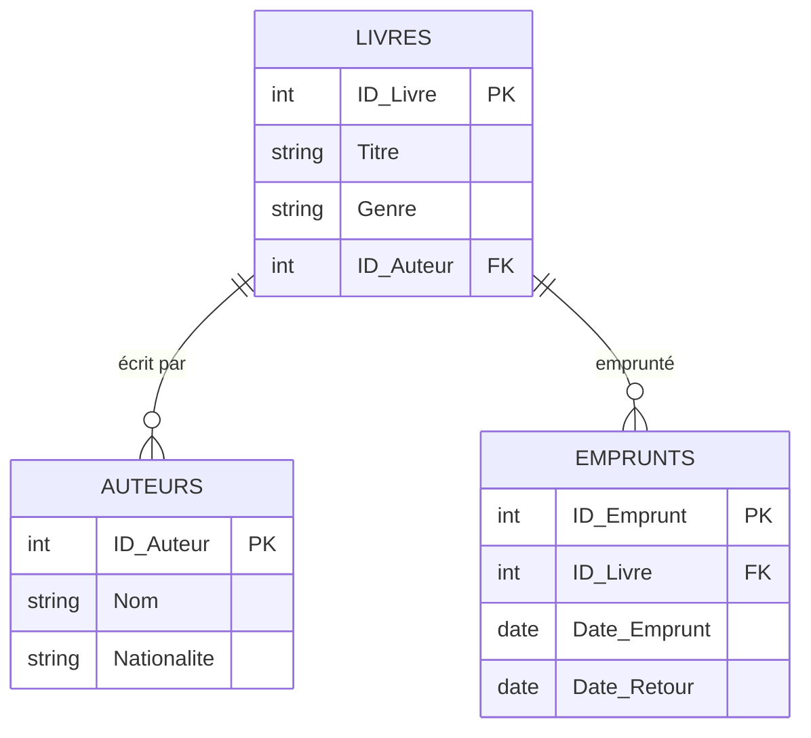

# Cours 1

*[BD]: Base de données

## Système de gestion de contenu (CMS)

Un CMS (Content Management System) permet de créer, organiser et gérer des contenus sans coder.

Quelques CMS populaires: WordPress, Joomla, Drupal, Magento, Shopify.

## WordPress

WordPress est un CMS open-source permettant de créer et de gérer des sites Web sans nécessiter de connaissances approfondies en programmation.

!!! info "Un peu d’histoire"

    * Créé en 2003 par Matt Mullenweg et Mike Little
    * Initialement conçu pour faire des blogues, il est devenu la plateforme CMS la plus utilisée au monde
    * Aujourd’hui, WordPress alimente plus de 40 % des sites Web

### Avantages de WordPress

* **Gratuit et open-source**
* **Flexibilité** : permet de créer des blogs, sites vitrine, boutiques en ligne, etc
* **Large communauté** : des milliers de développeurs créent des extensions et thèmes
* **Facilité d’utilisation** : interface intuitive et personnalisable
* **SEO-friendly** : optimisé pour les moteurs de recherche

### Licence GPL

WordPress est sous licence GPL. Voici les trois avantages principaux :

* Vous pouvez utiliser WordPress comme bon vous semble sans aucune restriction.
* Vous pouvez personnaliser, ajouter ou supprimer tout ce que vous n’aimez pas dans WordPress sans aucune restriction.
* Vous pouvez reconditionner, renommer, vendre et distribuer WordPress sans aucune restriction, sauf qu’il est également publié sous licence GPL.

## WordPress.com / WordPress.org

| Critère          | WordPress.com                                                      | WordPress.org |
| ---------------- | ------------------------------------------------------------------ | ------------- |
| Hébergement      | Hébergé par [Automattic](https://en.wikipedia.org/wiki/Automattic) | Hébergé par vous-même (auto-hébergé) |
| Coût             | Gratuit avec options payantes.                                     | 100% gratuit, mais vous payez pour l’hébergement |
| Personnalisation | Limitée (certains thèmes et plugins restreints)                    | Totale (tous les thèmes et plugins disponibles) |
| Nom de domaine   | Sous-domaine gratuit (ex. : votresite.wordpress.com)               | Nécessite un domaine personnalisé (ex. : votresite.com) |
| Publicité        | Publicité imposée sur les plans gratuits                           | Pas de publicité imposée |

## Lexique à connaître

* **CMS**
* **Thèmes** : Un thème détermine l’apparence visuelle et la mise en page d’un site. Il peut être modifié sans affecter le contenu.
* **Plugins** : Les plugins ajoutent des fonctionnalités (ex. : formulaires, SEO, sécurité). Exemple : Yoast SEO pour le référencement, WooCommerce pour l’e-commerce.

## Introduction à l’environnement AMP (Apache, MySQL, PHP)

AMP : Acronyme pour Apache, MySQL et PHP, utilisé pour simuler un serveur sur son ordinateur ou, communément appelé, en local.

* Apache : Serveur Web permettant de tester votre site en local.
* MySQL : Base de données où sont stockées toutes les informations du site (pages, utilisateurs, contenus).
* PHP : Langage de programmation côté serveur utilisé par WordPress.

Outils courants

* XAMPP (Windows / Mac / Linux)
* MAMP (Windows / Mac)
* WAMP (Windows)

### Base de données

[Exemple de base de données](https://docs.google.com/spreadsheets/d/1UrpLz3xW8v7MJjuDbJq8beKEzivx062v6dDO_5OvQRA/edit?usp=sharing)

### MAMP

Téléchargement et Installation

Ajoutez vos fichiers dans ... (htdocs)

Création de base de donnée
	•	Ouvrez phpMyAdmin via l’interface de votre outil AMP.
	•	Créez une nouvelle base de données (ex. : wordpress_db).

Choisir la bonne *collation* :material-food: (miam miam) est primordiale. Une *collation* est un ensemble de règles qui détermine comment les caractères sont comparés, triés, et recherchés dans une base de données. Pour WordPress, il est fortement recommandée d'utiliser `utf8mb4_unicode_ci`.

| *Collation*            | Avantages                                                   | Inconvénients                               |
| ---------------------- | ----------------------------------------------------------- | ------------------------------------------- |
| utf8_general_ci        | Plus rapide pour des cas simples.                           | Limité aux caractères UTF-8 (pas d’émojis). |
| utf8_unicode_ci        | Bonne gestion des langues.                                  | Ne prend pas en charge les émojis.          |
| utf8mb4_general_ci     | Compatible avec tous les caractères modernes.               | Tri simplifié, moins précis.                |
| **utf8mb4_unicode_ci** | Meilleure précision linguistique et compatibilité complète. | Un peu plus lent pour de grandes BD.        |

## Exercices

  

  <small>Exercice - Wordpress</small> 
  **[Installation de base](./wp-install.md){.stretched-link}**

