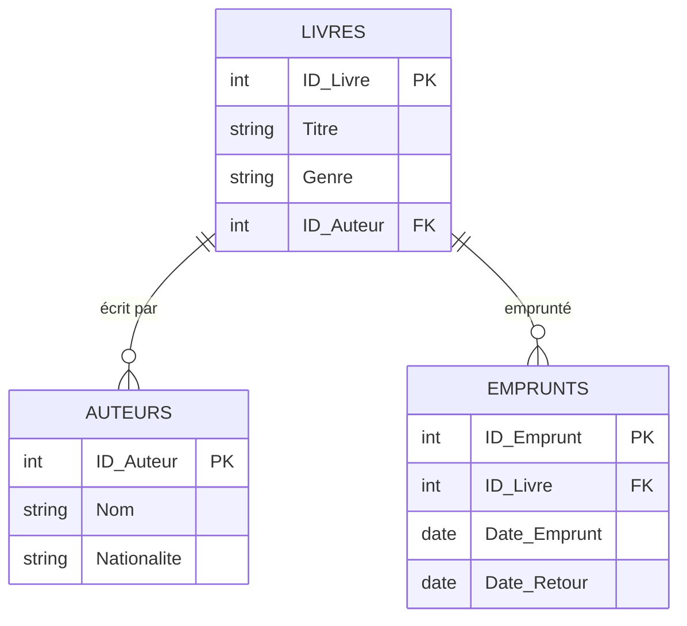

# Bienvenue en Web 4

*[CMS]: Content Management System
*[BD]: Base de données

{.w-100}

## Système de gestion de contenu (CMS)

Un CMS (Content Management System) c'est un outil qui permet de créer, organiser et gérer des contenus sans programmation !

Voici une liste non exhautive de CMS populaires[^cms] :

[^cms]: [Liste des 15 CMS les plus populaires](https://www.wpbeginner.com/showcase/best-cms-platforms-compared/)

* :simple-wordpress: Wordpress (open-source)
* :simple-drupal: Drupal (open-source)
* :simple-joomla: Joomla (open-source)
* :simple-hubspot: Hubspot
* :simple-shopify: Shopify
* :simple-ghost: Ghost (open-source)
* :simple-typo3: Typo3 (open-source)
* :simple-blogger: Blogger
* :simple-wix: Wix

Aperçu rapide de ce à quoi ressemble un CMS :

  {data-zoom-image}

  Interface administrative où les utilisateurs gèrent le contenu, les paramètres et les fonctionnalités du site (back-end)

  {data-zoom-image}

  Édition du contenu en ligne (inline editing)

  {data-zoom-image}

  Aperçu du résultat final (front-end)

### Fonctionnalités d'un CMS

Voici quelques-unes des fonctionnalités clés que l’on retrouve généralement dans un CMS :

* **Interface conviviale (UI)** : Une interface utilisateur intuitive permet aux administrateurs et aux éditeurs de naviguer facilement dans le système, de créer et de modifier du contenu sans nécessiter de compétences techniques avancées. 
* **Gestion de contenu** : Les CMS permettent une gestion efficace du contenu, offrant des fonctionnalités pour ajouter, modifier et supprimer des pages, des articles, des images et d’autres types de médias.
* **Personnalisation de l’apparence** : La possibilité de personnaliser l’apparence du site grâce à des **thèmes**.
* **Optimisation pour les moteurs de recherche (SEO)**
* **Gestion des utilisateurs et des permissions** : La possibilité de gérer plusieurs utilisateurs avec des rôles et des permissions spécifiques, facilitant la collaboration tout en maintenant la sécurité et le contrôle sur le contenu publié. 
* **Sécurité** : Des fonctionnalités de sécurité robustes, y compris des mises à jour régulières, la gestion des permissions et le support SSL, sont essentielles pour protéger les informations sensibles et assurer la fiabilité du site.
* **Support multilingue**
* **Optimisation pour les appareils mobiles** : En bonne partie lié au thème choisi.
* **Gestion des versions et historique des révisions**
* **Intégration avec des outils tiers** : La possibilité d’intégrer des **plugins** et des extensions pour ajouter des fonctionnalités supplémentaires et des fonctionnalités avancées.

### Bon, comment ça marche ?

Ça prends une base de données, un langage de programmation serveur, un serveur et le CMS choisi.

Une manière de gérer le contenu. Soit par wysiwyg, inline editing ou par formulaire admin.

### Pourquoi utiliser un CMS ?

Créer un site Web entièrement à la main peut être long et compliqué, surtout si l’on doit maîtriser plusieurs langages de programmation (HTML, CSS, PHP, JavaScript). Les CMS offrent plusieurs avantages :

* Gain en temps
* Mises à jour
  * Gérer et mettre à jour un site est plus rapide avec une interface conviviale.
  * La communauté est toujours plus au parfum des mises à jour importantes et des vulnérabilités.
  * Les CMS opensource ont souvent une large communauté d'entraide.
* Sécurité
  * Les CMS sont souvent mis à jour pour combler les failles de sécurité.
  * Les CMS opensource sont très populaires et donc bien testés.
  * Les besoins du marché sont souvent strict à cet effet.
* Accessibilité
* Design
* Flexibilité

## WordPress

WordPress est un CMS open-source permettant de créer et de gérer des sites Web sans nécessiter de connaissances approfondies en programmation.

!!! info "Un peu d’histoire"

    * Créé en 2003 par Matt Mullenweg et Mike Little
    * Initialement conçu pour faire des blogues, il est devenu la plateforme CMS la plus utilisée au monde
    * Aujourd’hui, WordPress alimente plus de 40 % des sites Web

### Avantages de WordPress

* **Gratuit et open-source**
* **Flexibilité** : permet de créer des blogs, sites vitrine, boutiques en ligne, etc
* **Large communauté** : des milliers de développeurs créent des extensions et thèmes
* **Facilité d’utilisation** : interface intuitive et personnalisable
* **SEO-friendly** : optimisé pour les moteurs de recherche

### Licence GPL

WordPress est sous licence GPL. Voici les trois avantages principaux :

* Vous pouvez utiliser WordPress comme bon vous semble sans aucune restriction.
* Vous pouvez personnaliser, ajouter ou supprimer tout ce que vous n’aimez pas dans WordPress sans aucune restriction.
* Vous pouvez reconditionner, renommer, vendre et distribuer WordPress sans aucune restriction, sauf qu’il est également publié sous licence GPL.

## WordPress.com / WordPress.org

| Critère          | WordPress.com                                                      | WordPress.org |
| ---------------- | ------------------------------------------------------------------ | ------------- |
| Hébergement      | Hébergé par [Automattic](https://en.wikipedia.org/wiki/Automattic) | Hébergé par vous-même (auto-hébergé) |
| Coût             | Gratuit avec options payantes.                                     | 100% gratuit, mais vous payez pour l’hébergement |
| Personnalisation | Limitée (certains thèmes et plugins restreints)                    | Totale (tous les thèmes et plugins disponibles) |
| Nom de domaine   | Sous-domaine gratuit (ex. : votresite.wordpress.com)               | Nécessite un domaine personnalisé (ex. : votresite.com) |
| Publicité        | Publicité imposée sur les plans gratuits                           | Pas de publicité imposée |

## Lexique à connaître

* **Thèmes** : Un thème détermine l’apparence visuelle et la mise en page d’un site. Il peut être modifié sans affecter le contenu.
* **Plugins** : Les plugins ajoutent des fonctionnalités (ex. : formulaires, SEO, sécurité). Exemple : Yoast SEO pour le référencement, WooCommerce pour l’e-commerce.

## Introduction à l’environnement AMP (Apache, MySQL, PHP)

AMP : Acronyme pour Apache, MySQL et PHP, utilisé pour simuler un serveur sur son ordinateur ou, communément appelé, en local.

* Apache : Serveur Web permettant de tester votre site en local.
* MySQL : Base de données où sont stockées toutes les informations du site (pages, utilisateurs, contenus).
* PHP : Langage de programmation côté serveur utilisé par WordPress.

Outils courants

* XAMPP (Windows / Mac / Linux)
* MAMP (Windows / Mac)
* WAMP (Windows)

### Serveur

Qu’est-ce qu’un serveur ?

[:octicons-broadcast-24: Go live](https://marketplace.visualstudio.com/items?itemName=ritwickdey.LiveServer)

### Base de données

[Exemple de base de données](https://docs.google.com/spreadsheets/d/1UrpLz3xW8v7MJjuDbJq8beKEzivx062v6dDO_5OvQRA/edit?usp=sharing)

### MAMP

Téléchargement et Installation

Ajoutez vos fichiers dans ... (htdocs)

Création de base de donnée
	•	Ouvrez phpMyAdmin via l’interface de votre outil AMP.
	•	Créez une nouvelle base de données (ex. : wordpress_db).

Choisir la bonne *collation* :material-food: (miam miam) est primordiale. Une *collation* est un ensemble de règles qui détermine comment les caractères sont comparés, triés, et recherchés dans une base de données. Pour WordPress, il est fortement recommandée d'utiliser `utf8mb4_unicode_ci`.

| *Collation*            | Avantages                                                   | Inconvénients                               |
| ---------------------- | ----------------------------------------------------------- | ------------------------------------------- |
| utf8_general_ci        | Plus rapide pour des cas simples.                           | Limité aux caractères UTF-8 (pas d’émojis). |
| utf8_unicode_ci        | Bonne gestion des langues.                                  | Ne prend pas en charge les émojis.          |
| utf8mb4_general_ci     | Compatible avec tous les caractères modernes.               | Tri simplifié, moins précis.                |
| **utf8mb4_unicode_ci** | Meilleure précision linguistique et compatibilité complète. | Un peu plus lent pour de grandes BD.        |

## Exercices

  

  <small>Exercice - MAMP</small> 
  **[Installation de base](./mamp-install.md){.stretched-link}**

  

  <small>Exercice - Wordpress</small> 
  **[Installation de base](./wp-install.md){.stretched-link}**

