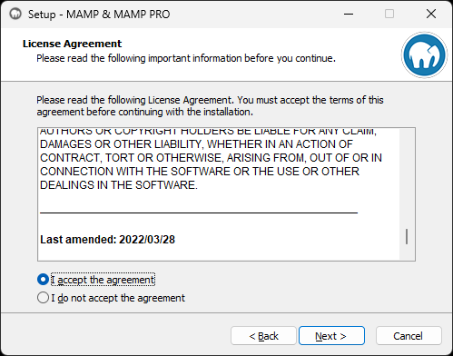
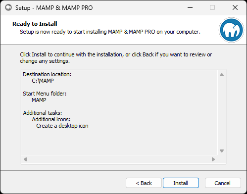
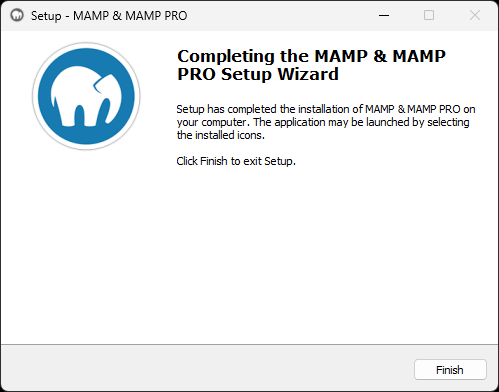

---
tags:
  - Exercice
---

# Installation de Mamp

## Téléchargement

Mamp est gratuit, mais il est possible de payer pour obtenir des fonctionnalités supplémentaires. Dans le cadre du cours, nous utiliserons la version gratuite.

[Télécharger l'application MAMP](https://www.mamp.info/en/downloads/){ .md-button .md-button--primary }

## Installation en Windows

Voici le processus d'installation étape par étape en capture d'écran.

<figure markdown>
  {.w-100}
  <figcaption>Cliquez sur le bouton « Next »</figcaption>
</figure>

<figure markdown>
  {.w-100}
  <figcaption>Décochez les cases « MAMP PRO » et « Install Apple Bonjour »</figcaption>
</figure>

<figure markdown>
  {.w-100}
  <figcaption>Acceptez les termes de la licence, si elle vous convient</figcaption>
</figure>

<figure markdown>
  {.w-100}
  <figcaption>Choisissez le dossier d'installation</figcaption>
</figure>

<figure markdown>
  {.w-100}
  <figcaption>Cliquez sur le bouton « Next »</figcaption>
</figure>

<figure markdown>
  {.w-100}
  <figcaption>Cliquez sur le bouton « Next »</figcaption>
</figure>

<figure markdown>
  {.w-100}
  <figcaption>Cliquez sur le bouton « Install »</figcaption>
</figure>

<figure markdown>
  {.w-100}
  <figcaption>Patientez un moment</figcaption>
</figure>

<figure markdown>
  {.w-100}
  <figcaption>L'installation est complétée. Cliquez sur le bouton « Finish »</figcaption>
</figure>
