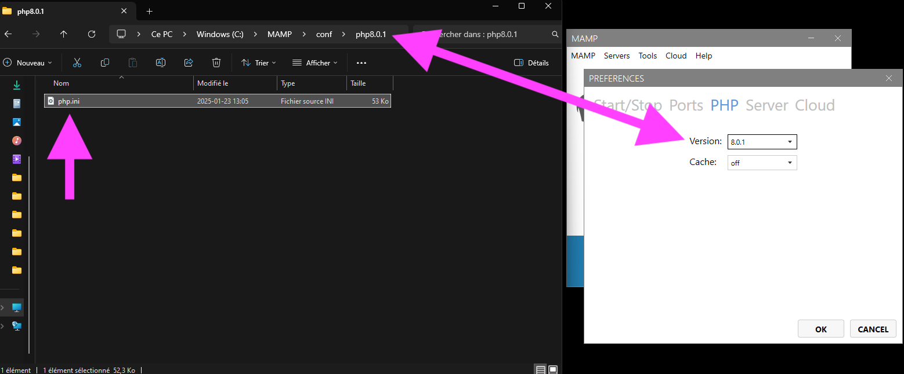
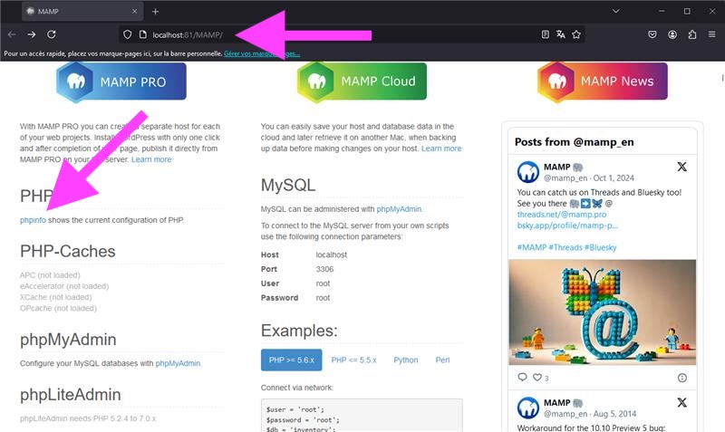
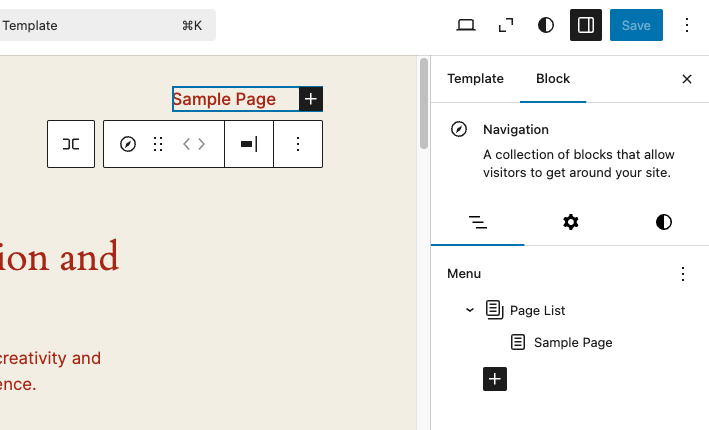
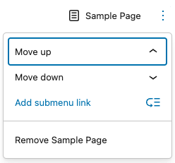
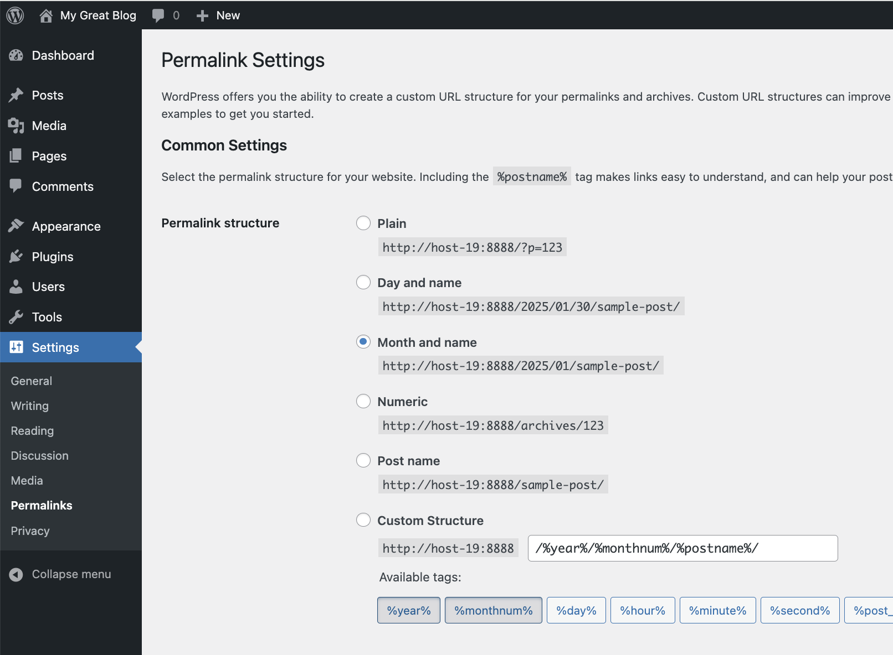
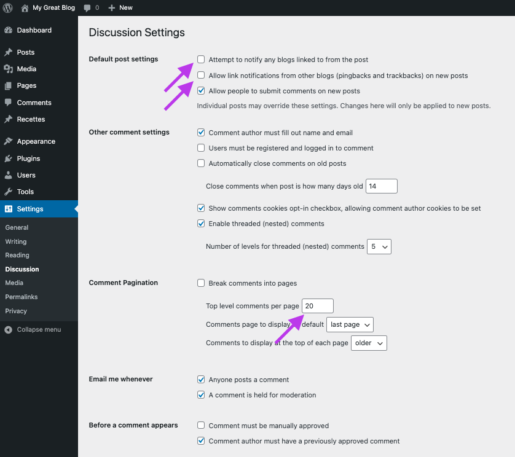

# Cours 2

## Configurations de WordPress

### php.ini

{ data-zoom-image }

Modifier le fichier `php.ini` et configurez la limite de la mémoire de votre serveur local.

#### memory_limit

```bash
memory_limit = 256M
```

#### max_execution_time

Augmenter le temps d'exécution des scripts à **300 secondes**.

Le paramètre `max_execution_time` dans le fichier `php.ini` définit le temps maximal qu’un script PHP peut s’exécuter avant d’être automatiquement interrompu par le serveur.

Par défaut, cette valeur devrait être autour de 30 secondes. Or, certains scripts WordPress (comme des mises à jour, des imports de données volumineux ou des sauvegardes) peuvent nécessiter plus de temps.

```bash
max_execution_time = 300
```

#### Valider les modifications

Un fois ces corrections terminées, validez qu'elles ont bel et bien été prises en considération.

D'abord redémarrez votre serveur MAMP, puis allez voir dans le fichier `phpinfo.php` si les modifications ont bien fonctionnées. Cliquez sur le lien `phpinfo` dans la page WebStart de MAMP, puis cherchez la mention `memory_limit` et `max_execution_time`.

{ data-zoom-image }

## Taxonomies

> Science qui a pour objet la classification des divers éléments d’un domaine, d’une science.<br>
> — Antidote 11

Les **catégories** (_category_) et les **étiquettes** (_tags_) sont tous les deux des types de taxonomies. Elles permettent de structurer le contenu de votre site en utilisant des catégories et des étiquettes.

* 📂 **Catégories** : Pour organiser ou classifier la structure principale du site. Les catégories sont utiles lorsqu'on veut des thématiques générales.
* 🏷 **Étiquettes** : Mots-clés pour affiner la recherche. Utile si ont veut aider les visiteurs à trouver des articles similaires.

Utilisez les catégories pour organiser le contenu et les étiquettes pour enrichir le contenu.

| **Critère**            | **Catégorie**                 | **Étiquette**                |
|------------------------|-------------------------------|------------------------------|
| **Hiérarchique**       | ✅ Oui                        | ❌ Non                       |
| **Nombre par article** | 1 principale (+ autres optionnelles) | Autant que nécessaire |
| **Utilité**            | Structurer le contenu du site | Ajouter des mots-clés        |

### Exemple

**Titre du billet (post)** :

Recette de tarte aux fraises et à la rhubarbe

**Catégories** :

* 🥘 Recette
  * 🍰 Dessert
  * 🍩 Pâtisserie
    * Tarte et tartelette

**Étiquettes** :

* 🍓 Fraises
* Sucré
* Rhubarbe
* 🥚 Œufs
* 🍰 Pâtisserie
* 🥄 Dessert rapide

## Menus

Les emplacements des différents menus sont différents d'un thème à l'autre. Leur gestion peut également varier, mais pour le moment, nous allons modifier le menu avec le thème Wordpress par defaut. Voici comment faire :

1. **Accédez** à l'interface d'administration (tableau de bord) puis :
1. **Naviguez** vers `Apparence > Editor`
1. **Cliquez** sur dans le site, peu importe l'endroit (cela le rendra éditable)
1. **Cliquez** sur le menu une première fois (cela devrait sélectionner l'entête)
1. **Cliquez** sur le menu une seconde fois (cela devrait sélectionner le menu)
1. Dans la colonne de droite, vous pouvez faire la gestion de vos éléments de menu<br>{ data-zoom-image }
1. Testez les différentes options offertes dans le sous menu d'un élément de menu (représenté par trois points verticals :material-dots-vertical:), particulièrement, l'option d'imbriquer un autre élément de menu afin de créer une arborescence<br>
1. **Enregistrez** vos modifications

### Exemples de menus

Les sites Web comprennent souvent plusieurs menus. Voici quelques exemples :

* Menu principal : Accueil, À propos, Services, Tarification, Contact
* Menu secondaire (ex: en haut du site) : Connexion, Inscription
* Menu de pied de page : Mentions légales, Politique de confidentialité, Plan du site, Accès à l'information, Accessibilité, Nétiquette, Infolettre

> Nétiquette n.f.<br>
> Ensemble des règles de savoir-vivre que doivent respecter les utilisateurs des réseaux comme Internet.<br>
> — Antidote 11

## Types de contenu

Dans WordPress, les types de contenu par défaut sont les suivants.

* **Articles** de blogue (_post_)
* **Pages** statiques (_page_)
* **Médias** (images, vidéos, PDF).
* Révisions (_revision_). Ce sont des sauvegarde des modifications ! Très cool !
* Éléments des menus pour la navigation

### Options des pages et articles

WordPress propose plusieurs options[^options] pour configurer un article ou une page. Ces options permettent de gérer la visibilité, l’organisation et l’affichage du contenu.

[^options]: <https://wordpress.org/documentation/article/page-post-settings-sidebar>

#### Image mise en avant

L’image mise en avant (_Featured Image_) est l’image principale associée à un **article**, une **page** ou un autre type de contenu dans WordPress.

* **Affichage sur la page**. L'image peut être affichée en haut de la page, mais cela dépend du thème utilisé. Certains thèmes affichent automatiquement l’image mise en avant, tandis que d’autres nécessitent une configuration manuelle.
* **Aperçus et listes d’articles** : Elle est souvent utilisée dans les aperçus d’articles, comme sur la page d’accueil, la page de blog ou les archives.
* **Partage sur les réseaux sociaux** : Si correctement configurée (via un plugiciel), elle peut être utilisée comme image de partage sur les réseaux sociaux.
* **SEO** (Référencement) : L’image n’affecte pas directement le SEO, mais elle améliore l’expérience utilisateur et peut apparaître dans les résultats enrichis chez Google. Pour optimiser cela, il faut bien nommer l’image, ajouter une balise alt pertinente et optimiser son poids.

#### Extrait

L’extrait (_excerpt_) est un résumé facultatif de l’article. S’il est ajouté, ce que je recommande fortement, il peut être affiché à la place du contenu complet dans certaines pages comme la liste des articles ou les résultats de recherche.

Peut également être utilisé pour le SEO et l’optimisation de l’affichage sur les réseaux sociaux. Pourquoi pas !

#### Statut et publication

| **Statut**      | **Description** |
|-----------------|----------------|
| **Publié (_Published_)** | L’article est en ligne et accessible à tous. |
| **Brouillon (_Draft_)** | L’article n’est pas encore prêt à être publié. **Il est enregistré, mais invisible** pour les visiteurs. |
| **En attente (_Pending_)** | L’article est prêt, mais doit être approuvé par un administrateur ou un éditeur avant publication. |
| **Planifié (_Scheduled_)** | L’article sera publié automatiquement à une date et heure choisies. |
| **Privé (_Private_)** | L’article est visible uniquement par les administrateurs et éditeurs du site. |
| **Épinglé (_Sticky_)** | Pour les articles, permet de l’afficher en priorité en haut de la liste des articles publiés. |

#### Lien

Le lien (_Link_) l’URL de l’article ou de la page. Il est généré automatiquement selon la structure des permaliens définie dans WordPress, mais il peut être modifié dans `Settings > Permalinks`.

{ data-zoom-image }

#### Modèle de page

Le modèle de page (_Template_) permet d’utiliser un design spécifique pour une page, selon ce qui est défini dans le thème actif.

On peut y changer notament l'ordre des éléments.

#### Discussion

Cette option contrôle si les commentaires et rétroliens (_pingbacks/trackbacks_[^pinback]) sont autorisés pour un article ou une page.

Pour les commentaires, c'est à vous de choisir.

Toutefois, les rétroliens déconseillé pour leur ressemble à du spam. Si ça vous intéresse, je vous recommande de lire l'article « [Should Your WordPress Trackbacks and Pingbacks Be Disabled?](https://www.contentpowered.com/blog/wordpress-trackbacks-pingbacks-disabled/) » qui explique très bien les avantages et inconvénients de cette technologie.

Si vous décidez d'y aller avec ma recommandation, voici les configurations à ajuster pour les commentaires.

{ data-zoom-image }

#### Révisions

Les révisions sont des versions antérieures de votre article ou de votre page. Elles sont utilisées pour restaurer une version plus ancienne.

C'est très pratique pour conserver l'historique des modifications effectuées, mais c'est également plus lourd pour la base de données !

Par défaut, la révision est activée pour les articles, mais pas pour les pages. Si vous voulez l'activer, vous pouvez ajouer la ligne suivante dans `wp-config.php` situé à la racine de votre site :

```php
define('WP_POST_REVISIONS', true);
```

## Création d'un nouveau type de contenu

Imaginez que vous devez créer un site de recettes. Le type de contenu **page** vous aidera pour ce qui est plus administratif, le type de contenu **post** pourrait vous aider si votre site contien un blogue, mais il vous manque l'essentiel ! Un type de contenu **Recette** !

Pour créer un nouveau type de contenu, il faut installer un plugiciels.

1. Accédez à l'interface d'administration (tableau de bord)
1. **Naviguez** vers `Plugins > Add New Plugin`
1. Dans la barre de recherche, tapez **Pods - Custom Content Types and Fields** puis lorsque le plugiciel s'affiche, cliquez sur le bouton **Install Now**
1. Attendez un peu que le plugiciel se télécharge puis cliquez sur le bouton **Activate** lorsqu'il apparait

**Pods - Custom Content Types and Fields** vous permet de créer autant de types de contenu personnalisés que vous le souhaitez !

C'est bien, on a la possibilité de créer un nouveau type de contenu. Toutefois, il serait bien également d'avoir la possiblité de créer des champs personnalisés. Par exemple, dans une recette, on devrait avoir des champs pour y inscrire des ingrédients, avec leur quantité et la mesure! Il faut tout ça pour que l'expérience utilisateur soit le plus efficace possible.

Pour ce faire, il faudra donc installer et activer deux plugiciels supplémentaires, soit **CMB2** et **CMB2 Admin Extension**.

**CMB2** permet d'ajouter des champs personnalisés aux types de contenu et 2**CMB2 Admin Extension2** permet de les afficher dans l'interface d'administration de WordPress.

### Pods

1. **Naviguez** vers `Pods Admin > Add New`
1. **Choisissez** l'option **Create a new Content Type**
1. **Remplissez** le champs **Singular Label** avec « Recette » et **Plural Label** avec « Recettes »
1. **Cochez** l'option **Content Privacy**
1. **Cliquez** sur le bouton **Next Step**

Vous avez maintenant un nouveau type de contenu ! Maintenant, configurons le correctement.

1. **Naviguez** vers l'onglet **Advanced Options** dans l'édition de votre nouveau Pods et cochez toutes les cases sous **Supports** sauf Trackbacks.
1. **Cliquez** sur le bouton **Save Pod**
1. **Naviguez** vers l'onglet **Connections** puis sélectionnez **Categories** et **Tags**.
1. **Cliquez** sur le bouton **Save Pod**

### CMB2

1. **Naviguez** vers `CMB2 > Add New Meta Box`
1. **Ajoutez** le titre « Ingrédients» puis créez trois champs : **Quantité**, **Mesure** et **Aliment**
1. Dans la colonne de droite, **Sélectionnez** « Recettes » puis cochez la case **Repeatable Group**
1. **Cliquez** sur le bouton **Publier**

Maintenant que tout est en place, créez une recette !

### Afficher les ingrédients

Ajoutez en bas du fichier `./wp-content/themes/twentytwentyfour/functions.php` le code suivant :

```php
function afficher_les_ingredients($atts) {
    $atts = shortcode_atts(
        array(
            'post_id' => get_the_ID(),
            'field'   => '',
        ),
        $atts
    );

    if (empty($atts['field'])) {
        return 'ID du champ requis.';
    }

    $fields = get_post_meta($atts['post_id'], $atts['field'], true);

    if (!empty($fields) && is_array($fields)) {
        ob_start();

        echo '<h2>Ingrédients</h2>';
        echo '<ul class="ingredients-container">';

        foreach ($fields as $field) {
            echo '<li>';

        if (!empty($field['_quantite'])) {
                echo '<span>' . esc_html($field['_quantite']) . '</span>';
            }

            if (!empty($field['_mesure'])) {
                echo '<span>' . esc_html($field['_mesure']) . '</span> ';
            }

            if (!empty($field['_aliment'])) {
                echo '<strong>' . esc_html($field['_aliment']) . '</strong>';
            }

            echo '</li>';
        }

        echo '</ul>';
        return ob_get_clean();
    }

    return '-Aucun ingrédient-';
}

add_shortcode('show_cmb2', 'afficher_les_ingredients');
```

Corrigez au besoin les nom de champs.

Dans l'affichage d'une recette, vous pouvez maintenant ajouter un "Shortcode" pour afficher les ingrédients avec la syntaxe suivante : `[show_cmb2 field="_ingredients"]`

{ .w-100 }

## Exercices

<div class="grid grid-1-2" markdown>
  

  <small>Exercice - Wordpress</small><br>
  **[Gordon](./exercices/wp-gordon.md){.stretched-link .back}**
</div>
