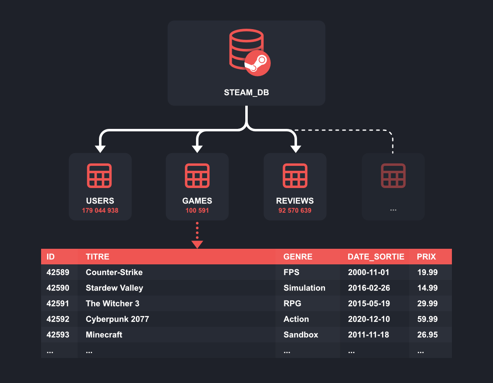

{data-zoom-image}

Pour le grand public, le nom **Gutenberg** est surtout associé à l’invention de l’imprimerie au milieu du XVe siècle.

Il est aujourd’hui au centre de nombreuses discussions dans l’univers de **WordPress**, le système de gestion de contenu le plus utilisé au monde.

Ici, Gutenberg ne désigne plus une presse à imprimer, mais bien **l’éditeur de contenu de WordPress**, un outil qui permet de créer et de structurer des pages web à l’aide de blocs.

## Gutenberg sur WordPress : c’est quoi exactement ?

Gutenberg est l’éditeur de contenu de WordPress.

Il permet de créer et de mettre en forme des pages et des articles à l’aide de blocs (texte, images, titres, boutons, etc.).

Intégré à WordPress depuis la version 5.0, Gutenberg remplace l’ancien éditeur et offre une interface plus visuelle, simple et intuitive pour organiser le contenu d’un site.

### Les blocs : le cœur de Gutenberg
Dans WordPress, l’éditeur **Gutenberg** fonctionne grâce aux **blocs**.
Les blocs sont les éléments de base qui servent à construire une page ou un article.

##### Un bloc peut contenir du :
* **texte**
* une **image**
* une **vidéo**
* un **bouton**, etc.

##### On peut facilement 
* **ajouter**
* **déplacer**
* **supprimer** ces blocs

simplement avec la souris.

Grâce aux blocs, il est possible de créer des mises en page variées et personnalisées **sans écrire une seule ligne de code**.

##### Les blocs sont regroupés en **six grandes catégories** :

* **Texte** (paragraphes, titres, listes)
* **Médias** (images, vidéos, audio)
* **Design** (colonnes, séparateurs, espacements)
* **Widgets** (archives, recherche, catégories)
* **Thème** (navigation, logo du site, titre du site)
* **Contenus embarqués** (YouTube, Spotify, réseaux sociaux)

{width="50%" data-zoom-image}

## Gutenberg et l’éditeur de site : comprendre simplement
Concrètement, Gutenberg permet de modifier toutes les parties d’un site WordPress : le **contenu** (pages et articles), mais aussi le **haut de page (header)**, le **bas de page (footer)** et la mise en page générale.

### Éditeur de contenu, éditeur de site : quelle différence ?
Au départ, Gutenberg servait surtout à **écrire et mettre en forme des articles et des pages**.

C’était son premier objectif : rendre l’édition plus simple et plus intuitive que l’ancien éditeur.

Depuis, Gutenberg a évolué.

WordPress propose maintenant un **Éditeur de site** (anciennement appelé Full Site Editing ou FSE).

##### Cet éditeur permet de **modifier l’ensemble du site**, pas seulement le contenu :

* le header
* le footer
* les menus
* les modèles de pages
  
Tout se fait avec le **même principe de blocs**.

### Conditions pour utiliser l’Éditeur de site

Pour accéder à l’Éditeur de site, il faut respecter deux conditions :

* Utiliser **WordPress 5.9 ou une version plus récente**
* Avoir activé un **thème basé sur les blocs**
(par exemple : Twenty Twenty-Three, Twenty Twenty-Four)

Si votre thème n’est pas basé sur les blocs, l’Éditeur de site ne sera pas disponible.

### À retenir
* Gutenberg n’est plus seulement un éditeur de texte
* C’est devenu un outil complet pour construire un site WordPress, visuellement et sans code

## Gutenberg et les constructeurs de pages : quelle différence ?
Un **constructeur de page** (page builder en anglais) est un outil qui permet de créer facilement des pages web avec des mises en page avancées, **sans écrire de code**.
Il fonctionne généralement par **glisser-déposer** et propose de nombreux **modèles prêts à l’emploi** (pages complètes, sections, blocs design).

**L’Éditeur de site de Gutenberg** fonctionne de façon assez similaire :

* il permet de modifier **toutes les zones du site** (pages, articles, en-tête, pied de page, etc.)
* il utilise aussi un système de **blocs visuels**

Cependant, il existe une différence importante :

**Les options créatives sont plus limitées dans Gutenberg.**
Un constructeur de page propose en général **beaucoup plus de modèles**, d’effets visuels et de réglages avancés que l’Éditeur de site de WordPress.

### En résumé : quel outil utiliser ?

* Pour créer et rédiger des articles ou des pages
→ Utilisez l’éditeur de contenu de WordPress (Gutenberg)
* Pour construire un site complet :
  * Si vous êtes à l’aise avec WordPress ou développeur → l’Éditeur de site peut suffire
  * Si vous débutez ou voulez aller vite avec plus de liberté visuelle → un constructeur de page est souvent plus simple et plus puissant
 
    
### À retenir
* Gutenberg est intégré à WordPress et évolue constamment
* Les constructeurs de pages sont souvent plus flexibles, mais ajoutent une couche supplémentaire au site

## Avantages de Gutenberg

* Facile à prendre en main : idéal pour éditer pages et articles sans coder.
* Aperçu en temps réel : ce que vous voyez est ce que vous obtenez (WYSIWYG).
* Pas besoin de code : tout se fait avec des blocs.
* Plus besoin de shortcodes : les blocs remplacent les anciennes méthodes d’intégration de contenu.
* Intégré à WordPress : pas de risque d’incompatibilité ou de bug majeur.
* Évolutif : Gutenberg continue de s’améliorer avec les mises à jour.
* Accessibilité : conçu pour être utilisé par tout le monde.

## Inconvénients de Gutenberg

* Moins de fonctionnalités avancées pour créer des mises en page poussées par rapport à un constructeur de page.
* Performance légèrement réduite sur de très longs contenus (chargement un peu plus lent).

### En résumé
Gutenberg est un **outil moderne et flexible** pour créer du contenu dans WordPress, mais pour des mises en page très complexes ou des performances optimales sur de gros sites, un **page builder** peut parfois être plus adapté.

## Découvrir l’interface de Gutenberg
Pour accéder à Gutenberg dans WordPress, c’est très simple :

* Pour créer un **article** : allez dans **Articles > Ajouter**
* Pour créer une **page** : allez dans **Pages > Ajouter**

Une fois dans l’éditeur, vous pouvez commencer à **ajouter, déplacer et modifier des blocs** pour construire votre contenu.

{data-zoom-image}

## Les trois zones principales de l’interface Gutenberg
En regardant l’éditeur, on distingue trois zones principales :

1.	La barre supérieure (top bar)
   * Située en haut de la fenêtre
   * Permet d’ajouter des blocs, de prévisualiser et de publier votre contenu      
1.	La zone centrale
   * Contient tout le contenu de votre page ou article
   * Chaque élément (texte, image, vidéo, etc.) est un bloc indépendant que vous pouvez déplacer ou modifier
1.	La barre latérale droite
   * Comporte deux onglets :
    * Article / Page : pour modifier les paramètres généraux du contenu
    * Bloc : pour personnaliser individuellement chaque bloc, comme son style, ses couleurs ou sa mise en page

### Comment ajouter un bloc dans Gutenberg
Pour ajouter un nouveau bloc, suivez ces étapes :

1.	Repérez l’icône « + »
   * Elle se trouve en haut à gauche de la page ou dans l’espace de contenu où vous voulez insérer le bloc.
1.	Choisissez le bloc
   * Gutenberg propose 6 catégories de blocs :
    * Texte : paragraphes, titres, listes
    * Médias : images, vidéos, audio
    * Design : colonnes, séparateurs, espacements
    * Widgets : archives, recherche, catégories
    * Thème : navigation, logo, titre du site
    * Contenus embarqués : YouTube, Spotify, réseaux sociaux
          
   * Vous pouvez cliquer sur un bloc pour l’ajouter, ou le glisser-déposer à l’endroit souhaité.

1.	Insérez le bloc
   * Cliquez à l’endroit où le bloc doit apparaître dans votre contenu.
   * Ensuite, utilisez l’icône « + » pour choisir le bloc désiré ou ouvrez l’outil d’insertion complet pour parcourir tous les blocs disponibles.
  
      
{data-zoom-image}

## Ajouter et formater des blocs dans Gutenberg

### Ajouter un bloc
Les blocs sont faciles à utiliser grâce à leurs noms explicites :

* Pour un titre → ajoutez un bloc **Titre**
* Pour une image → ajoutez un bloc **Image**
* Pour un bouton → ajoutez un bloc **Bouton**
  
Pour un paragraphe, vous n’avez pas besoin de choisir un bloc : taper directement dans l’espace de contenu crée automatiquement un **bloc Paragraphe**. 
Cela se produit aussi lorsque vous appuyez sur **Entrée**.

### Personnaliser un bloc
Une fois ajouté, chaque bloc est brut.
Pour le formater, cliquez dessus pour afficher **la barre d’outils supérieure**.

Les options varient selon le type de bloc :

* **Bloc Image** → ajouter un filtre, ajuster la taille, etc.
* **Bloc Titre** → alignement, niveau de titre (H2, H3…), gras, italique, barré, exposant, liens, etc.

Ainsi, chaque bloc peut être **adapté facilement à vos besoins**, sans toucher au code.

{data-zoom-image}

## Comment personnaliser le style d’un bloc ?

Le **formatage de base** n’est qu’un premier pas pour personnaliser un bloc.
Pour aller plus loin, utilisez les **réglages avancés** disponibles pour chaque bloc.

* Ces options se trouvent dans la **barre latérale droite**, sous l’onglet **« Bloc »**.
* Les réglages proposés dépendent du type de bloc que vous éditez.

### Exemple pour un bloc « Paragraphe » :
* **Couleurs** : texte, arrière-plan, liens
* **Typographie** : taille, police, style, hauteur de ligne, espacement, majuscules/minuscules
* **Marges : internes** (padding) et externes (margin)
* **Options avancées** : ajouter une ancre HTML ou une classe CSS personnalisée

Ainsi, chaque bloc peut être **adapté visuellement** selon vos besoins, sans toucher au code.

{data-zoom-image}

## Personnaliser et déplacer vos blocs

Avec le **bloc « Bouton »**, vous pouvez modifier non seulement le texte et la couleur, mais aussi **la largeur** et **la bordure** du bouton.

### Déplacer vos blocs
Si un bloc n’est pas à l’endroit souhaité, pas de souci : **Gutenberg vous permet de le déplacer facilement.**

Voici vos options :

* Copier-coller :
 * Sélectionnez le bloc en cliquant dessus.
 * Appuyez sur Ctrl + C (PC) ou Cmd + C (Mac) pour copier, puis Ctrl + V (PC) ou Cmd + V (Mac) pour le coller à l’endroit choisi.

* Flèches de déplacement :
 * Utilisez les deux petites flèches situées sur la barre d’outils du bloc pour le faire monter ou descendre dans la page.

{data-zoom-image}

## Déplacer un bloc
Pour changer la position d’un bloc :

* Glisser-déposer : cliquez sur l’icône des six petits points dans la barre d’outils du bloc, maintenez le clic et déplacez le bloc à l’emplacement souhaité.

Grouper plusieurs blocs
Même si Gutenberg n’offre pas toutes les options d’un constructeur de page comme Elementor, vous pouvez organiser vos contenus proprement grâce aux **blocs « Design »**.

Par exemple, le bloc Colonnes crée un conteneur parent pour plusieurs blocs enfants.

* Chaque colonne peut contenir un bloc différent : un texte dans la colonne de droite, une image dans la colonne de gauche, etc.
* Cela permet de créer des mises en page structurées et visuellement harmonieuses, sans toucher au code.

{data-zoom-image}

Lorsque vous ajoutez des **colonnes**, elles se disposent **horizontalement** les unes à côté des autres.

Si vous souhaitez grouper des blocs **verticalement**, utilisez le bloc **Groupe**.
Ce bloc vous permet d’empiler plusieurs éléments **de haut en bas**, un peu comme le bloc **Empilement**.

Par exemple, vous pouvez grouper un **titre** et son **paragraphe** dans un même bloc Groupe.

L’avantage ? Une fois les blocs regroupés, vous pouvez **appliquer la même mise en forme** à tous en même temps, ce qui facilite la cohérence du style sur votre page.

{data-zoom-image}

## Comment utiliser les compositions de blocs dans Gutenberg
Les **compositions de blocs** (ou block patterns) sont des ensembles de blocs regroupés dans un seul conteneur.

Ce sont comme des **modèles prêts à l’emploi** que vous pouvez insérer pour créer rapidement des sections complètes dans vos articles ou pages.
Pour accéder aux compositions de blocs :

* Ouvrez l’**outil d’insertion de blocs** (icône « + »).
* Cliquez sur l’onglet **Compositions**.
* Vous verrez alors les modèles disponibles, dont le nombre dépend du **thème actif** sur votre site.

Les compositions de blocs sont classées en **9 catégories principales :**

* Mis en avant
* Publications
* Texte
* Galerie
* Appel à l’action
* Bannières
* En-têtes
* Pieds de page
* Témoignages

Ces modèles vous permettent de gagner du temps et de maintenir une mise en page cohérente sur l’ensemble de votre site.

{data-zoom-image}

Pour insérer une **composition de bloc** dans votre contenu, cliquez simplement sur celle qui vous intéresse.

Vous pouvez ensuite **personnaliser chaque bloc** individuellement, tant au niveau du contenu que du style.

{data-zoom-image}

## Profiter des compositions synchronisées
Les **compositions synchronisées** étaient autrefois appelées **blocs réutilisables**. Depuis WordPress 6.3 (août 2023), elles portent ce nouveau nom.

Une composition synchronisée est un bloc ou un groupe de blocs que vous créez avec Gutenberg et que vous pouvez **réutiliser partout sur votre site**. Une fois enregistré, son contenu et sa mise en forme restent identiques où que vous l’insériez.

L’avantage ? Si vous modifiez la composition à un endroit, le changement se répercute **automatiquement sur toutes les publications** où elle est utilisée.

C’est particulièrement pratique pour :

* Ajouter des appels à l’action (ex : inscription à une newsletter)
* Réutiliser un même visuel ou une même structure de contenu sur plusieurs pages

Les compositions synchronisées vous font **gagner du temps** et garantissent **la cohérence de votre site**.

### Zoom sur les compositions synchronisées

Avant de créer une composition sur WordPress, voici ce qu’il faut savoir sur les **compositions synchronisées** :

* Cette fonctionnalité est intégrée nativement dans l’éditeur depuis **WordPress 6.3** (août 2023) et remplace l’ancienne option « blocs réutilisables ».
* Une composition synchronisée permet de **réutiliser le même contenu sur tout votre site** sans avoir à le recréer à chaque fois.
* Elles sont principalement utilisées pour les blocs situés dans la **zone de contenu principale** des articles et pages.
* **Synchronisation automatique** : toute modification d’une composition sur une publication se répercute sur toutes les autres où elle est utilisée.
* La création et l’enregistrement d’une composition se font **en quelques clics** depuis l’éditeur de contenu ou l’Éditeur de site.
  
{data-zoom-image}

## Pourquoi utiliser une composition synchronisée ?

La **composition synchronisée** de WordPress (anciennement « bloc réutilisable ») est idéale si vous utilisez souvent le même contenu sur plusieurs pages ou articles.

Elle vous permet de **créer un bloc une seule fois** et de le réutiliser partout, sans le recréer à chaque ajout de contenu.

Exemples d’usage pratiques :

* Un encart (petit bloc ou section d’information isolée) **Auteur** à la fin de tous vos articles, avec photo et présentation courte.
* Des liens vers vos **réseaux sociaux** pour inciter vos lecteurs à vous suivre.
* Des **appels à l’action (CTA)**, par exemple pour l’inscription à votre newsletter ou le téléchargement d’un document.
* Un **formulaire de contact** à différents endroits stratégiques (page Services, À Propos…).
* Un **formulaire de réservation** ou les **horaires d’ouverture** pour votre commerce.
* Des **encarts** (petit bloc ou section d’information isolée) **affiliés** pour promouvoir des produits ou services à vos lecteurs.

Grâce à cette fonctionnalité, toute modification d’une composition synchronisée se **répercute automatiquement** partout où elle est utilisée, vous faisant gagner un temps précieux.

## Comment créer une composition de blocs sur WordPress ?
Suivez ces étapes simples pour créer une composition en quelques clics.

**Cas pratique : créer un encart d’appel à l’action**

### Étape 1 : Créer ou modifier un contenu
* Commencez par ajouter un nouvel article via **Articles > Ajouter** (ou choisissez un article ou une page existante à modifier).
* Donnez un **titre** à votre publication, puis ajoutez le **texte** que vous souhaitez y inclure.

{data-zoom-image}

### Étape 2 : Créer une composition de blocs sur WordPress

Pour réaliser notre encart d’appel à l’action, nous allons **combiner plusieurs blocs en un seul**.

* La solution la plus simple consiste à utiliser le **bloc « Bannière »**, qui vous permet d’ajouter facilement une image en arrière-plan.
* Vous pouvez aussi choisir le **bloc « Groupe »**, qui permet de rassembler plusieurs blocs dans un même conteneur.

Pour ajouter le bloc « Bannière », cliquez sur l’**icône +** en haut à gauche de votre page pour ouvrir l’inséreur de blocs, puis sélectionnez le bloc souhaité

{data-zoom-image}

Cliquez sur le bouton « Téléverser » pour incorporer l’image d’arrière-plan (background) de votre choix. 

{data-zoom-image}

Rédigez le titre de votre choix, puis personnalisez-le en utilisant les options disponibles dans les réglages du bloc.

{data-zoom-image}

Ajoutez maintenant un bloc **« Bouton »** à l’intérieur de votre bloc **« Bannière »**. Pour cela, cliquez à l’intérieur du bloc **Bannière** pour faire apparaître l’inserteur de blocs, puis sélectionnez le bloc **Bouton**.

Vous pouvez personnaliser ce bouton comme vous l’avez fait pour votre titre : modifier la **taille**, la **couleur de fond**, les **marges**, la **bordure**, etc.

Finalement, vous obtiendrez un résultat similaire à ceci :

{data-zoom-image}

### Étape 3 : Enregistrer la composition
Quand votre bloc « Bannière » est prêt :

* Cliquez dessus pour afficher les options du bloc (les trois petits points).
* Sélectionnez **« Créer une composition »**, donnez-lui un nom (par exemple : « Mon CTA ») et choisissez si vous souhaitez **la synchroniser** ou non.

{data-zoom-image}

**Félicitations !** Votre composition WordPress, qu’elle soit synchronisée ou non, est maintenant enregistrée et prête à être utilisée dans n’importe quelle page ou publication de votre site.

### Étape 4 : Ajouter une composition dans une publication
Supposons que vous vouliez insérer votre composition à la fin d’un nouvel article de blog.

Créez votre article comme vous le savez déjà, puis placez le curseur à l’endroit où vous souhaitez intégrer la composition : à la fin du contenu, au milieu, ou ailleurs selon vos besoins.

Ensuite, ouvrez l’inséreur de blocs.

* L’onglet avec deux losanges superposés (chiffre 2 sur la capture) affiche vos **compositions synchronisées** (anciennement blocs réutilisables).
* L’onglet **Compositions** (chiffre 1) présente toutes les autres compositions disponibles.

Cliquez sur celle que vous voulez ajouter, et elle s’insérera directement dans votre publication.

{data-zoom-image}

Vous trouverez vos propres compositions (non synchronisées) dans la première catégorie intitulée **« Mes compositions »**.
Les catégories suivantes regroupent des compositions prêtes à l’emploi, classées par type : **Texte**, **Galerie**, **En-têtes**, etc.

Pour ajouter une composition à votre contenu, il vous suffit de cliquer dessus.
Si vous utilisez régulièrement cette fonctionnalité, vous verrez rapidement s’accumuler une liste de compositions qui peut devenir assez conséquente, facilitant ainsi la création rapide de vos publications.

Source : [wp-marmite](https://wpmarmite.com/wordpress/gutenberg/#)

## Introduction à l’environnement AMP (Apache, MySQL, PHP)

AMP : Acronyme pour Apache, MySQL et PHP, utilisé pour simuler un serveur sur son ordinateur ou, communément appelé, en local.

* Apache : Serveur Web permettant de tester votre site en local.
* MySQL : Base de données où sont stockées toutes les informations du site (pages, utilisateurs, contenus).
* PHP : Langage de programmation côté serveur utilisé par WordPress.

Outils courants

* XAMPP (Windows / Mac / Linux)
* **MAMP** (Windows / Mac)
* WAMP (Windows)

### Serveur

Qu’est-ce qu’un serveur ?

Un serveur est un **ordinateur** ou un **programme** qui **fournit des services** à d'autres **ordinateurs**, appelés clients, via un **réseau** (souvent internet).

!!! info "Le saviez vous?"

    Lorsque vous utilisez l'extension Live Server dans Visual Studio Code (VS Code)

    [:octicons-broadcast-24: Go live](https://marketplace.visualstudio.com/items?itemName=ritwickdey.LiveServer)

    vous créez en réalité un serveur local. Cela signifie que votre ordinateur agit temporairement comme un serveur web, permettant d'afficher et de tester vos pages HTML, CSS et JavaScript dans un navigateur web, comme si elles étaient hébergées en ligne.

### Base de données

Une base de données est un système qui permet de stocker, organiser et gérer des informations de manière structurée.

{data-zoom-image}

Plus concrètement :

{data-zoom-image}

## Exercices

  

  <small>Exercice - MAMP</small> 
  **[Installation de base](./exercices/mamp-install.md){.stretched-link .back}**

  

  <small>Exercice - Wordpress</small> 
  **[Installation de base](./exercices/wp-install.md){.stretched-link .back}**

  

  <small>Exercice 1</small> 
  **[Gutenberg](./exercices/exercice1.md){.stretched-link .back}**

  

  <small>Exercice 2</small> 
  **[Gutenberg 2](./exercices/exercice2.md){.stretched-link .back}**

