{data-zoom-image}

## Qu’est-ce qu’un thème WordPress ?
Un thème WordPress est un ensemble de fichiers qui détermine :

* L’apparence visuelle 
* La mise en forme d’un site web


Il influence la façon dont le contenu est présenté, sans modifier le contenu lui-même.

Pour définir cette représentation visuelle et graphique, un thème repose généralement sur plusieurs types de fichiers, notamment :

*	Des fichiers de modèles (templates)
  * ex. : index.php pour les thèmes classiques
  * ex. : index.html pour les thèmes basés sur les blocs
   
*	Des fichiers images
  (.jpg, .png, .gif, etc.) utilisés pour les visuels du thème.
*	Des feuilles de styles CSS
*	Des modèles de pages personnalisés
*	D’autres fichiers sources nécessaires au fonctionnement du thème
 

### Qu’est-ce qu’un thème natif ?

Un thème natif est un thème :

*	fourni par défaut avec WordPress ;
*	développé et maintenu par l’équipe WordPress ;
*	conçu pour démontrer les bonnes pratiques et les fonctionnalités récentes de la plateforme.

Ces thèmes portent tous un nom commençant par Twenty suivi de l’année de publication
(ex. : Twenty Twenty-One, Twenty Twenty-Two, Twenty Twenty-Three).

**Les thèmes natifs servent souvent à :**

*	tester les nouvelles fonctionnalités de WordPress ;
*	comprendre la structure d’un thème bien conçu ;
*	servir de base d’apprentissage ou de point de départ pour un projet.

**7 bonnes raisons de personnaliser un thème WordPress**

1.	Avoir un site unique
1.	Améliorer l’expérience utilisateur
1.	Rendre le contenu plus lisible et accessible
1.	Adapter le site à tous les écrans (responsive)
1.	Mettre à jour le design du site
1.	Créer un design sur mesure
1.	Adapter le site à des événements ponctuels

**Avant de personnaliser un thème WordPress : sauvegardez votre site**

**Personnaliser un thème peut toucher :**

*	les fichiers du site
*	la base de données

En cas d’erreur (bug, problème d’affichage, erreur de code), la sauvegarde permet de remettre le site comme avant.
Idéalement, sauvegardez :

*	les fichiers
*	la base de données

### Comment sauvegarder ?
*	Avec une extension de sauvegarde 
*	Avec un outil de gestion de site qui propose la restauration en un clic

**Méthode 1 : l’Outil de personnalisation (Customizer)**
L’Outil de personnalisation permet de modifier l’apparence d’un thème sans toucher au code.
On y accède normalement via : Apparence > Personnaliser.
👉 Mais attention : il n’est pas toujours disponible.

**Pourquoi vous ne le voyez peut-être pas ?**

*	votre site utilise WordPress 5.9 ou plus
*	Et un thème basé sur des blocs (ex. : Twenty Twenty-Three)

Dans ce cas, le menu Apparence affiche seulement :

*	Thèmes
*	Éditeur
  
**Le Customizer n’est plus utilisé.**

Il est remplacé par l’Éditeur de site, qui permet de modifier tout le site avec des blocs (header, footer, pages, etc.).

**Quand le Customizer est-il disponible ?**

*	vous utilisez un thème classique (ex. : Astra)

**Exemple**

* WordPress 6.x + thème Astra → Customizer disponible
* WordPress 6.x + thème à blocs → Éditeur de site uniquement

#### Le Customizer : à quoi ça sert et comment l’utiliser ?
L’Outil de personnalisation (Customizer) permet de modifier l’apparence d’un thème en voyant les changements en direct.

**Ce que permet généralement le Customizer**

*	changer les polices et les couleurs
*	ajouter un logo et une icône de site
*	modifier l’apparence du blog
*	créer et gérer les menus
*	choisir la page d’accueil (articles ou page fixe)
*	personnaliser le footer
*	ajouter du CSS personnalisé

---

#### Méthode 2 : l’Éditeur de site WordPress
L’Éditeur de site permet de modifier tout le site (header, footer, pages, modèles) avec des blocs.
Pour pouvoir l’utiliser, il faut :

*	WordPress 5.9 ou plus
*	un thème basé sur des blocs

**Comment y accéder ?**

1.	Allez dans Apparence > Thèmes
1.	Cliquez sur Ajouter
1.	Choisissez un thème basé sur des blocs (ex. : Neve FSE)
1.	Installez et activez le thème

Ce qui change après l’activation

*	Le menu Apparence est plus simple
*	Le menu Personnaliser disparaît
*	Un nouveau menu apparaît : Éditeur

### Pour modifier le thème
* Allez dans Apparence > Éditeur

**Quelles options sont disponibles ?**

*	modifier le menu de navigation
*	changer les couleurs et styles globaux du site
*	modifier toutes les pages
*	modifier ou créer des modèles (page d’accueil, articles, archives, page 404, etc.)
*	créer et gérer des compositions (patterns)

**Comment ça fonctionne ?**

*	Tout se fait directement à l’écran
*	Les changements sont visibles en temps réel
*	Vous cliquez sur un élément (texte, image, bouton) pour le modifier

**Exemple**

*	Cliquez sur un bouton → changez le texte
*	Cliquez sur une image → remplacez-la
*	Ajoutez un bloc → il s’intègre tout de suite

**Ajouter et modifier des blocs**

*	Cliquez sur + pour ajouter un bloc
*	Sélectionnez un bloc
*	Modifiez ses options dans le panneau Réglages

---

#### Méthode n°3 : un constructeur de page
Nous allons voir les constructeurs de page plus tard durant la session.

---

#### Méthode n°4 : l’éditeur de fichiers du thème
WordPress propose un éditeur de fichiers directement dans l’administration.

Il peut être tentant de l’utiliser… mais il ne faut pas le faire.

**Pourquoi ?**
*	Une erreur de code peut faire planter le site
*	Les modifications sont effacées lors des mises à jour
*	WordPress lui-même déconseille cette méthode

**Conclusion :**
N’utilisez jamais l’éditeur de fichiers du thème.
!!! info "À noter" 

    •	Avec un thème classique, l’éditeur est accessible via Apparence > Éditeur de fichiers
    •	Avec un thème basé sur des blocs, cet éditeur n’est souvent plus visible (et c’est une bonne chose)

---

#### Méthode n°5 : personnaliser avec du code (la bonne façon)

**Le thème enfant** 
Si vous devez modifier le code d’un thème, la bonne méthode est d’utiliser un thème enfant.

*Un thème enfant :*

*	reprend le design et les fonctions du thème parent
*	permet de faire des modifications sans les perdre lors des mises à jour

**Avantages :**

•	site plus sécurisé
•	modifications conservées
•	bonne pratique professionnelle

**Que modifie-t-on dans un thème enfant ?**

Généralement :

*	style.css
*	functions.php
*	parfois d’autres fichiers (index.php, modèles, etc.)

#### Conclusion
Vous savez maintenant comment personnaliser un thème WordPress.

Source : https://wpmarmite.com/comment-personnaliser-theme-wordpress/


## Comment installer son thème WordPress

**Qu’est-ce qu’un bon thème WordPress ?**

Un thème WordPress sert à gérer le design et la mise en page de votre site.
Changer de thème change donc l’apparence du site, pas son contenu.

Comme un site est fait pour être visité, le thème doit :

*	être agréable à regarder
*	donner envie de naviguer
*	donner envie de revenir
  
👉 C’est pourquoi il faut bien choisir son thème.
 
**Les caractéristiques d’un bon thème WordPress**

* Facile à utiliser
*	Flexible
*	Mis à jour régulièrement
*	Responsive
*	Bien codé
*	Bien noté
*	Léger et rapide
*	Compatible avec les plugins populaires

**Exemples de bons thèmes**

*	Astra
*	Neve
*	Kadence
*	Blocksy
*	GeneratePress

!!! warning "⚠️ Attention"

    Même s’ils sont de qualité, le meilleur thème reste celui qui correspond à vos besoins.
    👉 Le bon choix dépend toujours de votre projet (site vitrine, blogue, boutique, etc.).


**5 choses à faire avant de changer de thème WordPress**

👉 Cette section concerne uniquement les sites déjà en ligne.

 
**1️⃣ Faire une sauvegarde (indispensable)**

*	sauvegarde des fichiers
*	sauvegarde de la base de données
  
En cas de problème, vous pourrez tout restaurer.
 
**2️⃣ Mettre une page de maintenance**

*	le site peut être mal affiché
*	certaines pages peuvent boguer

👉 Une page de maintenance informe les visiteurs que le site revient bientôt.
 
**3️⃣ Vérifier ce que faisait l’ancien thème**
Certains thèmes ajoutent des fonctions :

*	SEO
*	shortcodes
*	mise en page spéciale

⚠️ Ces fonctions peuvent disparaître avec le nouveau thème.
 
**4️⃣ Copier le code ajouté dans functions.php**

*	options
*	fonctionnalités
*	ajustements
  
👉 Pensez à recopier ce code dans le functions.php du nouveau thème (ou du thème enfant).


### Comment installer un thème WordPress depuis l’administration

 **Méthode 1 :** Installer un thème via un fichier ZIP
 
Pour un thème premium (payant), vous aurez un fichier .zip. Il faut le téléverser dans WordPress.

Dans votre tableau de bord WordPress, allez dans :

1. Apparence > Thèmes
{data-zoom-image}

2. Cliquez sur le bouton « Ajouter ». 
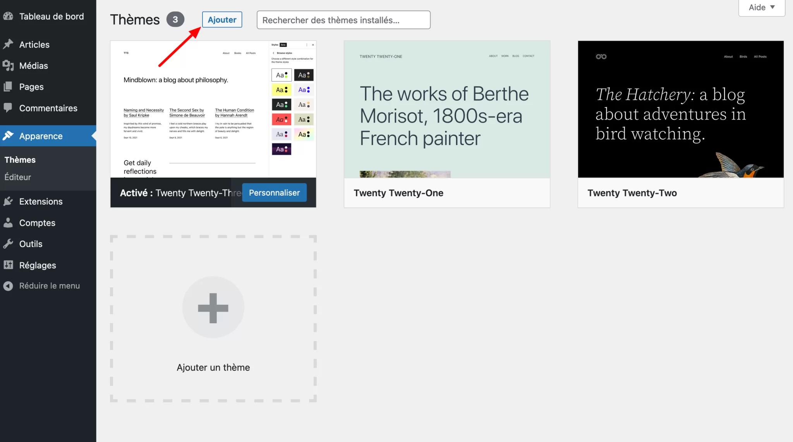{data-zoom-image}

4. Cliquez sur le bouton « Téléverser un thème ». 
{data-zoom-image}

6.	Cliquez sur le bouton « Parcourir » pour télécharger le fichier zip de votre thème. 
{data-zoom-image}

7.	Activer le thème

---

**Méthode 2 :** Installer un thème depuis le répertoire officiel
Vous pouvez aussi ajouter un thème gratuit directement depuis WordPress, sans quitter votre tableau de bord.
La procédure est très proche de celle pour installer un fichier ZIP. Voici comment faire, par exemple pour le thème Astra :

1.
Connectez-vous à WordPress et allez dans :

1. Apparence > Thèmes 
{data-zoom-image}


2. Cliquez sur le bouton « Ajouter ».
{data-zoom-image}

3.
Choisissez le thème que vous voulez.
WordPress montre par défaut les thèmes les plus populaires.

Vous pouvez aussi naviguer dans les onglets pour trouver votre thème :

*	Populaires
*	Derniers
*	Thèmes basés sur des blocs
*	Favoris
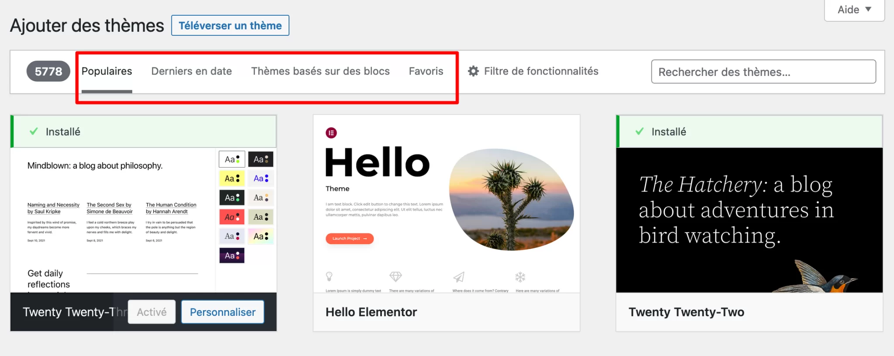{data-zoom-image}

*	soit, chercher par catégorie grâce au filtre de fonctionnalités proposé par WordPress ;
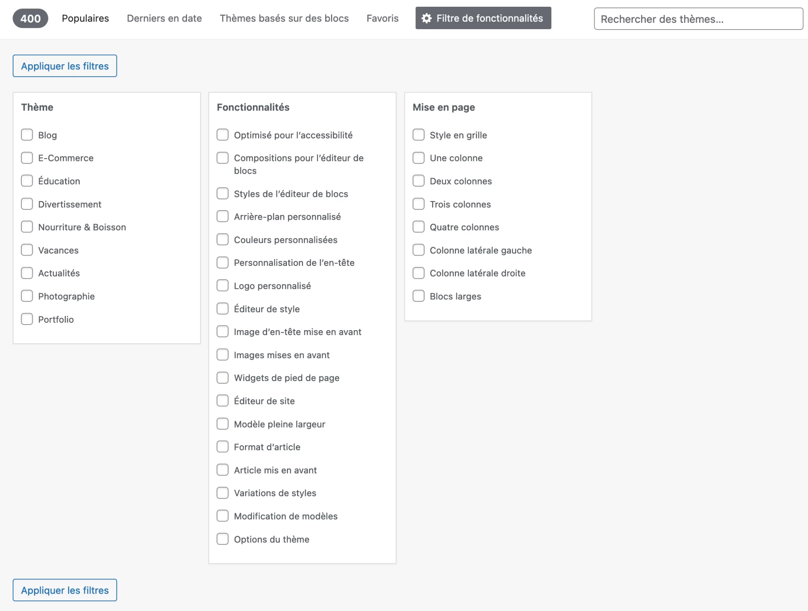{data-zoom-image}

*	soit, utiliser la barre de recherche pour retrouver le thème de votre choix, ce qui implique que vous l’ayez déjà choisi.
{data-zoom-image} 

4. Installez le thème.
Une fois votre sélection opérée, cliquez sur le bouton « Installer » : 
{data-zoom-image} 

5. Activer le thème
{data-zoom-image}  

Source : https://wpmarmite.com/installer-theme-wordpress/#

## Exercice : Édition d'un thème

<div class="grid grid-1-2" markdown>
  

  <small>Exercice - Thème Wordpress</small><br>
  **[Édition d'un thème](./exercices/exercice3.md){.stretched-link .back}**
</div>

## Qu’est-ce qu’un plugin WordPress ?
Un plugin (ou extension) sert à ajouter de nouvelles fonctionnalités à WordPress.

Un plugin complète le Cœur pour que votre site fasse exactement ce dont vous avez besoin.

**Comment choisir un plugin WordPress ?**

*	À quoi il sert ? Quelle fonctionnalité vous faut-il ?
*	Peut-il vraiment faire ce que vous voulez ?
*	Comprenez-vous ce qu’il fait ?
*	Pouvez-vous le configurer sans casser votre site ?
  
Certains plugins mal utilisés peuvent poser des problèmes, alors soyez prudent.

Regardez aussi ces points avant d’installer :

*	Étoiles / notes : choisissez un plugin bien noté (idéalement ≥ 4 étoiles).
*	Avis des utilisateurs : lisez ce que les autres disent.
*	Installations actives : plus il y en a, plus c’est un bon signe (mais ce n’est pas toujours vrai).
*	Mises à jour récentes : vérifiez que le plugin est compatible avec votre version de WordPress. 
{data-zoom-image}  


**Où trouver des plugins WordPress ?
Le répertoire officiel de WordPress est le meilleur endroit pour chercher des plugins. 

*	Par catégories : blocs, populaires, mises en avant, bêta…
*	Avec la barre de recherche : tapez le nom du plugin ou un mot-clé (ex : SEO, formulaire, sécurité).
*	Avec les filtres :
 *	Communautaire : gratuit et développé par la communauté
 *	Commercial : gratuit avec options payantes ou support en plus
 {data-zoom-image}  

**Comment installer un plugin WordPress gratuit**

1.	Dans votre tableau de bord WordPress, allez dans Extensions > Ajouter.
1.	Si vous ne voyez pas ce menu, vous utilisez peut-être WordPress.com au lieu de WordPress.org (auto-hébergé).
1.	Dans la barre de recherche, tapez le nom du plugin ou un mot-clé (ex : SEO, formulaire, sécurité).
1.	Cliquez sur Installer puis Activer.
   
Et voilà, votre plugin est prêt à être utilisé. 
{data-zoom-image}  


**Installer un plugin WordPress acheté ou téléchargé**
Si vous avez un plugin premium ou téléchargé ailleurs (fichier .zip) :

1.	Dans WordPress, allez dans Extensions > Ajouter.
1.	Cliquez sur Téléverser une extension.
1.	Choisissez le fichier .zip de votre plugin.
1.	Cliquez sur Installer puis Activer.
   
Votre plugin est maintenant prêt à l’emploi.
{data-zoom-image}  


Sélectionnez ensuite le fichier .zip de votre plugin sur votre ordinateur, et cliquez sur le bouton « Installer maintenant » :
{data-zoom-image}  
 

Une fois le plugin installé, cliquez également sur « Activer l’extension » pour la mettre en service :
{data-zoom-image}  

## All-in-One WP Migration and Backup
Ce plugin facilite la migration, la sauvegarde et la restauration d’un site WordPress.
Il permet de copier tout le site (base de données, images, plugins, thèmes) dans un seul fichier à exporter et réutiliser facilement.

**All-in-One WP Migration and Backup – Mode d’emploi simple**

1. Installer le plugin
*	Allez dans Extensions > Ajouter sur votre tableau de bord WordPress.
*	Cherchez All-in-One WP Migration.
*	Cliquez sur Installer, puis Activer.
2. Faire une sauvegarde de votre site
*	Dans le menu WordPress, cliquez sur All-in-One WP Migration > Exporter.
{data-zoom-image}  
*	Choisissez Exporter vers et sélectionnez Fichier (ou un autre service si disponible, comme Google Drive).
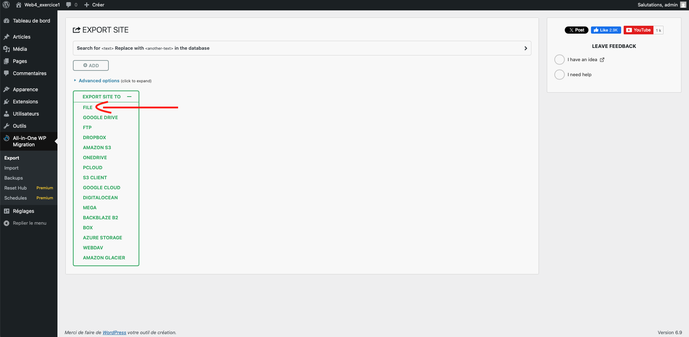{data-zoom-image}  
*	Le plugin va créer un fichier .wpress contenant :
 *	votre base de données
 *	vos fichiers médias
 *	vos plugins
 *	votre thème
•	Téléchargez ce fichier sur votre ordinateur.
{data-zoom-image}  
3. Restaurer votre site
*	Dans WordPress, allez sur All-in-One WP Migration > Importer.
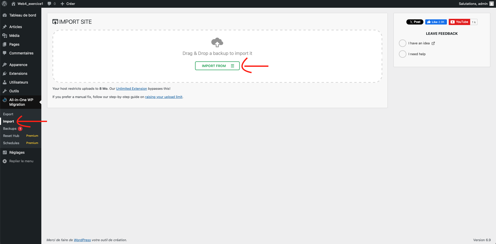{data-zoom-image}  
*	Cliquez sur Importer depuis et sélectionnez le fichier .wpress que vous avez sauvegardé.
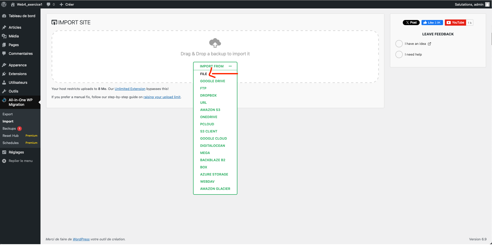{data-zoom-image}  
*	Suivez les instructions à l’écran pour restaurer votre site.
4. Points importants
*	Sauvegardez avant toute modification de votre site.
*	La version gratuite a des limites pour la taille des fichiers.
*	Pour des sauvegardes sur le cloud ou des fonctionnalités avancées, il faudra acheter la version premium.

**Augmenter la valeur de téléchargement par défaut de MAMP**

**Emplacement du php.ini — MAMP classique (Windows)**

Le fichier se trouve ici :

!!! info "PC"

    C:\MAMP\bin\php\phpX.X.X\conf\php.ini
    
    ou

    C:\MAMP\conf\php\phpX.X.X\conf\php.ini

!!! info "Mac"

    /Applications/MAMP/bin/php/phpX.X.X/conf/php.ini


!!! tip "👉 Exemple concret"

    C:\MAMP\bin\php\php8.1.12\conf\php.ini


⚠️ Il peut y avoir plusieurs dossiers phpX.X.X
Tu dois modifier CELUI qui est réellement utilisé.


**Modifications à faire dans php.ini**

Ajoute ou modifie :

``` ini
upload_max_filesize = 256M
post_max_size = 256M
memory_limit = 512M
max_execution_time = 300
max_input_time = 300
```


!!! warning "Attention"

    Redémarrage OBLIGATOIRE

Indispensable :

* Stop Servers
* Start Servers dans MAMP

**Sans ça → aucun effet.**


{data-zoom-image}   

## Qu’est-ce que Polylang ?

Polylang est un plugin WordPress qui permet de créer un site en une ou plusieurs langues.
Il permet de traduire le contenu du site (pages, articles, menus, catégories, etc.).

**Comment installer Polylang sur WordPress**

**Étape 1 :** Choisir les langues du site

{data-zoom-image}   

Choisissez au moins une langue pour votre site (ex. français, anglais).

👉 La première langue choisie devient la langue par défaut du site.

**Étape 2 :** Traduire les médias (optionnel)

{data-zoom-image}   

* Polylang vous demande si vous voulez traduire les textes des images
(titre, description, texte alternatif).
* ➡️ Activez ou désactivez selon vos besoins.

**Étape 3 :** Définir la langue des contenus existants

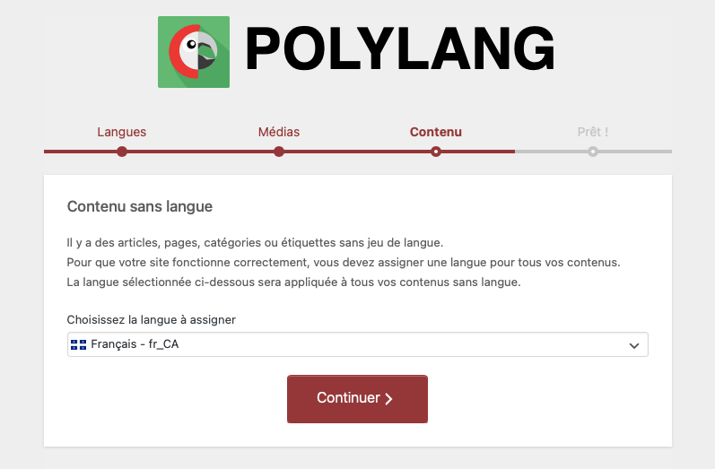{data-zoom-image}   

Tous vos contenus actuels (pages, articles) reçoivent une langue par défaut.

**Étape 4 :** Traduire la page d’accueil (si applicable)

{data-zoom-image}   

Si vous avez une page d’accueil fixe, Polylang vous propose de la traduire.

**Étape 5 :** Configuration terminée


Polylang est prêt à être utilisé.

Vous pouvez maintenant :

* traduire vos pages et articles
* créer des menus multilingues
* consulter la documentation
* ou retourner au tableau de bord

👉 Votre site est maintenant prêt pour le multilingue.

### Les réglages de Polylang

**Polylang a 4 menus principaux :**

* Langues
* Traduction des chaînes
* Réglages
* Configurer (relance l’assistant)
* Menu Langues
  
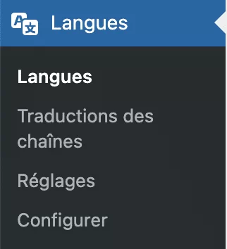{data-zoom-image}  

Ce menu sert à gérer les langues du site.

Vous pouvez :

* ajouter une langue
* changer son nom
* choisir le sens d’écriture (gauche → droite ou droite → gauche)
* changer l’ordre des langues
* choisir ou remplacer le drapeau
  
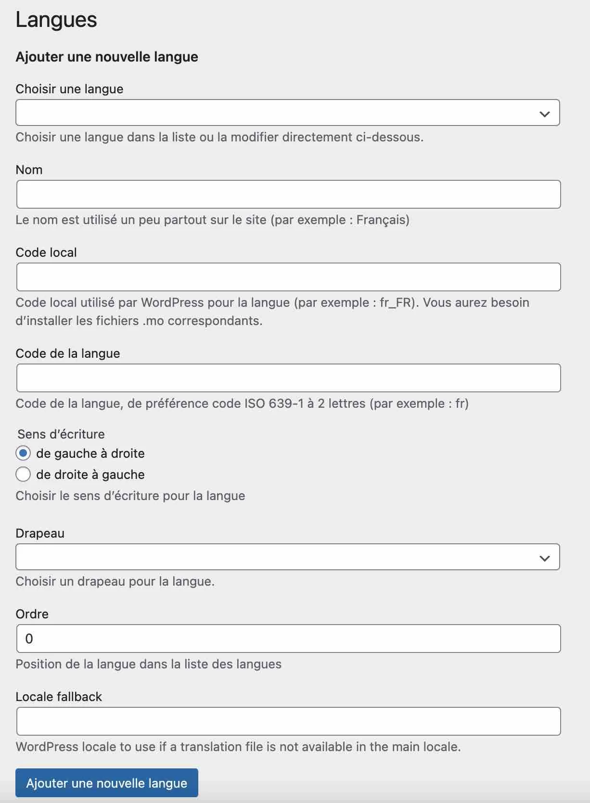{data-zoom-image}    

👉 La langue par défaut est marquée par une étoile.
Vous pouvez la changer en cliquant sur l’étoile.

Vous pouvez aussi :

* désactiver une langue
* la modifier
* la supprimer
* Menu Traduction des chaînes
  
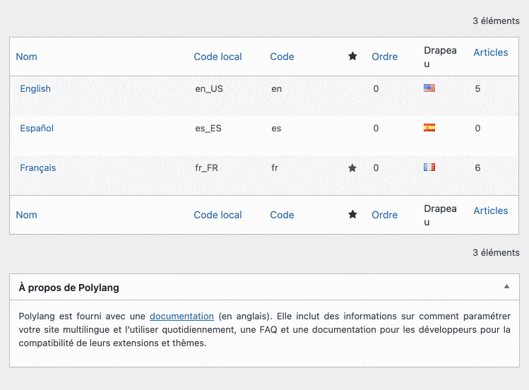{data-zoom-image}

#### Menu Réglages

Ici, vous gérez les options générales :

* traduire ou non les médias
* rediriger les visiteurs selon la langue de leur navigateur
* choisir la forme des URLs

Options possibles pour les URLs :

* avec dossier : monsite.com/fr/
* avec sous-domaine : fr.monsite.com
* avec domaine différent : monsite.fr / monsite.com

{data-zoom-image}


#### Sélecteur de langues

Ajouter ce code dans le fichier `functions.php` du thème actif.

```php
// Shortcode de sélecteur de langue avec Polylang
// Usage : [custom_language_switcher]
function custom_pll_language_switcher() {
  return pll_the_languages( array(
    'show_flags' => 1,
    'show_names' => 1,
    'display_names_as' => 'name', // name ou slug
    'echo' => 0,
    'hide_current' => 1,
  ) );
}
add_shortcode( 'custom_language_switcher', 'custom_pll_language_switcher' );
```

Puis, dans l'édition du menu principal, ajouter le shortcode suivant :

```php
[custom_language_switcher]
```

!!! info "html et langue"

    Dans la balise html de votre site, vous devriez voir apparaître un attribut `lang` qui indique la langue de votre site. Par exemple : 'fr-CA' pour français canadien.


### Gestion des menus

Avant de faire la gestion des menus, installez le plugin [Block Visibility](https://wordpress.org/plugins/block-visibility/)

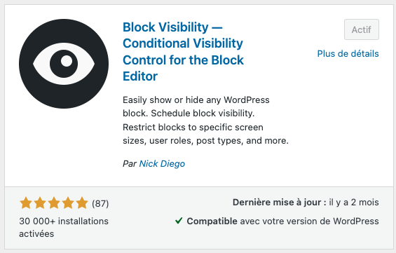

Si notre site est bilingue français/anglais, on devra créer 2 navigations dans l'édition du thème, où se trouve le menu principal.

Pour chaque navigations, configurez la visibilité en spécifiant une condition sur l'URL.

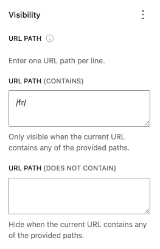


Source : https://wpmarmite.com/polylang/#

### Exercice Polylang

<div class="grid grid-1-2" markdown>
  

  <small>Exercice - Polylang</small><br>
  **[Polylang](./exercices/exercice4.md){.stretched-link .back}**
</div>

## ACF (Advanced Custom Fields)

ACF est un plugin WordPress qui permet d’ajouter des champs personnalisés à vos pages, articles ou autres contenus.

**👉 Exemple :**

* une note,
* un avis client,
* une image spécifique,
* des infos produit,
* des détails d’événement.

**À quoi sert ACF ?**

* mieux organiser les données dans WordPress
* faciliter la saisie de contenu
* afficher des infos personnalisées sur le site
* créer des sites plus clairs et professionnels

**Ce que vous pouvez faire avec ACF**

* Ajouter plus de 30 types de champs (texte, image, nombre, date, choix, etc.)
* Créer des listes répétées (ex. : témoignages)
* Créer des galeries d’images
* Choisir où les champs apparaissent (page précise, article, catégorie, etc.)
* Créer des types de contenus personnalisés (portfolio, recettes, projets…)
* Créer des pages d’options (logo, couleurs, réseaux sociaux)
* Créer des blocs Gutenberg personnalisés

### Installer ACF

1. Allez dans Extensions
1. Recherchez Advanced Custom Fields
1. Cliquez sur Installer, puis Activer

### Créer des champs avec ACF

1. Allez dans ACF > Ajouter
1. Donnez un nom au groupe de champs
1. Ajoutez un champ (ex. : texte, nombre, image)
1. Définissez où il apparaît (page, article, type de contenu)
1. Enregistrez

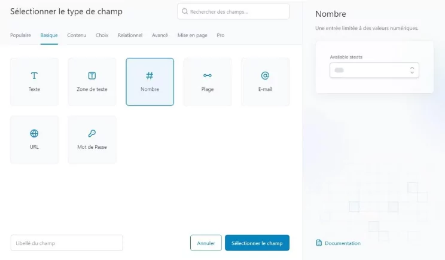{data-zoom-image}

### Où afficher les champs ACF ?

Les champs peuvent apparaître :

* sur une page précise
* sur un article
* sur un type de contenu personnalisé (ex. produits, portfolio)
* Afficher les champs sur le site

{data-zoom-image}

**Deux solutions :**

* Simple : utiliser un plugin ou un shortcode (ex. Advanced Views Lite)

* Avancée : utiliser un peu de code PHP (pour développeurs)

## Advanced Views Lite

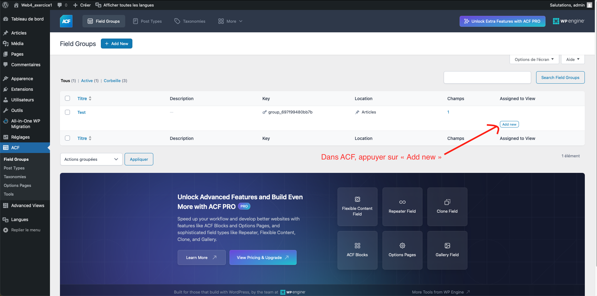{data-zoom-image}
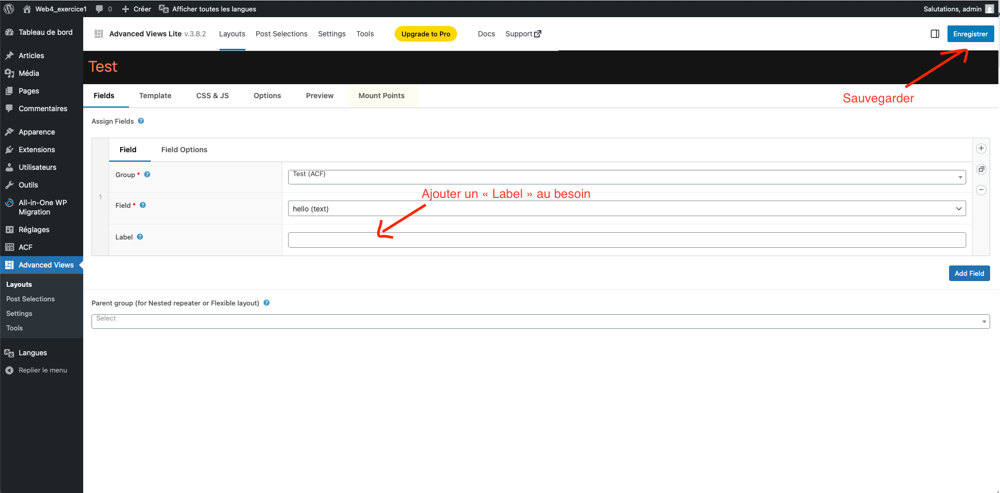{data-zoom-image}
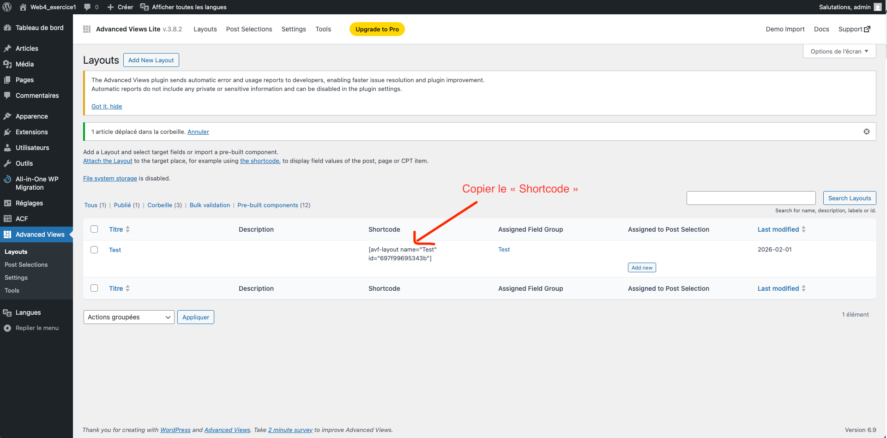{data-zoom-image}

### Exercice ACF

<div class="grid grid-1-2" markdown>
  

  <small>Exercice - Advanced Custom Fields</small><br>
  **[ACF](./exercices/exercice5.md){.stretched-link .back}**
</div>
