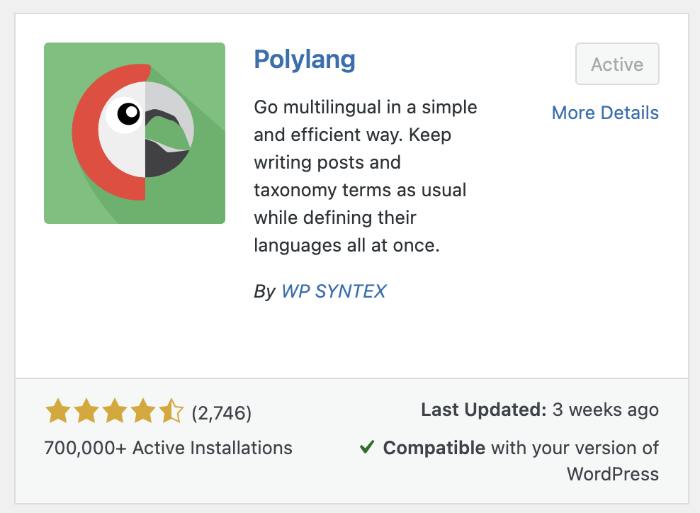
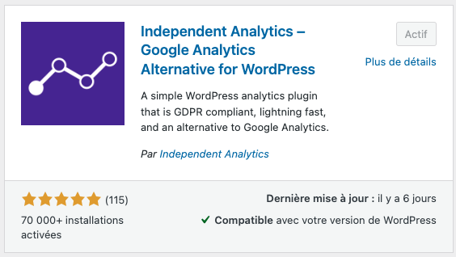
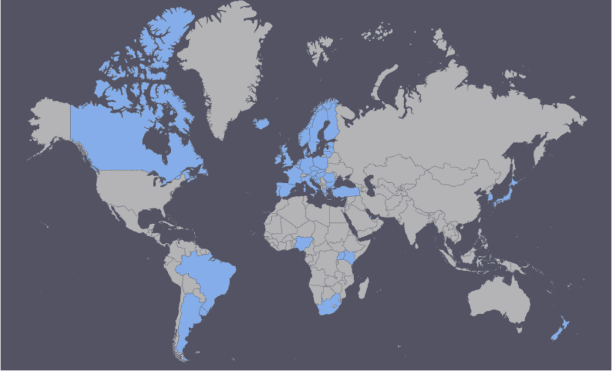
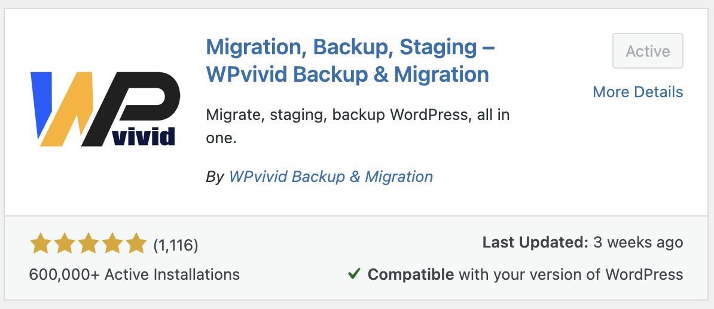
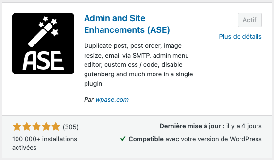

# Cours 3

## Les plugiciels

### Anatomie d'un plugin

{ .w-100 }

Un plugin WordPress est composé principalement des éléments suivants :

* Un dossier dans `wp-content/plugins/` contenant tous les fichiers du plugin.
* Un fichier principal PHP, généralement nommé `NOMDUPLUGIN.php` qui initialise le plugin.
* Un fichier de désinstallation `uninstall.php`.
* Des ressources supplémentaires comme des fichiers CSS, JavaScript ou des templates. etc. etc. On y reviendra.

### Précautions du magazinage

{ .w-100 }

Avant d’installer un plugin, il est important de bien évaluer sa qualité et sa sécurité. Voici quelques critères pour faire un bon choix :

1. Vérification de la réputation
  * Lire les avis et les notes des utilisateurs sur WordPress.org.
  * Vérifier le nombre d'installations actives : un plugin largement utilisé est souvent plus fiable.
1. Compatibilité et mise à jour
  * Vérifier la compatibilité avec votre version de WordPress avant l’installation.
  * Vérifier la dernière date de mise à jour : un plugin non mis à jour depuis plusieurs années peut être obsolète et poser des risques de sécurité.
1. Sécurité
  * Le plus possible, téléchargez depuis des sources fiables (WordPress.org, développeurs reconnus).
  * Supprimer les plugins inutilisés pour éviter des failles de sécurité potentielles.
1. Support et documentation

### 3 méthodes d'installation

{ .w-100 }

1. Installation via l’interface WordPress
  * Accédez à `Plugins > Add New Plugin` dans l'administration de WordPress.
  * Utilisez la barre de recherche pour trouver un plugin.
  * Cliquez sur `Install`, puis sur `Activate` pour l’utiliser.
1. Installation manuelle via un fichier ZIP
  * Téléchargez le fichier .zip du plugin depuis WordPress.org ou une source fiable.
  * Accédez à `Plugins > Add New Plugin` et cliquez sur `Upload Plugin` en haut de page.
  * Sélectionnez le fichier .zip, puis cliquez sur Installer maintenant.
  * Activez le plugin une fois l’installation terminée.
1. Installation manuelle
  * Téléchargez et extrayez l’archive .zip du plugin.
  * Déposez le dossier extrait dans wp-content/plugins/.
  * Accédez à Extensions dans l'administration WordPress et activez le plugin

## Multilingue



[Polylang](https://en-ca.wordpress.org/plugins/polylang/) est un logiciel de traduction multilingue pour WordPress.

### Sélecteur de langues

Ajouter ce code dans le fichier `functions.php` du thème actif.

```php
// Shortcode de sélecteur de langue avec Polylang
// Usage : [custom_language_switcher]
function custom_pll_language_switcher() {
  return pll_the_languages( array(
    'show_flags' => 1,
    'show_names' => 1,
    'display_names_as' => 'name', // name ou slug
    'echo' => 0,
    'hide_current' => 1,
  ) );
}
add_shortcode( 'custom_language_switcher', 'custom_pll_language_switcher' );
```

Puis, dans l'édition du menu principal, ajouter le shortcode suivant :

```php
[custom_language_switcher]
```

!!! info "html et langue"

    Dans la balise html de votre site, vous devriez voir apparaître un attribut `lang` qui indique la langue de votre site. Par exemple : 'fr-CA' pour français canadien.

### Chaines traduisibles

Pour ajouter une chaine traduisible, on peut le faire en programmation avec le code suivant. Il suffit de l'insérer dans le fichier `functions.php` du thème actif.

```php
// Ajoute des string traduisibles pour Polylang
function my_register_strings_for_polylang() {
  if ( function_exists( 'pll_register_string' ) ) {
    // Ajouter ici des chaines :
    pll_register_string( 'Comments label', 'Comments', 'Thème' );
    // ...
  }
}
add_action( 'after_setup_theme', 'my_register_strings_for_polylang' );
```

Lorsque la chaine est ajoutée, on peut utiliser un shortcode pour l'afficher. Ainsi on a un contrôle total sur les chaines traduisibles.

Pour créer le shortcode, il faut ajouter le code suivant dans le fichier `functions.php` du thème actif.

```php
// Shortcode de traduction
// Exemple : [trans text="Comments"]
function trans_shortcode( $atts ) {
  $atts = shortcode_atts( array('text' => ''), $atts, 'trans' );
  if ( ! empty( $atts['text'] ) ) {
    return pll__( $atts['text'] );
  }
  return '';
}
add_shortcode( 'trans', 'trans_shortcode' );
```

Ce qui veut dire qu'on peut maintenant, dans la gestion des blocs du site, ajouter un shortcode `[trans text="My sublime text!"]` et le texte sera traduit selon la langue du site.

### Gestion des menus

Avant de faire la gestion des menus, installez le plugin [Block Visibility](https://wordpress.org/plugins/block-visibility/)


Si notre site est bilingue français/anglais, on devra créer 2 navigations dans l'édition du thème, où se trouve le menu principal.

Pour chaque navigations, configurez la visibilité en spécifiant une condition sur l'URL.


## Statistiques

La plupart des sites web utilisent des outils de statistiques comme [Google Analytics](https://analytics.google.com/analytics/web/). À vrai dire, c'est assurément l'outil de statistique le plus utilisé au monde. Mais depuis Google Analytics 4, le suivi est devenu moins précis (_opinion personnelle du prof_) et avec le RGPD (ou GDPR), on est obligé de repenser notre façon de collecter les données. C’est pourquoi d’autres solutions, comme [Independent Analytics](https://wordpress.org/plugins/independent-analytics/), peuvent être envisagées.



### RGPD

{.w-100}

Le RGPD (Règlement Général sur la Protection des Données) est une loi européenne entrée en vigueur en **2018**, visant à renforcer la protection des données personnelles des citoyens de l’UE.

* **Consentement explicite** : Les utilisateurs doivent donner un accord clair avant la collecte de leurs données.
* **Droit d’accès et de suppression** : Toute personne peut demander l’accès ou la suppression de ses données.
* **Portabilité des données** : Possibilité de récupérer ses données et de les transférer à un autre service.
* **Sécurité des données** : Obligation pour les entreprises de protéger les informations collectées.
* **Notification des violations** : Signalement obligatoire des fuites de données dans un délai de 72 heures.

### Loi 25 | Québec

La Loi 25[^loi25a] modernise la protection des renseignements personnels au Québec et impose de nouvelles obligations aux entreprises et organisations.

[^loi25a]: https://www.cai.gouv.qc.ca/protection-renseignements-personnels/sujets-et-domaines-dinteret/principaux-changements-loi-25

* **Responsable des données** : Obligation de désigner une personne chargée de la protection des renseignements personnels.
* **Consentement clair** : Doit être explicite et bien informé avant toute collecte de données.
* **Transparence** : Politique de confidentialité claire et accessible aux utilisateurs.
* **Notification des fuites** : Obligation de signaler toute atteinte aux données à la Commission d’accès à l’information (CAI) et aux personnes concernées.
* **Droit à la portabilité** : Les utilisateurs peuvent demander une copie de leurs données dans un format structuré.
* **Droit à l'oubli** : Suppression de compte.

Depuis 2022, officialisé en 2024[^loi25b].

[^loi25b]: https://www.barreau.qc.ca/fr/nouvelle/avis-aux-membres/loi-25-vigueur-entierete/

## Sauvegarde et exportation



L'utilisation d'un plugin de sauvegarde est essentielle pour protéger votre site contre les pertes de données.[WPvivid Backup & Migration](https://fr.wordpress.org/plugins/wpvivid-backuprestore/) permet :

* De créer des sauvegardes complètes de votre site (fichiers + base de données).
* D'automatiser les sauvegardes avec un planning personnalisé.
* De restaurer facilement un site en cas de problème.
* De migrer un site d'un serveur à un autre.

## Plugin à explorer !



[Admin and Site Enhancements (ASE)](https://wordpress.org/plugins/admin-site-enhancements/) vous permet d’affiner de nombreux paramètres de gestion sur votre site. Il y en a une bonne cinquantaine d'options alors n’hésitez pas à explorer les différents réglages pour découvrir comment chaque option peut affecter votre expérience.

## Exercices

Changez d'côté vous vous êtes trompé

<div class="grid grid-1-2" markdown>
  

  <small>Exercice - Wordpress</small><br>
  **[Bk](./exercices/wp-bk.md){.stretched-link .back}**
</div>

<div class="grid grid-1-2" markdown>
  

  <small>Exercice - Wordpress</small><br>
  **[Konnichiwa](./exercices/wp-anime.md){.stretched-link .back}**
</div>

[STOP]

## Fil d'Ariane

Communément appelé _breadcrumb_, le fil d'Ariane indique le chemin de navigation d'un utilisateur sur un site web. Il n'y en a pas par défaut dans WordPress.

!!! info "Le saviez vous ?"

    

    Le fil d’Ariane tire son origine de la mythologie grecque[^breadcrumb1], et plus particulièrement de l’histoire de Thésée et du Minotaure. Afin d’aider Thésée à sortir du labyrinthe construit par Dédale dans lequel il se trouvait prisonnier avec le Minotaure, Ariane, fille du roi de Crète, aurait utilisé un fil d’une pelote de laine. Elle souhaitait ainsi porter secours à l’homme dont elle était amoureuse pour qu’il puisse retrouver son chemin et sortir du labyrinthe sain et sauf.[^breadcrumb2]

[^breadcrumb1]: <https://fr.wikipedia.org/wiki/Ariane_(mythologie)>
[^breadcrumb2]: <https://foxglove-partner.com/fil-ariane/>