# Cours 4

*[FSE]: Full Site Editing

## Gutemberg

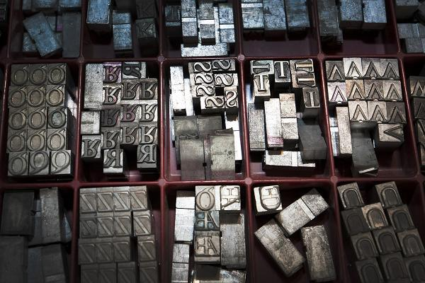{.w-100}

**Johannes Gutenberg** (vers 1400-1468) était un inventeur allemand connu pour avoir révolutionné l’**imprimerie** en Europe au XVe siècle grâce à l’invention de la presse à **caractères mobiles[^movable]**.

Au début, l’imprimerie a surtout servi la diffusion des **textes religieux**, mais elle est rapidement devenue un outil fondamental pour l’expansion du savoir dans tous les domaines 📚 et a grandement contribué à la **démocratisation du savoir** 🌍.

{.w-100}

[^movable]: <https://fr.wikipedia.org/wiki/Caract%C3%A8re_(typographie)#Caract%C3%A8res_mobiles>

### Gutenberg et WordPress

Gutenberg est le nom de l’éditeur de blocs natif de WordPress, introduit dans la version 5.0 en 2018.

Il remplace l’ancien **éditeur classique** en permettant aux utilisateurs de créer du contenu et de concevoir des pages à l’aide de blocs modulaires (📝 Texte, 🖼️ Images, 🎥 Vidéos, 🔘 Boutons, 📏 Colonnes), **sans nécessiter de code** !

Gutenberg est également à la base du _FSE (Full Site Editing)_, qui permet de personnaliser l’ensemble d’un site WordPress directement depuis l’éditeur.

Voici une comparaison de l'interface avant et après Gutenberg.

<div class="grid" markdown>
  <figure markdown>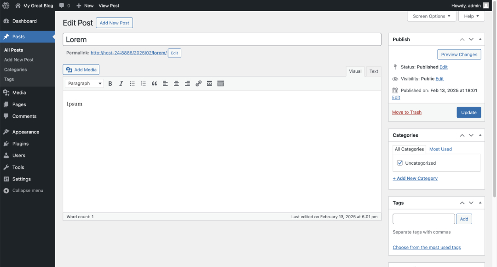{data-zoom-image}<figcaption>Éditeur classique</figcaption></figure>

  <figure markdown>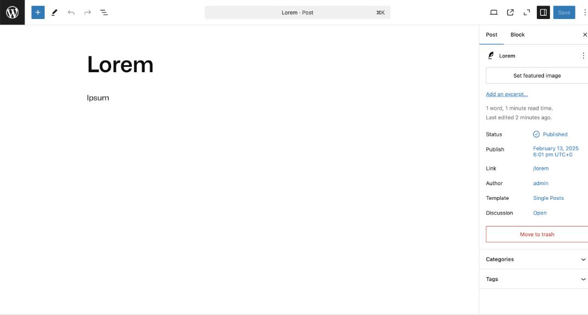{data-zoom-image}<figcaption>Gutenberg 🚀</figcaption></figure>
</div>

## Les thèmes WordPress


Un thème WordPress est un ensemble de fichiers (PHP, CSS, HTML) qui détermine l’apparence et la mise en page d’un site 🎨✨.

### Installation

L'installation fonctionne de la même manière que les plugins. C'est le magasinage qui change un peu.

On peut cliquer sur l'image pour avoir un aperçu rapide 🤩 du thème.

Il faut cependant savoir qu'il existe deux types de thèmes WordPress : les thèmes **classiques** et les thèmes **FSE** (_Full Site Editing_).

### _Block themes_

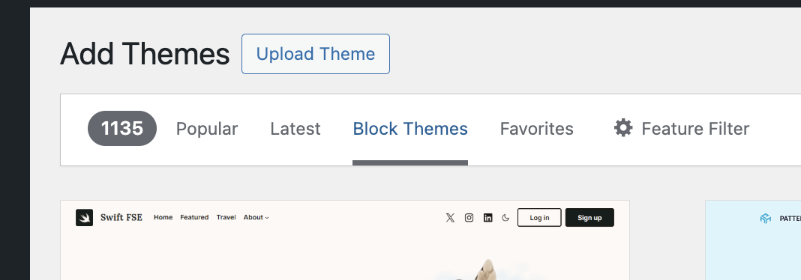

Aussi appelés _FSE themes_, ce type de thème a été introduit en janvier 2022 pour que l'affichage soit cohérent avec l'outil d'édition de blocs Gutenberg.

Il permet de personnaliser l'ensemble du site sans toucher au code !

D'ailleurs, le thème par défaut de WordPress en est un exemple.

C'est le type de thème que nous allons privilégier pour le moment.

!!! info "Bon à savoir"

    Les thèmes FSE utilisent un fichier `theme.json` pour la configuration, plutôt que le `functions.php` qui sert à cela dans les thèmes classiques.

### Thèmes classiques


Les thèmes classiques utilisent la structure traditionnelle de WordPress avec une hiérarchie de fichiers PHP plus granulaire, mais aussi plus complexe.

L'avantage des thèmes classiques est que la personnalisation est plus fine et plus proche d'une **perspective de programmeur**. Les thèmes classiques offrent également une meilleure compatibilité avec certains plugins et permettent une maîtrise plus approfondie du code PHP, ce qui est utile pour les **sites complexes**.

## Patterns

Les **patterns** sont des modèles de blocs prédéfinis qui permettent de créer des mises en page rapidement.

On retrouve également les **parties du thème** (_template parts_) qui sont générales au site (header, footer, sidebar, etc.).

Si vous êtes curieux ou curieuses, vous pouvez les voir dans les fichiers situés sous le dossier patterns dans le code du thème.

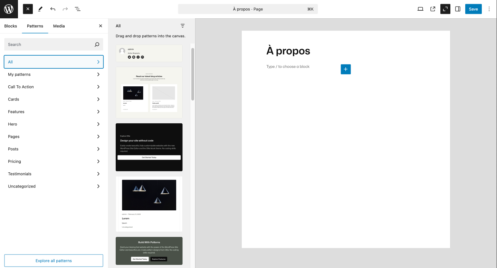{data-zoom-image}

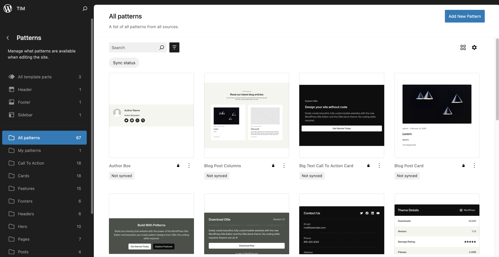{data-zoom-image}

### _Synced_ vs. _Not synced_

Un pattern **synced** est modifié globalement sur tout le site si l’on change une de ses instances. C’est un “bloc réutilisable” qui est souvent signalé par une icône violette.

Un pattern **not synced** permet de modifier une instance sans affecter les autres.

## Modèles de page (Templates)

Les modèles de page sont des mise en forme de page assigné à des type de pages.

Faites attentions à ne pas ajouter le contenu de votre site dans les modèles de page. Il faut être vigilent pour cela.

!!! warning "Attention"

    N'ajoutez pas de contenu dans l'éditeur du site. Ça porte à confusion, car on met souvent du contenu dans les templates pour simuler ce que pourrait être le contenu, mais idéalement il n'en aurait pas. Tout le contenu se trouverait dans les pages et les posts.

    Si on est pas administrateur, on n'a pas accès au site editor.

### Bonne pratique

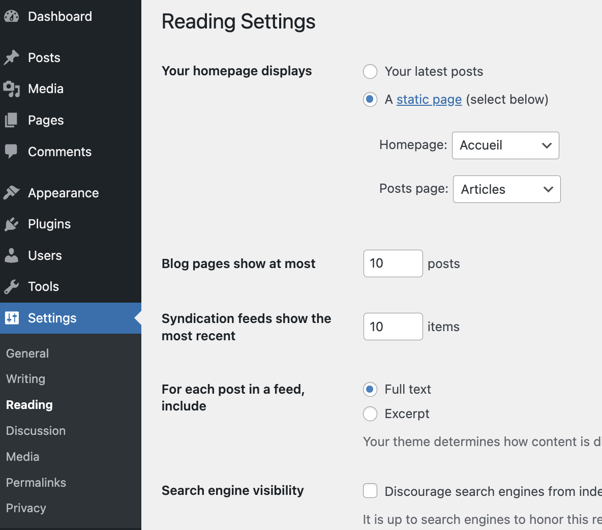{data-zoom-image}

Dans /wp-admin/options-reading.php, on peut trouver les modèles de page assignées à la page d'accueil et la page des posts.

## Éditeur de fichiers du thème

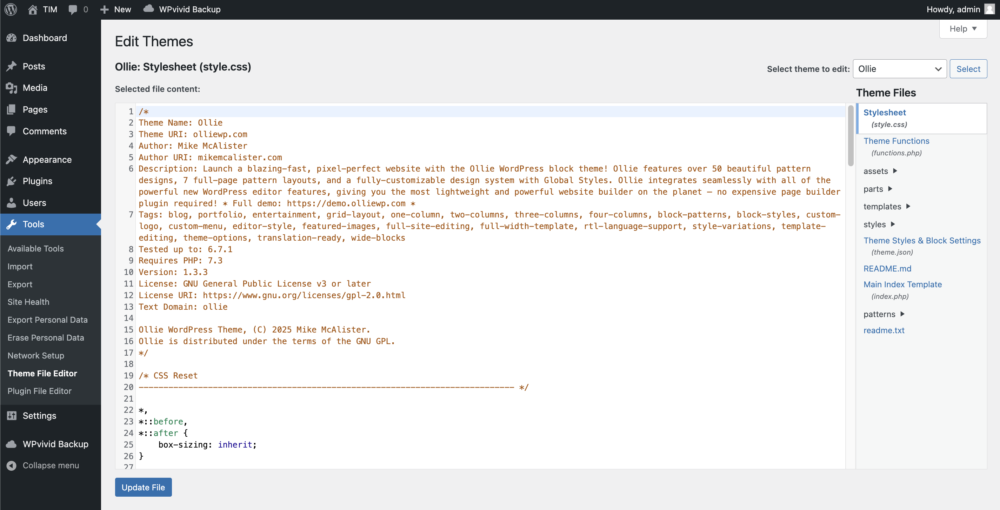{data-zoom-image}

Attention, si vous n'utilisez pas de thème enfant, le code ajouté dans le theme editor sera écrasé par une mise à jour du thème.

## Serveur distant


[Lien vers votre cPanel](https://res-cp5.yyz2.websiteservername.com:2083) pour faire la gestion de votre serveur.

| Nom, Prénom                  | Nom d'utilisateur | Mot de passe                 |
|------------------------------|-------------------|------------------------------|
| Angon Dubé, Rafaël           | rafael            | _# de téléphone sur colnet_  |
| Arseneau, Mikaël             | mikael            | _# de téléphone sur colnet_  |
| Bélisle, Émeryk              | emeryk            | _# de téléphone sur colnet_  |
| Chamberland, Yannick         | yannick           | _# de téléphone sur colnet_  |
| Daher, Elie                  | elie              | _# de téléphone sur colnet_  |
| Dufault, Ryan                | ryan              | _# de téléphone sur colnet_  |
| Ferland, Benjamin            | benjamin          | _# de téléphone sur colnet_  |
| Gendron, Alexandre           | alexandre         | _# de téléphone sur colnet_  |
| Jean, Sandrine               | sandrine          | _# de téléphone sur colnet_  |
| Kaïssoumi, Ahmed             | ahmed             | _# de téléphone sur colnet_  |
| Kordan, Radhouane            | radhouane         | _# de téléphone sur colnet_  |
| Lach, Thearylou              | thearylou         | _# de téléphone sur colnet_  |
| Laprise, Marie-Lili          | marielili         | _# de téléphone sur colnet_  |
| Saloumi, Jad                 | jad               | _# de téléphone sur colnet_  |
| Tounekti, Amira              | amira             | _# de téléphone sur colnet_  |
| Ghariani, Matis              | matis             | _# de téléphone sur colnet_  |
| Hébert, Jade                 | jade              | _# de téléphone sur colnet_  |
| Lavoie, Félix                | felix             | _# de téléphone sur colnet_  |
| Ledru, Edelwyn               | edelwyn           | _# de téléphone sur colnet_  |
| Lu, Ting Yung                | tingyung          | _# de téléphone sur colnet_  |
| Martineau, Xavier            | xavier            | _# de téléphone sur colnet_  |
| Montpetit, Justin            | justin            | _# de téléphone sur colnet_  |
| Nassif, Patricia             | patricia          | _# de téléphone sur colnet_  |
| Nikulin, Anton               | anton             | _# de téléphone sur colnet_  |
| Ranger, Mégane               | megane            | _# de téléphone sur colnet_  |
| Saavedra-Torrano, Dana       | dana              | _# de téléphone sur colnet_  |
| Willett, Mathieu             | mathieu           | _# de téléphone sur colnet_  |
| Yaya, Manel                  | manel             | _# de téléphone sur colnet_  |

L'URL de votre site Web se trouve à l'adresse suivante : **https://==NUMÉRO_DA==.tim-momo.com/**

### Limites

1 Go d'espace de stockage TOTAL

10 bases de données

300 000 fichiers (une installation de base de WordPress tourne autour de 4 000 fichiers)

### Installer WordPress avec cPanel

!!! warning "Mot de passe"

    Prévoyez désormais un mot de passe suffisamment sécurisé pour vos sites.

    Une fois en ligne, ils seront accessibles au monde entier, incluant les robots pirates 🏴‍☠️

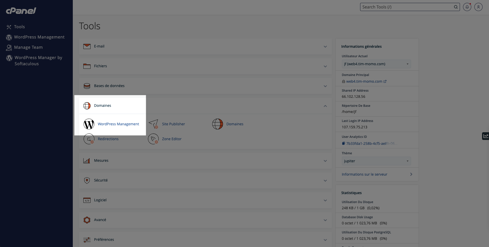{data-zoom-image}

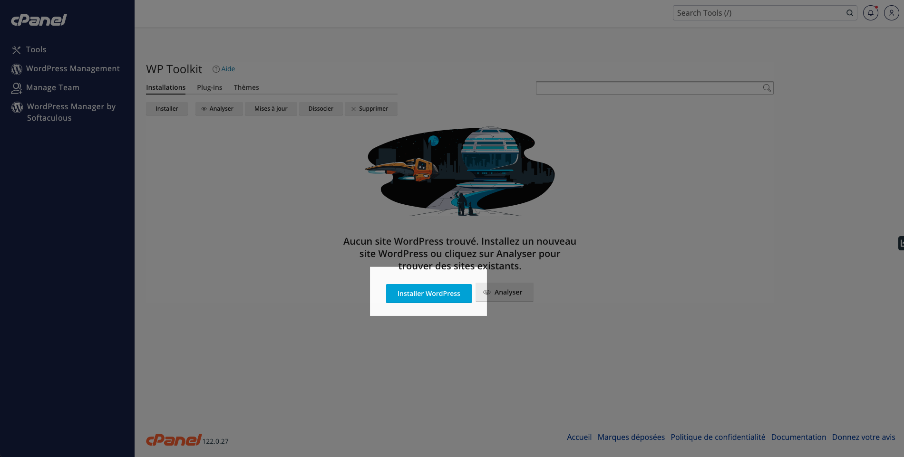{data-zoom-image}

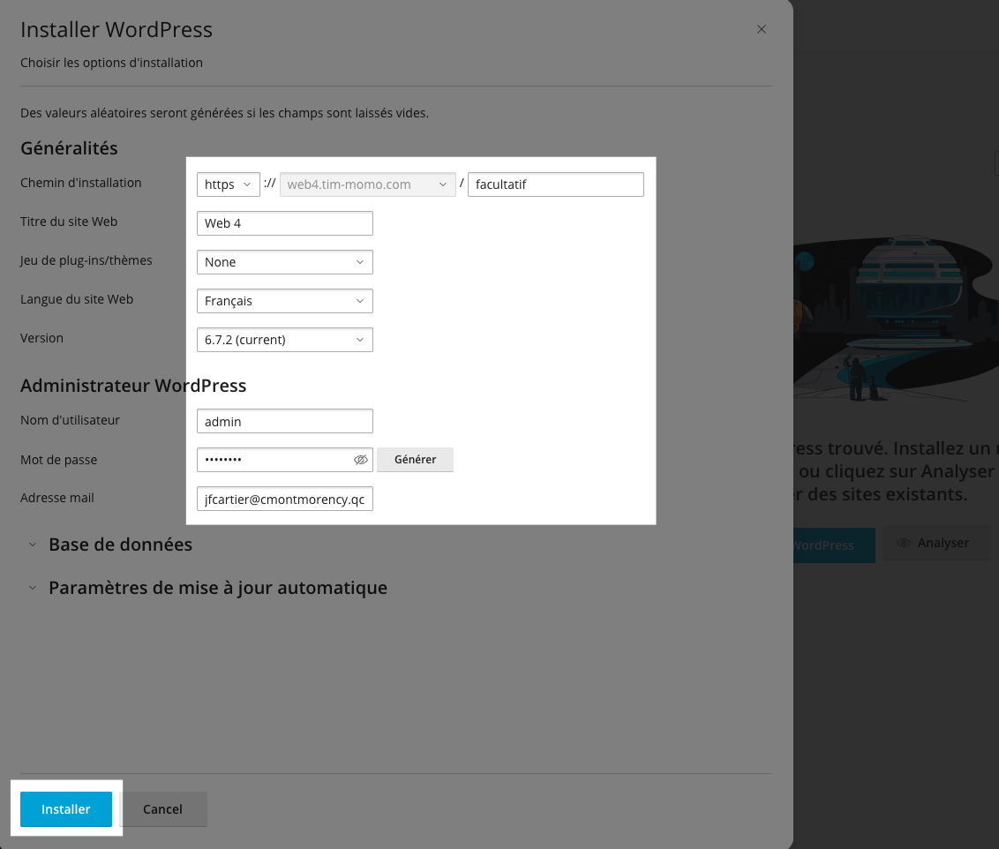{data-zoom-image}

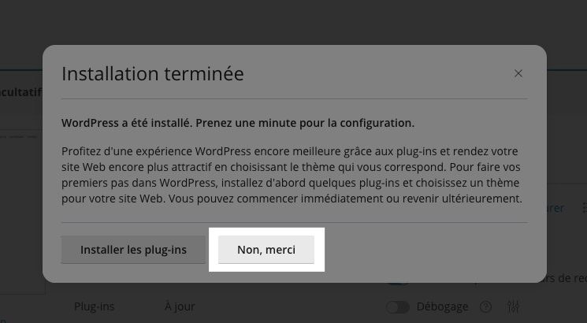{data-zoom-image}

### Importer Wordpress avec WPVivid

La restauration d'un site peut prendre plusieurs minutes ⏳ (5min+) sur ce type de serveur, car les ressources attribuées à votre site par HostPapa sont limitées.

!!! info "Poids des backups"

    Attention à la limite du serveur. Les backups ont un poids à ne pas négliger dans le calcul de l'espace disque disponible.

!!! bug "Permaliens"

    Après une restauration de backup, il arrive que la configuration des URL (permaliens) soit compromise.

    Heureusement, il suffit d’aller dans `Settings > Permalinks` et d'enregistrer la page (sans rien changer) pour résoudre ce problème.

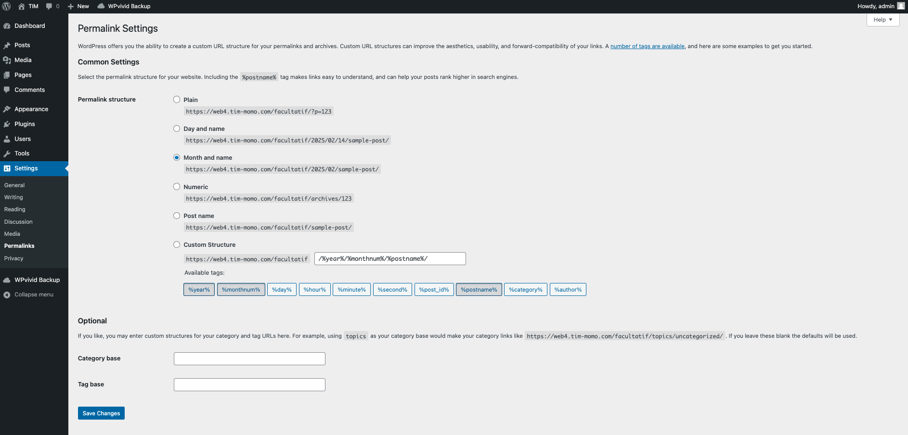{data-zoom-image}

### 🔐 Mot de passe non sécurisé

Si votre mot de passe n’est pas assez sécurisé 🦨, vous devrez le modifier.

Plutôt que de changer le mot de passe sur votre environnement local, réexporter le backup et le réimporter sur le serveur 🫠, il existe une méthode bien plus simple.

Suivez les étapes suivantes :

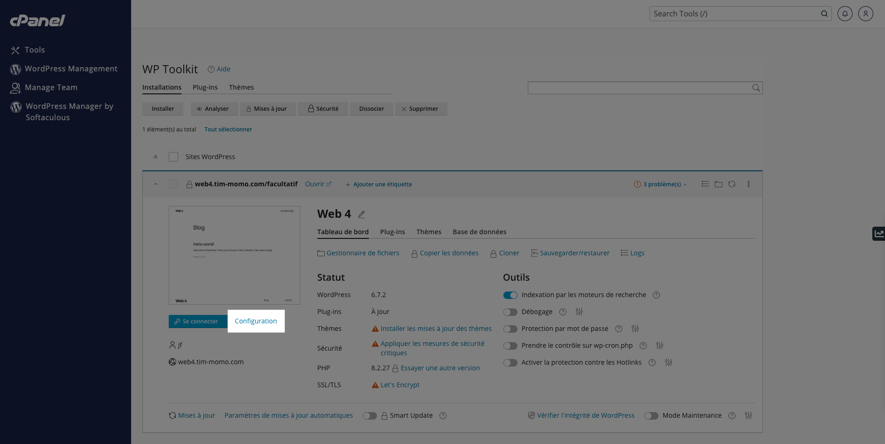{data-zoom-image}

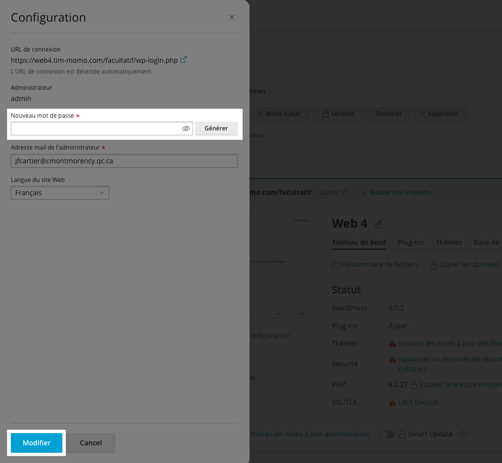{data-zoom-image}

## Exercice

<div class="grid grid-1-2" markdown>
  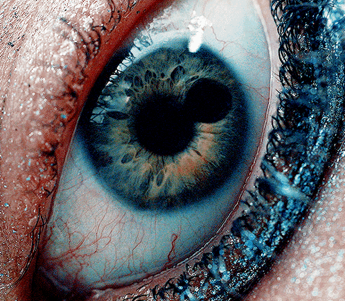

  <small>Exercice - Wordpress</small><br>
  **[La substance](./exercices/wp-substance.md){.stretched-link .back}**
</div>

## Devoir

<div class="grid grid-1-2" markdown>
  

  <small>Devoir - Wordpress</small><br>
  **[WOW](./exercices/wp-wow.md){.stretched-link .back}**
</div>

[STOP]

### Créer un thème enfant

Dans le répertoire /wp-content/themes/, crée un nouveau dossier. Nomme-le par convention :  `nom_du_theme_parent-child`
Exemple : si ton thème parent est twentytwentyfive, nomme le dossier `twentytwentyfive-child`.

Crée un fichier `style.css` dans ton dossier et ajoute ceci :

```css
/*
Theme Name: Twenty Twenty-Five Child
Theme URI: https://web4.tim-momo.com/
Description: Thème enfant de Twenty Twenty-Five
Author: Jean-François Cartier
Author URI: https://web4.tim-momo.com/
Template: twentytwentyfive
Version: 1.0.0
Text Domain: twentytwentyfive-child
*/
```

⚠️ La ligne Template: twentytwentyfour doit correspondre exactement au dossier du thème parent.

⚠️ Le Text Domain doit être unique et correspondre au nom du thème enfant.

Ajouter un fichier nommé `functions.php`. Ce fichier servira à charger les styles CSS du thème parent.

Dans `functions.php`, ajoute ceci :

```php
<?php
function child_theme_enqueue_styles() {
    wp_enqueue_style(
        'parent-style',
        get_template_directory_uri() . '/style.css'
    );
}
add_action('wp_enqueue_scripts', 'child_theme_enqueue_styles');
```

Copie le fichier `theme.json` du thème parent dans ton dossier de thème enfant.

💡 Seules les valeurs modifiées s’appliqueront, le reste héritera du parent.

Activer le thème enfant dans `Apparence > Thèmes`.

## Thème enfant

Créer un thème enfant (ou sous-thème) permet de préserver les modifications (styles, templates, theme.json, etc.) lorsque le thème parent est mis à jour.

En effet, quand un thème est mis à jour, tous ses fichiers sont remplacés par la nouvelle version. Si on a modifié un ou plusieurs fichiers, **tout sera perdu** 🙃

{.w-100}