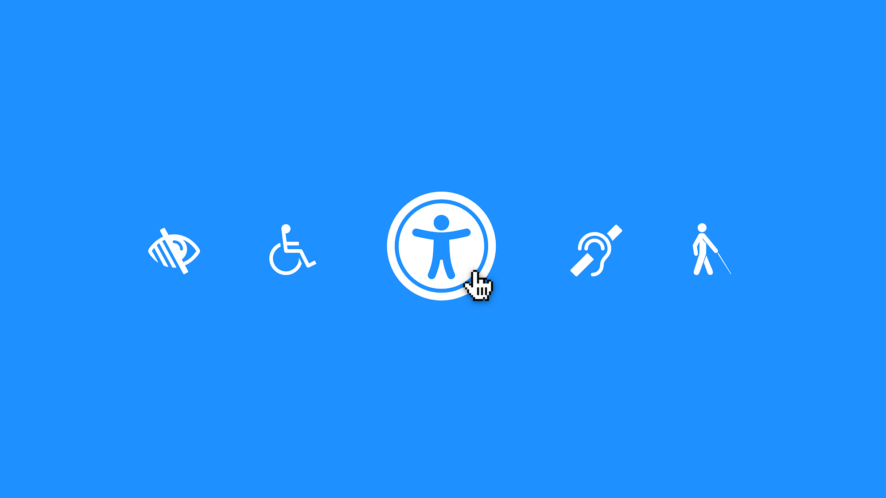

# Cours 6

*[SEO]: Search Engine Optimization
*[E-E-A-T]: Experience, Expertise, Authoritativeness, and Trustworthiness
*[WCAG]: Web Content Accessibility Guidelines
*[UX]: User eXperience
*[CTA]: Call To Action
*[CTR]: ClickThrough Rate

## Annonces

Vous vous cherchez le moyen de vous distinguer par rapport aux autres ?

Saisissez l'occasion.

{ .w-100 } 
**Concours d’essais audiovisuels** 
[Appel à candidature :material-download:](https://cmontmorency365.sharepoint.com/sites/TIM-programmeTIM752/Documents%20partages/Forms/AllItems.aspx?id=%2Fsites%2FTIM%2DprogrammeTIM752%2FDocuments%20partages%2FConcours%20essais%20audiovisuels%2FAppel%20a%20candidature2025%2Epdf&parent=%2Fsites%2FTIM%2DprogrammeTIM752%2FDocuments%20partages%2FConcours%20essais%20audiovisuels&p=true&ga=1)

{ .w-100 } 
**Visites de studios en création numérique** 
[Informations sur Teams](https://teams.microsoft.com/l/message/19:0df14bbe83b542679a319fb4fa0dcea8@thread.tacv2/1740517437871?tenantId=ffa995c7-10de-4ec8-95db-28ed0576455d&groupId=924057af-2255-4c2a-8ce7-f0a1809ad4a4&parentMessageId=1740517437871&teamName=TIM%20-%20Programme%20TIM&channelName=General&createdTime=1740517437871)

## Édition de contenu Web

  

  **[SEO / Référencement naturel](./seo.md){.stretched-link .back}**

  

  **[Accessibilité / A11y](./a11y.md){.stretched-link .back}**

  

  **[La rédaction](./redaction.md){.stretched-link .back}**

## Exercices

  

  <small>Exercice - Wordpress</small> 
  **[Yoast](./exercices/wp-yoast.md){.stretched-link .back}**

