{data-zoom-image}

## 1. Structure des pages

{data-zoom-image}

**Une page est construite avec des conteneurs qui contiennent des éléments (widgets) comme :**

* titres
* textes
* boutons
* images

### Le panneau Structure

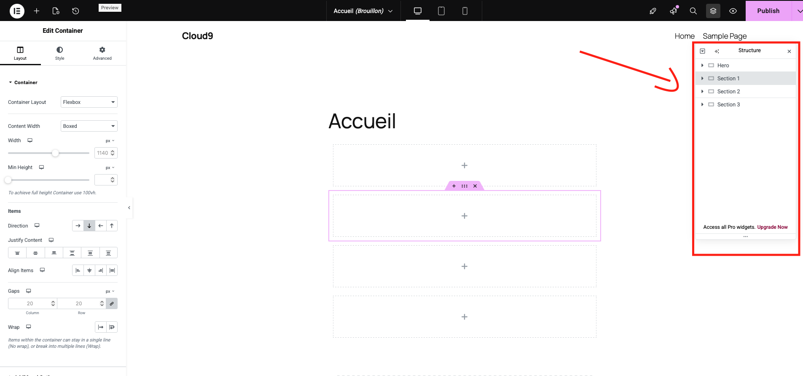{data-zoom-image}

Le panneau Structure permet de voir l’organisation de tous les conteneurs et éléments.

**On peut :**

* déplacer un conteneur
* ajouter un conteneur (ex. structure 2 colonnes)
* supprimer un élément
* annuler une action avec l’historique.

## 2. Ajouter et modifier des éléments

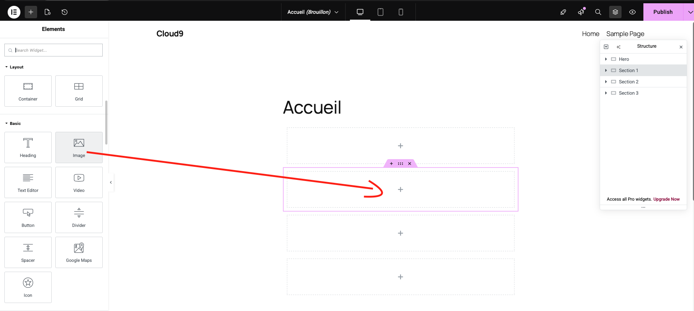{data-zoom-image}

**Dans Elementor on peut glisser-déposer des widgets :**

* Titre
* Texte
* Bouton
* Image

**Chaque élément possède trois onglets de réglages :**

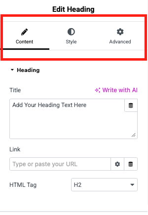{data-zoom-image}

* **Contenu** – modifier le texte, lien, icône, etc.
* **Style** – typographie, couleur, alignement, ombre, etc.
* **Avancé** – marges, espacement, effets.

## 3. Personnalisation du texte

**On peut modifier :**

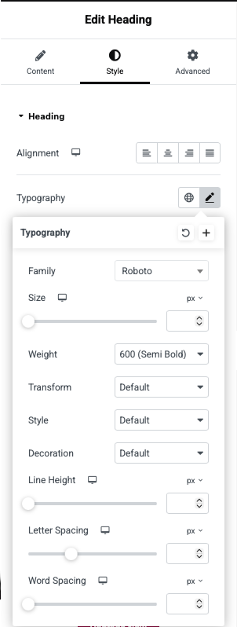{data-zoom-image}

* le contenu du texte
* la police
* la taille
* la couleur
* l’espacement des lettres et lignes
* les effets (ombre, contour).

**Les couleurs peuvent provenir :**

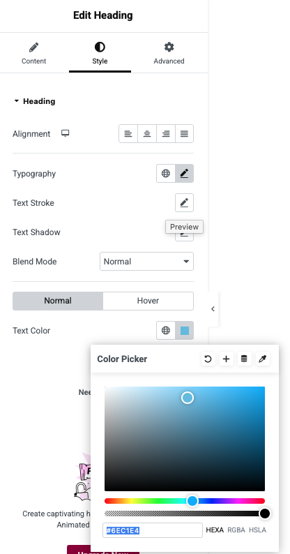{data-zoom-image}

* d’un code hexadécimal
* des couleurs globales du thème.

## 4. Personnalisation des boutons

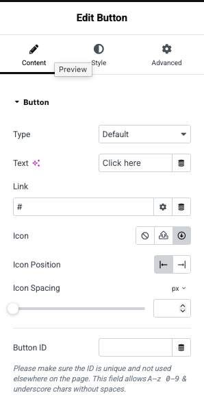{data-zoom-image}

**Les boutons peuvent être configurés pour :**

* rediriger vers une page (ex. contact)
* afficher une icône

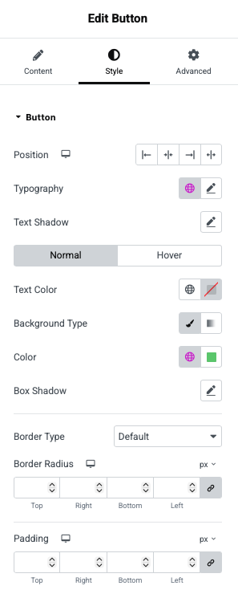{data-zoom-image}

* **modifier :**

  * la couleur
* la typographie
* les coins arrondis
* les ombres
* les effets au survol (hover).

## 5. Images et arrière-plans

**Deux types d’images :**

{data-zoom-image}

### Images d’éléments (widgets image)

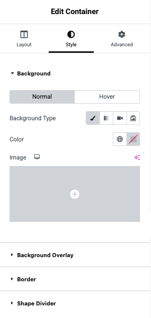{data-zoom-image}

### Images d’arrière-plan dans les conteneurs

* **Options possibles :**

  * importer une image
* régler taille, bordure, ombre
* utiliser différents arrière-plans :
* image classique
* dégradé
* vidéo
* diaporama.

On peut aussi ajouter un **overlay (calque)** pour améliorer le contraste.

## 6. Gestion de l’espacement

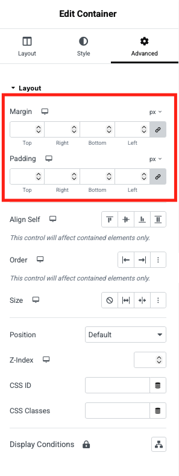{data-zoom-image}

**Trois méthodes principales :**

1. **Padding (remplissage)**
→ espace à l’intérieur d’un élément.

2. **Margin (marge)**
→ espace à l’extérieur de l’élément.

3. **Spacer widget**
→ élément qui ajoute simplement de l’espace.

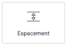{data-zoom-image}

On peut aussi ajuster la hauteur minimale d’un conteneur.

##### Mise en page (layout)

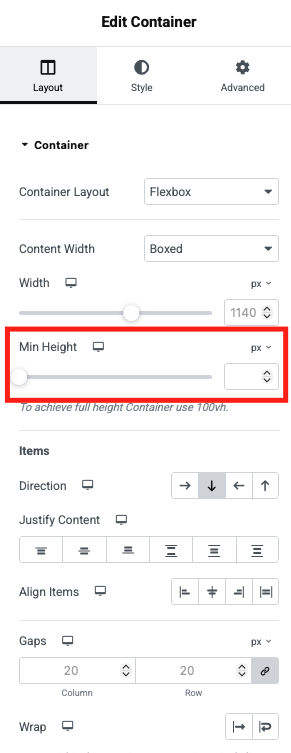{data-zoom-image}

## 7. Elementor permet d’utiliser deux systèmes :

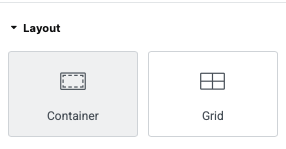{data-zoom-image}

**Flexbox**

* simple
* lignes ou colonnes
* idéal pour la plupart des mises en page.

**Grid**

* plus complexe
* pour galeries ou layouts avancés.
* Exemple : créer 3 colonnes avec images + texte.

Ces réglages s’appliquent à tout le site.

## 8. Optimisation mobile

{data-zoom-image}

Elementor permet de voir la page en :

* desktop
* tablette
* mobile

**On peut :**

* changer la taille des textes sur mobile
* ajuster les marges
* cacher certaines sections sur mobile.

## 9. Ajouter de nouvelles pages

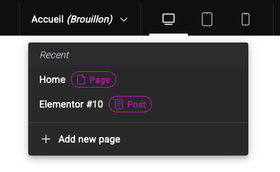{data-zoom-image}

**Pour créer une page :**

* Ajouter une nouvelle page dans Elementor.
* Publier la page.

Ajouter la page au menu WordPress (Apparence → Menus).

## Paramètres de la page

{data-zoom-image}

### Principaux paramètres de Page Settings
##### 1. Layout (Mise en page)

Contrôle la structure générale de la page.

**Options fréquentes :**

* Default → utilise le thème WordPress.
* Elementor Full Width → pleine largeur mais avec le header et footer.
* Elementor Canvas → page vide sans header ni footer (utile pour landing page).

**Autres réglages :**

* Content Width → largeur maximale du contenu
* Widgets Space → espace entre les widgets.

##### 2. Style

Permet de définir le style global de la page.

**Exemples :**

* Background → couleur ou image d’arrière-plan
* Background overlay
* Typography globale
* Couleurs de texte

Ces réglages s’appliquent à toute la page.

##### 3. Advanced

**Options avancées :**

* Margin / Padding de la page
* Custom CSS (version pro)
* Responsive settings
* Motion effects

##### 4. Page Title

**Permet de :**

* afficher ou cacher le titre de la page.

Souvent utilisé quand Elementor crée un header personnalisé.

##### 5. Featured Image

Permet de définir l’image à la une de la page.

**Elle peut être utilisée par :**

* le thème
* les articles de blog
* les réseaux sociaux.

## ✅ Idée principale :
Elementor permet de créer un site WordPress visuellement en utilisant des conteneurs, widgets, styles, espacements et modèles, tout en optimisant la mise en page pour desktop et mobile.

## Extensions Elementor

### Unlimited Elements For Elementor

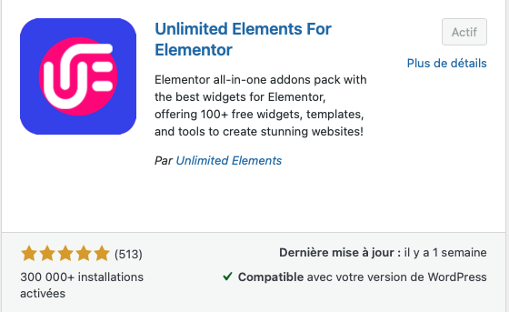{data-zoom-image}

### Custom CSS for Elementor

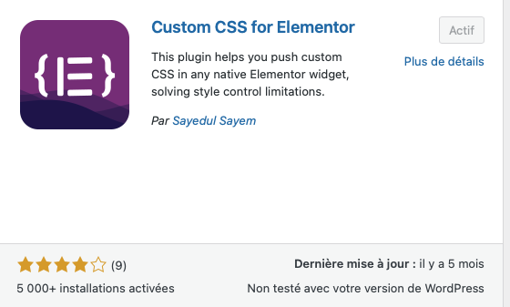{data-zoom-image}

## Exercice : Elementor

  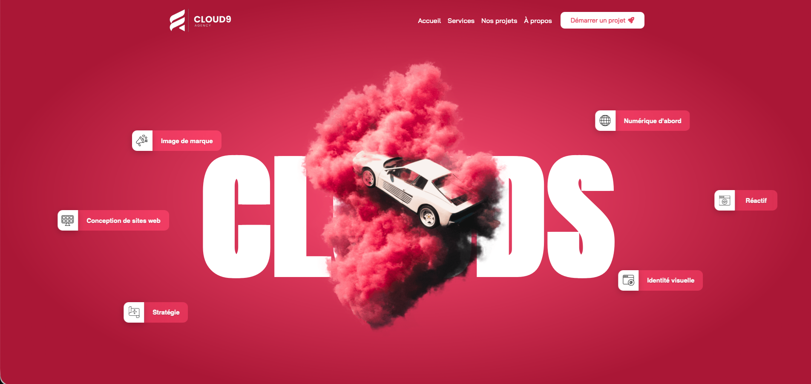

  <small>Exercice - Elementor</small> 
  **[Cloud9](./exercices/cloud9.md){.stretched-link .back}**

