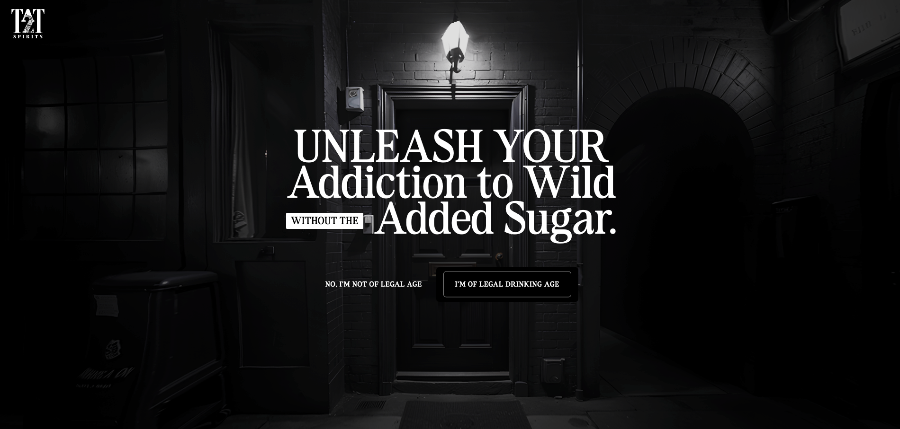
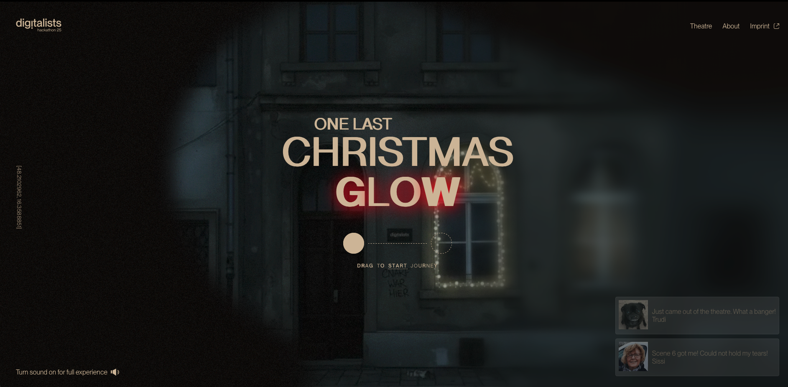
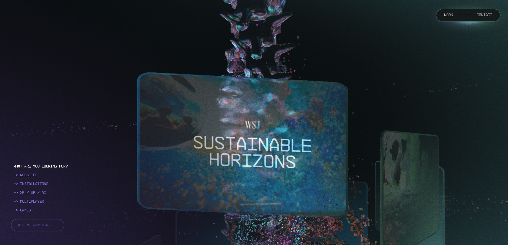
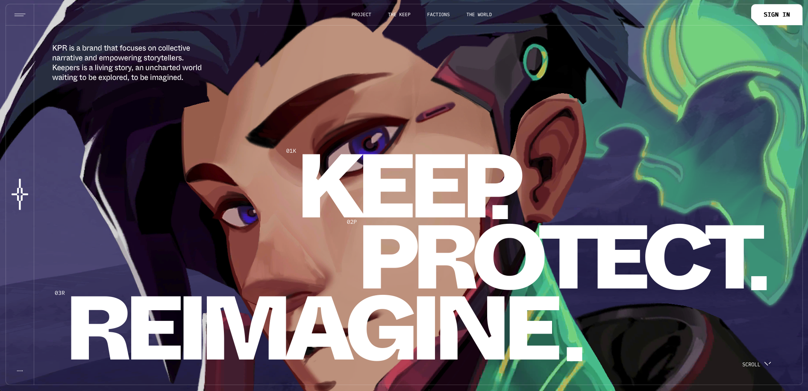
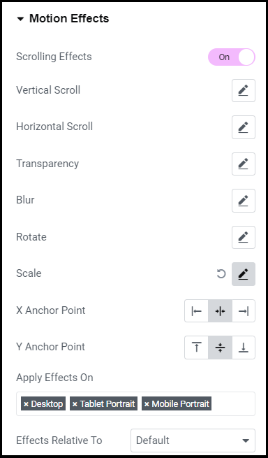
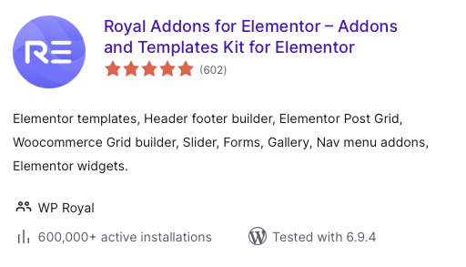
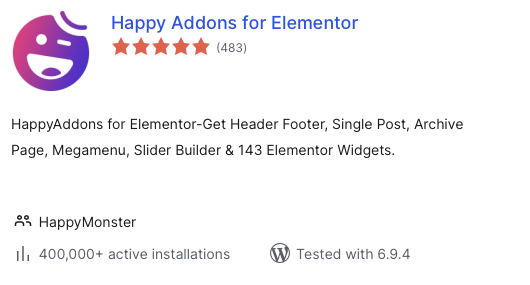
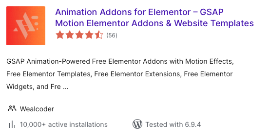

# Parallaxe

### Exemples de site avec parallaxe

[TaT2](https://tat2spirits.com)

{data-zoom-image}

[Glow Digitalists](https://glow.digitalists.at)

{data-zoom-image}

[Active Theory](https://activetheory.net)

{data-zoom-image}

[KPR Verse](https://kprverse.com)

{data-zoom-image}

[Manayer Bamate](https://manayerbamate.com)

{data-zoom-image}

## 7 principaux types d'effets

1. **Défilement vertical parallaxé :** lorsque vous faites défiler la page vers le bas, l’arrière-plan se déplace à une vitesse différente de celle du premier plan. 

  * Cela crée une impression de profondeur, idéale pour les images ou les sections d’arrière-plan.

1. **Défilement horizontal parallaxe :** Similaire au défilement vertical, mais le mouvement s’effectue horizontalement. 

  * Utilisez cette technique pour les images ou les diaporamas qui se déplacent lorsque vous naviguez sur le site.

1. **Parallaxe à la souris :** les éléments s’animent en fonction des mouvements de votre souris, créant une expérience interactive. 
  * Idéal pour les en-têtes de pages ou les pages d’accueil afin de capter l’attention.

1. **Parallaxe du premier plan et de l'arrière-plan :** Plusieurs calques (premier plan et arrière-plan) se déplacent à des vitesses différentes, créant un effet de parallaxe plus complexe.

1. **Parallaxe 2D/3D :** simulez un effet 3D en faisant bouger les calques dans différentes directions et à différentes vitesses. 
  * Idéal pour les portfolios ou les sites de jeux vidéo où l’impact visuel est primordial.

1. **Parallaxe vidéo :** Modifiez la vitesse des vidéos d’arrière-plan ou maintenez-les fixes lors du défilement du contenu. 
  * Cela ajoute du dynamisme à l’arrière-plan, idéal pour raconter des histoires ou présenter des produits.

1. **Effet de parallaxe avec CSS :** Le CSS personnalisé permet de créer des effets de parallaxe flexibles, offrant ainsi un contrôle accru. 

  * Si vous êtes développeur, c’est une excellente façon d’implémenter la parallaxe sans avoir recours à des plugins.

## Elementor PRO

##### Scrolling Effect

{data-zoom-image}

## Créez des effets de parallaxe avec Elementor

{data-zoom-image}

{data-zoom-image}

## Animations

{data-zoom-image}

## Exercice : AI-MAX

  

  <small>Exercice - Site Web</small> 
  **[AI-MAX](./exercices/ai-max.md){.stretched-link .back}**

