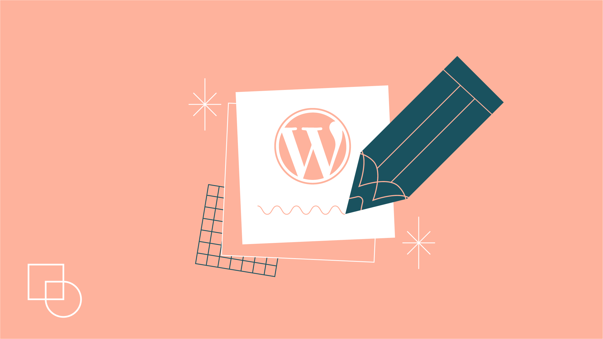
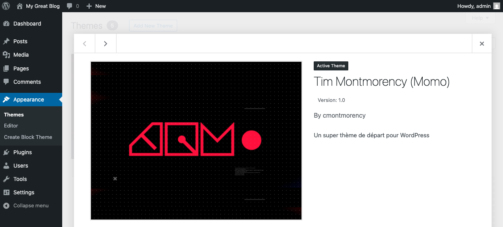
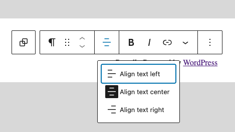

# Cours 9

*[FSE]: Full Site Editing

## Retour sur l'examen

<https://exam.tim-momo.com/preview/>

## Thème FSE personnalisé



Minimalement, un thème WordPress FSE (Block Based Themes) doit avoir la structure de fichiers suivante :

```txt
wp-content/themes/
└── tim_momo/
    ├── parts/
    │   ├── header.html
    │   └── footer.html
    ├── templates/
    │   ├── single.html (facultatif)
    │   └── index.html
    ├── theme.json
    ├── screenshot.png (facultatif)
    ├── functions.php (facultatif, mais important)
    └── style.css
```

### Dossier du thème

Dans le dossier `wp-content/themes/`, créer un dossier pour le nouveau thème, par exemple :

``` text
wp-content/themes/tim_momo/
```

### Fichier `style.css`

Un fichier `style.css` doit être ajouté à la racine du thème.

Même s’il n’est pas utilisé (on verra pourquoi plus tard), ce fichier est requis pour que WordPress reconnaisse le thème.

```css title="Exemple de style.css"
/*
Theme Name: Tim Montmorency (Momo)
Author: cmontmorency
Description: Un super thème de départ pour WordPress
Requires at least: 6.7
Version: 1.0
*/
```

{ data-zoom-image }

On peut ajouter plusieurs autres informations dans le commentaire CSS de ce fichier. Pour voir d'autres possibilités, consultez le fichier `style.css` d'autres thèmes ou encore mieux, la [documentation sur le fichier `style.css`](https://developer.wordpress.org/themes/basics/main-stylesheet-style-css/).

### Fichier theme.json

[Un fichier `theme.json`](https://developer.wordpress.org/block-editor/how-to-guides/curating-the-editor-experience/theme-json/) doit être ajouté à la racine du thème.

Il permet de contrôler le style global et la configuration des blocs. Beaucoup de configurations peuvent être spécifiées dans ce fichier. Je vous recommande fortement de consulter la [documentation sur le fichier `theme.json`](https://developer.wordpress.org/themes/global-settings-and-styles/) pour en savoir plus.

```json title="Exemple de theme.json"
{
  "$schema": "https://schemas.wp.org/wp/6.7/theme.json",
  "settings": {
    "appearanceTools": true,
    "useRootPaddingAwareAlignments": true,
    "layout": {
      "contentSize": "620px",
      "wideSize": "1000px"
    },
    "spacing": {
      "units": ["%", "px", "em", "rem", "vh", "vw"]
    },
    "typography": {
      "fontFamilies": [
        {
          "fontFamily": "-apple-system, BlinkMacSystemFont, 'Segoe UI', Roboto, Oxygen-Sans, Ubuntu, Cantarell, 'Helvetica Neue', sans-serif",
          "name": "System Font",
          "slug": "system-font"
        }
      ]
    }
  },
  "templateParts": [
    {
      "area": "header",
      "name": "header"
    },
    {
      "area": "footer",
      "name": "footer"
    }
  ],
  "version": 3
}
```

Quelques explications :

* `"$schema"` : Ça sert surtout à VS Code pour aider avec l’autocomplétion et la validation du fichier.
* `settings` : Cette section contrôle les options disponibles dans l’éditeur et les styles par défaut.
* `templateParts` : Définit des régions récurrentes du thème. Par exemple, l'entête, le pied de page, la colonne de gauche, etc. Ce sont les éléments entourés d’un encadré mauve/violet 🟪 dans l'interface d'édition du site !

### Système de commentaires HTML

Si vous regardez dans les fichiers `.html` d'un thème, vous verrez que Wordpress utilise des commentaires HTML spéciaux.

Ces commentaires commençant toujours par `<!-- wp:` et ils ne sont pas de nature explicatives. En vérité, ce sont des [instructions pour l’éditeur de blocs](https://developer.wordpress.org/block-editor/reference-guides/core-blocks/) Gutemberg !

En gros, les commentaires disent à Gutemberg :

> « Voici un bloc que j'aimerais rendre éditable par l'utilisateur dans l'interface d'administration. »

Voici un exemple :

```html
<!-- wp:paragraph {"align":"center"} -->
<p class="has-text-align-center">Proudly Powered by <a href="https://wordpress.org" rel="nofollow">WordPress</a></p>
<!-- /wp:paragraph -->
```

{ data-zoom-image }

Pour en apprendre plus sur ce genre de syntaxe, il est souvent plus simple d'étudier ce que les autres thèmes FSE font.

### Entête et pied de page

Si dans notre modèle, on veut ajouter l'entête du site et le pied de page du site, on ajoute les commentaires suivants :

```html
<!-- wp:template-part {"slug":"header","tagName":"header"} /-->
<!-- wp:template-part {"slug":"footer","tagName":"footer"} /-->
```

L'option `slug` est le `name` du templateParts et doit correspondre au fichier html. Ex: `footer.html`.

L'option `tagName` est la balise html utilisée autour du contenu du template part.

#### Exemple de template index.html

```html
<!-- wp:group {"layout":{"inherit":"true"}} -->
<div class="wp-block-group">
	<!-- wp:group {"align":"full","layout":{"type":"flex","justifyContent":"space-between"},"style":{"spacing":{"padding":{"bottom":"30px","top":"30px"}}}} -->
	<div class="wp-block-group alignfull" style="padding-bottom:30px;padding-top:30px">

		<!-- wp:group {"layout":{"type":"flex"}} -->
		<div class="wp-block-group">
			<!-- wp:site-logo {"width":64} /-->

			<!-- wp:group -->
			<div class="wp-block-group">
				<!-- wp:site-title /-->
				<!-- wp:site-tagline /-->
			</div>
			<!-- /wp:group -->
		</div>
		<!-- /wp:group -->

		<!-- wp:navigation {"layout":{"type":"flex","setCascadingProperties":true,"justifyContent":"right","orientation":"horizontal"},"style":{"spacing":{"margin":{"top":"0"}}}} /-->

	</div>
	<!-- /wp:group -->

</div>
<!-- /wp:group -->

<!-- wp:spacer {"height":50} -->
<div style="height:50px" aria-hidden="true" class="wp-block-spacer"></div>
<!-- /wp:spacer -->
```

### Modèles

Le dossier `templates` contient les modèles de page.

Il en existe plusieurs. Voici un liste non exhaustive :

| Fichier                   | Utilisé pour…                                                |
|---------------------------|--------------------------------------------------------------|
| `index.html`              | Template par défaut (minimum requis)                         |
| `single.html`             | Un article de blog individuel (`post`)                       |
| `page.html`               | Une page WordPress (`page`)                                  |
| `archive.html`            | Une archive générique (catégorie, étiquette, auteur, etc.)   |
| `404.html`                | Page d’erreur 404                                            |
| `search.html`             | Résultats de recherche                                       |
| `home.html`               | Page des articles du blog (si page d’accueil = statique)     |

Diagramme sur la [hiérarchie des modèles de page](https://developer.wordpress.org/themes/basics/template-hierarchy/) en Wordpress.

{ data-zoom-image }

## Générer un thème

Il existe des outils très faciles à utiliser pour générer des thèmes personnalisés :

* <https://fullsiteediting.com/block-theme-generator/>
* <https://wordpress.org/plugins/create-block-theme/>

### Scripts et CSS

Pour charger des scripts JavaScript ou des feuilles de style CSS, on peut le faire dans le fichier `functions.php` de notre thème.

Par exemple si on veut inclure Bootstrap 5 dans notre projet, voici le bout de code à ajouter.

```php title="functions.php"
<?php
// ...
// @todo: Changer tim_momo par le nom de votre thème
function tim_momo_enqueue_bootstrap() {
    wp_enqueue_style('bootstrap-css', 'https://cdn.jsdelivr.net/npm/bootstrap@5.3.0/dist/css/bootstrap.min.css', [], 5.3.0);
    wp_enqueue_script('bootstrap-js', 'https://cdn.jsdelivr.net/npm/bootstrap@5.3.0/dist/js/bootstrap.bundle.min.js', [], 5.3.0, true);
}

// @todo: Changer tim_momo par le nom de votre thème
add_action('wp_enqueue_scripts', 'tim_momo_enqueue_bootstrap');
```

Pour tout ce qui est personnalisé, c'est la même méthode.

```php title="functions.php"
<?php
// ...
// @todo: Changer tim_momo par le nom de votre thème
function tim_momo_enqueue_assets() {
    wp_enqueue_style( 'mon_css_custom', get_template_directory_uri() . '/assets/css/salut.css' );
    wp_enqueue_script( 'mon_script_custom', get_template_directory_uri() . '/assets/js/bonjour.js', [], '1.0', true );
}

// @todo: Changer tim_momo par le nom de votre thème
add_action( 'wp_enqueue_scripts', 'tim_momo_enqueue_assets' );
```

#### Chargement dans l'administration

Si on ajoute pas ceci, les styles ne seront pas visibles lorsqu'on les modifie.

```php title="functions.php"
<?php
// ...
function tim_momo_editor_styles() {
    add_editor_style( 'https://cdn.jsdelivr.net/npm/bootstrap@5.3.0/dist/css/bootstrap.min.css' );
    add_editor_style( './assets/css/styles.css' );
}
add_action( 'after_setup_theme', 'tim_momo_editor_styles' );
```

## Devoir

<div class="grid grid-1-2" markdown>
  

  <small>Devoir - Wordpress</small><br>
  **[One more time](./devoirs/wp-custom-theme.md){.stretched-link .back}**
</div>

[STOP]

#### version

La version du schéma JSON utilisé.
À partir de WP 6.1+, c’est souvent version: 2 ou 3.
Tu peux l’ignorer en général, WordPress se débrouille selon sa version.

Template (area) : https://www.w3schools.com/html/html5_semantic_elements.asp

## Références

https://webdevstudios.com/2022/07/05/create-fse-theme/
https://elpuas.com/blog/let-s-create-an-fse-theme/
https://www.wpzoom.com/blog/how-to-create-wordpress-theme/

https://github.com/carolinan/fullsiteediting/tree/course/Starter%20themes
https://fullsiteediting.com/
https://fullsiteediting.com/block-theme-generator/

https://wordpress.org/plugins/create-block-theme/

https://developer.wordpress.org/block-editor/reference-guides/block-api/block-edit-save/
https://developer.wordpress.org/block-editor/reference-guides/core-blocks/

https://tim-momo.com/devoir01/

https://exam.tim-momo.com/preview/
@Dv3ntur3T!m3#2025
