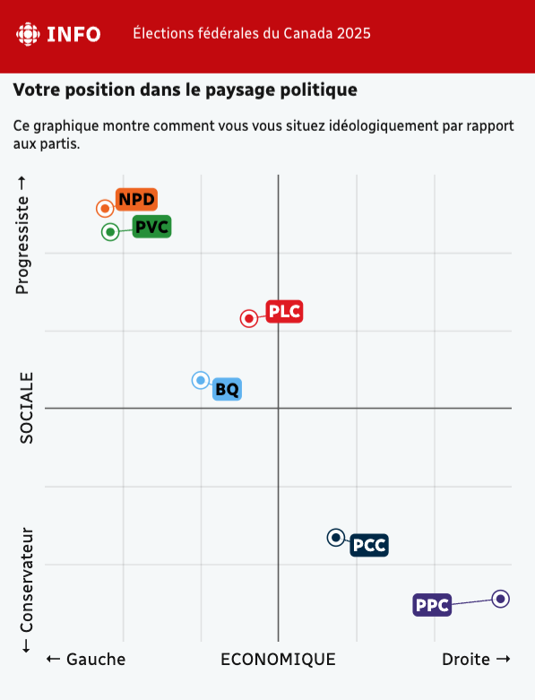
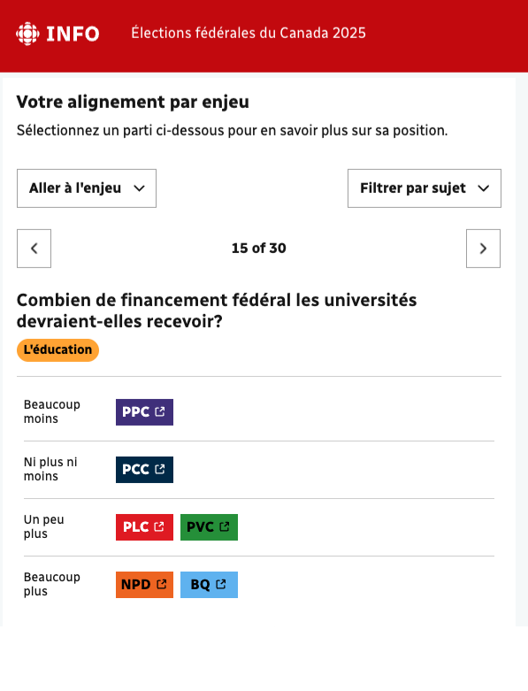
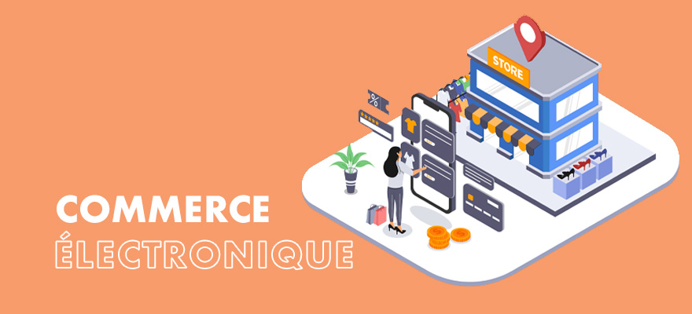
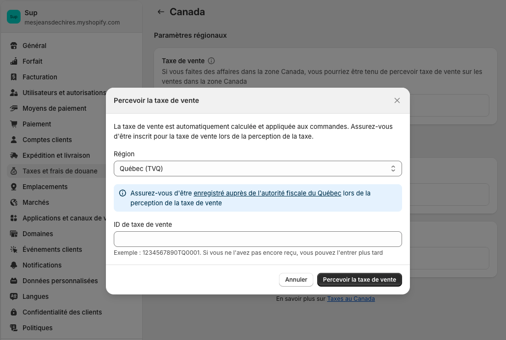
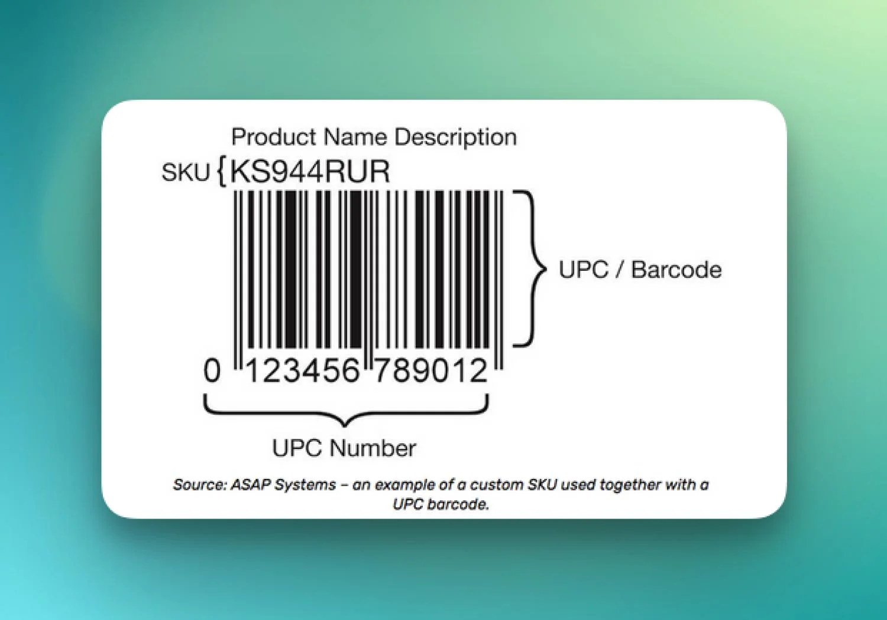
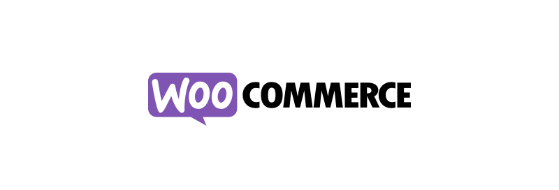
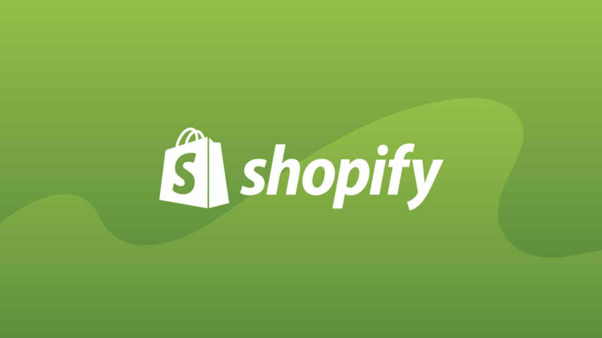

# Cours 10

## Élections fédérales du Canada 2025

Lundi 28 avril 2025

Vous devriez recevoir votre carte d’information de l’électeur d’ici le 22 avril.

{ data-zoom-image }

Si vous n'avez pas reçu de carte d'information de l'électeur ou si elle contient des erreurs : <https://ereg.elections.ca/fr/ereg/index>

### La Boussole électorale


La Boussole électorale est un outil développé par des politologues pour vous aider à comparer vos opinions avec celles des partis.

<div class="grid" markdown>
{ data-zoom-image }

{ data-zoom-image }
</div>

[boussole.radio-canada.ca](https://boussole.radio-canada.ca/){ .md-button .md-button--primary }

[Pourquoi cette élection est cruciale pour les jeunes ?](https://ici.radio-canada.ca/info/videos/1-10332551/pourquoi-cette-election-est-cruciale-pour-jeunes)

## Commerce électronique



Vendre en ligne au Québec implique de respecter plusieurs [**obligations légales et fiscales**](https://www.latactik.com/etapes-creation-boutique-ecommerce-canada) pour assurer la conformité de votre entreprise.

### Obligations fiscales


Au Québec, si vous réalisez **plus de 30 000 $ de revenus** sur une période de **quatre trimestres consécutifs**, vous êtes [**tenu de facturer la TPS (5 %) et la TVQ (9.975 %)**](https://www.revenuquebec.ca/fr/entreprises/taxes/tpstvh-et-tvq/inscription-aux-fichiers-de-la-tps-et-de-la-tvq/) sur vos ventes, puis de les remettre au gouvernement.

Même si vos revenus sont inférieurs à 30 000 $, vous pouvez **choisir de vous inscrire volontairement**, mais ça rend peut-être vos produits **moins compétitifs**.

⚠️ **Important** : Si vous facturez les taxes, vous devez **obligatoirement** les remettre. Les conserver serait une **infraction fiscale**.

### Tenue de registres

Il est essentiel de tenir des **registres clairs et complets** de vos revenus et dépenses. Cela permet aux autorités fiscales de vérifier vos déclarations.

Les plateformes comme Shopify, Stripe ou PayPal peuvent faciliter le suivi, mais il est conseillé de :

- faire des **sauvegardes régulières**,
- conserver des **preuves de transaction** (factures, reçus, etc.),
- garder une trace aussi de vos **dépenses d’entreprise** (matières premières, équipement, pub, etc.).

### Les acomptes provisionnels

Lorsque vous vendez régulièrement des produits ou services — que ce soit comme **travailleur autonome** ou dans le cadre d’une **société en nom collectif** — vous pourriez devoir faire des **acomptes provisionnels**[^provi].

- Requis si votre impôt net à payer dépasse [**1 800 $**](https://www.revenuquebec.ca/fr/citoyens/declaration-de-revenus/payer-ou-etre-rembourse/acomptes-provisionnels/).
- Généralement versés **chaque trimestre** (mars, juin, septembre, décembre).
- Ils remplacent la retenue à la source normalement prélevée par un employeur.

> 💡 En bas de 1 800 $, le gouvernement considère que l’impôt est « raisonnable » à payer en une fois. Au-delà, il préfère que vous payiez au fur et à mesure, pour éviter les mauvaises surprises.

#### Exemple 1

| Description                    | Montant          |
|--------------------------------|------------------|
| Revenu brut                    | 12 000 $         |
| Dépenses d'entreprise          | – 2 000 $        |
| **Revenu net imposable**       | **10 000 $**     |
| Impôt estimé (QC + fédéral)    | ~1 300 à 1 500 $ |

**Résultat** : L’impôt estimé est **inférieur à 1 800 $** = **pas besoin d’acomptes provisionnels.**

#### Exemple 2

| Description                    | Montant          |
|--------------------------------|------------------|
| Revenu brut                    | 20 000 $         |
| Dépenses d'entreprise          | – 3 000 $        |
| **Revenu net imposable**       | **17 000 $**     |
| Impôt estimé (QC + fédéral)    | ~2 300 à 2 600 $ |

**Résultat** : L’impôt estimé est **supérieur à 1 800 $** = **acomptes provisionnels requis.**

### Faut-il créer une compagnie pour vendre en ligne ?

Non, pas nécessairement.

Vous pouvez vendre en tant que **travailleur autonome**, sans constituer une société.

Cependant, si vous exploitez une activité commerciale **de façon régulière** (boutique en ligne, marchés, Etsy, etc.), vous devez vous **inscrire au Registre des entreprises du Québec**.

[Accéder au Registre des entreprises du Québec](https://www.quebec.ca/entreprises-et-travailleurs-autonomes/obtenir-renseignements-entreprise/recherche-registre-entreprises/acceder-registre-entreprises)

## Shopify


**Shopify** est une plateforme tout-en-un qui permet de créer facilement une boutique en ligne **sans avoir à gérer l’hébergement**.

- [Coût d’un site e-commerce Shopify en 2025](https://www.shopify.com/blog/ecommerce-website-cost)
- [▶ Chaîne YouTube | Learn With Shopify](https://www.youtube.com/@learnwithshopify)

### Plans tarifaires de Shopify

Tous les plans incluent un **essai gratuit de 3 jours**. Ça va nous être utile ;)

| Plan Shopify          | Frais de transaction Shopify | Frais de carte (Shopify Payments)      | Frais totaux approx. | Remarques                                          |
|-----------------------|------------------------------|----------------------------------------|----------------------|----------------------------------------------------|
| **Starter**           | **5 %**                      | Inclus dans les 5 %                    | **5 %**              | Pas de boutique complète, vente via lien ou réseaux sociaux |
| **Basic**             | **0 %**                      | 2,8 % + 0,30 $ CAD (en ligne)          | ~2,8–3,5 %           | Boutique complète, moins de frais                  |
| **Basic** (avec Stripe ou PayPal) | **2 %**          | Stripe : ~2,9 % + 0,30 $               | ~5 %                 | Utiliser Shopify Payments évite ces 2 %            |
| **Shopify (Standard)**| **0 %**                      | 2,7 % + 0,30 $ CAD                     | ~2,7–3,3 %           | Frais de carte un peu réduits                      |
| **Advanced**          | **0 %**                      | 2,4 % + 0,30 $ CAD                     | ~2,4–3 %             | Frais encore plus bas pour gros volume             |

💡 En utilisant **Shopify Payments**, tu évites les 2 % de frais Shopify (appliqués si tu utilises Stripe ou PayPal sur les plans Basic et +).

Le plan Starter est simple, mais **plus coûteux par vente** — idéal pour tester, pas pour long terme.

### Pourquoi une fourchette de 2,8 à 3,5 % ?

Parce que les frais varient selon le **type de carte utilisé** par le client :

| Type de carte                 | Taux appliqué                | Frais totaux              | 💰 Montant reçu sur 10 $ |
|-------------------------------|------------------------------|---------------------------|--------------------------|
| Carte canadienne (Visa/MC)    | 2,8 % + 0,30 $ CAD           | 0,28 $ + 0,30 $ = 0,58 $  | **9,42 $**               |
| Carte internationale (Visa/MC)| 3,5 % + 0,30 $ CAD           | 0,35 $ + 0,30 $ = 0,65 $  | **9,35 $**               |
| Carte American Express (Amex) | 3,5 % + 0,30 $ CAD           | 0,35 $ + 0,30 $ = 0,65 $  | **9,35 $**               |

### Pourquoi choisir d'autres plateformes de paiement ?

- Certains clients **font davantage confiance à PayPal**, surtout à l'international.
- Dans [certains pays](https://help.shopify.com/en/manual/payments/shopify-payments/supported-countries), **Shopify Payments n’est pas disponible**, donc Stripe devient une bonne alternative.

C'est un marché très compétitif, il faut bien magasiner ses affaires.

### Exemple concret

Imaginons :

- Je veux vendre un pot de fleurs affiché à **10 $ CAD**.
- Taxes applicables : **TPS (5 %) + TVQ (9.975 %) = 14.975 %**
- Le client paie par **Visa ou Mastercard (via Shopify Payments)**.

| Plan Shopify          | Frais totaux approx. | 💰 Tu reçois sur 10 $ | Remarques                                          |
|-----------------------|----------------------|------------------------|----------------------------------------------------|
| **Starter**           | **5 %**              | **9,50 $**             | Vente via lien ou réseaux sociaux, pas de boutique |
| **Basic**             | ~2,9–3,5 %           | ~**9,65–9,70 $**       | Boutique complète, pas de frais Shopify            |
| **Basic + Stripe**    | ~5 %                 | ~**9,50 $**            | Frais Stripe + 2 % Shopify                         |
| **Shopify (Standard)**| ~2,7–3,3 %           | ~**9,68–9,73 $**       | Frais réduits avec volume                          |
| **Advanced**          | ~2,4–3 %             | ~**9,70–9,76 $**       | Pour gros vendeurs, frais au minimum               |

#### Configuration des taxes



[Tuto ;)](https://youtu.be/ferhOYx1NMo?feature=shared&t=2494)

### Technicité

L'url donné par shopify est le suivant : nom-de-ta-boutique.myshopify.com

### SKU



Le [SKU](https://www.shopify.com/fr/blog/sku) (Stock Keeping Unit) est un code interne qu'on utilise pour identifier des produits.

Tu peux laisser ce champ vide si :

* Tu gères un **inventaire simple** ou artisanal (ex. : chaque pot est unique).
* Tu n’as pas besoin d’inventaire détaillé.

Tu devrais utiliser un SKU si :

* Tu as plusieurs variantes d’un même produit (tailles, couleurs, etc.).
* Tu gères un inventaire plus complexe.
* Tu veux pouvoir rechercher, filtrer ou identifier rapidement un produit.
* Tu utilises un logiciel externe de gestion d’inventaire ou de comptabilité.

| Produit                       | Variante     | SKU        |
|-------------------------------|--------------|------------|
| Pot de fleurs en céramique    | Bleu         | POT-CER-BL |
| Pot de fleurs en céramique    | Rouge        | POT-CER-RG |
| Pot de fleurs en céramique    | Vert         | POT-CER-VT |
| Pot suspendu en terre cuite   | Taille M     | POT-TC-MED |
| Pot suspendu en terre cuite   | Taille L     | POT-TC-LRG |
| Petit pot fait main (unique)  | —            | POT-001    |

<!-- ## WooCommerce



**WooCommerce**, en revanche, est un **plugin gratuit pour WordPress** qui transforme un site existant en boutique en ligne.
Il demande toutefois **plus de configuration** (hébergement, sécurité, mises à jour, etc.). -->

## Sous-thème FSE

Lorsqu’on souhaite développer un site à partir d’un thème FSE existant, il n’est **pas recommandé de modifier directement le thème original**.

À la place, il faut **créer un thème enfant** (ou *sous-thème*) basé sur ce thème FSE. Cela permet de **préserver vos modifications**, même si le thème parent est mis à jour ultérieurement. En effet, une mise à jour écraserait les fichiers du thème parent, mais **le thème enfant reste intact**.

Rien de plus simple à faire ! Il suffit d'utiliser le bon vieux plugin **Create Block Theme**.


Tout ce qu'il faut s'avoir c'est que dans le thème enfant, un fichier css a été généré et qu'il contient l'information `Template`. C'est la valeur de cette information qui lie l'enfant à son parent.

```css hl_lines="6"
/*
Theme Name: Kid
Requires at least: 6.7
Tested up to: 6.7
Requires PHP: 5.7
Template: twentytwentyfive
Text Domain: kid
*/
```

### Développement

Quand on développe un thème FSE, ça peut être frustrant de ne pas pouvoir tester l'enregistrement d'un template.

On peut revenir en arrière en réinitialisant le layout programmé. Pour ce faire, il faut aller dans Apparence > Editor > Templates et cliquer sur les trois points verticaux associés au template en question. Sélectionnez ensuite «Reset».


## Exercice et devoir

<div class="grid grid-1-2" markdown>
  

  <small>Exercice - Wordpress</small><br>
  **[Shopify](./exercices/shopify.md){.stretched-link .back}**
</div>

<div class="grid grid-1-2" markdown>
  

  <small>Devoir - Wordpress</small><br>
  **[One last time](./devoirs/wp-custom-theme2.md){.stretched-link .back}**
</div>
