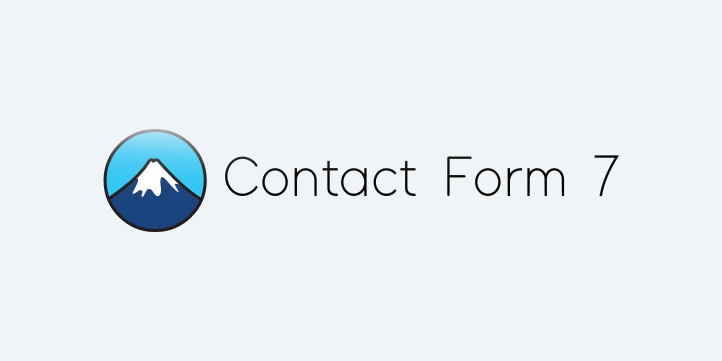{data-zoom-image}

## Contact Form 7

### 1. C’est quoi Contact Form 7 ?

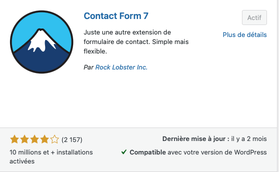{data-zoom-image}

👉 Un plugin gratuit qui permet de créer :

* formulaires de contact
* demandes de soumission
* réservations simples

✔️ léger
✔️ flexible
❌ design très basique (CSS à faire toi-même)

### ⚙️ 2. Installation

1. Va dans Extensions → Ajouter
1. Cherche : Contact Form 7
1. Installer → Activer

👉 Tu verras ensuite Contact dans le menu WordPress

### 🧱 3. Créer un formulaire

Va dans :
👉 Contact → Ajouter

Tu verras un formulaire par défaut :


    [text* your-name]
    [email* your-email]
    [textarea your-message]
    [submit "Envoyer"]

### ✏️ 4. Comprendre les champs

| Code | Signification |
| ----------- | ----------- |
| [text] |	champ texte |
| [email] |	champ email |
| [textarea] |	message |

*	obligatoire

Exemple personnalisé :

    [text* nom placeholder "Votre nom"]
    [email* email placeholder "Votre email"]
    [tel telephone placeholder "Téléphone"]
    [textarea message placeholder "Votre message"]
    [submit "Envoyer"]

### 📩 5. Configuration email (IMPORTANT)

Onglet Mail

    To: ton@email.com
    From: [nom] <[email]>
    Subject: Nouveau message site

Message :

    Nom : [nom]
    Email : [email]
    Téléphone : [telephone]

Message :

    [message]

🚨 ERREUR FRÉQUENTE

👉 Les emails n’arrivent pas ?

Solution :
➡️ Installer un plugin SMTP comme :

* WP Mail SMTP

### 🧩 6. Ajouter le formulaire sur ton site

Tu obtiens un shortcode :

    [contact-form-7 id="123" title="Contact"]

👉 Ajoute-le dans :

* une page
* un article
* un bloc shortcode

### 🎨 7. Styliser avec CSS

CF7 est très brut → tu dois styliser

Exemple :

```css
.wpcf7 input,
.wpcf7 textarea {
  width: 100%;
  padding:12px;
  margin-top: 8px;
  background: rgba(17, 17, 17, 0.05);
  border: 1px solid #e8e8e8;
  color: rgb(170, 170, 170);
  border-radius: 3px;
}

.wpcf7 input[type="submit"] {
  background: #333;
  border: none;
  cursor: pointer;
  font-size:18px;
}
```

### ⚡ 8. Ajouter des champs avancés
#### Menu déroulant
    [select service "Mariage" "Corporatif" "Gala"]
#### Checkbox
    [checkbox options "DJ" "Live Band" "Animation"]
#### Upload fichier
    [file fichier]

### 🔒 9. Anti-spam

##### Version pas extrêmement sécuritaire

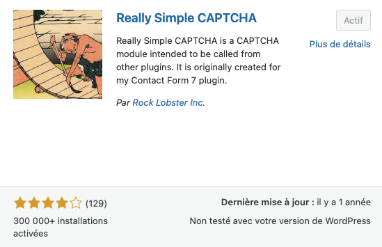{data-zoom-image}

1) Par défaut
Utiliser ce code: 

    [captchac captcha-170]
    [captchar captcha-170 4/4]

2) Petit
Utiliser ce code: 

    [captchac captcha-778 size:s fg:#ffffff bg:#000000]
    [captchar captcha-778 4/4]

3) Grand
Utiliser ce code: 

    [captchac captcha-118 size:l fg:#00ff00 bg:#ffffff]
    [captchar captcha-118 4/4]


##### Version sécuritaire

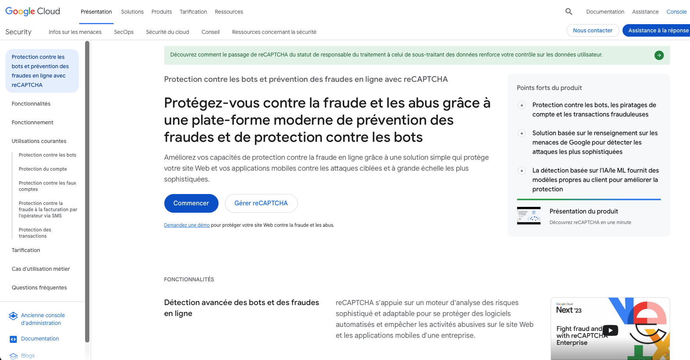{data-zoom-image}

Ajoute :

[recaptcha]

👉 Configure avec :

    Google reCAPTCHA

## CDN

Un Content Delivery Network (CDN) est un réseau de serveurs **répartis géographiquement** qui permet d’accélérer le chargement des pages en distribuant les fichiers statiques (images, CSS, JavaScript, polices, etc.) depuis un serveur proche de l’utilisateur. Par exemple : Cloudflare.

Avantages :

* Améliore les **performances**
* Optimise la **SEO**
* Réduit de la consommation de **bande passante**
* Renforce la **sécurité** :
  * Protection contre les attaques DDoS[^ddos] en répartissant le trafic sur plusieurs serveurs.
  * Certains services CDN offrent aussi une protection contre les _bots_ et les tentatives d’intrusion.

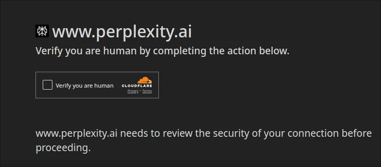{data-zoom-image}

[^ddos]: Une attaque DDoS (_Distributed Denial of Service_) est une tentative malveillante de surcharger un serveur ou un réseau en envoyant un grand nombre de requêtes simultanées depuis plusieurs sources, rendant le site ou le service inaccessible.

| Type de CDN              | Utilité principale                                           | Exemples                         |
|--------------------------|--------------------------------------------------------------|----------------------------------|
| **CDN classique**        | Héberge des fichiers **statiques** pour accélérer WordPress. | Cloudflare, BunnyCDN, StackPath |
| **CDN de bibliothèques** | Fournit des **fichiers publics** comme Bootstrap pour éviter de les stocker localement. | Google Hosted Libraries, jsDelivr, CDNJS |

!!! question "Wait what ?"

    Si Cloudflare créé des fichiers statiques de mon site WordPress, ça veut dire que ceux-ci seront dupliqués sur le nombre de serveurs que Cloudflare a dans le monde ?

    C'est fou, n'est-ce pas ?! Sachant que Cloudflare dispose d’un réseau mondial avec plus de **13 000 points d'accès**. Ça en fait des copies !

    Imaginez la quantité d’informations stockées sur ces serveurs ! C’est **astronomique**. 🌍🚀


## cPanel


Abréviation de “control panel”, cPanel est un panneau de gestion d’hébergement Web qui permet de gérer un ou plusieurs serveurs et leurs sites Web via une interface graphique.

Il existe plusieurs autres outils de gestion de serveur comme Plesk, DirectAdmin ou Webmin, mais dans le cadre du cours, nous utiliserons cPanel.

### Connexion

<!-- 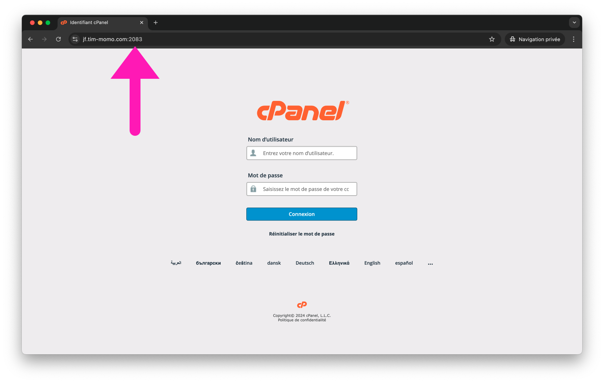{data-zoom-image} -->

#### Adresse

La connexion se fait à l'adresse suivante : **https://SOUSDOMAINE.tim-momo.com:2083**

Remplacez `SOUSDOMAINE` par les 9 caractères de votre numéro de DA.

!!! example "Exemple"

    https://202912345.tim-momo.com:2083

#### Nom d'utilisateur

Vous trouverez votre nom d'utilisateur dans une des listes ci-dessous.

<div class="grid align-items-start" markdown>

| AM |
| ----------------- |
| ounissiassil |
| siroistanguaycdr |
| cheourwalid |
| pereiracalderonp |
| lalibertolivier |
| simonnathan |
| rodriguezfontain |
| tighzanourelisle |
| crevierjonathan |
| onkoyasmine |
| ferdinandjayden |
| briandwilliam |
| driesenseanlarry |
| benmaizrada |
| lysenkoiryna |
| veilleuxamlie |
| warrenzackary |
| elfantroussiyass |
| labbharleymarlon |
| ricardemmanuel |
| bonneaulucas |

| PM |
| ----------------- |
| chahedchaima |
| fosubradley[^exception]|
| benfradjadam |
| richardnurlika |
| mullerfranoissar |
| guilbaultalexis |
| richardtyler |
| gevorgyanmariam |
| chheralexia |
| canomendozacrist |
| cruznicolas |
| lvesqueflix |
| thortjessica |
| sadkimohamedali |
| sousaluizfelippe |
| thriaultjrmy |
| vitalstanleyoliv |
| barydiouma |


</div>

[^exception]: Votre mot de passe contient un "1" avant votre numéro de téléphone

#### Mot de passe

Votre mot de passe est votre **numéro de téléphone** sur Colnet : sans tiret ni espace.

!!! example "Exemple"

    5145551234

### Tableau de bord

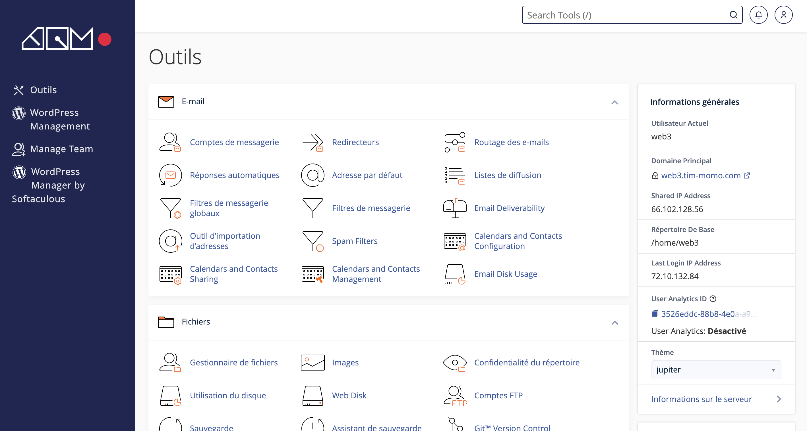{data-zoom-image}

### Informations générales et statistiques

<div class="grid align-items-start" markdown>
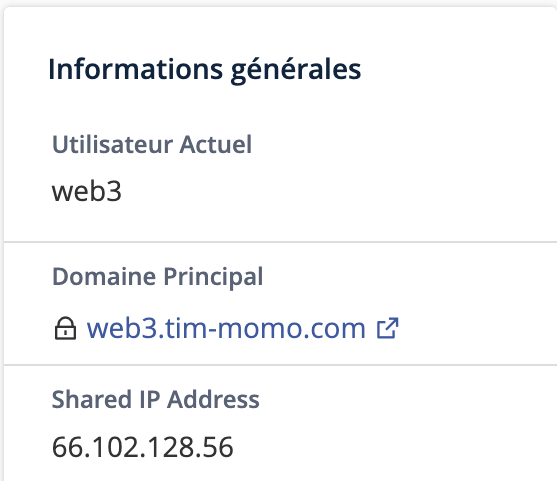{data-zoom-image}

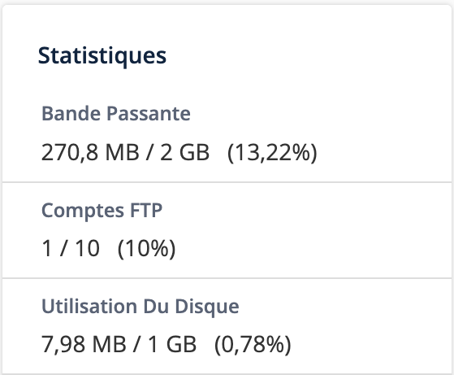{data-zoom-image}
</div>

### Changer son mot de passe

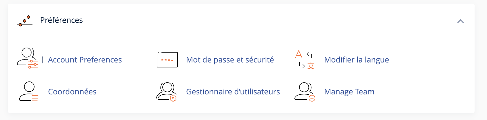

Il est fortement recommandé de changer son mot de passe pour quelque chose de plus sécuritaire.

1. Dans le tableau de bord, cliquer sur « Mot de passe et sécurité »
1. Changer le mot de passe

### Gestionnaire de fichiers

1. Dans le tableau de bord, cliquer sur « Gestionnaire de fichiers »

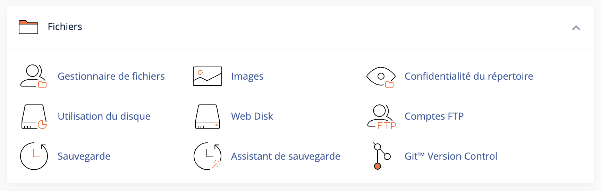{data-zoom-image}

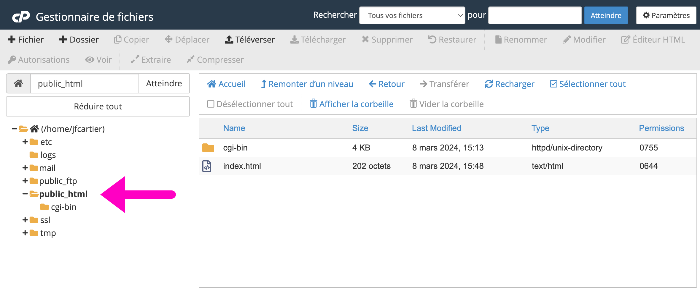{data-zoom-image}

**📁 public_html : C’est la racine Web : tout ce que vous y ajouterez sera visible sur internet**

  > Exemples :
  > - public_html/index.html : visible par `https://201234567.tim-momo.com/`
  > - public_html/tp2/index.html : visible par `https://201234567.tim-momo.com/tp2/`
  > 
  > Je recommande de faire un répertoire par projet pour le moment. Rien à la racine directement. Pour le moment ;)
  > 
  > Petit truc. Téléverser un `.zip` pour l'extraire ensuite permet de faciliter le processus.

**📁 public_ftp : Sert pour partager des fichiers via FTP anonyme.**

  > Si activé, n'importe qui pourrait télécharger son contenu via une adresse comme : `ftp://201234567.tim-momo.com`

* 📁 mail : Contient les boîtes de réception de vos courriels
* 📁 logs : contient les erreurs serveur au format compressé (ex. : 404, 500)
* 📁 ssl : stocke les certificats pour activer la notion HTTPS
* 📁 tmp : fichiers temporaires
* 📁 etc : contient des fichiers de configuration globales

!!! info "403 Forbidden"

    S'il n'y a pas de fichier index.html à la racine du dossier public_html, vous devriez logiquement voir cette page :

    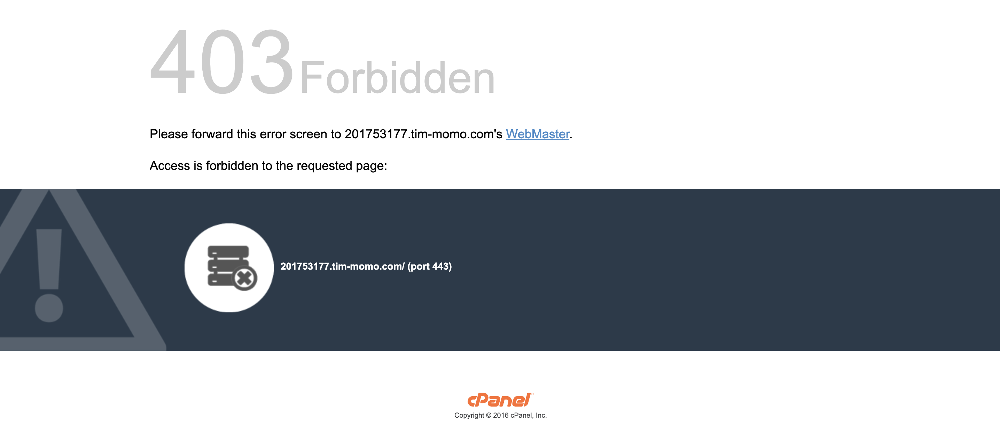

### Courriels

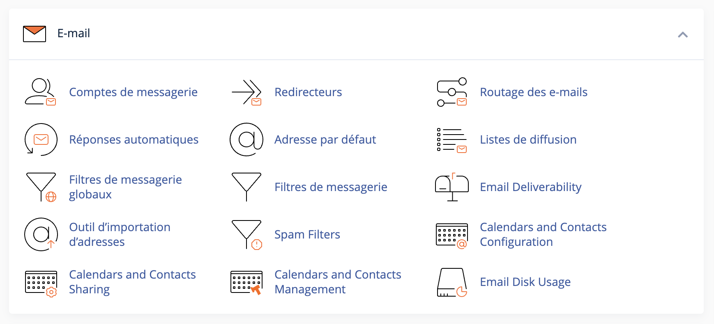

Votre cPanel vient avec une gestion de courriels, un peu comme si vous aviez votre propre Gmail.

#### Créer une boîte de courriel

1. Dans le tableau de bord, cliquer sur « Comptes de messagerie »
1. Cliquer sur « Créer »
1. Ajouter un nom d'utilisateur. Ce sera le nom de votre courriel. Par exemple : contact@201234567.tim-momo.com
1. Ajouter un mot de passe
1. Cliquer sur « Créer »

#### Boîte de courriel

1. Dans le tableau de bord, cliquer sur « Comptes de messagerie »
1. Cliquer sur « Check Email » de la boîte de courriel précédemment créée.

!!! info "Webmail"

    Si le lien ne fonctionne pas, vous y avez accès par votre url en spécifiant webmail.
    
    Ex: https://webmail.201234567.tim-momo.com/ 

1. Cliquer sur « Open »

  {.w-50}

1. Tester l'envoi et la réception d'un courriel.

## Gestion du serveur à distance avec ftp-simple


<div class="grid grid-auto" markdown>


[ftp-simple](https://marketplace.visualstudio.com/items?itemName=humy2833.ftp-simple) est une extension qui permet de travailler sur le serveur directement dans VSCode !
</div>

### Configuration

1. Dans VSCode, appuyer sur la touche ++f1++ (ou ++ctrl+shift+p++)
1. Chercher « ftp-simple »
1. Choisir l'option « ftp-simple: Config ... »

   > Cela ouvre le fichier de configuration `ftp-simple-temp.json`

1. Entrer les informations de connexion de votre cPanel :

  ```json title="Exemple"
  [
    {
      "name": "201234567.tim-momo.com",
      "host": "201234567.tim-momo.com",
      "port": 21,
      "type": "ftp",
      "username": "carmackjohn",
      "password": "5145551234",
      "path": "/public_html",
      "autosave": true,
      "confirm": true
    }
  ]
  ```
1. Sauvegarder et fermer le fichier de configuration.

### Ouvrir une session

1. Dans VSCode, ouvrir une nouvelle fenêtre
1. Appuyer sur la touche ++f1++
1. Chercher « ftp-simple »
1. Choisir l'option « ftp-simple: Remote directory ... »
1. Choisir le site sur lequel se connecter (normalement celui configuré plus tôt)
1. Choisir le dossier à ouvrir (`. Current directory : /public_html`)

  

### Limites

1 Go d'espace de stockage TOTAL

10 bases de données

300 000 fichiers (une installation de base de WordPress tourne autour de 4 000 fichiers)

### Installer WordPress avec cPanel

!!! warning "Mot de passe"

    Prévoyez désormais un mot de passe suffisamment sécurisé pour vos sites.

    Une fois en ligne, ils seront accessibles au monde entier, incluant les robots pirates 🏴‍☠️

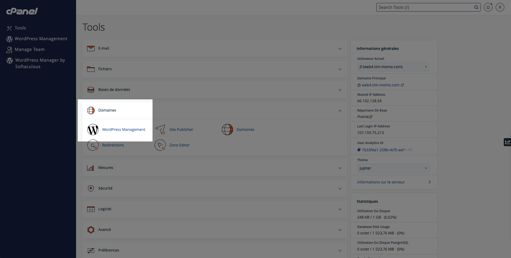{data-zoom-image}

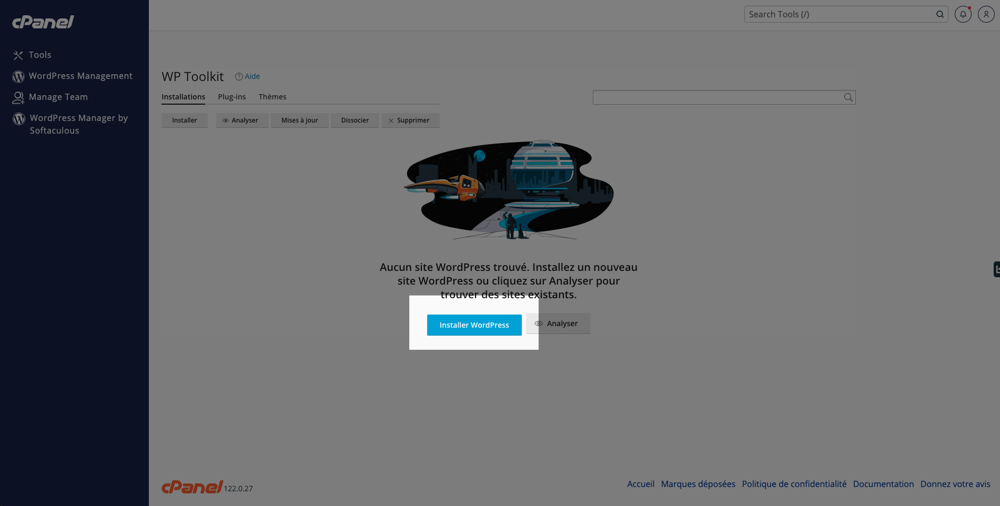{data-zoom-image}

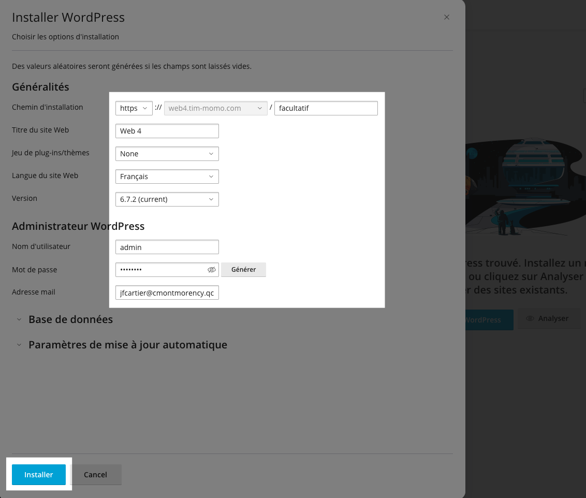{data-zoom-image}

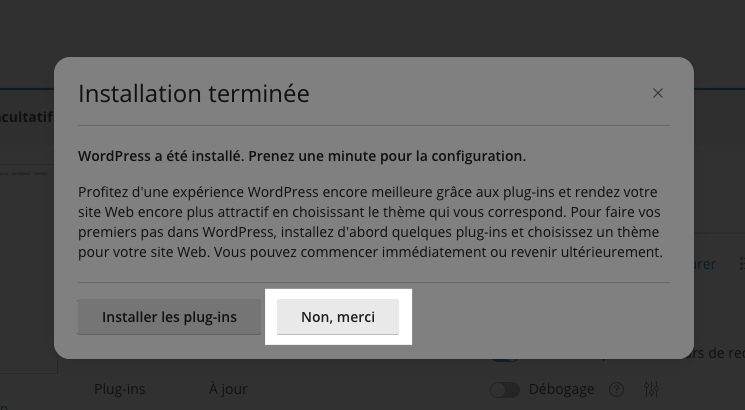{data-zoom-image}

### Importer Wordpress avec All-in-one Migration & Backup

La restauration d'un site peut prendre plusieurs minutes ⏳ (5min+) sur ce type de serveur, car les ressources attribuées à votre site par HostPapa sont limitées.

!!! info "Poids des backups"

    Attention à la limite du serveur. Les backups ont un poids à ne pas négliger dans le calcul de l'espace disque disponible.

!!! bug "Permaliens"

    Après une restauration de backup, il arrive que la configuration des URL (permaliens) soit compromise.

    Heureusement, il suffit d’aller dans `Settings > Permalinks` et d'enregistrer la page (sans rien changer) pour résoudre ce problème.

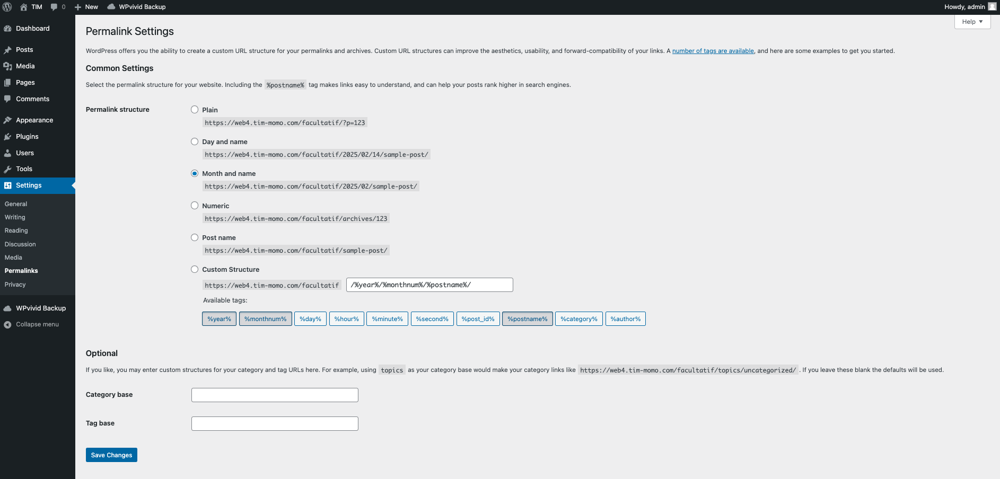{data-zoom-image}

### 🔐 Mot de passe non sécurisé

Si votre mot de passe n’est pas assez sécurisé 🦨, vous devrez le modifier.

Plutôt que de changer le mot de passe sur votre environnement local, réexporter le backup et le réimporter sur le serveur 🫠, il existe une méthode bien plus simple.

Suivez les étapes suivantes :

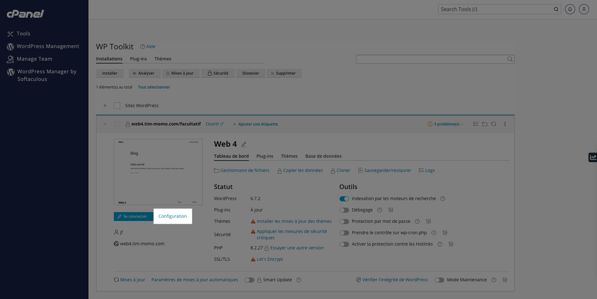{data-zoom-image}

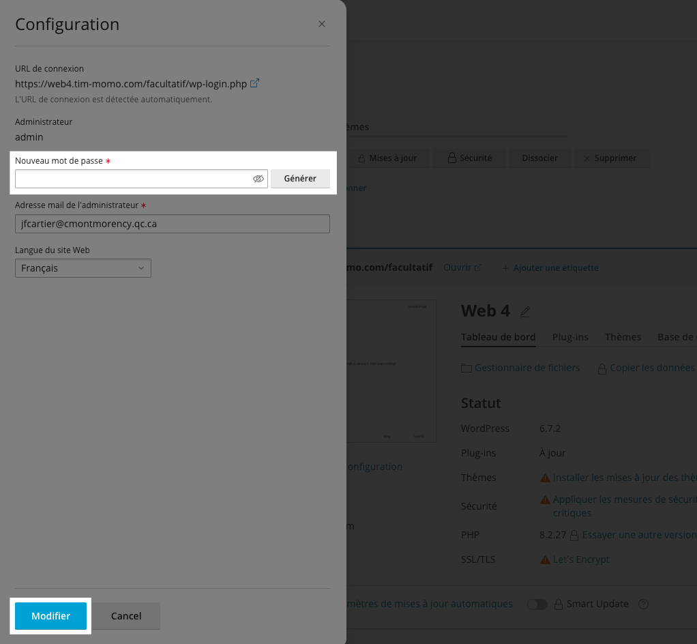{data-zoom-image}
