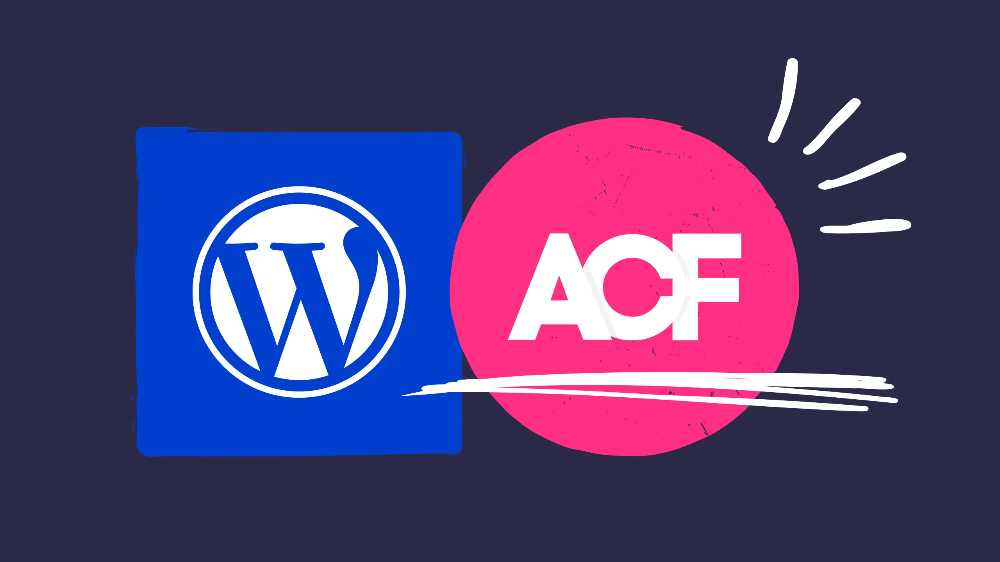

# Cours 11

## Démo en classe

### Query Loop

Fonctionnalité de base de WordPress. Query loop sert à afficher des contenus dynamiquement. Par exemple, une liste d'articles.

### Loco Translate

**[Loco Translate](https://en-ca.wordpress.org/plugins/loco-translate/)** : Permet de traduire les chaines de caractères non traduites.

### Simple Local Avatars

**[Simple Local Avatars](https://en-ca.wordpress.org/plugins/simple-local-avatars/)** : Permet l'ajoute d'une photo de profil.

### ACF

**[ACF - Advanced Custom Fields](https://en-ca.wordpress.org/plugins/advanced-custom-fields/)** : Permet l'ajout de champs personnalisés.

Légère alternative : **[Custom Post Type UI](https://en-ca.wordpress.org/plugins/custom-post-type-ui/)**

### WooCommerce

**[WooCommerce](https://en-ca.wordpress.org/plugins/woocommerce/)** : Boutique en ligne façon WordPress 🤯

## Devoir

  

  <small>Travail pratique - Wordpress</small> 
  **[TP](./tp/index.md){.stretched-link .back}**

