### RGPD

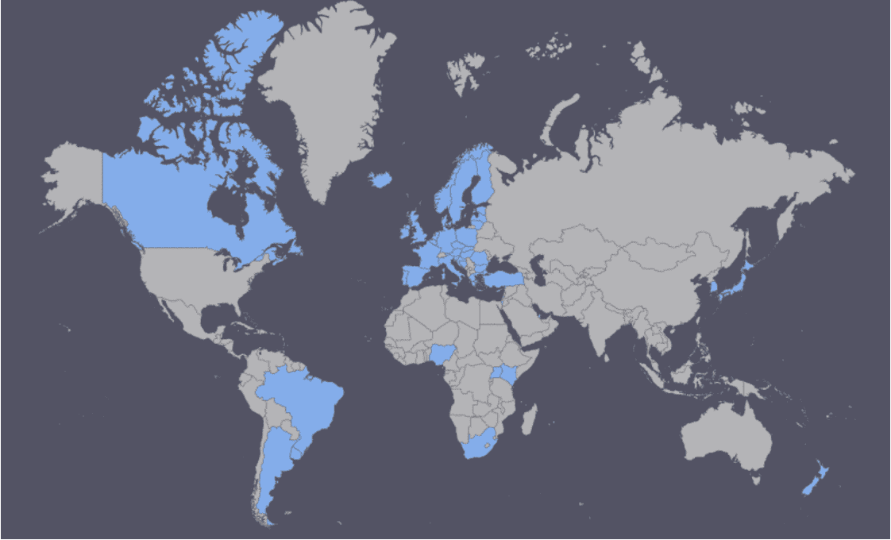{.w-100}

Le RGPD (Règlement Général sur la Protection des Données) est une loi européenne entrée en vigueur en **2018**, visant à renforcer la protection des données personnelles des citoyens de l’UE.

* **Consentement explicite** : Les utilisateurs doivent donner un accord clair avant la collecte de leurs données.
* **Droit d’accès et de suppression** : Toute personne peut demander l’accès ou la suppression de ses données.
* **Portabilité des données** : Possibilité de récupérer ses données et de les transférer à un autre service.
* **Sécurité des données** : Obligation pour les entreprises de protéger les informations collectées.
* **Notification des violations** : Signalement obligatoire des fuites de données dans un délai de 72 heures.

### Loi 25 | Québec

La Loi 25[^loi25a] modernise la protection des renseignements personnels au Québec et impose de nouvelles obligations aux entreprises et organisations.

[^loi25a]: https://www.cai.gouv.qc.ca/protection-renseignements-personnels/sujets-et-domaines-dinteret/principaux-changements-loi-25

* **Responsable des données** : Obligation de désigner une personne chargée de la protection des renseignements personnels.
* **Consentement clair** : Doit être explicite et bien informé avant toute collecte de données.
* **Transparence** : Politique de confidentialité claire et accessible aux utilisateurs.
* **Notification des fuites** : Obligation de signaler toute atteinte aux données à la Commission d’accès à l’information (CAI) et aux personnes concernées.
* **Droit à la portabilité** : Les utilisateurs peuvent demander une copie de leurs données dans un format structuré.
* **Droit à l'oubli** : Suppression de compte.

Depuis 2022, officialisé en 2024[^loi25b].

[^loi25b]: https://www.barreau.qc.ca/fr/nouvelle/avis-aux-membres/loi-25-vigueur-entierete/

# SEO

*[SEO]: Search Engine Optimization
*[E-E-A-T]: Experience, Expertise, Authoritativeness, and Trustworthiness
*[WCAG]: Web Content Accessibility Guidelines
*[UX]: User eXperience
*[CTA]: Call To Action
*[CTR]: ClickThrough Rate

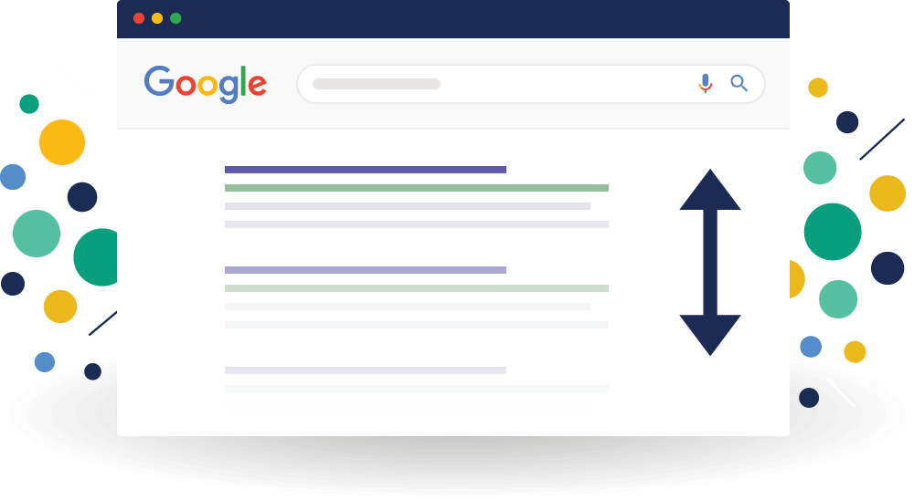

Le SEO (optimisation pour le moteur de recherche, ou Search Engine Optimization en anglais) est l'ensemble des techniques utilisées pour optimiser le positionnement d’une page web dans les moteurs de recherche, comme Google.

## Les bases du SEO

### Popularité

<div class="grid" markdown>
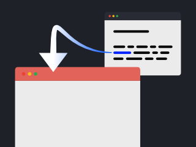

<div markdown>
La popularité se mesure par le nombre de liens (_backlinks_) qui pointent vers votre site.

> Imaginez que votre site soit recommandé par un blog populaire : c'est comme obtenir un "vote" de confiance qui aide Google à mieux vous classer.
</div>
</div>

### Pertinence

<div class="grid" markdown>
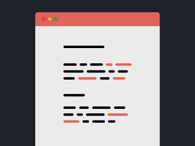

<div markdown>
La pertinence signifie que votre contenu répond exactement à **ce que recherche l'utilisateur**.

> Si quelqu'un tape "recettes de cookies faciles", un article avec des recettes pas à pas et des photos sera plus utile qu'un article sur l'histoire des cookies. C'est le principe de mot-clés.
</div>
</div>

### La qualité du contenu

<div class="grid" markdown>
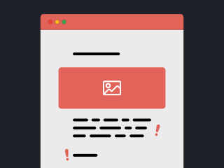

<div markdown>
Un contenu de qualité est **original**, bien **structuré** et **intéressant** pour vos visiteurs.

> Par exemple, un tutoriel sur la réparation de vélos avec des images, des vidéos et des conseils pratiques retiendra mieux l'attention qu'un simple texte sans visuels.
</div>
</div>

## L'indice E-E-A-T

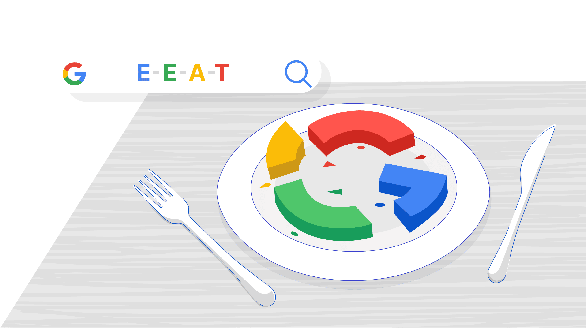

Google évalue la confiance d'un site avec l'indice **E-E-A-T** : **Expérience**, **Expertise**, **Autorité** et **Fiabilité**.

### Expérience

{ .w-50 }

L'auteur doit montrer qu'il connaît vraiment le sujet.

> Vous faites un tutoriel sur la programmation d’un site. Partagez des captures d’écran de votre code en action et parlez de vos expériences concrètes.

**🛠️ Concrètement, on peut :**

- Ajoutez des **témoignages**, des **études de cas**, des **expériences personnelles**.
- Intégrez des images ou vidéos prises par vous (ex. photos de vos projets, captures d’écran).
- Présentez-vous clairement dans une page "À propos".

### Expertise

{ .w-50 }

L'auteur doit être reconnu pour ses connaissances dans son domaine.

> Pour un article sur le développement web, indiquez les langages que vous maîtrisez et partagez des liens vers des tutoriels ou études que vous trouvez pertinents.

**🛠️ Concrètement, on peut :**

- Affichez votre nom et une courte biographie.
- Mentionnez vos formations ou expériences en lien avec le sujet.
- Citez des sources fiables pour renforcer vos propos.

### Autorité

{ .w-50 }

Votre site doit être vu comme une référence dans votre domaine.

> Si plusieurs sites spécialisés renvoient vers vos tutoriels, Google comprendra que votre contenu est important et digne de confiance.

**🛠️ Concrètement, on peut :**

- Obtenez des backlinks en faisant des échanges avec d'autres sites ou en participant à des forums.
- Publiez des articles invités[^guest] sur des blogs connus.
- Mentionnez les recommandations d'autres experts.

#### Comment publier un article invité ?

1. Trouver des blogs pertinents dans votre domaine qui acceptent des articles invités.
1. Proposer un sujet intéressant en contactant le propriétaire du blog.
1. Écrire un article de qualité qui respecte la ligne éditoriale du blog.
1. Inclure un lien vers votre site (souvent dans la bio de l’auteur ou dans le contenu, si autorisé).
1. Interagir avec les lecteurs en répondant aux commentaires.

### Fiabilité

{ .w-50 }

Votre site doit inspirer confiance.

> Un site avec un cadenas dans la barre d’adresse (HTTPS) et des informations claires sur l'auteur et les contacts donnera plus confiance aux visiteurs et à Google.

**🛠️ Concrètement, on peut :**

- Utilisez le protocole HTTPS pour sécuriser votre site.
- Affichez des mentions légales et une politique de confidentialité.
- Évitez les titres trop tape-à-l'œil, les _clickbaits_ et les informations non vérifiées.

## Optimiser la SEO

### L'ancienneté du site web

Un site qui existe depuis longtemps et qui est régulièrement mis à jour a souvent plus de crédibilité.

> Un site lancé il y a 10 ans avec beaucoup d'articles de qualité sera probablement mieux classé qu'un site créé hier.

### Backlinks (Liens entrants)

Les liens d'autres sites vers le vôtre montrent que votre contenu est utile.

> Si un site populaire dans votre domaine fait référence à votre tutoriel, c'est un bon signe pour le SEO.

### L'adaptation mobile

Votre site doit être lisible et facile à utiliser sur un smartphone ou une tablette.

> Testez votre site sur différents appareils. Un site avec un menu simple et des textes lisibles sur mobile aura un meilleur référencement.

### Le balisage sémantique

Utiliser les bonnes balises HTML pour structurer votre contenu aide Google à mieux comprendre vos pages.

**🛠️ Concrètement, on peut :**

- Utilisez `<h1>` pour le titre principal et `<h2>`, `<h3>` pour les sous-titres.
- Ajoutez des balises `<meta>` pour décrire le contenu.


### L'expérience utilisateur (UX)

L'expérience utilisateur (UX) se réfère à la manière dont les visiteurs interagissent avec votre site

**🛠️ Concrètement, on peut :**

- S'assurer que le site charge rapidement
- Organisez le contenu de manière claire et intuitive.
- Utilisez des images optimisées et un design responsive.
- Tester tout cela avec Google Lighthouse

### Sécurité

Un site doit être en **HTTPS** (protocole sécurisé), sinon Google peut le pénaliser.

De base, il est recommandé d'utiliser un certificat Let's Encrypt.

### Sitemap

Un sitemap est un fichier XML qui liste toutes les pages de votre site pour aider Google à les explorer.


### Google Search Console

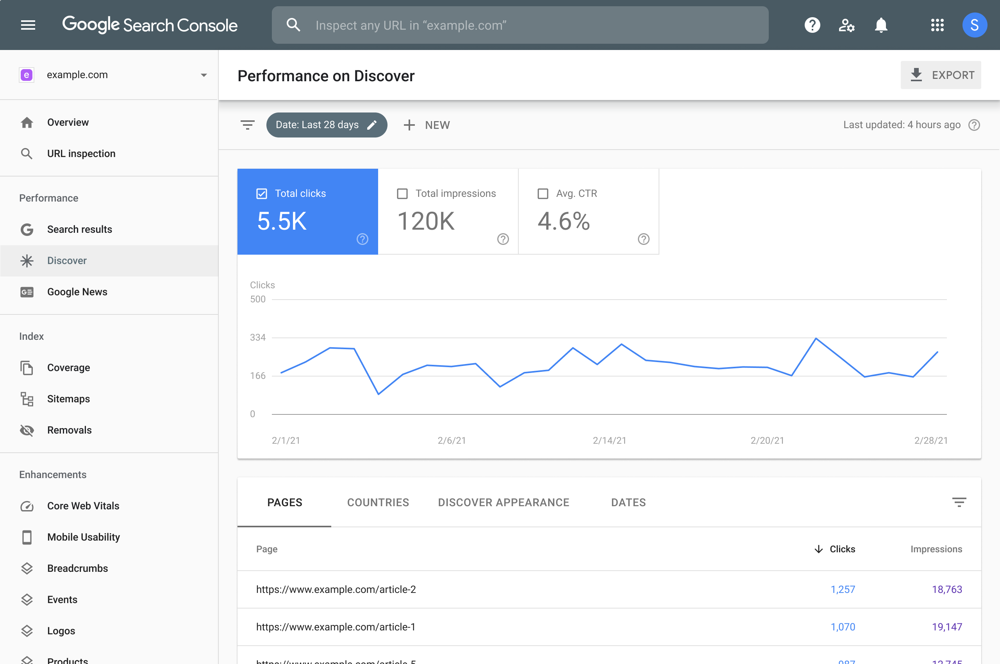{ data-zoom-image }

Google Search Console est un outil gratuit qui vous aide à voir comment Google voit votre site, à corriger les erreurs et à améliorer le référencement.

## Plugin
{ data-zoom-image }

Yoast SEO

# Accessibilité

*[SEO]: Search Engine Optimization
*[E-E-A-T]: Experience, Expertise, Authoritativeness, and Trustworthiness
*[WCAG]: Web Content Accessibility Guidelines
*[UX]: User eXperience
*[CTA]: Call To Action
*[CTR]: ClickThrough Rate

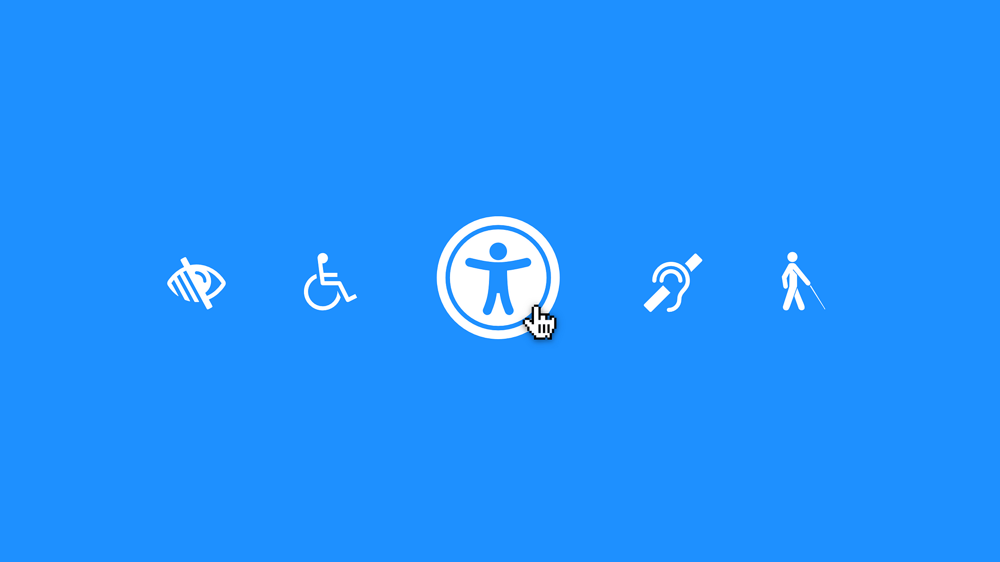

L'**accessibilité Web** (A11Y[^a11y]) consiste à rendre les sites internet utilisables par **tous**, y compris les personnes en situation de handicap (**visuel**, **auditif**, **moteur**, **cognitif**).

Une bonne accessibilité **garantit une expérience utilisateur équitable** et **optimise aussi le SEO**, car les sites bien structurés sont mieux référencés.

De plus, plusieurs pays imposent des normes légales comme **WCAG 2.1**.

[^a11y]: <https://www.boia.org/blog/what-is-a11y>

## Normes et obligations

Plusieurs endroits dans le monde (Union Européenne, Royaume-Uni, Australie, États-Unis, Canada) exigent que les sites web respectent certaines normes d'accessibilité (ex : **WCAG 2.1**).

D'ailleurs, c'est le cas pour les organismes gouvernementaux et para-gouvernementaux au Québec[^qc] :

* Ministères et organismes gouvernementaux.
* Municipalités et services publics.
* Organismes recevant du financement gouvernemental.

[^qc]: <https://www.quebec.ca/accessibilite>

## Principes fondamentaux

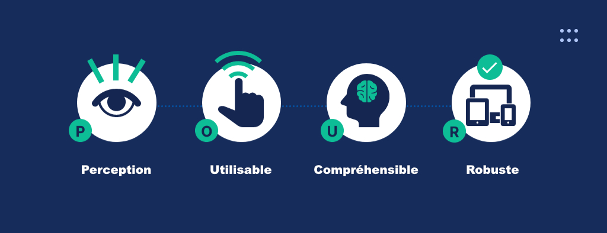{.w-100}

Les **WCAG**[^wcag] définissent **quatre principes fondamentaux** pour garantir l'accessibilité numérique. Depuis décembre 2024, on est maintenant à la version republiée `2.2` des WCAG[^wcag22].

[^wcag]: <https://www.w3.org/WAI/standards-guidelines/wcag/>

[^wcag22]: <https://www.w3.org/TR/WCAG22/>

### Perceptible

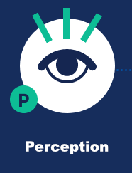

Les utilisateurs doivent pouvoir accéder au contenu, quel que soit leur mode d'interaction.

#### Mise en contexte

Un site de recettes affiche l'image d'un plat. Par contre, les utilisateurs aveugles n'arrivent pas à comprendre ce que montre l'image.

✅ Solution : Ajouter un texte alternatif décrivant chaque image :

```html

```

### Utilisable

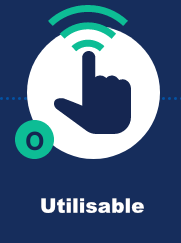

La navigation et l'interactivité doivent être accessibles à tous les utilisateurs.

#### Mise en contexte

Un site e-commerce utilise un menu déroulant, mais celui-ci ne peut être ouvert qu’avec une souris.

✅ Solution : Permettre la navigation au clavier (++tab++ et ++enter++). En même temps, penser à indiquer clairement où se trouve le focus au moment de la navigation par clavier :

```css
:focus {
  outline: 2px solid blue;
}
```

### Compréhensible

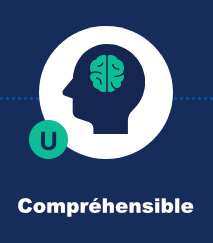

L'information et la navigation doivent être faciles à comprendre.

#### Mise en contexte

Un site WordPress affiche un formulaire de contact, mais les champs ne sont pas bien étiquetés. On comprend mal où entrer ses informations.

✅ Solution : Ajouter des labels explicites pour les champs de formulaire.

```html
<label for="email">Courriel :</label>
<input type="email" id="email" name="email" placeholder="jfcartier@cmontmorency.qc.ca">
```

Pensez aussi à la gestion des erreurs en JavaScript et assurez vous que le message parle à l'utilisateur.

```html
<label for="email">Courriel :</label>
<input type="email" id="email" name="email" placeholder="jfcartier@cmontmorency.qc.ca">
<small class="form-error">Veuillez entrer un courriel valide.</small>
```

### Robuste

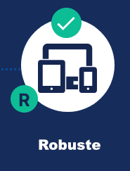

Le site doit être compatible avec différents appareils et technologies.

#### Mise en situation

Un blog utilise un lecteur audio JavaScript super cool, mais celui-ci ne fonctionne pas avec un lecteur d’écran.

✅ Solution : Utiliser HTML5 pour une meilleure compatibilité :

```html
<audio controls>
  <source src="podcast.mp3" type="audio/mpeg">
</audio>
```

## Exemples concrets

### 📸 Texte alternatif (Alt text)

* Les images doivent avoir un **texte alternatif** qui décrit leur contenu.
* Les icônes purement décoratives doivent avoir un `alt=""` ou être cachées aux lecteurs d'écran.

### 🎨 Contraste des couleurs

* Le contraste entre le texte et l'arrière-plan doit être d'au moins **4.5:1**.
* Un contraste insuffisant rend la lecture difficile pour les personnes malvoyantes.

### 🎥 Sous-titres et transcriptions

* Les vidéos doivent contenir **des sous-titres et/ou une transcription** pour les personnes sourdes ou malentendantes.

### ⌨️ Navigation au clavier

* Un utilisateur doit pouvoir **parcourir tout le site avec la touche Tabulation (`Tab`)**.
* Les menus déroulants, boutons et autres éléments interactifs doivent être accessibles sans souris.

### 🏷️ Labels et formulaires accessibles

* Tous les champs de formulaire doivent être accompagnés d'un **label clair et lisible**.
* Les erreurs de saisie doivent être expliquées **clairement** à l'utilisateur.

### ⚠️ Erreurs fréquentes à éviter

* Ne pas imposer **d'actions rapides** (ex : limite de temps non ajustable).
* Ne pas utiliser de **contenus clignotants** qui peuvent provoquer des crises d'épilepsie.
* Éviter d'utiliser uniquement la couleur pour transmettre une information.

## À faire / À éviter

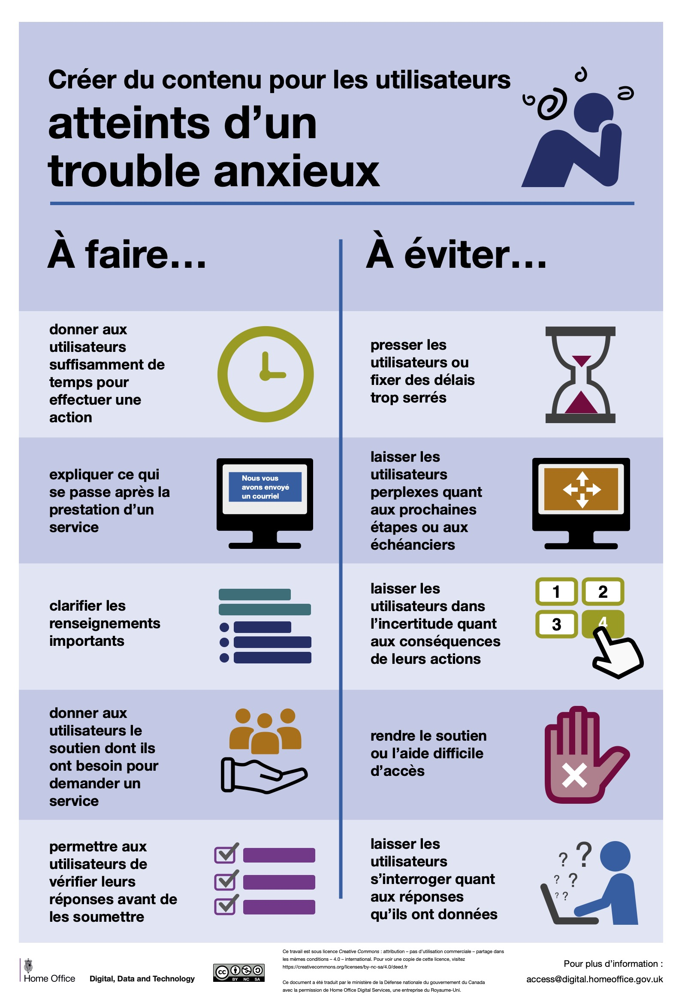{.w-100 data-zoom-image}

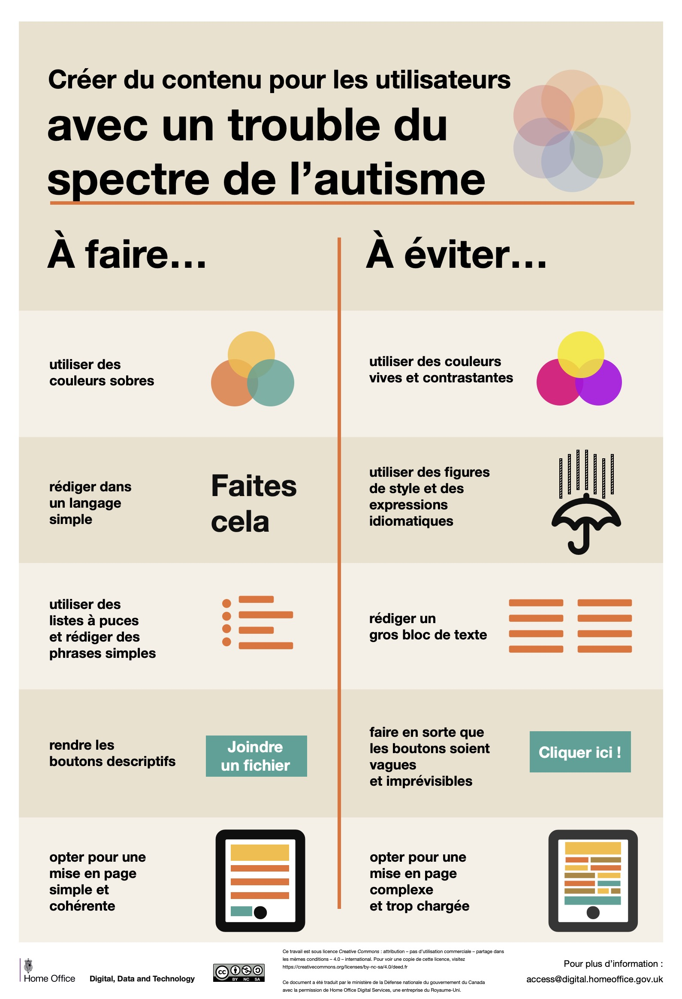{.w-100 data-zoom-image}

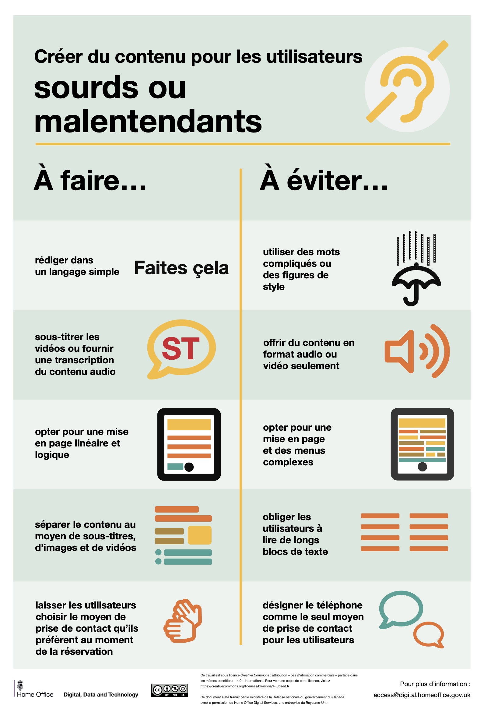{.w-100 data-zoom-image}

{.w-100 data-zoom-image}

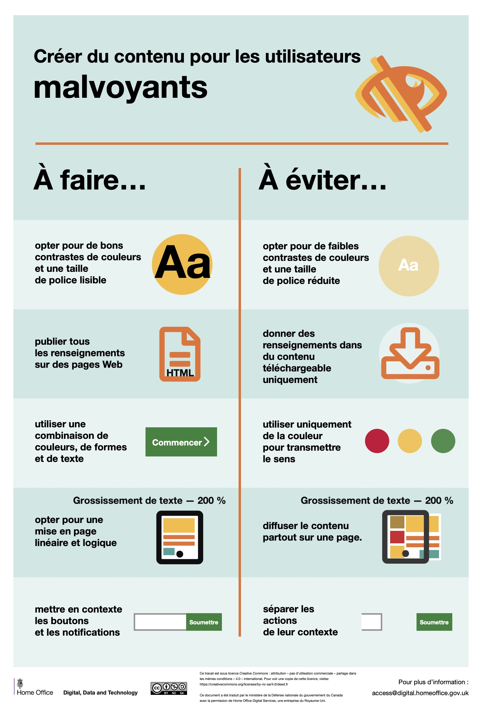{.w-100 data-zoom-image}

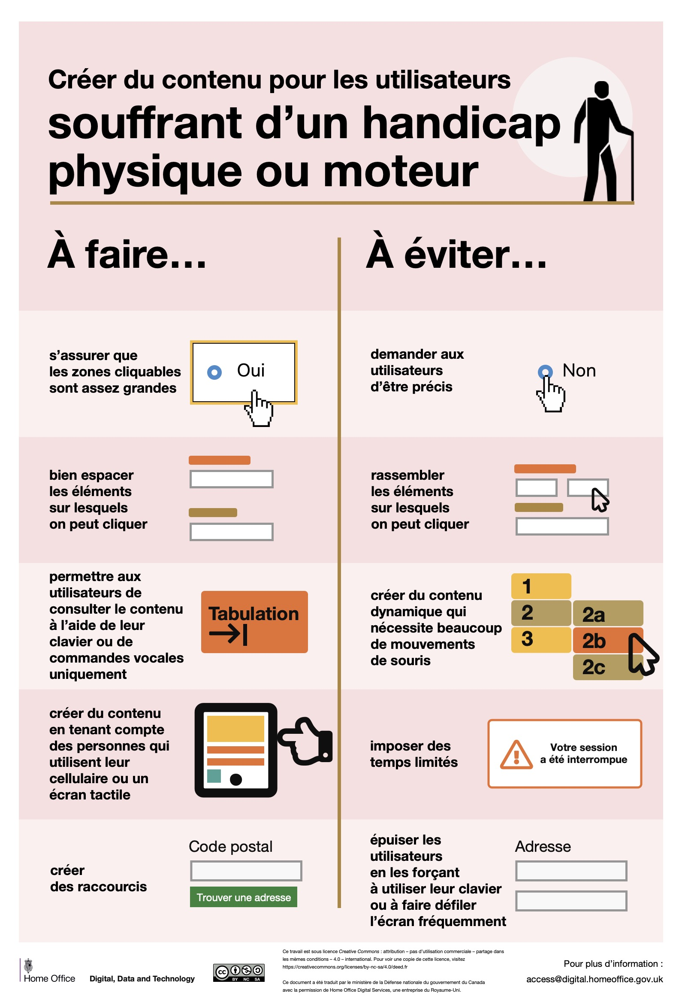{.w-100 data-zoom-image}

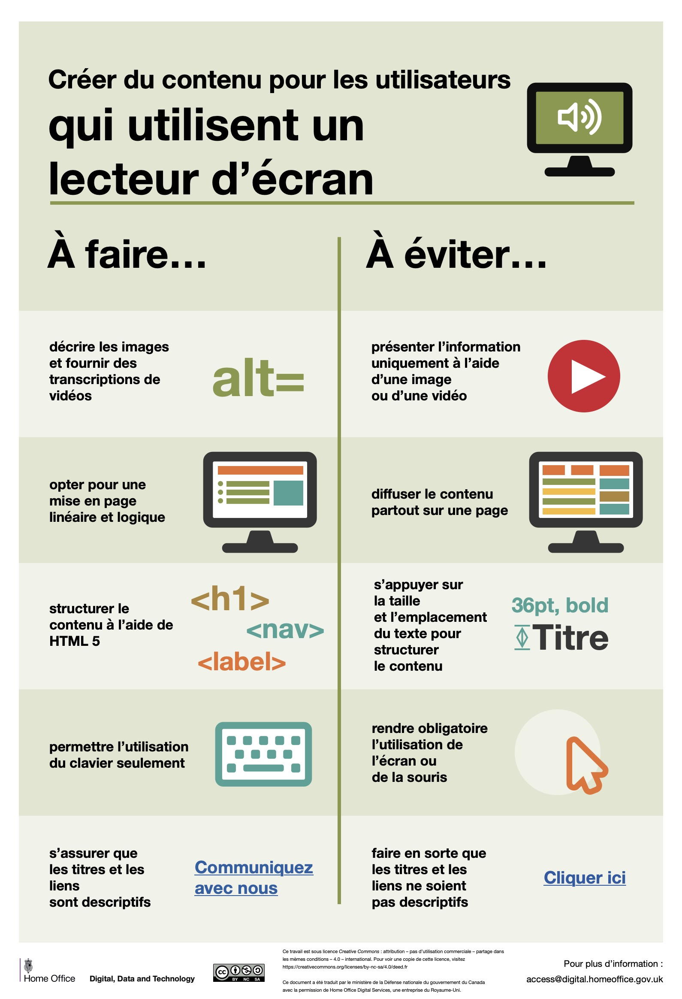{.w-100 data-zoom-image}

Source : https://github.com/UKHomeOffice/posters

## Tester l'accessibilité

<div class="grid grid-1-2" markdown>


<div markdown>
**[Lighthouse (Google)](https://developer.chrome.com/docs/lighthouse/)**

Audit automatique d'accessibilité.
</div>
</div>

<div class="grid grid-1-2" markdown>
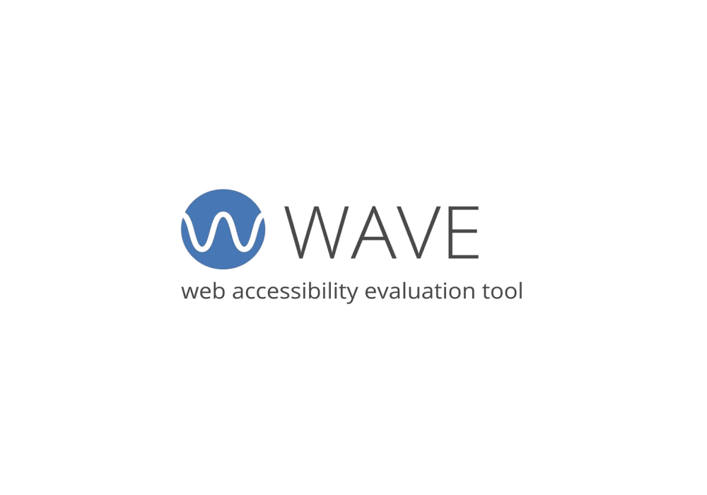

<div markdown>
**[WAVE Web Accessibility Evaluation Tool](https://wave.webaim.org/)**

Analyse les contrastes, textes alternatifs, erreurs ARIA, etc.
</div>
</div>

<div class="grid grid-1-2" markdown>
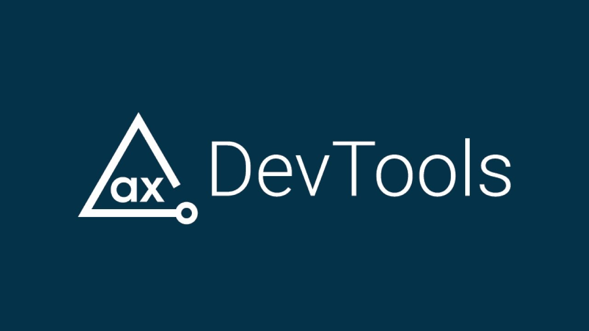

<div markdown>
**[axe DevTools](https://www.deque.com/axe/devtools/)**

Extension Chrome pour détecter les problèmes d'accessibilité.
</div>
</div>

<div class="grid grid-1-2" markdown>
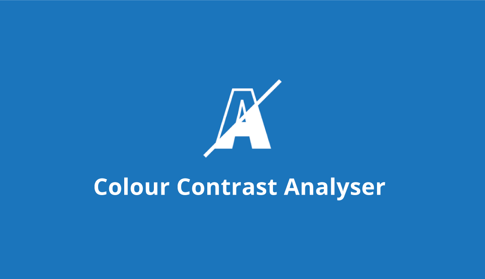

<div markdown>
**[Contrast Checker](https://webaim.org/resources/contrastchecker/)** / **[Link Contrast Checker](https://webaim.org/resources/linkcontrastchecker/?fcolor=0000FF&bcolor=FFFFFF)**

Vérifie si le contraste des couleurs respecte les normes WCAG 2.1.
</div>
</div>

<div class="grid grid-1-2" markdown>
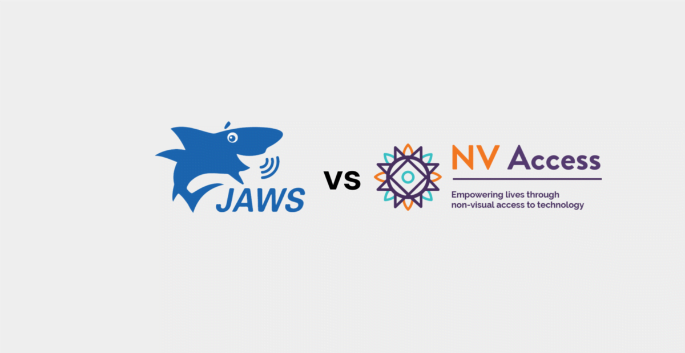

<div markdown>
**[NVDA (NonVisual Desktop Access)](https://www.nvaccess.org/)**

Lecteur d'écran gratuit pour tester la compatibilité.
</div>
</div>


## Qu’est-ce qu’une API ?

{ data-zoom-image }

Une API (_Application Programming Interface_), c’est un ensemble de règles qui permet à deux logiciels de communiquer entre eux.

Autrement dit, c’est un pont entre deux systèmes qui permet le partage d'information.

## Rest API

{ data-zoom-image }

Une API REST (_Representational State Transfer API_) est un type d’API qui suit des règles précises pour fonctionner via le protocol HTTP.

**Types de requêtes HTTP** :

* GET : obtenir des infos
* POST : envoyer des infos
* PUT / PATCH : modifier
* DELETE : supprimer

### APIs à votre disposition

* [public-apis | Github](https://github.com/public-apis/public-apis)
* [Apilist.fun](https://apilist.fun/)

### Exemple d'API

Pour tester la notion d'API, appelons l'URL suivante <https://yesno.wtf/api>. On peut le faire dans n'importe quel langage.

```js title="En JavaScript"
fetch('https://yesno.wtf/api')
  .then(res => res.json())
  .then(data => {
    document.getElementById('mareponse').textContent = "Réponse : " + data.answer;
    document.getElementById('monimage').src = data.image;
  })
  .catch(err => {
    document.getElementById('mareponse').textContent = "Erreur lors de l'appel à l'API.";
  });
```

```php title="En PHP"
<?php
$response = file_get_contents("https://yesno.wtf/api");

if ($response !== false) {
    $data = json_decode($response, true);
    echo "Réponse : " . $data['answer'] . "<br>";
    echo "";
} else {
    echo "Erreur lors de l'appel à l'API.";
}
```

### Authentification


Certaines URL d'API requiert un principe d'authentification.

**OAuth** : Donne l'accès à un utilisateur sans qu'il ai à partager son mot de passe.

**APIKey** : Certaines API demandent de recevoir une clé via l'URL. Pour ce faire, il faut créer sa clé d'API sur le service distant.

### HTTPS

Si l’URL appelée est sur le protocole `http://` et votre site est sur `https://`, le navigateur va bloquer la requête pour des raisons de sécurité (mélange de contenu sécurisé et non sécurisé).

### CORS

CORS est une politique de sécurité des navigateurs qui empêche une page Web de faire des requêtes vers un domaine différent (_cross-origin_).

Par défaut, si votre site est sur https://monsite.ca et que vous appelez une API sur https://api.autresite.com, le navigateur peut bloquer la requête.

Pour que ça fonctionne, il faut que le serveur qu'on veut accéder ai une configuration spéciale qu'on nomme le header.

```
Access-Control-Allow-Origin: *
ou
Access-Control-Allow-Origin: https://monsite.ca
```

### Résumé ultra simple
* CORS = protection du navigateur
* Cross-origin = autre domaine

Le serveur doit dire :

👉 “je t’autorise” avec un header

## Wordpress et son Rest API

Par défaut, WordPress intègre sa propre API REST, accessible sans avoir besoin d’installer quoi que ce soit.

Si l’URL de votre site est : `https://votresite.tim-momo.com/tp`, vous pouvez accéder à l’API REST simplement en ajoutant `/wp-json` à la fin.

Quelques exemples :

```md
// Affiche les informations générales de l’API disponible sur votre site en format JSON.
https://votresite.tim-momo.com/tp/wp-json/

// Affiche tous les articles (posts) de votre site en format JSON.
https://votresite.tim-momo.com/tp/wp-json/wp/v2/posts

Affiche les 3 derniers articles seulement.
https://votresite.tim-momo.com/tp/wp-json/wp/v2/posts?per_page=3
```

Autres paramètres utiles :

- `?categories=3`
- `?author=1`
- `?search=motcle`

!!! question "POST, PUT, DELETE"

    Est-ce qu'on peut utiliser l'API de WordPress en POST, PUT, ou DELETE ?

    Bien sur que oui !

    Toutefois, il faut pour cela prévoir une logique d'authentification (Nonce, JWT). C'est un bien plus avancé alors nous n'irons pas jusque là.

## Sécurité
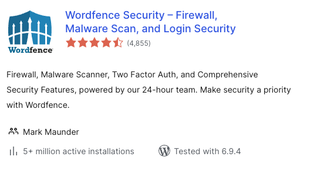

L’utilisation du plugin **Wordfence** dans WordPress permet d’améliorer significativement la sécurité de votre site web. Il offre une protection contre les attaques courantes, comme les tentatives de piratage ou les logiciels malveillants, grâce à son pare-feu et à son système de scan. En l’activant, vous renforcez la protection de vos données et assurez une meilleure stabilité de votre site.


## Optimisation

### Images

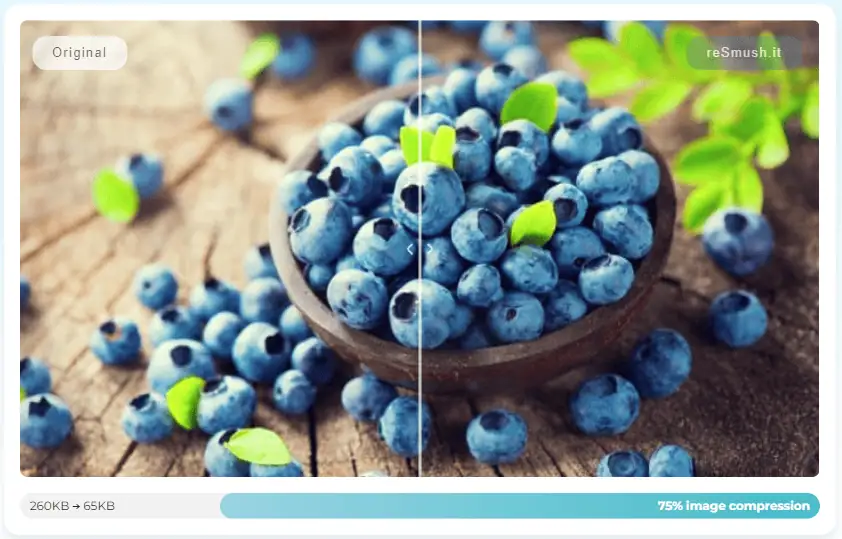

Une conversion des images au format **WebP** est nécessaire pour améliorer les performances du site en réduisant leur poids sans perte significative de qualité. Ce format est d’ailleurs recommandé par Google pour optimiser le temps de chargement des pages.

Plugin : [WP-Optimize](https://fr-ca.wordpress.org/plugins/wp-optimize/)

Un compression est effectuée par l'entremise de l'outil [reSmush.it](http://resmush.it/).

### Compression du code

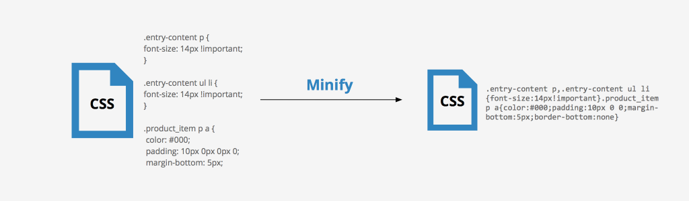{data-zoom-image}

L’optimisation des fichiers **CSS** et **JavaScript** permet d’accélérer l’affichage des pages.

Cette technique, appelée « **minification** », supprime les espaces inutiles, les commentaires et réduit la taille des fichiers.

Plugin : [WP-Optimize](https://fr-ca.wordpress.org/plugins/wp-optimize/)

### Base de données

Une base de données optimisée améliore la réactivité et réduit le temps de réponse du serveur. Cela inclut le nettoyage des **révisions** de posts ou des **commentaires en attente** par exemple.

Plugin : [WP-Optimize](https://fr-ca.wordpress.org/plugins/wp-optimize/)

[Commentaire faire un bon nettoyage de la base de données ? (en)](https://nitropack.io/blog/post/wordpress-database-cleanup-guide)

Avant d'effectuer un nettoyage, faites toujours un backup de votre site et analysez en amont ce qui n'est plus à jour. Par exemple :

* plugins non utilisés
* themes non utilisés
* étiquettes non utilisés
* catégories non utilisées
* posts non publiés
* commentaires en attente
* images non utilisées
* posts plus à jour
* profils utilisateurs peu ou pas utilisé depuis longtemps
* anciennes révisions
* spam
* etc.

#### Pingbacks et trackbacks

Tant qu'à être dans le grand ménage du printemps, supprimez les pingbacks et trackbacks et désactivez les.

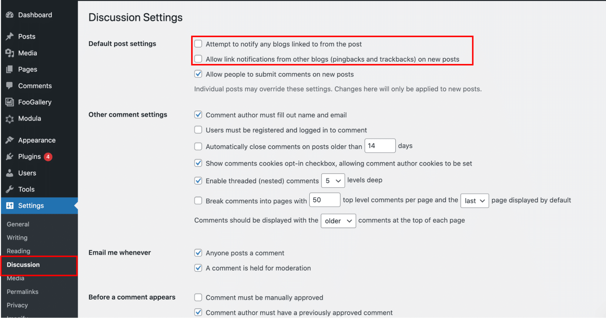{data-zoom-image}

### Cache

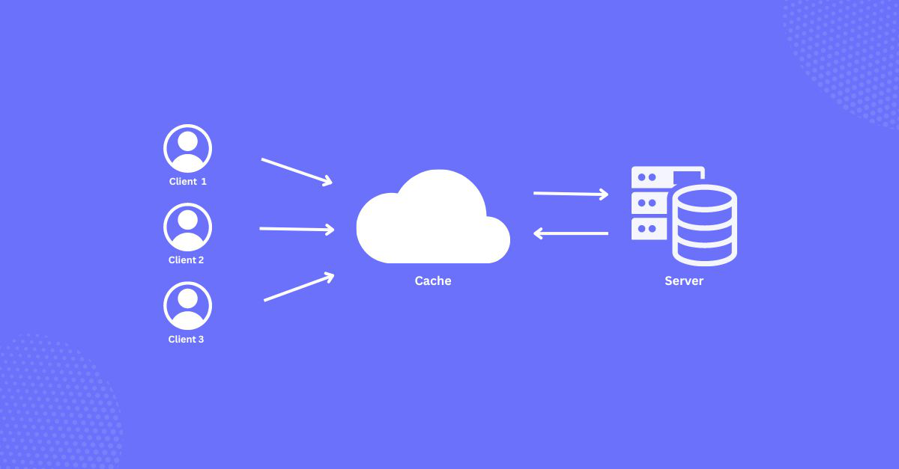{data-zoom-image}

La mise en cache permet d’**accélérer le chargement des pages** en stockant temporairement des versions statiques du contenu, réduisant ainsi la charge sur le serveur et améliorant l’expérience utilisateur.

Plugin : [WP-Optimize](https://fr-ca.wordpress.org/plugins/wp-optimize/)
