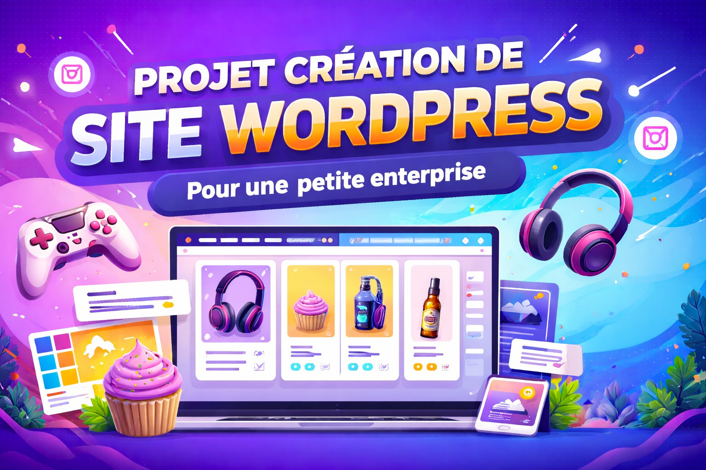

# TP FINAL — SITE WEB POUR UNE ENTREPRISE

{.w-100}

## Objectif

Vous devez concevoir un site web **WordPress** complet pour un client ayant une petite entreprise.

Cela signifie que votre site doit être pensé comme un vrai projet professionnel, comme si vous étiez mandaté par un client. 

**Vous devez donc :**

* imaginer une entreprise crédible en lien avec le thème choisi
* définir son identité (nom, mission, type de produits ou services)
* structurer un site qui répond aux besoins d’une entreprise réelle

**Votre site doit inclure :**

* une présentation claire de l’entreprise
* une mise en valeur de ses produits
*  une navigation simple et efficace
* un design moderne et cohérent

L’objectif est de créer un site qui pourrait réellement être mis en ligne pour une entreprise, tant au niveau du contenu que de l’apparence.

**Le projet doit démontrer :**

* votre capacité à créer un site professionnel
* votre créativité (design moderne et artistique)
* votre maîtrise des outils vus en classe

## Thèmes disponibles

##### Vous devez choisir UN seul thème parmi les suivants :

### Appareils électroniques (audio)
!!! example "Télécharger"
    
    [Fichiers Electro](../assets/documents/Projet%20final%20Electro.zip)

### Gaming
!!! example "Télécharger"
    
    [Fichiers Gaming](../assets/documents/Projet%20final%20Electro.zip)

### Guitare / musique
!!! example "Télécharger"
    
    [Fichiers Guitare](../assets/documents/Projet%20final%20Electro.zip)

### Jus 
!!! example "Télécharger"
    
    [Fichiers Jus](../assets/documents/Projet%20final%20Jus.zip)

### Écouteurs
!!! example "Télécharger"
    
    [Fichiers Écouteurs](../assets/documents/Projet%20final%20Electro.zip)

### Scooter futuriste
!!! example "Télécharger"
    
    [Fichiers Scooter](../assets/documents/Projet%20final%20Electro.zip)

### Cupcakes et beignes
!!! example "Télécharger"
    
    [Fichiers Sweeny](../assets/documents/Projet%20final%20Electro.zip)

### Réalité virtuelle (VR)
!!! example "Télécharger"
    
    [Fichiers VR](../assets/documents/Projet%20final%20Electro.zip)

👉 Toutes les images nécessaires vous seront fournies.

!!! Info "Information"

    Vous pouvez utiliser des images libres de droits pour compléter votre projet. Les images générées par intelligence artificielle sont également acceptées, à condition d’en indiquer la source.

## Structure obligatoire du site

**Votre site doit contenir les pages suivantes :**

* Accueil
* À propos
* Boutique
* Blogue
* Contact

## Exigences obligatoires
##### 1. Page d’accueil

* Design moderne et artistique

**Doit contenir :**

* une section hero
* une mise en valeur des produits (featured products)
* Minimum 5 sections dans votre page d'accueil
* une structure visuelle travaillée (sections, images, hiérarchie)

---

##### 2. Boutique (WooCommerce)
* Minimum 4 produits
* Produits organisés clairement
* Page boutique affichant tous les produits

---

##### 3. Champs personnalisés dans Woocommerce
* Utilisation de champs personnalisés sur les produits
* Minimum 3 champs personnalisés

!!! Warning "Extensions possible"
    * Advanced Product Fields (Product Addons) for WooCommerce
    * Product Addons for Woocommerce – Product Options with Custom Fields

#### Exemples :

* caractéristiques techniques
* autonomie
* format / taille
* niveau de difficulté
* saveur (si alimentaire)

---

##### 4. Multilingue
* Minimum 2 langues
* Utilisation de l’extension GTranslate

---

##### 5. Blogue
* Minimum 3 articles

**Articles avec :**

* catégories
* étiquettes

---

##### 6. Page Contact

**Doit contenir :**

* un formulaire (Contact Form 7)
* un design travaillé (pas seulement un formulaire)
* cohérent avec la page d’accueil

---

##### 7. Page À propos

**Présente:**

* l’entreprise
* sa mission
* ses valeurs
* Contenu crédible et cohérent avec le thème

---

##### 8. Design général
* Style moderne et artistique

**Cohérence visuelle:**

* couleurs
* typographie
* images
* Utilisation d’**Elementor** pour la mise en page

## Outils obligatoires

**Vous devez utiliser :**

* Thème Astra (header + footer)
* Elementor
* Unlimited Elements
* Contact Form 7
* WooCommerce
* ACF
* GTranslate

## Bonus 5%

Intégrer une API gratuite dans votre site web.

Cette API doit permettre d’ajouter une fonctionnalité dynamique réelle à votre projet (et non simplement décorative).

Contraintes
L’API doit :
* récupérer des données externes (JSON)
* être visible sur le site
* être pertinente avec votre thème

**L’intégration peut être faite avec :**

* Avec une extension / widget compatible

!!! Tip "Extension"

    WPGet API – Connect to any external REST API

#### Exemples d’utilisation

Voici des idées selon les thèmes :

* Audio / musique
  * API de musique ou playlists
* Gaming
  * API de jeux (ex : infos sur jeux)
* Jus
  * API de fruits ou légumes
* Cupcakes
  * API de recettes
* Scooter futuriste
  * API météo ou carte
* VR
  * API de produits tech

Exemples d’API simples

* OpenWeather API (météo)
* TheMealDB API (recettes)
* RAWG Video Games Database API (jeux)

#### Exigences techniques

L’API doit :

* être fonctionnelle
* afficher des données réelles
* être intégrée visuellement dans une section du site

## GRILLE D’ÉVALUATION DÉTAILLÉE ( /100 )

### 1. DESIGN & CRÉATIVITÉ ( /20 )

| Niveau | Description                                                                             | Points |
| ------ | --------------------------------------------------------------------------------------- | ------ |
| A      | Design très soigné, moderne, artistique, forte identité visuelle, excellente hiérarchie | 18-20  |
| B      | Design cohérent et propre, quelques éléments créatifs                                   | 15-17  |
| C      | Design simple, peu original, manque de cohérence visuelle                               | 10-14  |
| D      | Design négligé, incohérent ou très peu travaillé                                        | 1-9    |
| E      | Absent                                                                                  |    0   |

### 2. STRUCTURE DU SITE ( /10 )

| Niveau | Description                                                             | Points |
| ------ | ----------------------------------------------------------------------- | ------ |
| A      | Structure complète, navigation claire, toutes les pages bien organisées | 9-10  |
| B      | Structure fonctionnelle, quelques petites incohérences                  | 7-8  |
| C      | Structure confuse ou incomplète                                         | 5-6    |
| D      | Navigation difficile, pages manquantes                                  | 1-4    |
  E      | Absent                                                                  |    0   |

### 3. PAGE D’ACCUEIL ( /20)

| Niveau | Description                                                                      | Points |
| ------ | -------------------------------------------------------------------------------- | ------ |
| A      | Page très travaillée, visuel fort, produits bien mis en valeur, sections variées | 18-20  |
| B      | Bonne structure, produits visibles mais manque d’impact visuel                   | 15-17  |
| C      | Page basique, peu de mise en valeur des produits                                 | 10-14    |
| D      | Page pauvre ou incomplète                                                        | 1-9    |
  E      | Absent                                                                           |    0   |

### 4. WOOCOMMERCE ( /10 )

| Niveau | Description                                                             | Points |
| ------ | ----------------------------------------------------------------------- | ------ |
| A      | Produits bien présentés, organisation claire, fiches produits complètes | 9-10   |
| B      | Produits présents, organisation correcte                                | 7-8    |
| C      | Produits peu travaillés ou mal organisés                                | 5-6    |
| D      | Produits insuffisants                                                   | 1-4    |
  E      | Absent                                                                  |    0   |

### 5. Woocommerce (CHAMPS PERSONNALISÉS) ( /5 )

| Niveau | Description                                                     | Points |
| ------ | --------------------------------------------------------------- | ------ |
| A      | Champs pertinents, bien intégrés visuellement dans les produits | 5      |
| B      | Champs utilisés mais peu intégrés ou peu exploités              | 4      |
| C      | Champs présents mais mal utilisés                               | 2-3    |
| D      | inutiles                                                        | 1      |
  E      | Absent                                                          |    0   |

### 6. MULTILINGUE ( /5 )

| Niveau | Description                                         | Points |
| ------ | --------------------------------------------------- | ------ |
| A      | Site entièrement fonctionnel en 2 langues, cohérent | 5      |
| B      | Fonctionnel mais avec quelques oublis               | 3-4    |
| C      | Traduction partielle ou incohérente                 | 2      |
| D      | Non fonctionnel                                     | 1      |
  E      | Absent                                              |    0   |

### 7. BLOGUE ( /5 )

| Niveau | Description                                                      | Points |
| ------ | ---------------------------------------------------------------- | ------ |
| A      | Articles complets, bien structurés avec catégories et étiquettes | 5      |
| B      | Articles présents mais peu développés                            | 3-4    |
| C      | Articles minimalistes ou mal organisés                           | 2      |
| D      | Très mal organisés                                               | 1      |
  E      | Absent                                                           |    0   |

### 8. PAGE CONTACT ( /5 )

| Niveau | Description                                | Points |
| ------ | ------------------------------------------ | ------ |
| A      | Design travaillé + formulaire bien intégré | 5      |
| B      | Formulaire présent mais design simple      | 3-4    |
| C      | Formulaire minimal sans design             | 2      |
| D      | non fonctionnel                  | 1    |
  E      | Absent                                     |    0   |

### 9. UTILISATION DES OUTILS ( /5 )

| Niveau | Description                                                   | Points |
| ------ | ------------------------------------------------------------- | ------ |
| A      | Excellente maîtrise (Elementor, Astra, plugins bien utilisés) | 5      |
| B      | Bonne utilisation générale                                    | 3-4    |
| C      | Utilisation limitée ou erreurs                                | 2      |
| D      | Mauvaise utilisation                                          | 1      |
  E      | Absent                                                        |    0   |

### 10. RESPONSIVE (Desktop / Tablette / Mobile) ( /10 )

| Niveau | Description                                                                           | Points |
| ------ | ------------------------------------------------------------------------------------- | ------ |
| A      | Site parfaitement adapté aux 3 formats, aucune erreur visuelle, excellente lisibilité | 9-10   |
| B      | Adaptation correcte, quelques petits ajustements nécessaires                          | 7-8    |
| C      | Problèmes visibles (texte, espacements, éléments mal placés)                          | 5-6    |
| D      | Site difficilement utilisable sur certains formats                                    | 0-4    |

### 11. COHÉRENCE DU PROJET ( /5 )

| Niveau | Description                                           | Points |
| ------ | ----------------------------------------------------- | ------ |
| A      | Projet très cohérent (design, contenu, thème alignés) | 5      |
| B      | Cohérence générale correcte                           | 3-4    |
| C      | Plusieurs incohérences                                | 2      |
| D      | Projet décousu                                        | 1    |
  E      | Absent                                                |    0   |

**TOTAL : ____ / 100**

👉 Note remise sur 40% selon la pondération du cours
