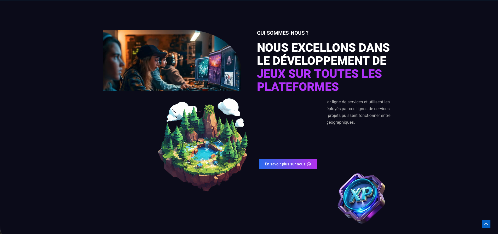
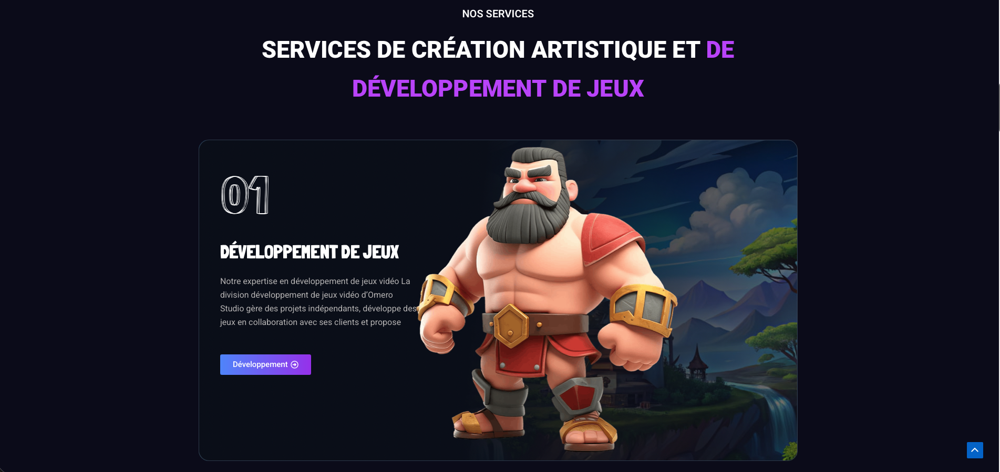
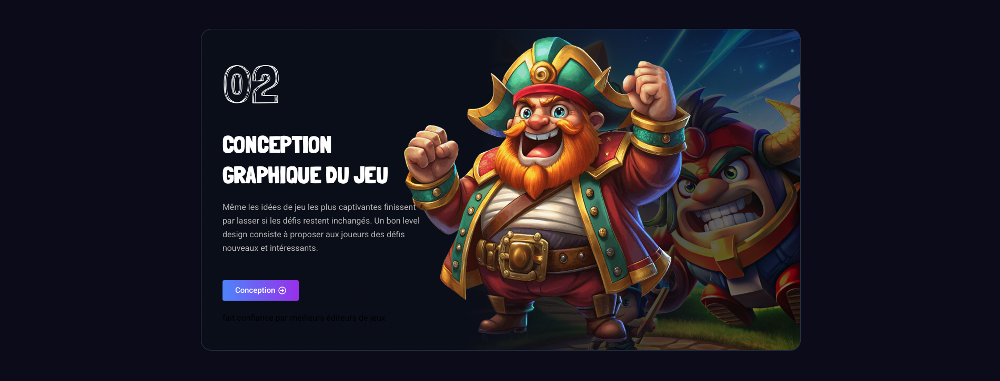
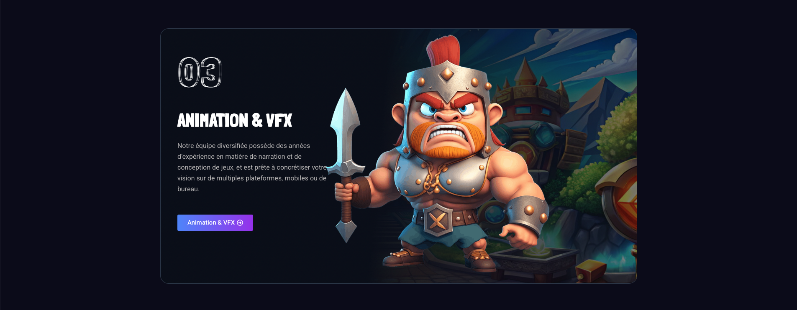
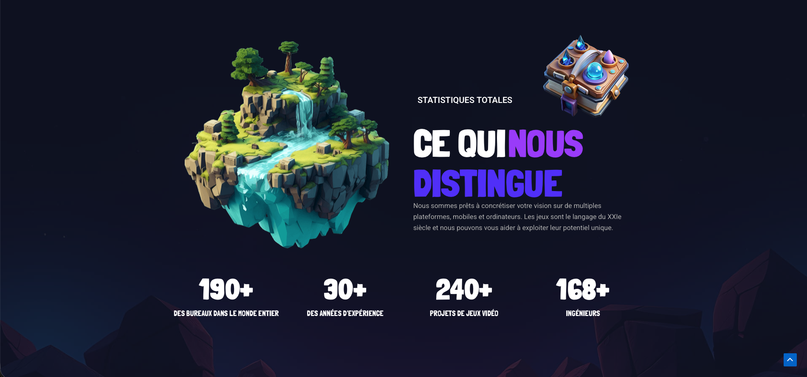
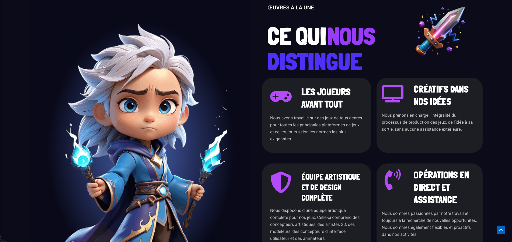
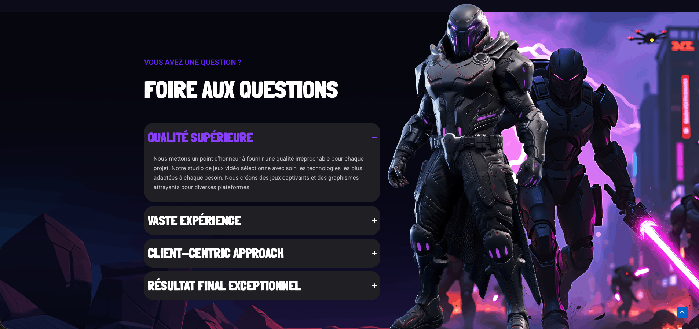
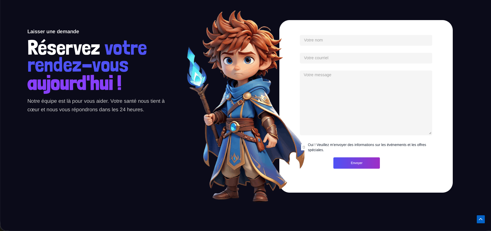
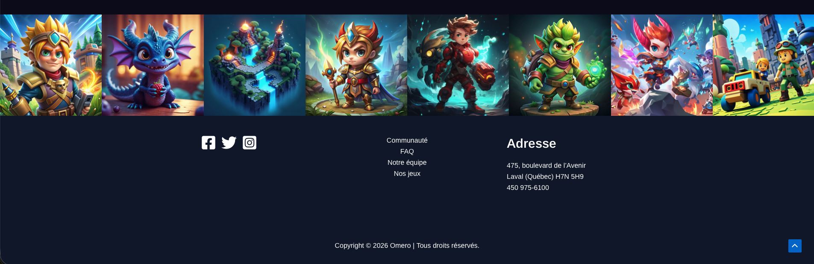

# TP2- Omero

{data-zoom-image}

{data-zoom-image}

{data-zoom-image}

{data-zoom-image}

{data-zoom-image}

{data-zoom-image}

{data-zoom-image}

{data-zoom-image}

{data-zoom-image}

{data-zoom-image}

## Lien vers le site web
[Omero B](https://tp2steph.tim-momo.com/trflhs-62/)

## Objectif du travail
Dans ce travail pratique, vous devrez recréer un site web existant en utilisant les outils vus en classe.

L’objectif est de développer votre capacité à :

* Observer un design web
* Comprendre sa structure
* Reproduire fidèlement une interface

!!! Tip "Indice"

    Les marges externes peuvent être négatives, ce qui permet de déplacer des éléments ou de les superposer.
 
## Approche demandée
Vous devrez analyser visuellement le site fourni et tenter de reproduire le plus fidèlement possible :

* La mise en page (layout)
* Les sections
* Les espacements
* Les couleurs
* La typographie
* Les effets visuels (ombres, animations, etc.)

👉 Il ne s’agit pas de copier le code, mais bien de recréer à partir de l’observation.
 
## Outils obligatoires
Vous devez utiliser les outils suivants :

* Thème WordPress : Astra
* Constructeur de page : Elementor
* Extension : Unlimited Elements
  * Dual Color Heading
* Contact Form 7

⚠️ Aucun autre constructeur ou thème ne doit être utilisé sans autorisation.
 
## Identité visuelle à respecter
Vous devez impérativement utiliser :

### Couleurs
*  #FFF
*  #F6F6F6
*  #6F6F6F
*  #5A55FB
*  #C47CFF
*  #07061B
*  #000

### Typographie
* Police par défaut
* Londrina Solid
* Londrina Outline

👉 Ces éléments doivent être respectés pour assurer une reproduction fidèle.
 
## Consignes importantes
* Le site doit être responsive (adapté mobile et tablette)
* Vous devez structurer votre contenu de façon logique
* Les sections doivent être clairement identifiables
* Les éléments doivent être bien alignés et espacés

* La présence en classe est obligatoire pour tous les cours dédiés au projet (présence complète, jusqu’à la fin).
 
## Critères d’évaluation
Votre travail sera évalué selon :

* Fidélité visuelle au modèle
* Qualité de la structure
* Utilisation adéquate des outils
* Propreté du design
* Responsivité (mobile/tablette)
 
## 💡 Conseils
* Prenez le temps d’analyser avant de commencer
* Travaillez section par section
* Zoomez sur les détails (marges, tailles, alignements)
* Testez régulièrement votre site
 
## 📅 Remise
* 20 avril 2026
* Vous devez soumettre, dans le devoir Teams qui vous sera envoyé, le lien de votre site web, ainsi que les informations de connexion (nom d’utilisateur et mot de passe) permettant d’y accéder.
 
Bon travail !

## Grille d’évaluation — TP2 : Reproduction d’un site web

| Critère                                                  | Excellent                         | Bon                  | Moyen                  | Faible                | Points |
| -------------------------------------------------------- | --------------------------------- | -------------------- | ---------------------- | --------------------- | ------ |
| **Fidélité visuelle** (30 pts)                           | Reproduction presque identique    | Très ressemblant     | Ressemblance partielle | Très différent        | /30    |
| **Structure du site** (10 pts)                           | Sections claires et logiques      | Structure correcte   | Quelques incohérences  | Désorganisé           | /10    |
| **Hiérarchie visuelle** (10 pts)                         | Titres et contenus bien organisés | Bonne hiérarchie     | Peu claire             | Confuse               | /10    |
| **Utilisation d’Elementor** (10 pts)                     | Maîtrise complète                 | Bonne utilisation    | Utilisation limitée    | Mauvaise utilisation  | /10    |
| **Utilisation des widgets (Unlimited Elements)** (5 pts) | Très pertinent                    | Correct              | Peu utilisé            | Non utilisé           | /5     |
| **Header & Footer (Astra)** (5 pts)                      | Bien configurés et cohérents      | Fonctionnels         | Peu travaillés         | Absents ou incorrects | /5     |
| **Typographie** (5 pts)                                  | Parfaitement respectée            | Légers écarts        | Inconstante            | Incorrecte            | /5     |
| **Couleurs** (5 pts)                                     | Fidèles au modèle                 | Quelques différences | Peu respectées         | Incorrectes           | /5     |
| **Alignement & espacements** (10 pts)                    | Parfaits                          | Quelques erreurs     | Plusieurs erreurs      | Désorganisé           | /10    |
| **Cohérence visuelle globale** (5 pts)                   | Design homogène et professionnel  | Cohérent             | Quelques incohérences  | Incohérent            | /5     |
| **Effets visuels (ombres, hover, animations)** (5 pts)   | Très bien reproduits              | Présents             | Peu maîtrisés          | Absents               | /5     |

🧮 Total : ______ / 100

---

## 🌐 Accéder à votre cPanel et installer WordPress

### 1. Se connecter au cPanel

* Ouvrez votre navigateur
* Accédez à votre cPanel (ex : votresite.com/cpanel)
* Entrez votre **nom d’utilisateur** et votre **mot de passe**

---

### 2. Accéder au gestionnaire de fichiers

* Dans le cPanel, trouvez la section **Files**
* Cliquez sur **File Manager**

---

### 3. Aller dans le dossier principal du site

* Dans le menu de gauche, cliquez sur **public_html**

👉 Ce dossier correspond à la racine de votre site web

---

### 4. Créer un nouveau dossier

* Cliquez sur le bouton **+ Folder** (en haut)
* Donnez un nom à votre dossier (ex : tp2)
* Cliquez sur **Create New Folder**

---

### 5. Accéder au dossier

* Double-cliquez sur le dossier que vous venez de créer

---

### 6. Installer WordPress dans ce dossier

#### Option A (recommandée) : Installation automatique

* Retournez à l’accueil du cPanel
* Cliquez sur **Softaculous Apps Installer** (ou WordPress Installer)
* Cliquez sur **Install Now**
* Dans le champ **Directory**, entrez le nom de votre dossier (ex : tp2)
* Remplissez les informations demandées :

  * Nom du site
  * Nom d’utilisateur
  * Mot de passe
* Cliquez sur **Install**

---

#### Option B : Installation manuelle

* Téléchargez WordPress depuis wordpress.org
* Dans le File Manager, cliquez sur **Upload**
* Envoyez le fichier ZIP
* Cliquez sur **Extract**
* Assurez-vous que les fichiers sont bien dans votre dossier

---

### 7. Accéder à votre site

* Votre site sera accessible à l’adresse :

👉 votresite.com/tp2

---

### 8. Accéder à l’administration WordPress

* Ajoutez **/wp-admin** à l’adresse :

👉 votresite.com/tp2/wp-admin

* Connectez-vous avec vos identifiants

---

