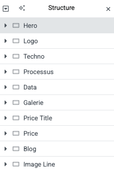

# AI-MAX

{data-zoom-image}

## Consigne du travail

L’objectif de ce travail est de reproduire le plus fidèlement possible le site web fourni en référence.

À partir du site donné, tu dois analyser sa structure, son design et ses interactions afin d’en créer une réplique fonctionnelle.

### Attentes

* Reproduire la mise en page générale (structure, sections, disposition)

* Recréer le style visuel (couleurs, typographie, espacements)

* Intégrer les comportements interactifs (navigation, effets, animations simples)

* Adapter le site pour qu’il soit responsive (fonctionnel sur différentes tailles d’écran)

## Site Web de référence :

[AI-MAX](https://web4steph.tim-momo.com/)

## Matériel

[Télécharger les documents](../assets/documents/AI-Max.zip)

## Thème

* Astra

## Famille de police
* Readex Pro

## Couleurs

#### Orange

    #FF7400

### Blanc

    #FFFFFF

### Noir

    #000000
    
### Background

    #181818

## Extensions

* Elementor
* Woocommerce
* Custom CSS for Elementor

### Unlimited Elements for Elementor

##### Widgets

* Dual Color Heading
* Linear Progress Bar
* Logo Carousel
* Testimonial Box
* Pricing Table
* Masonery & Justified Gallery
* Post Carousel Lite
* Woo Product Grid

## Structure des conteneurs

{data-zoom-image}
