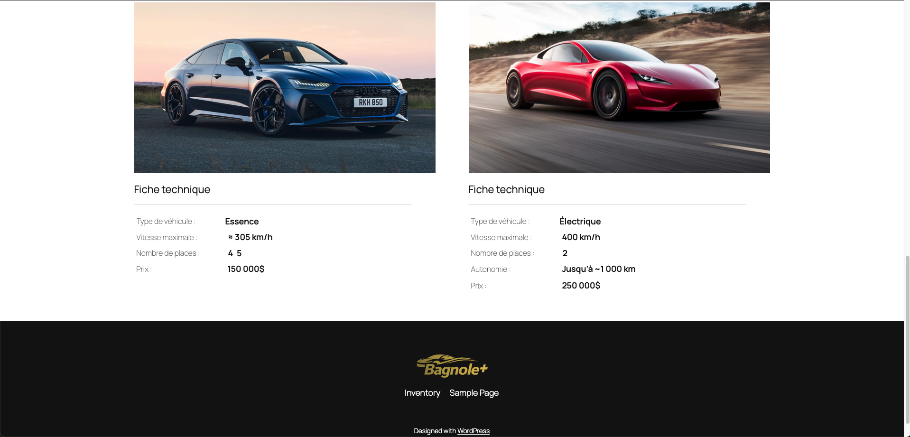

## Bagnole+

{data-zoom-image}   
{data-zoom-image}   
{data-zoom-image}   

## Matériel
[Documents pour l'exercice](../assets/documents/Bagnole+.zip)

---

Créer une page de comparaison de véhicules avec Query Loop, ACF et Advanced Views Lite
 
### Objectif
Créer une page Comparaison de véhicules qui affiche dynamiquement des véhicules à partir d’un post-type Inventaire, avec leurs fiches techniques, sans écrire de PHP.
Technologies utilisées :

*	Gutenberg (Query Loop)
*	ACF
*	Advanced Views Lite
 
### 1️⃣ Créer le post-type « Inventaire »

Dans ACF :

*	Nom du post-type : Inventaire
*	Pluriel : Inventaires
*	Slug : inventaire
*	Sauvegarder

👉 Ce post-type servira à créer chaque véhicule.
 
### 2️⃣ Créer le Field Group « Fiche technique »
* Dans ACF → Field Groups → Add New
* Nom du groupe
* Fiche technique
* Settings
 *	Post Type est égal à Inventaire
 
### Champs à créer
1. Type de véhicule
   
 *	Type : Radio Button
 *	Nom : Type de véhicule
 *	Choix :
   
  *	Essence
  * Électrique
 
1. Vitesse maximale
   
*	Type : Text
*	Nom : Vitesse maximale
 
1. Nombre de places
   
*	Type : Checkbox
*	Nom : nombre_places
*	Choix :
  
 *	2
 *	4
 *	5
 *	6
 *	7
 
1. Autonomie
   
*	Type : Text
*	Nom : Autonomie

 
1. Prix
   
*	Type : Text
*	Nom : Prix
 
👉 Enregistre le Field Group.
 
## 3️⃣ Créer les véhicules (contenu)

1. Va dans Inventaire → Ajouter
1. Crée 4 véhicules, par exemple :

*	Audi RS7
*	Tesla Roadster
*	Mercedes AMG GT 63
*	BMW M8

Pour chaque véhicule :

•	Ajoute un titre
•	Une image mise en avant
•	Remplis la fiche technique

1. Publier
 
## 4️⃣ Dans ACF (Advanced custom fields)
1. Aller dans Field Group
1. Complètement à droite  dans Assign View  Add new
 
Dans Advenced Views
1. Ajouter les "labels" suivants pour chaque champ
   
*	Type de Véhicule :
*	Vitesse maximale :
*	Nombre de places :
*	Autonomie :
*	Prix :
  
1. Enregistrer

## 5️⃣ Créer un modèle « Comparaison de véhicules »
* Nom : Comparaison de véhicules
* Va dans : Apparence → Éditeur → Modèles → Ajouter un modèle → Modèle personnalisé
 
## 6️⃣ Construire la structure du modèle
Voici l’ordre des blocs à ajouter 👇
 
1. Ajouter un bloc → Sélectionner l’onglet Motif → En-têtes
   
*	Effacer le bloc : Titre du Site
*	Ajouter le logo
*	Sélectionner le menu à droite 
 *	Ajouter la couleur #B8A952
*	Couleur de l’arrière-plan : #00002A

 
1. Ajouter un bloc → Sélectionner l’onglet Motif → Bannières
   
*	Sélectionner dans la 2e page des bannière : Fullwidth Dark Banner with Heading Top Left 
*	Changer le texte pour : Comparaison de véhicule
*	Couleur du texte : #9181007A
*	Taille du texte : 82px
*	Apparence : Bold
*	Line height : 2,5
*	Letter spacing 10px
*	Remplacer l’image d’arrière-plan par celle de la BMW M8
*	Couleur de l’overlay (Calque de superposition) de la bannière : #030B2D

 
1. Ajouter un bloc → Spacer
   
*	Hauteur : 50px
 
1. Ajouter une boucle de requête (Queryloop)
   
*	Sélectionner : Partir à zéro
*	Sélectionner la variante : Image, date et Titre
*	Effacer la date de publication
*	Effacer pagination
*	Effacer : Aucun résultats
*	Mettre le titre en haut
*	Après l’image mise en avant ajouter un bloc : Column 50 / 50

### Boucle de requête
*	Disposition : Les bloc intérieur utilisent la largeur du contenu = Activé
*	Type de requête : Personnalisé
*	Type de publication : Inventaire
*	Éléments par page : 10

### Modèle de publication
*	Mettre en : Grille  2 colonnes
*	Position de l’élément de la grille : Auto
*	Colonnes : 2
*	Espacement des blocs : Large


### Titre 
*	Font-size = XL
*	Apparence : Bold
*	Letter spacing : 6
*	Letter case : Majuscule

### Image mise en avant
*	Résolution : Full Size
*	Aspect-Ratio : Wide – 16 : 9

### Colonnes
1. Dans la 1ère colonne
   
*	Width : 100%
*	Ajouter un bloc : titre H3 appelé Fiche technique
*	Ajouter un bloc : séparateur
*	Ajouter un bloc : Shortcode
*	Ajouter le Shortcode de Advanced Views Lite
  
1. Dans la deuxième colonne
   
 * Rien
 
1. Ajouter un bloc → Sélectionner l’onglet Motif → Pieds de page
   
Sélectionner le pieds de page → Center footer with social links

*	Effacer :  Titre du site
*	Ajouter une image : logo
*	Ajouter une marge en bas : X-Small
*	Effacer : Navigation (Ce n’est pas un bloc Navigation)
*	Ajouter un Bloc Navigation
*	Sélectionner le Bloc Empiler et justifier les éléments au centre

1. Aller dans vos pages
   
*	Ajouter une page avec le nom : Inventaire
*	Aller dans les réglages à droite
*	Dans l’onglet Page  Sélectionner Modèle
*	Ensuite, sélectionner Modifier le modèle
*	Sélectionner votre modèle
*	Publier 

## Aller voir le résultat !


### Finalement

*	Ajouter le CSS dans Advenced Views Lite 
*	Onglet CSS & JS
*	Sauvegarder

``` css
#view {
	display: flex;
  	flex-direction: column; 
}
.acf-view > div {
  display: grid;
  grid-template-columns: 180px 1fr;
  align-items: center;
  gap: 12px;
}
.acf-view p {
  margin: 5px;
  font-size: 16px;
}

.acf-view > div p[class$="-label"] {
  min-width: 200px;
  font-weight: 200;
  opacity: 0.7;
}
.acf-view > div [class$="-field"],
.acf-view > div [class$="-choice"] {
  font-weight: 600;
  text-align: left;
  font-size: 18px;
}
.acf-view__nombre-de-places-field {
  display: flex;
  gap: 8px;
  padding-left: 6px;
}
```

