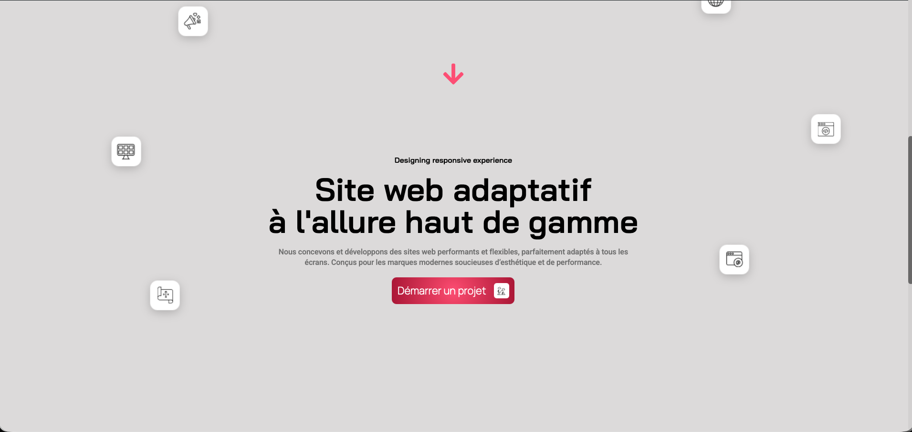
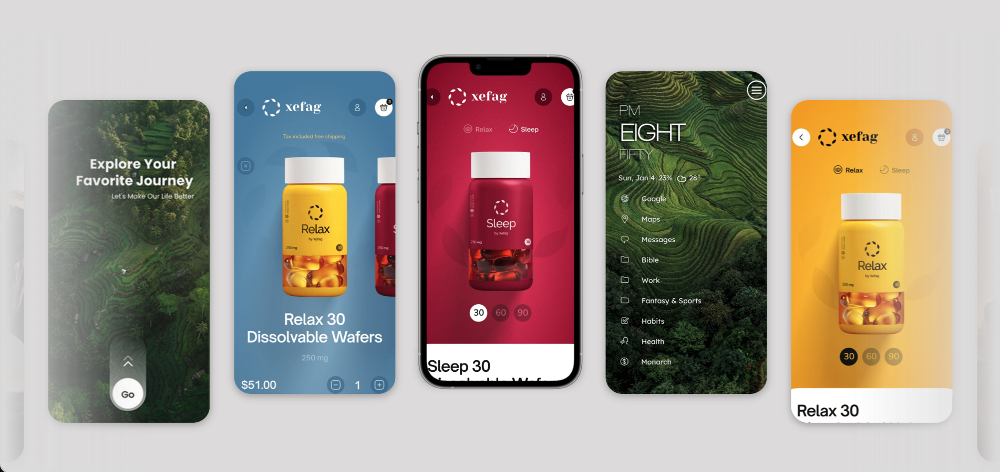

{data-zoom-image}

## Matériel

[Télécharger les documents](../assets/documents/Cloud9-images.zip)

## Wordpress
* [ ]	Ouvrez votre installation WordPress
* [ ]   Installer l'extension : **Custom CSS for Elementor**
* [ ]	Créez une nouvelle page
* [ ]	Cliquez sur “Modifier avec Elementor”
!!! tip "Indice"

    Assurez-vous de ne pas avoir d’en-tête ou pied de page prédéfini

* [ ]   Allez dans Paramètres de la page / Mise en page
* [ ]   Choisissez “Elementor Canvas”
 
## Création de la section Hero

* [ ]	Ajoutez un conteneur
* [ ]	Réglez-le sur pleine largeur
* [ ]	Ajoutez un conteneur à l’intérieur
* [ ]	Réglez-le sur **“boxed”**
* [ ]	Ajoutez un arrière-plan dégradé radial
* [ ]	Copiez les codes couleur depuis les ressources
* [ ]	#FF587F et location **0**
* [ ]	#B4183D et location **72**
* [ ]	Ajustez les marges (avec valeur négative)

        1. 	TOP : -60
        2.	Right : 0
        3.	Bottom : 0
        4.	Left : 0

* [ ]	Ajoutez la classe CSS : **hero-section**

**Ensuite :**

* [ ]	Supprimez le padding du conteneur principal

        1.	TOP : 0
        2.	Right : 0
        3.	Bottom : 0
        4.	Left : 0

* [ ]	Renommez les conteneurs (Page, Hero) pour mieux vous organiser

*	Conteneur principal : Page
* 	Conteneur à l’intérieur : Hero
 
**Ajout du contenu Hero**

* [ ]	Ajoutez un conteneur **“Content”**
* [ ]	Réglez-le sur pleine largeur
* [ ]	Hauteur (unités --> choisir le crayon) : 100dvh **(dynamic viewport height)**
* [ ]	Centrer le contenu
* [ ]	Ajoutez padding personnalisé

        1.	TOP : 250
        2.	Right : 10
        3.	Bottom : 10
        4.	Left : 10

* [ ]	Z-index : **3**
* [ ]	Ajoutez la classe CSS : **Section**

**Ajoutez ensuite dans le conteneur Hero :**

* [ ]	Une image :

        	Car-clouds.png

* [ ]	Résolution de l’image : **Full**
* [ ]	largeur :  **85%**
* [ ]	Ajoutez une marge personnalisée :

        1	TOP : -200
        2	Right : 0
        3	Bottom : 0
        4	Left : 0

* [ ]	Un z-index = **2**
* [ ]	Ajouter le CSS personnalisé pour l’animation dans **Custom CSS for Elementor**

	```css
    selector {
    transform-origin: center center;
    animation: kenBurns 10s ease-in-out infinite alternate;
    }

    @keyframes kenBurns {
        0% {
            transform: scale(1);
        }
        100% {
            transform: scale(1.2);
        }
    }
    ```

##### Titre
* [ ]	Titre : **Clouds**
* [ ]	centré 
* [ ]	police : **Anton**
* [ ]	taille : **330 px**
* [ ]	uppercase
* [ ]	Couleur : **Blanc**
* [ ]	Marge négative pour le positionner derrière l’image

        1.	TOP : 0
        2.	Right : 0
        3.	Bottom : -430
        4.	Left : 0

*	Publié
 
##### Header

* [ ]	Au-dessus du conteneur Page
* [ ]	Ajoutez un nouveau conteneur en flexbox
* [ ]	Deux colonnes
* [ ]	Marge négative

        1.	TOP : 0
        2.	Right : 0
        3.	Bottom : -110
        4.	Left : 0

* [ ]	Z-index **99**
* [ ]	Nommer votre conteneur : **Header**

**Ajoutez :**

* [ ]	Ajouter une image dans la colonne de gauche

            Agency-logo.png

* [ ]	Style : aligner à gauche
* [ ]	Largeur : 33 %

##### Menu horizontal

* [ ]	Ajouter le widget : **Icon list**
* [ ]	Horizontal
* [ ]   Effacer les items 2 et 3 de la liste
* [ ]	Effacer l’icon de l’**item 1**
* [ ]	Dupliquer l’item 1 : **3 fois**
* [ ]	**Nommer l’item 1 à 4 :**

        1	Accueil
        2	Services
        3	Nos projets
        4	À propos 

* [ ]	Changer la police : **Bai Jamjuree**
* [ ]	Weight : **500**
* [ ]	Taille : **16**
* [ ]	Couleur : **Blanc**

##### Bouton

* [ ]	Ajouter un bouton “Démarrer un projet” avec l’icon « Rocket »
* [ ]	Position du bouton à la fin
* [ ]	Couleur d’arrière-plan du bouton : **Blanc**
* [ ]	Changer la police : **Bai Jamjuree**
* [ ]	Weight : **500**
* [ ]	Taille : **16**
* [ ]	Couleur : semblable à celle de votre arrière-plan
* [ ]	Couleur de l’icon : semblable à celle de votre arrière-plan

**Aligner le menu**

* [ ]	Sélectionner le conteneur avec l’icon list et le bouton à l’intérieur
* [ ]	Flex-Direction : **Right**
* [ ]	Justify-Content : **End**
* [ ]	Align Items : **Center**
 
## Section PAGE

{data-zoom-image}

* [ ] Ajoutez un conteneur sous Hero --> Colonne de direction 
* [ ]	Nouveau conteneur pleine largeur
* [ ]	Ajouter Widget HTML et dupliquer celui-ci
* [ ]	Renommer votre conteneur : Code
* [ ]	Renommer le premier Widget HTML : CSS
* [ ]	Collez le code HTML

<iframe height="300" style="width: 100%;" scrolling="no" title="Cloud9-HTML" src="https://codepen.io/editor/Le-prof-de-Momo/embed/preview/019cc188-3084-78df-8bef-d23be72c36b5?default-tab=html" frameborder="no" loading="lazy" allowtransparency="true">
  See the Pen <a href="https://codepen.io/editor/Le-prof-de-Momo/pen/019cc188-3084-78df-8bef-d23be72c36b5">
  Cloud9-HTML</a> by Stephane (<a href="https://codepen.io/Le-prof-de-Momo">@Le-prof-de-Momo</a>)
  on <a href="https://codepen.io">CodePen</a>.
</iframe>

* [ ]	Collez le code CSS

<iframe height="300" style="width: 100%;" scrolling="no" title="Cloud9-CSS" src="https://codepen.io/editor/Le-prof-de-Momo/embed/preview/019cc18f-6d0e-7f25-b06a-28e824dbd098?default-tab=css" frameborder="no" loading="lazy" allowtransparency="true">
  See the Pen <a href="https://codepen.io/editor/Le-prof-de-Momo/pen/019cc18f-6d0e-7f25-b06a-28e824dbd098">
  Cloud9-CSS</a> by Stephane (<a href="https://codepen.io/Le-prof-de-Momo">@Le-prof-de-Momo</a>)
  on <a href="https://codepen.io">CodePen</a>.
</iframe>

* [ ]	Déplacez le conteneur Code au-dessus de Hero dans le conteneur Page
* [ ]	Déplacez le Widget HTML sous le conteneur Hero et ensuite ramener-le au-dessus de Hero  mais à l’extérieur du conteneur Code.
* [ ]   Ajoutez un nouveau conteneur sous Hero 
* [ ]	Renommer-le : **Section**
* [ ]	Height :  **100vh**
* [ ]	Classe CSS : **promo-section**
* [ ]   À l’intérieur du conteneur Section, ajouter un nouveau conteneur
* [ ]	Classe CSS : **promo-heading-wrapper**
* [ ]   Ajouter un Titre **H1**

        	Site web adaptatif <br> à l'allure haut de gamme

* [ ]	Changer la police : **Bai Jamjuree**
* [ ]	Weight : **600**
* [ ]	Taille : **67**
* [ ]	Centrer
* [ ]   Largeur personnalisée : **70%**
* [ ]   Dupliquer le titre et le ramener au-dessus du Titre **H1**
* [ ]	Le mettre en **sous-titre H2**

            Concevoir une expérience réactive

* [ ]	Taille : **16**
* [ ]   Ajouter le **Widget Text Editor** sous le **Titre H1**

            Nous concevons et développons des sites web performants et flexibles, parfaitement adaptés à tous les écrans. Conçus pour les marques modernes soucieuses d'esthétique et de performance.

* [ ]	Largeur personnalisée : **70 %**
* [ ]	Weight : **500**
* [ ]	Taille : **16**
* [ ]	Centrer

### Bouton 

* [ ]   Ajouter le bouton
* [ ]	Ajouter le Widget HTML
* [ ]	Copier le code HTML Button

<iframe height="300" style="width: 100%;" scrolling="no" title="Cloud9-Bouton" src="https://codepen.io/editor/Le-prof-de-Momo/embed/preview/019cc1a9-5da6-7f1c-a4e0-58e5224417be?default-tab=html" frameborder="no" loading="lazy" allowtransparency="true">
  See the Pen <a href="https://codepen.io/editor/Le-prof-de-Momo/pen/019cc1a9-5da6-7f1c-a4e0-58e5224417be">
  Cloud9-Bouton</a> by Stephane (<a href="https://codepen.io/Le-prof-de-Momo">@Le-prof-de-Momo</a>)
  on <a href="https://codepen.io">CodePen</a>.
</iframe>

!!! info "Information"

    Le bouton va avoir design un peu bizarre mais ce n’est pas grave.

### L'icône

* [ ]   Ajouter un Icon au-dessus du **Titre H2**
* [ ]	Changer l’icône pour une flèche vers le bas.
* [ ]	Changer la couleur de l’icône : même que l’arrière-plan rouge
* [ ]	Changer le **Padding** :

            TOP : 120
            Right : 0
            Bottom : 120
            Left : 0
 
### Javascript

* [ ]	Ajoutez un widget HTML tout en bas du conteneur Page
* [ ]	Nommer-le : **JS**
* [ ]   Collez le code JavaScript

<iframe height="300" style="width: 100%;" scrolling="no" title="Cloud9-JS" src="https://codepen.io/editor/Le-prof-de-Momo/embed/preview/019cc1a7-65b7-7e8e-95c0-46272ed47b75?default-tab=js" frameborder="no" loading="lazy" allowtransparency="true">
  See the Pen <a href="https://codepen.io/editor/Le-prof-de-Momo/pen/019cc1a7-65b7-7e8e-95c0-46272ed47b75">
  Cloud9-JS</a> by Stephane (<a href="https://codepen.io/Le-prof-de-Momo">@Le-prof-de-Momo</a>)
  on <a href="https://codepen.io">CodePen</a>.
</iframe>


### Phone Frame

{data-zoom-image}

* [ ]   Ajoutez un conteneur sous le **Widget HTML**
* [ ]	Nommer le **Phone Frame**
* [ ]	Ajouter l’**ID CSS** : **marquee-container** (ID) 
* [ ]	Déplacer le conteneur au-dessus du Widget HTML
* [ ]	Publier et aller voir le résultat

!!! warning "Important"

    Le code Javascript doit être placé tout en bas.
 

* [ ]   Sélectionner le conteneur **Phone Frame**
* [ ]	Réglez-le sur pleine largeur
* [ ]   Hauteur : **90vh**
* [ ]   **Margin :**

            TOP : -60
            Right : 0
            Bottom : -100
            Left : 0

* [ ]   **Padding :**

            TOP : 60
            Right : 0
            Bottom : 0
            Left : 0

* [ ]   Ajouter un conteneur à l’intérieur de **Phone Frame**
* [ ]Renommer-le : **Animation**
* [ ]	Réglez-le sur pleine largeur
* [ ]	Couleur d’arrière-plan : #E0DFDF
* [ ]	Aller dans Page Settings et changer la couleur d’arrière-plan pour : #E0DFDF

**Dans le conteneur Animation**

* [ ]	Ajouter la classe CSS : **animation-clip**
* [ ]	Ajouter un conteneur
* [ ]	Dupliquer **2 fois**
* [ ]	Renommer les 3 conteneurs :

            Left -cloud
            Right-cloud
            Frame container

* [ ]   Sélectionner le conteneur  **Left-cloud**
* [ ]	Ajouter la classe CSS : **left-cloud**

* [ ]   Sélectionner le conteneur  **Right-cloud**
* [ ]	Ajouter la classe CSS : **right-cloud**
* [ ]   Sélectionner le conteneur  **Frame container** 
* [ ]	Ajouter un conteneur à l’intérieur
* [ ]	Renommer-le : **Iphone screen**
* [ ]	**Margin :**

            TOP : 0
            Right : 0
            Bottom : 0
            Left : 0

* [ ]	**Padding :**

            TOP : 0
            Right : 0
            Bottom : 0
            Left : 0

* [ ]	Ajouter la classe CSS : **iphone-frame**


* [ ]   Sélectionner le conteneur **Iphone screen**
* [ ]	Ajouter une image

	        iframe.png

* [ ]	**Padding :**

            TOP : 0
            Right : 0
            Bottom : 0
            Left : 0

* [ ]	Ajouter la classe CSS : **iphone-screen**

* [ ]   Sélectionner le conteneur Animation
* [ ]	Ajouter une image

	        Responsive7.png

* [ ]	Ajouter la classe CSS : **image-item**
* [ ]	Dupliquer l’image **7 fois**

            1.  Responsive1.png
            2.	Responsive2.png
            3.	Responsive3.png
            4.	Responsive4.png
            5.	Responsive5.png
            6.	Responsive6.png

* [ ]	Publier

## Correction

* [ ]   Sélectionner le conteneur **Section**
* [ ]	Changer la hauteur pour : **0**


