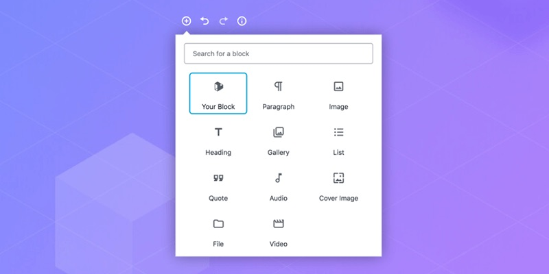

## Exercice 1 – Construire une page avec des blocs Gutenberg

{data-zoom-image}

### Objectif
Apprendre à ajouter, organiser et configurer des blocs dans l’éditeur Gutenberg.

### Consigne générale
Vous devez créer une page WordPress en utilisant uniquement des blocs Gutenberg, sans code.

### Étape 1 – Créer la page
* [ ] Allez dans Pages → Ajouter une page
* [ ] Donnez-lui le titre :
Exercice – Découverte des blocs

### Étape 2 – Ajouter les blocs obligatoires
Votre page doit contenir les blocs suivants, dans l’ordre :

1. Bloc Titre
  * [ ] Texte : Bienvenue sur ma première page Gutenberg
  * [ ] Niveau : H2

1. Bloc Paragraphe
  * [ ] Minimum 3 phrases
  * [ ] Sujet libre (ex. : présentation, hobby, formation)

1. Bloc Image
  * [ ] Importez une image depuis votre ordinateur
  * [ ] Ajoutez un texte alternatif
  * [ ] Alignez l’image au centre

1. Bloc Colonnes (2 colonnes)
  * [ ] Colonne gauche : un paragraphe
  * [ ] Colonne droite : une liste à puces (au moins 3 éléments)

1. Bloc Bouton
  * [ ] Texte du bouton : En savoir plus
  * [ ] Lien : n’importe quelle URL valide

### Étape 3 – Mise en forme
* [ ] Changez la couleur du texte d’un paragraphe
* [ ] Ajoutez un espacement (marge ou padding) à un bloc
* [ ] Déplacez au moins un bloc avec la souris

## Critères de réussite
* Tous les blocs demandés sont présents
* Les blocs sont bien configurés
* La page est lisible et structurée
* Aucun code n’est utilisé

## ⭐ Bonus (optionnel)
* [ ] Ajouter un bloc Séparateur
* [ ] Transformer un bloc Paragraphe en Citation
* [ ] Enregistrer un groupe de blocs comme composition (pattern)
