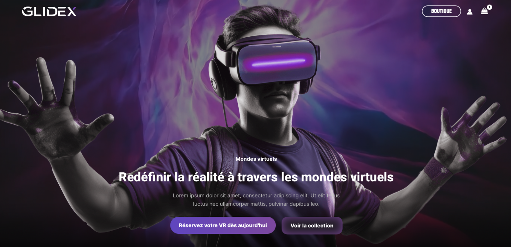
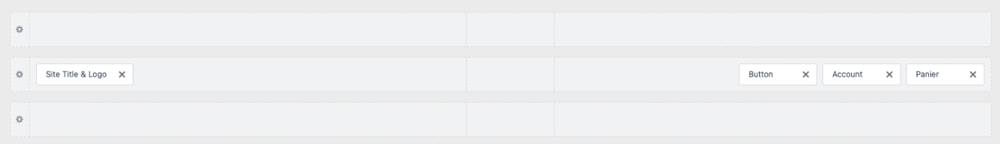
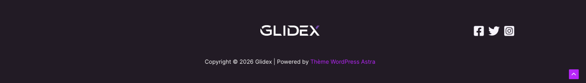
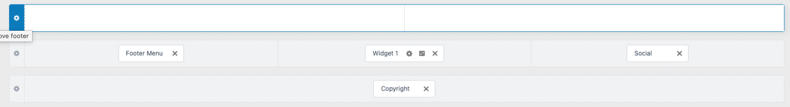
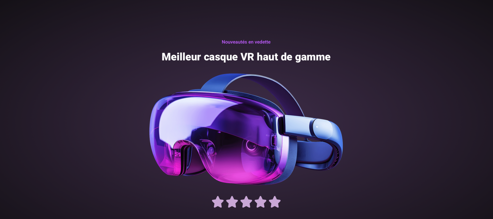
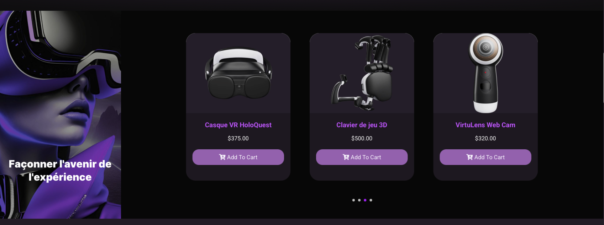
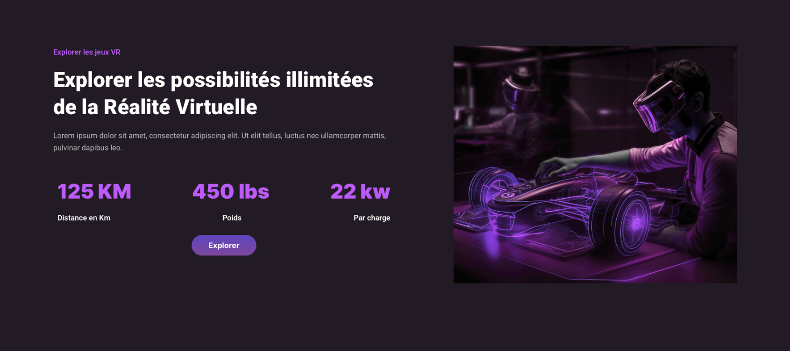
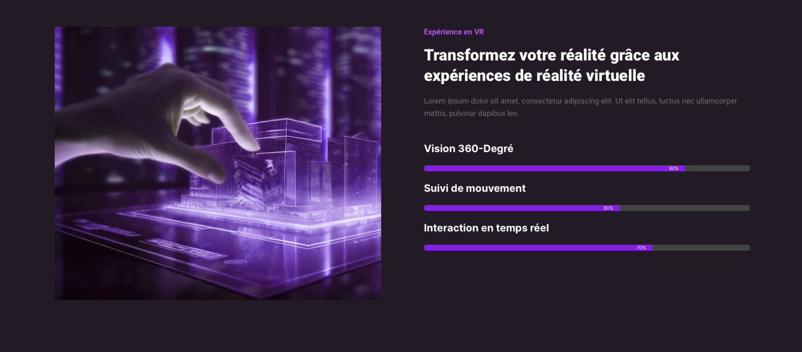
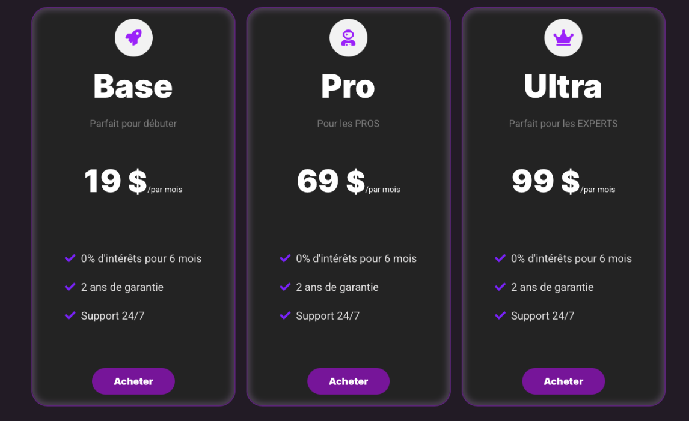
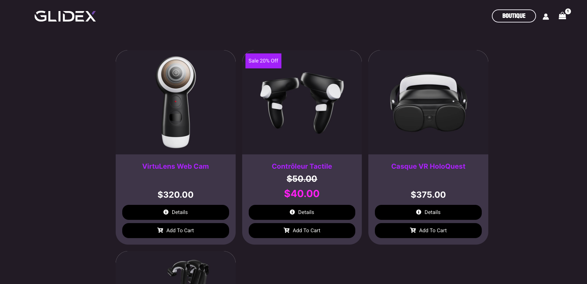

{data-zoom-image}


## Matériel

[Télécharger les images](../assets/documents/Glidex.zip)


## Wordpress
* [ ]	Ouvrez votre installation WordPress
* [ ]	Installer le thème Astra
* [ ]	Installer l'extension Elementor
* [ ]	Installer l'extension Unlimited-Elements
* [ ]	Créez une nouvelle page Boutique
* [ ]   Créer un nouvelle page Accueil
* [ ]	Cliquez sur “Modifier avec Elementor”
!!! tip "Indice"

    Assurez-vous de ne pas avoir d’en-tête ou pied de page prédéfini

{data-zoom-image}

* [ ]   Allez dans Paramètres de la page / Mise en page
* [ ]   Choisissez “Valeur par défaut”
* [ ]   Masquer le titre
* [ ]   Publier

Aller voir à quoi ressemble votre page !

## Header dans le Thème Astra

{data-zoom-image}

* [ ]   Appuyer sur **personnaliser**
* [ ]   Dans l'en-tête : sur la 2e ligne à gauche ajouter --> Site Title & Logo
* [ ]   À l'intérieur, ajouter l'image Main-logo.png
* [ ]   Effacer le titre du site web

### Bouton

* [ ]   À droite de l'en-tête, ajouter un bouton, account et un Panier
* [ ]   Dans le bouton --> Général, ajouter le titre : Boutique
* [ ]   Ajouter le lien : index.php/la-page-de-votre-boutique
* [ ]   Dans la section Design : Couleur dut texte ---> #FFF
* [ ]   Au survol : #C10FFF
* [ ]   Arrière-plan transparent
* [ ]   Arrière-plan au survol : #FFF
* [ ]   Couleur de la bordure : #FFF
* [ ]   Famille de police : Bayon, Sans0serif
* [ ]   Border-Width : 2 2 2 2
* [ ]   Rayon de bordure : 40px 40px 40px 40px
* [ ]   Marge-interne : 8px 30px 8px 30px

### Account
* [ ]   Icon Size 20px
* [ ]   Ajouter le lien vers la page : mon compte

### Panier
* [ ]   Slide in Cart Width : 460px
* [ ]   Couleur : #FFF

### En-tête
* [ ]   Arrière-plan : transparent
* [ ]   Hauteur : 110px
* [ ]   Taille de la bordure inférieur : 0

{data-zoom-image}

{data-zoom-image}

### Pied de page
* [ ]   Ajouter un Widget au centre
* [ ]   Ajouter une image dans le Widget
* [ ]   L'image : Main-logo.png
* [ ]   À droite du pied de page, ajouter Social
* [ ]   Dernière ligne du pied de page, ajouter les copyrights
* [ ]   Couleur d'arrière-plan du pied de page : #261C2A
* [ ]   Taille de la bordure supérieur : 0
* [ ]   Ajouter le CSS suivant dans CSS Personnalisé

```css
.ast-site-header-cart .widget_shopping_cart, .astra-cart-drawer {
    background-color: #261C2A;
    border: none;
}

.ast-site-header-cart .widget_shopping_cart .cart_list a, .woocommerce .ast-site-header-cart .widget_shopping_cart .cart_list a {
    color: white;
}

.woocommerce-js table.shop_table thead, .woocommerce-page table.shop_table thead {
    background-color: #333;
}

.entry-content[data-ast-blocks-layout] > * {
    margin-top: 100px;
}

.woocommerce-cart .cart-collaterals .cart_totals > h2, .woocommerce-cart .cart-collaterals .cross-sells > h2 {
    background-color: #333;
}

.woocommerce-message, .woocommerce-info {
    border-top-color: var(--ast-global-color-1);
    background-color: #333;
    color: #fff;
}

.woocommerce-js form .form-row input.input-text, .woocommerce-js form .form-row textarea {
    background-color: #333;
    border-color: #4f4c4c;
    color: #fff;
}

.woocommerce-js form .form-row label {
    color: #c991fc;
}

.woocommerce .select2-container .select2-selection--single, .woocommerce select, .woocommerce-page .select2-container .select2-selection--single, .woocommerce-page select {
    background-color: #333;
    border-color: #4f4c4c;
}

.select2-dropdown {
    background-color: #333;
    color: #ff47fe;
}

.select2-container--default .select2-selection--single .select2-selection__rendered {
    color: #b299b9;
}

.woocommerce .select2-container .select2-dropdown, .woocommerce .select2-container .select2-search__field, .woocommerce-page .select2-container .select2-dropdown, .woocommerce-page .select2-container .select2-search__field {
    border: 1px solid #474747;
    background-color: #333;
    color: #fff;
}

.page .entry-header {
    margin-top: 170px;
}

```


## Elementor

* [ ]   Créer un page Accueil dans Wordpress
* [ ]   Éditer la page Accueil dans Elementor
* [ ]   Ajouter une section Conteneur
* [ ]   Nommer-le : Section Hero
* [ ]   Colonne : Verticale
* [ ]   Largeur du contenu : Pleine largeur
* [ ]   Arrière-plan : Video-link
* [ ]   Ajouter le lien de la vidéo que vous avez télécharger
* [ ]   Marge : 0 0 0 0
* [ ]   Padding : 0 0 0 0


## HERO

{data-zoom-image}

* [ ]   Ajouter un conteneur
* [ ]   Nommer-le : Personnage
* [ ]   Colonne : Verticale
* [ ]   Largeur du contenu : Pleine largeur
* [ ]   Justify-Content : Début
* [ ]   Align-items : Centre
* [ ]   Arrière-plan : Image --> Home-02-Slider-fg.png
* [ ]   Position : Top center
* [ ]   Répéter : No-Repeat
* [ ]   Display Size : Cover
* [ ]   Superposition d'arrière-plan : Dégradé
* [ ]   Couleur 1 : #2929291F
* [ ]   Emplacement : 76%
* [ ]   Couleur 2 : #000000
* [ ]   Emplacement : 100%
* [ ]   Type : Linear
* [ ]   Angle : 180 deg
* [ ]   Opacité : 0,9
* [ ]   Mode de fusion : Normal
* [ ]   Marge : 0 0 0 0
* [ ]   Padding : 0 0 0 0

* [ ]   Ajouter un conteneur
* [ ]   Nommer-le Texte Hero
* [ ]   Largeur du contenu : Pleine largeur
* [ ]   Marge : 0 0 0 0
* [ ]   Padding : 550px 0 0 0

* [ ]   Ajouter un titre

            Mondes virtuels

* [ ]   Centrer
* [ ]   Famille de police : Inter
* [ ]   Taille : 18
* [ ]   Poids : 700
* [ ]   Couleur du texte : #FFF

* [ ]   Ajouter un titre

            Redéfinir la réalité à travers les mondes virtuels

* [ ]   Centrer
* [ ]   Famille de police : Inter
* [ ]   Taille : 44
* [ ]   Poids : 800
* [ ]   Couleur du texte : #FFF

* [ ]   Ajouter un éditeur de texte
* [ ]   Famille de police : Inter
* [ ]   Taille : 18
* [ ]   Poids : 400
* [ ]   Couleur du texte : #C1C1C1

* [ ]   Ajouter un conteneur
* [ ]   Nommer-le : Les Boutons
* [ ]   Largeur du contenu : Pleine largeur
* [ ]   Direction : Horizontale
* [ ]   Justify-Content : Centre

* [ ]   Ajouter un bouton
* [ ]   Nommer-le : 

            Réservez votre VR dès aujourd'hui

* [ ]   Famille de police : Inter
* [ ]   Poids : 800
* [ ]   Type d'arrière-plan : Dégradé
* [ ]   Couleur 1 : #6B4ACA
* [ ]   Emplacement : 0
* [ ]   Couleur 2 : #884EAA
* [ ]   Emplacement : 100%
* [ ]   Type : Linear
* [ ]   Angle : 90 deg
* [ ]   Rayon de bordure : 30px 30px 30px 30px
* [ ]   Marge interne : 15px 30px 15px 30px
* [ ]   Couleur en survol : #27202C
* [ ]   Box Shadow, couleur : rgba(227, 196, 255, 0.51)
* [ ]   Horizontal : 4
* [ ]   Vertical : 2
* [ ]   Flou : 31
* [ ]   Diffuser : 5
* [ ]   Position : Contour
* [ ]   Durée de transition : 0,8
* [ ]   Animation de survol : Wobble Skew

* [ ]   Ajouter un 2e bouton
* [ ]   Nommer-le : Voir la collection
* [ ]   Famille de police : Inter
* [ ]   Poids : 800
* [ ]   Couleur d'arrière-plan : #27202C
* [ ]   Border Type : Solide
* [ ]   Largeur de la bordure : 1px 1px 1px 1px
* [ ]   Couleur de la bordure : #884EAABF
* [ ]   Rayon de bordure : 20px 20px 20px 20px
* [ ]   Marge interne : 15px 30px 15px 30px
* [ ]   Box Shadow, couleur : rgba(136, 78, 170, 0.7490196078431373)
* [ ]   Horizontal : 0
* [ ]   Vertical : 0
* [ ]   Flou : 26
* [ ]   Diffuser : 4
* [ ]   Position : Position interne
* [ ]   Durée de transition : 0,8
* [ ]   Animation de survol : Wobble Skew


## Section Casque

{data-zoom-image}

* [ ]   Ajouter un conteneur
* [ ]   Nommer-le : Section : Casque
* [ ]   Largeur du contenu : Pleine largeur
* [ ]   Direction : Verticale
* [ ]   Arrière-plan : Dégradé
* [ ]   Couleur 1 : #684A79
* [ ]   Emplacement : 0
* [ ]   Couleur 2 : #201924
* [ ]   Emplacement : 100%
* [ ]   Type : Radial
* [ ]   Position : Center Center
* [ ]   Marge : 0 0 0 0
* [ ]   Padding : 0 0 0 0

* [ ]   Superposition d'arrière-plan : Dégradé
* [ ]   Couleur 1 : #00000059
* [ ]   Emplacement : 90%
* [ ]   Couleur 2 : #0A0A0A
* [ ]   Emplacement : 100%
* [ ]   Type : Linear
* [ ]   Angle : 180 deg
* [ ]   Opacité : 0,9
* [ ]   Mode de fusion : Normal
* [ ]   Marge : 0 0 0 0
* [ ]   Padding : 150px 0 0 0 

* [ ]   Ajouter un titre
* [ ]   Nouveautés en vedette
* [ ]   Centrer
* [ ]   Famille de police : Inter
* [ ]   Poids : 600
* [ ]   Couleur : #C560FF

* [ ]   Ajouter un titre

            Meilleur casque VR haut de gamme

* [ ]   Centrer
* [ ]   Famille de police : Inter
* [ ]   Tailler : 40px
* [ ]   Poids : 900
* [ ]   Couleur : #FFF

* [ ]   Ajouter une image

            Home-2-vrhelmet-img-01.png

* [ ]   Image Rsolution : Medium Large

* [ ]   Ajouter une note
* [ ]   Échelle de notation : 5
* [ ]   Note : 5
* [ ]   Alignement : Centrer
* [ ]   Taille : 48px
* [ ]   Espacement : 6px
* [ ]   Couleur : #D0AFDD
* [ ]   Couleur non marquée : #E8D4F7


## Woocommerce

* [ ]   Créer 4 produits simples

* VirtuLens Web Cam     --->   320$
* Contrôleur Tactile    --->   40$
* Casque VR HoloQuest   --->   375$
* Clavier de jeu 3D     --->   500$

* [ ]   Ajouter les images au bon produit
* [ ]   Ajuster Woocommerce pour Dollars canadiens
* [ ]   Ajouter la page de boutique


## Section Avenir

{data-zoom-image}

* [ ]   Ajouter un conteneur 2 colonnes
* [ ]   Nommer-le Section Avenir
* [ ]   Largeur du contenu : Pleine largeur
* [ ]   Direction : Horizontal
* [ ]   Arrière-Plan : #000000
* [ ]   Padding : 0 0 0 0

* [ ]   Nommer le 1er conteneur : Colonne Gauche
* [ ]   Nommer le 2e conteneur : Colonne Droite

**Dans le conteneur Colonne Gauche**

* [ ]   Largeur du contenu : Pleine largeur
* [ ]   Largeur : 25%
* [ ]   Direction : Vertical
* [ ]   Justify-Content : Fin
* [ ]   Align Items : Centre
* [ ]   Arrière-Plan : Image

            home-2-shop-image-left-sie.jpg

* [ ]   Position : Center Center
* [ ]   Répéter : No-Repeat
* [ ]   Display Size : Cover

* [ ]   Ajouter un titre dans le conteneur Colonne Gauche

        Façonner l'avenir de l'expérience

* [ ]   Centrer
* [ ]   Famille de police : Inter
* [ ]   Tailler : 32px
* [ ]   Poids : 900
* [ ]   Marge interne : 0 0 100px 0

**Dans le conteneur Colonne Droite**

* [ ]   Largeur du contenu : Encadré
* [ ]   Direction : Horizontal
* [ ]   Align Items : Centre
* [ ]   Arrière-Plan : #030303
* [ ]   Marge interne : 50px 0 50px 0


* [ ]   Ajouter Woo Product Carousel

### WOO Product Carousel

Faites en sorte que votre carousel ressemble à celui-ci :


{data-zoom-image}

##### Voici les couleurs utilisées

* [ ]   Background-color : #201924
* [ ]   Product Name : #C458FD
* [ ]   Regular Price : #FFF
* [ ]   Button Add to cart bacground : #9E6AB9

## Section Possibilités

{data-zoom-image}

* [ ]   Ajouter un conteneur 2 colonnes
* [ ]   Nommer-le Section Possibilités
* [ ]   Largeur du contenu : Pleine largeur
* [ ]   Direction : Horizontal
* [ ]   Padding : 100px 120px 100px 120px

* [ ]   Nommer le 1er conteneur : Colonne Gauche
* [ ]   Nommer le 2e conteneur : Colonne Droite

#### Colonne de Gauche

* [ ]   Direction : Vertical

* [ ]   Ajouter un titre

            Explorer les jeux VR

* [ ]   Balise HTML : Span
* [ ]   Famille de police : Inter
* [ ]   POids : 600

* [ ]   Ajouter un 2e titre

            Explorer les possibilités illimitées de la Réalité Virtuelle

* [ ]   Famille de police : Inter
* [ ]   Taille : 50
* [ ]   POids : 900

* [ ]   Ajouter un éditeur de texte

* [ ]   Ajouter un conteneur
* [ ]   Nommer-le : Chiffres
* [ ]   Direction : Horizontal
* [ ]   Justify-Content : Espace entre
* [ ]   Ajouter 3 Widgets Titre
* [ ]   Famille de police : Inter
* [ ]   Taille : 48
* [ ]   Poids : 900
* [ ]   Couleur : #C560FF

            125 Km

            450 lbs

            22kw

* [ ]   Ajouter un conteneur
* [ ]   Nommer-le : Unités
* [ ]   Direction : Horizontal
* [ ]   Justify-Content : Espace entre
* [ ]   Ajouter 3 Widgets Titre
* [ ]   Balise HTML : H4
* [ ]   Famille de police : Inter
* [ ]   POids : 600
* [ ]   Couleur : #FFF

            Distance en Km

            Poids

            Par charge

* [ ]   Ajouter un bouyon
* [ ]   Nommer-le : Explorer
* [ ]   Background type : Dégradé
* [ ]   Couleur 1 : #6B4ACA
* [ ]   Emplacement : 0
* [ ]   Couleur 2 : #884EAA
* [ ]   Type : Linear
* [ ]   Rayon de bordure : 30px 30px 30px 30px
* [ ]   Marge interne : 10px 40px 10px 40px

#### Colonne de droite

* [ ] Ajouter l'image

            stocky-slide-01.jpg


## Section Expérience

{data-zoom-image}

* [ ]   Ajouter un conteneur 2 colonnes
* [ ]   Nommer-le Section Exprerience
* [ ]   Largeur du contenu : Pleine largeur
* [ ]   Direction : Horizontal
* [ ]   Padding : 100px 120px 100px 120px

* [ ]   Nommer le 1er conteneur : Colonne Gauche
* [ ]   Nommer le 2e conteneur : Colonne Droite

#### Colonne Gauche

* [ ] Ajouter l'image

            stocky-slide-03.jpg


#### Colonne Droite


* [ ]   Direction : Vertical

* [ ]   Ajouter un titre

            Expérience en VR

* [ ]   Famille de police : Inter
* [ ]   POids : 600

* [ ]   Ajouter un 2e titre

            Transformez votre réalité grâce aux expériences de réalité virtuelle

* [ ]   Famille de police : Inter
* [ ]   Taille :37
* [ ]   POids : 900

* [ ]   Ajouter un éditeur de texte

* [ ]   Ajouter un conteneur
* [ ]   Nommer-le : Chiffres
* [ ]   Direction : Horizontal
* [ ]   Justify-Content : Espace entre
* [ ]   Ajouter 3 Widgets Barre de progression

            Vision 360-Degré    ---> 80%
            Suivi de mouvement  ---> 60%
            Interaction en temps réel   ---> 70%

* [ ]   Famille de police : Inter
* [ ]   Taille : 24
* [ ]   Poids : 700
* [ ]   Couleur : #9004EC


## Section Plan

* [ ]   Ajouter un conteneur 
* [ ]   Nommer-le Section Plan
* [ ]   Largeur du contenu : Pleine largeur
* [ ]   Direction : Horizontal
* [ ]   Justify-Content : Centre
* [ ]   Padding : 100px 0 100px 0

* [ ]   Ajouter 3 Widgets Pricing Table

### Pricing Table

Faites en sorte que votre carousel ressemble à celui-ci :


{data-zoom-image}

##### Voici les couleurs utilisées

* [ ]   Box Background-color : #272727
* [ ]   Border-color : #672585
* [ ]   Border-width : 2px
* [ ]   Product Name : #FFF
* [ ]   Regular Price : #FFF
* [ ]   Button Background color : #8302A7
* [ ]   Button Background Color Hover : #454545
* [ ]   Button Text : #FFF
* [ ]   Graphic element : Icon Color ---> #A700FF

##### Icons

* Rocket
* User Astronaut
* Crown

##### Titre et Prix

* [ ]   Famille de police : Inter
* [ ]   Taille : 60
* [ ]   Poids : 900

## Boutique

Faites en sorte que votre carousel ressemble à celui-ci :


{data-zoom-image}

* [ ]   Ajouter le Widget Woo Product Grid

* [ ]   Content Background : #473C53
* [ ]   Title : #B500FF
* [ ]   Sale Price : #FF00F9
* [ ]   Sale Label Background : #AE00FF
* [ ]   Label Color : #FFF
