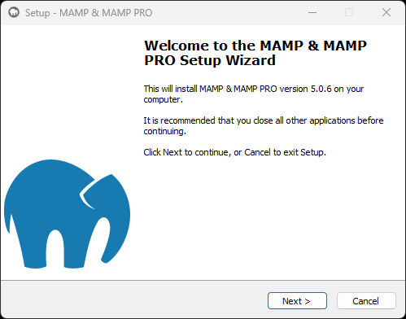
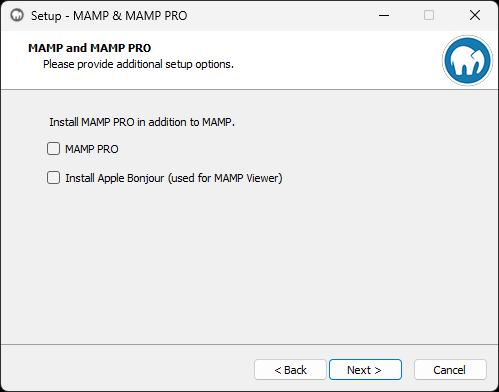
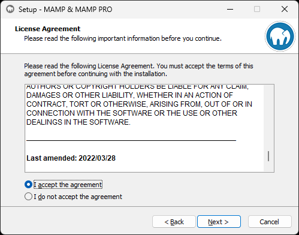
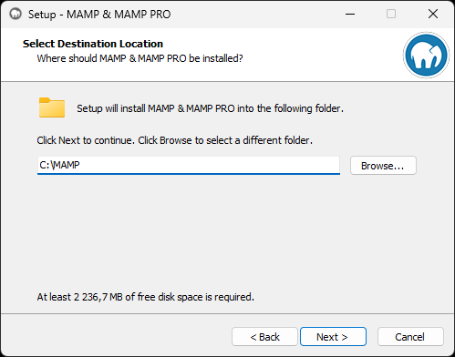
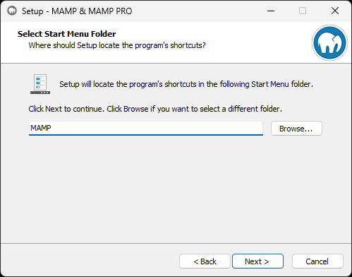
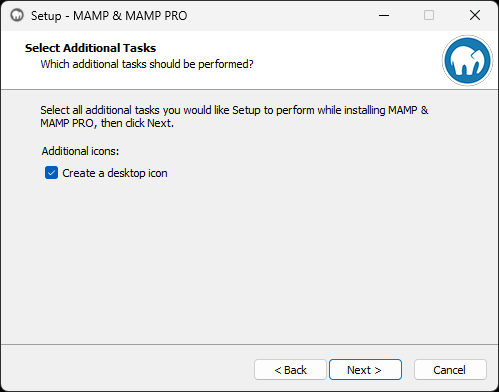
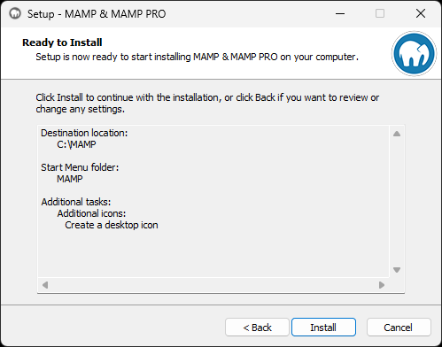
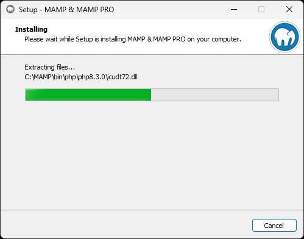
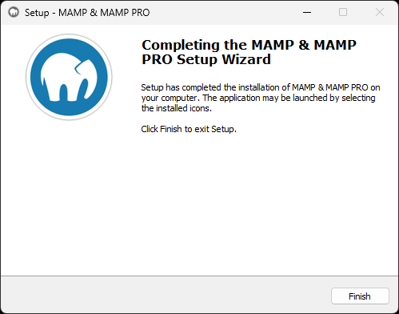

---
tags:
  - Exercice
---

*[BD]: Base de données

# Installation de Mamp

## Téléchargement

Mamp est gratuit, mais il est possible de payer pour obtenir des fonctionnalités supplémentaires. Dans le cadre du cours, nous utiliserons la version gratuite.

[Télécharger l'application MAMP :material-download:](https://www.mamp.info/en/downloads/){ .md-button .md-button--primary }

## Installation sur Windows

Voici le processus d'installation étape par étape en capture d'écran.

<figure markdown>
  {.w-100}
  <figcaption>Cliquez sur le bouton « Next »</figcaption>
</figure>

<figure markdown>
  {.w-100}
  <figcaption>Décochez les cases « MAMP PRO » et « Install Apple Bonjour »</figcaption>
</figure>

<figure markdown>
  {.w-100}
  <figcaption>Acceptez les termes de la licence, si elle vous convient</figcaption>
</figure>

<figure markdown>
  {.w-100}
  <figcaption>Choisissez le dossier d'installation</figcaption>
</figure>

<figure markdown>
  {.w-100}
  <figcaption>Cliquez sur le bouton « Next »</figcaption>
</figure>

<figure markdown>
  {.w-100}
  <figcaption>Cliquez sur le bouton « Next »</figcaption>
</figure>

<figure markdown>
  {.w-100}
  <figcaption>Cliquez sur le bouton « Install »</figcaption>
</figure>

<figure markdown>
  {.w-100}
  <figcaption>Patientez un moment</figcaption>
</figure>

<figure markdown>
  {.w-100}
  <figcaption>L'installation est complétée. Cliquez sur le bouton « Finish »</figcaption>
</figure>

## Configuration

Par défaut, les sites Web en local doivent être inclus dans le dossier suivant : `C:\MAMP\htdocs`.

Afin de s'assurer qu'il n'y ait pas de problème de persmission, je vous suggère de vous choisir un autre emplacement. Par exemple : `C:\Users\<NOM_UTILISATEUR>\Sites`.

## URLs

Losque votre serveur MAMP est démarré, vous pourrez ensuite accéder à ces adresses :

* Sites en local : <http://localhost:81/>
* Base de données (PhpMyAdmin) : <http://localhost:81/MAMP/phpmyadmin.php>

## Création d'une base de données (BD)

Dans l'interface [PhpMyAdmin](http://localhost:81/MAMP/phpmyadmin.php), vous devrez créer une base de donnée. Celle-ci sera le conteneur de toutes les tables nécessaires à l'usage d'un site Wordpress en particulier. Si vous faites un autre site Web, il vous faudra une autre base de données.

Créez une nouvelle base de données et donnez lui un nom (ex. : mon_premier_cms).

Concernant le menu déroulant situé juste à côté du nom de la base de données, celui-ci désigne la bonne *collation* (:material-food: miam miam) de votre BD.

Une *collation* est un ensemble de règles qui détermine comment les caractères sont comparés, triés, et recherchés dans une base de données. Pour WordPress, il est recommandé d'utiliser `utf8mb4_unicode_ci`. Voici pourquoi :

| *Collation*            | Avantages                                                   | Inconvénients                               |
| ---------------------- | ----------------------------------------------------------- | ------------------------------------------- |
| utf8_general_ci        | Plus rapide pour des cas simples.                           | Limité aux caractères UTF-8 (pas d’émojis). |
| utf8_unicode_ci        | Bonne gestion des langues.                                  | Ne prend pas en charge les émojis.          |
| utf8mb4_general_ci     | Compatible avec tous les caractères modernes.               | Tri simplifié, moins précis.                |
| **utf8mb4_unicode_ci** | Meilleure précision linguistique et compatibilité complète. | Un peu plus lent pour de grandes BD.        |