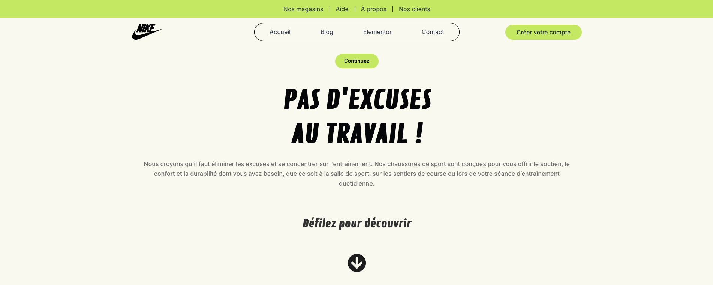
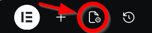
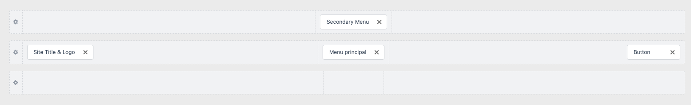
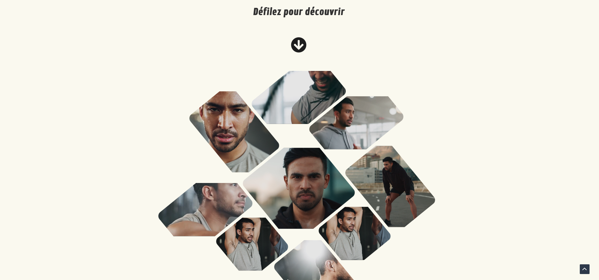
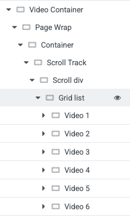
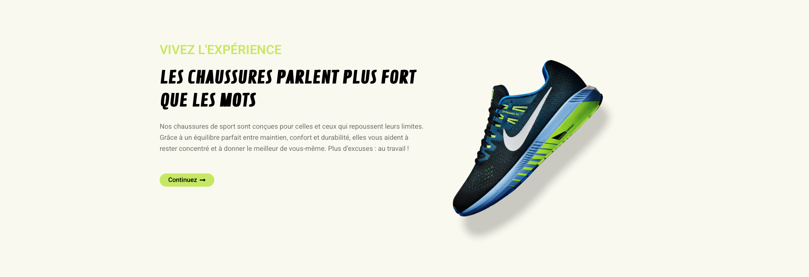
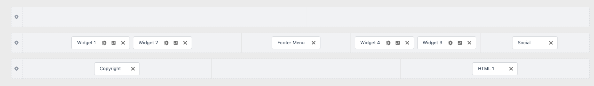

{data-zoom-image}

## Matériel

[Télécharger les images](../assets/documents/nike-images.zip)

[Télécharger les vidéos part.1](../assets/documents/nike-video-part-1.zip)

[Télécharger les vidéos part.2](../assets/documents/nike-video-part-2.zip)

## Wordpress
* [ ]	Ouvrez votre installation WordPress
* [ ]	Installer le thème Astra
* [ ]	Installer l'extension Elementor
* [ ]	Installer l'extension Custom CSS for Elementor
* [ ]	Créez une nouvelle page
* [ ]	Cliquez sur “Modifier avec Elementor”
!!! tip "Indice"

    Assurez-vous de ne pas avoir d’en-tête ou pied de page prédéfini

{data-zoom-image}

* [ ]   Allez dans Paramètres de la page / Mise en page
* [ ]   Choisissez “Valeur par défaut”
* [ ]   Masquer le titre
* [ ]   Publier

Aller voir à quoi ressemble votre page !

## Header dans le Thème Astra

{data-zoom-image}

* [ ]   Appuyer sur **personnaliser**
* [ ]   Dans l'en-tête : sur la 2e ligne à gauche ajouter --> Site Title & Logo
* [ ]   À l'intérieur, ajouter l'image nike-logo.png
* [ ]   Effacer le titre du site web
* [ ]   Taille du logo : **102px**
* [ ]   Au centre de l'en-tête, ajouter menu principal
* [ ]   Dans celui-ci, aller à configurer le menu
* [ ]   Sous menu Principal, cliquer sur modifier le menu
* [ ]   Appuyer sur : **Ajouter des éléments**
* [ ]   Sélectionner liens personnalisés
* [ ]   Ajouter les liens suivants en ajoutant le # comme adresse Web

        Accueil
        Blog
        Elementor
        Contact

* [ ]   Revener à l'en-tête
* [ ]   Dans le menu principal, couleur du texte : noir
* [ ]   Couleur d'arrière-plan au survol : #CBED62
* [ ]   Famille de police : Inter, Sans-Serif
* [ ]   Espacement --> Menu : 0 40px 0 40px
* [ ]   Au bout de la 2e ligne, ajouter un bouton
* [ ]   Ajouter le texte du bouton : **Créer votre compte**
* [ ]   Ajouter la couleur du texte : #1E293B et l'arrière-plan : #CBED62
* [ ]   Ajouter le rayon de bordure : 40px 40px 40px 40px
* [ ]   Ajouter une marge interne de : 12px 30px 12px 30px

* [ ]   Sur la 1ère ligne de l'en-tête, ajouter Secondary Menu
* [ ]   Sous Secondary Menu, cliquer sur modifier le menu
* [ ]   Appuyer sur : **Ajouter des éléments**
* [ ]   Sélectionner liens personnalisés
* [ ]   Ajouter les liens suivants en ajoutant le # comme adresse Web

        Nos magasins
        Aide
        À propos
        Nos clients

* [ ]   Revener à l'en-tête
* [ ]   Dans Secondary Menu : couleur du texte --> Noir
* [ ]   Famille de police : Inter, Sans-Serif
* [ ]   Choisissez la roue dentée de la première ligne et modifiez la couleur de l'arrière-plan : #CBED62
* [ ]   Dans Astra, aller dans CSS additionnel et ajouter le CSS suivant.

```css
.ast-builder-menu-1 .menu-item:hover > .menu-link, .ast-builder-menu-1 .inline-on-mobile .menu-item:hover > .ast-menu-toggle {
    color: #000000;
    background: #cbed62;
    border-radius: 50px;
}

.ast-builder-menu-1 {
    border-radius: 50px;
    border-style: solid;
    border-color: #000;
    border-width: 1px;
}

.ast-desktop .ast-above-header-bar .main-header-menu > .menu-item {
    border-right: 1px solid #333;
		height:15px
}

.ast-desktop .ast-above-header-bar .main-header-menu > .menu-item:last-child {
  border-right: none;
}
```

## Main dans Elementor

##### Section

* [ ]   Ajouter un conteneur et nommer-le : **Section**
* [ ]   Largeur du contenu : **Encadré (Boxed)**
* [ ]   Ajouter une marge interne : 20px 0 0 0
* [ ]   Ajouter une marge externe : 0 0 0 0

##### Bouton

* [ ]   Ajouter un bouton avec le texte : **Continuer**
* [ ]   Couleur d'arrière-plan : #CBED62
* [ ]   Couleur du texte : **Noir**
* [ ]   Couleur d'arrière-plan au survol : #000
* [ ]   Couleur du texte : **Blanc**
* [ ]   Rayon de bordure : 50px 50px 50px 50px

##### Titre

* [ ]   Ajouter un Titre

            PAS D'EXCUSES <br> AU TRAVAIL !

* [ ]   Famille de police : **Contrail One**
* [ ]   Taille : **70px**
* [ ]   Poids : **700**
* [ ]   Transformation : **Majuscule**
* [ ]   Centrer
* [ ]   Couleur du texte : **Noir**
* [ ]   Marge interne : 20px 0 0 0

##### Texte

* [ ]   Ajouter un éditeur de texte

            Nous croyons qu'il faut éliminer les excuses et se concentrer sur l'entraînement. Nos chaussures de sport sont conçues pour vous offrir le soutien, le confort et la durabilité dont vous avez besoin, que ce soit à la salle de sport, sur les sentiers de course ou lors de votre séance d'entraînement quotidienne.

* [ ]   Couleur du texte : #7A7A7A
* [ ]   Famille de police : Inter, Sans-Serif
* [ ]   Poids : 500
* [ ]   Centrer

### Conteneur Scroll 

{data-zoom-image}

* [ ]   Ajouter un conteneur Flexbox --> Colonne à l'aide du rectangle dans la page
* [ ]   Nommer-le : **Scroll**
* [ ]   Justify Content : **Centrer**
* [ ]   Align Items : **Centrer**

* [ ]   Ajouter un titre : **Défilez pour découvrir**
* [ ]   Famille de police : **Contrail One**
* [ ]   Poids : **600**
* [ ]   Centrer
* [ ]   Couleur du texte : **Noir**
* [ ]   Marge externe : 40px 0 0 0

* [ ]   Ajouter un Icon
* [ ]   Choisisser la flèche vers le bas
* [ ]   Couleur de l'icône : **Noir**
* [ ]   Marge externe : 40px 0 0 0

### Conteneur Vidéo

{data-zoom-image}

* [ ]   Ajouter un conteneur Flexbox --> Colonne à l'aide du rectangle dans la page
* [ ]   Nommer-le : **Video Container**
* [ ]   Marge externe : 0 0 200px 0

* [ ]   Ajouter un conteneur à l'intérieur de **Video Container**
 [ ]    Nommer-le : **Page Wrap**
* [ ]   Largeur du contenu : **Pleine largeur**
* [ ]   Classes CSS : **page-wrap**

* [ ]   Ajouter un conteneur à l'intérieur de **Page Wrap**
* [ ]   Nommer-le : **Container**
* [ ]   Largeur du contenu : **Pleine largeur**
* [ ]   Classes CSS : **container**

* [ ]   Ajouter un conteneur à l'intérieur de **Container**
* [ ]    Nommer-le : **Scroll Track**
* [ ]   Largeur du contenu : **Pleine largeur**
* [ ]   Classes CSS : **scroll-track**

* [ ]   Ajouter un conteneur à l'intérieur de **Scroll Track**
* [ ]   Nommer-le : **Scroll div**
* [ ]   Largeur du contenu : **Pleine largeur**
* [ ]   Classes CSS : **scroll-div**

* [ ]   Ajouter un conteneur à l'intérieur de **Scroll div**
* [ ]   Nommer-le : **Grid list**
* [ ]   Largeur du contenu : **Pleine largeur**
* [ ]   Classes CSS : **grid grid-list**

* [ ]   Ajouter un conteneur à l'intérieur de **Grid list**
* [ ]   Nommer-le : **Video 1**
* [ ]   Largeur du contenu : **Pleine largeur**
* [ ]   ID de CSS : w-node-_9fd62eab-0280-f145-8df2-063461c231cd-6a652656
* [ ]   Classes CSS : **block**

* [ ]   Ajouter un conteneur à l'intérieur de **Video 1**
* [ ]   Largeur du contenu : **Pleine largeur**
* [ ]   Classes CSS : **video w-background-video w-background-video-atom**

* [ ]   Ajouter un Widget Vidéo à l'intérieur de **Container**
* [ ]   Adresse web source : **auto-hébergée**
* [ ]   Option vidéo :

        Lecture -------------------> oui
        Lire sur mobile -----------> oui
        Muet ----------------------> oui
        Répéter -------------------> oui
        Contrôle du lecteur -------> non
        Bouton de téléchargement --> non

* [ ]   Ajouter la **video-1.mp4**
* [ ]   Classes CSS : **video-list**


* [ ]   Dupliquer le conteneur **Video 1**
* [ ]   Nommer-le : **Video 2**
* [ ]   Changer le ID de CSS pour : **w-node-fc16a369-52e7-42a6-d453-b98107c0bfb0-6a652656**
* [ ]   Sélectionner la vidéo
* [ ]   Changer la vidéo pour la **video-2.mp4**
* [ ]   Ajouter le ID de CSS de la vidéo : **103dc3dc-d536-3819-ccf2-f4f638b51351-video**


**Refaire la même étape pour les 9 vidéos**

##### Vidéo 3

* [ ]   Conteneur video ID CSS : **w-node-_613fd2b0-1bdc-a0a6-0c5d-456e3ce21c77-6a652656**
* [ ]   Changer la vidéo pour **video-3-1.mp4**
* [ ]   ID CSS de la vidéo : **78658693-dd41-1245-a448-e38f971d4320-video**

##### Vidéo 4

* [ ]   Conteneur video ID CSS : **w-node-a11bb637-7b11-1305-1681-7185f3ca1e4b-6a652656**
* [ ]   Changer la vidéo pour **video-4-1.mp4**
* [ ]   ID CSS de la vidéo : **73298d594-5d77-4e3c-e357-2e28d3eeae6e-video**

##### Vidéo 5

* [ ]   Conteneur video ID CSS : **w-node-ebb6d462-ce1a-e10b-e72e-125e0284b107-6a652656**
* [ ]   Changer la vidéo pour **video-5.mp4**
* [ ]   ID CSS de la vidéo : **28dbf48c-dfb0-7373-9c71-7050162ba4e7-video**

##### Vidéo 6

* [ ]   Conteneur video ID CSS : **w-node-_76a52f02-0cd5-394a-5005-480909af5a95-6a652656**
* [ ]   Changer la vidéo pour **video-6.mp4**
* [ ]   ID CSS de la vidéo : **0c1a543f-1ec7-fa38-d03b-b11db89979e5-video**

##### Vidéo 7

* [ ]   Conteneur video ID CSS : **w-node-eb73c93a-5f7d-20f1-5d96-cfddef4dfaa9-6a652656**
* [ ]   Changer la vidéo pour **video-7.mp4**
* [ ]   ID CSS de la vidéo : **4a1a29b7-6d65-401a-8233-b220ae86bb6d-video**

###### Vidéo 8

* [ ]   Conteneur video ID CSS : **w-node-_2338c1b8-30f5-d5f8-68aa-6ffd2af512f1-6a652656**
* [ ]   Changer la vidéo pour **video-8.mp4**
* [ ]   ID CSS de la vidéo : **d4hvbdhdhajaas-sksksdk-vide**

##### Vidéo 9

* [ ]   Conteneur video ID CSS : **w-node-_7be4fed4-24cc-3ddb-a5bd-49625389ecd8-6a652656**
* [ ]   Changer la vidéo pour v**ideo-9.mp4**
* [ ]   ID CSS de la vidéo : **db3d4d57-ccb3-c235-8b9d-e8bc394ed634-video**


* [ ]   Sélectionner votre premier conteneur **Video Container**
* [ ]   Ajouter un Widget HTML
* [ ]   Nommer-le CSS et ajouter le code suivant :

<iframe height="300" style="width: 100%;" scrolling="no" title="Nike-CSS" src="https://codepen.io/editor/Le-prof-de-Momo/embed/preview/019cc972-cb98-736d-a2d7-2d932718788d?default-tab=css" frameborder="no" loading="lazy" allowtransparency="true">
  See the Pen <a href="https://codepen.io/editor/Le-prof-de-Momo/pen/019cc972-cb98-736d-a2d7-2d932718788d">
  Nike-CSS</a> by Stephane (<a href="https://codepen.io/Le-prof-de-Momo">@Le-prof-de-Momo</a>)
  on <a href="https://codepen.io">CodePen</a>.
</iframe>

* [ ]   Sélectionner votre premier conteneur **Video Container**
* [ ]   Ajouter un Widget HTML
* [ ]   Nommer-le JS et ajouter le code suivant :

<iframe height="300" style="width: 100%;" scrolling="no" title="Nike-JS" src="https://codepen.io/editor/Le-prof-de-Momo/embed/preview/019cc973-e90a-7406-91ac-f656c901c78c?default-tab=js" frameborder="no" loading="lazy" allowtransparency="true">
  See the Pen <a href="https://codepen.io/editor/Le-prof-de-Momo/pen/019cc973-e90a-7406-91ac-f656c901c78c">
  Nike-JS</a> by Stephane (<a href="https://codepen.io/Le-prof-de-Momo">@Le-prof-de-Momo</a>)
  on <a href="https://codepen.io">CodePen</a>.
</iframe>


!!! warning "Important"

Assurez-vous que le JavaScript a été correctement collé. Il arrive parfois que le CSS reste en mémoire et soit recopié deux fois.

### Section 2

* [ ]   Ajouter un conteneur Flexbox --> Colonne à l'aide du rectangle dans la page
* [ ]   Nommer-le : **Section 2**
* [ ]   Ajouter un conteneur et nommer-le : **Container**
* [ ]   Largeur du contenu : **Pleine largeur**
* [ ]   Couleur d'arrière-plan : #CBED62

* [ ]   À l'intérieur du conteneur, ajouter un titre

            Je crois fermement qu'avec les bonnes chaussures, on peut dominer le monde.

* [ ]   Couleur du texte : **Noir**
* [ ]   Taille de la police : **16px**

### Section 3

{data-zoom-image}

* [ ]   Ajouter un conteneur Flexbox --> 2 Colonnes à l'aide du rectangle dans la page
* [ ]   Nommer-le : **Section 3**
* [ ]   Marge externe : 0 0 80px 0
* [ ]   Sélectionner la colonne de gauche
* [ ]   Largeur du contenu : **Pleine largeur**
* [ ]   Marge interne : 80px 0 0 0

* [ ]   Ajouter un titre

            Viver l'expérience

* [ ]   Couleur du texte : #CBED62


* [ ]   Ajouter un 2e titre

            LES CHAUSSURES PARLENT PLUS FORT QUE LES MOTS

* [ ]   Couleur du texte : **Noir**
* [ ]   Famille de police : **Contrail One**
* [ ]   Taille de police : **42**
* [ ]   Poids : **600**
* [ ]   Transformation : **Majuscule**


* [ ]   Ajouter un éditeur de texte

            Nos chaussures de sport sont conçues pour celles et ceux qui repoussent leurs limites. Grâce à un équilibre parfait entre maintien, confort et durabilité, elles vous aident à rester concentré et à donner le meilleur de vous-même. Plus d'excuses : au travail !

* [ ]   Couleur du texte : #7A7A7A

* [ ]   Ajouter un bouton --> Continuez avec un icône de flèche vers la droite à la fin
* [ ]   Ajouter la couleur du texte : #1E293B et l'arrière-plan : #CBED62
* [ ]   Ajouter la couleur Survol du texte : #ffffff et l'arrière-plan : #000000
* [ ]   Ajouter le rayon de bordure : 50px 50px 50px 50px
* [ ]   Ajouter une marge interne de : 8px 20px 8px 20px

* [ ]   Ajouter l'image souliers.png dans la 2e colonne

## Pieds de page dans le Thème Astra

{data-zoom-image}

{data-zoom-image}

* [ ]   Couleur d'arrière-plan : #CBED62

* [ ]   Widget 1 : image largeur 102 px
* [ ]   Widget 2 : Éditeur de texte
* [ ]   Widget 3 : Liste
* [ ]   Widget 4 : Titre H2 Taille de police M
* [ ]   Copyright [copyright] [current_year] | [site_title]
