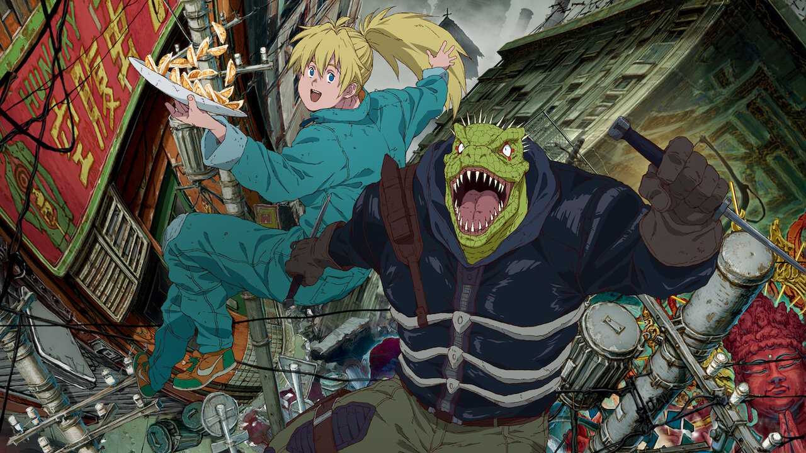

---
tags:
  - Exercice
---

# Konnichiwa

L'objectif de cet exercice est de créer un site multilingue franco-japonais sur le thème d'un film ou d'une série d'animation japonaise.

**Le site doit comporter trois articles** :

- [ ] Un article de présentation de l’œuvre en général.
- [ ] Un article critique de l’œuvre.
- [ ] Un article proposant des suggestions d’œuvres similaires.

**L’ensemble du contenu doit être traduit en français et en japonais**. Sortez le polyglotte en vous, ou utilisez Deepl, à vous de choisir. Tout doit être traduit :

- [ ] Les textes doivent être traduits.
- [ ] Les images doivent être traduites
- [ ] Les catégories doivent être traduites
- [ ] Le menu doit être traduit et doit comprendre les 3 articles

**L'URL des pages doivent suivre cette structure** :

- [ ] /LANGUE/CATÉGORIE/NOMDUPOST

**Sites de référence** :

* <https://myanimelist.net/anime>
* <https://anidb.net/anime>

**Suggestions** pour ceux et celles en panne d'inspiration :

* Spirited Away
* Akira
* Le conte de la princesse Kaguya
* Mob Psycho 100
* Berserk
* Dorohedoro

---

- [ ] (facultatif) Installez **Admin and Site Enhancements (ASE)** et explorez les possibilités !
- [ ] Enfin, exportez votre travail et sauvegardez le sur votre disque dur
