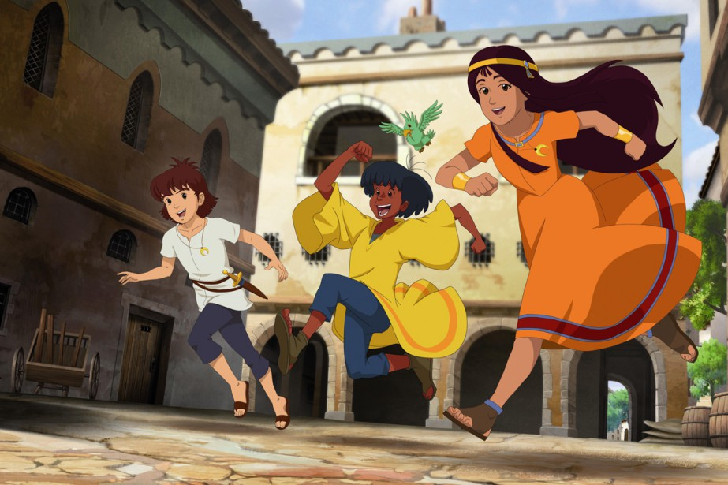

---
tags:
  - Exercice
---

# Les mystérieuses cités d'or

Vous êtes un(e) historien(ne) passionné(e), choisi pour documenter les grandes civilisations des Amériques à l’aide de WordPress. Sans hésiter, vous acceptez cette mission exaltante et vous vous préparez à plonger dans les méandres du passé. Votre voyage commence ici et votre première étape vous mène vers les civilisations suivantes :

* Olmèque
* Maya
* Aztèque
* Inca

## Consignes

- [ ] Créez une nouvelle instance Wordpress pour votre site sur MAMP.
- [ ] Connectez-vous au site en ajoutant `/login` dans l'url. Par exemple : http://localhost/mon_premier_wp/login.
- [ ] Ajoutez 4 articles (1 par civilisation)
- [ ] Chaque article doit contenir :
    * un titre principal
    * une **image mise en avant**
    * des **étiquettes**
    * au moins un **hyperliens** vers des sources d'information externes à même le texte principal
    * au moins un titre H2
    * au moins une note en bas de page
