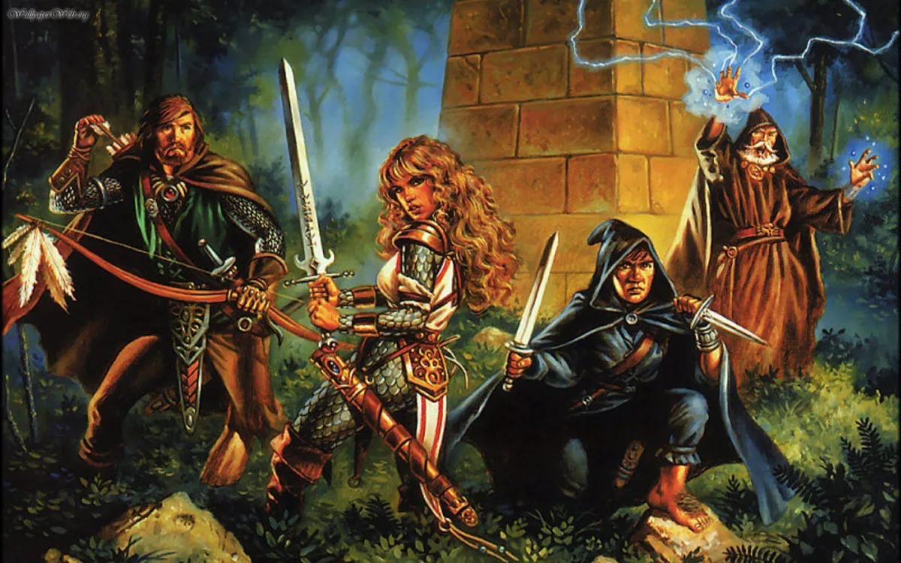
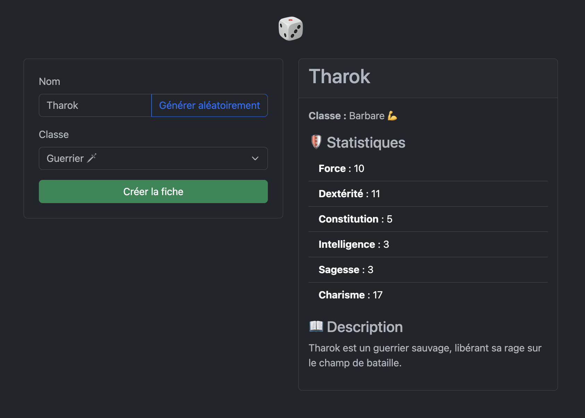

---
tags:
  - Exercice
---

# Générateur de personnage D&D

{ .w-100 }

Dans cet exercice, vous allez créer un générateur de personnage pour Donjons & Dragons (D&D) en PHP et Bootstrap. Vous allez :

1. Créer un formulaire pour choisir un nom et une classe.
1. Générer des statistiques aléatoires pour le personnage.
1. Afficher le résumé du personnage avec une description dynamique.
1. Ajouter un bouton **JavaScript** pour générer un nom aléatoire.

## Résultat attendu

<https://web4.tim-momo.com/dnd/>

{ .w-100 }

## Consignes

### Créer la structure HTML de base

- [ ] Créez un fichier `index.php`
- [ ] Ajoutez la structure HTML de base avec Bootstrap 5.3 en mode sombre.

```html title="💡 Aide"
<!DOCTYPE html>
<html lang="fr" data-bs-theme="dark">
<head>
    <meta charset="UTF-8">
    <meta name="viewport" content="width=device-width, initial-scale=1.0">
    <title>Générateur de personnage D&D</title>

    <!-- Inclure ici le nécessaire pour utiliser Bootstrap 5 -->
</head>
<body class="bg-dark text-light">

    <h1 class="text-center my-4">🎲</h1>

    <div class="container">
        <div class="row justify-content-center">
            <!-- Ici viendra le formulaire et tout le reste ;) -->
        </div>
    </div>

</body>
</html>
```

### Formulaire

- [ ] Ajouter un formulaire qui utilise la méthode POST. L'action sera dans le même fichier alors pas besoin de la spécifier.
- [ ] Ajouter un champ texte pour entrer le nom. N'oubliez pas son label !
- [ ] Ajouter un bouton “Générer un nom aléatoire”.
- [ ] Ajouter une liste déroulante `<select>` avec plusieurs classes de personnages. N'oubliez pas son label !
- [ ] Ajouter un bouton “Créer la fiche” pour envoyer le formulaire.
- [ ] Ajoutez les classes css Bootstrap qui concernent les formulaires (ex: form-control, form-label, etc.).
- [ ] Ajouter l’attribut required sur les champs obligatoires.

### Traiter le formulaire avec PHP

Ajoutez du PHP au début du fichier pour :

- [ ] Récupérer les valeurs du formulaire (avec `$_POST[]`).
- [ ] Générer des statistiques aléatoires pour le personnage.
- [ ] Définir une description selon la classe choisie.

```php title="💡 Aide"
<?php
$nom = "";
$classe = "";
$stats = [];

if (!empty($_POST)) {
    $nom = htmlspecialchars($_POST["nom"], ENT_QUOTES, 'UTF-8');
    $classe = htmlspecialchars($_POST["classe"], ENT_QUOTES, 'UTF-8');

    $stats = [
        "Force" => rand(3, 18),
        "Dextérité" => rand(3, 18),
        // ...
    ];
}
?>
```

### Afficher la fiche

- [ ] Affichez les résultats uniquement si un nom et une classe sont définis.
- [ ] Créez une carte Bootstrap contenant le nom, la classe et les statistiques.

```php title="💡 Aide"
<?php if (!empty($nom) && !empty($classe)): ?>

  <div class="card">
      <div class="card-header">
          <?php echo $nom; ?>
      </div>
      <div class="card-body">
          <?php echo $classe; ?>
          <ul>
              <?php
                  foreach ($stats as $stat => $valeur) {
                      echo "<li><strong>$stat</strong> : $valeur</li>";
                  }
              ?>
          </ul>
      </div>
  </div>

<?php endif; ?>
```

### JavaScript 😈

Quand l’utilisateur clique sur “Générer aléatoirement”, un nom est inséré dans le champ texte sans recharger la page.

- [ ] Ajoutez un script JavaScript qui écoute le clic sur le bouton. `addEventLi...` quoi déjà?
- [ ] Insérez un nom aléatoire dans le champ texte.

```js title="💡 Aide"
document.getElementById("genererNom").addEventListener("click", function () {
    const noms = ["Tharok", "Eldrin", "Morgana", "Lyra", "Dorn", "Kael"];
    document.getElementById("nom").value = noms[Math.floor(Math.random() * noms.length)];
});
```

### 🎯 Défi bonus

- [ ] Faire en sorte que lorsqu'on soumet le formulaire, le champ Nom et Classe soient préremplis avec les informations entrées précédemment.
